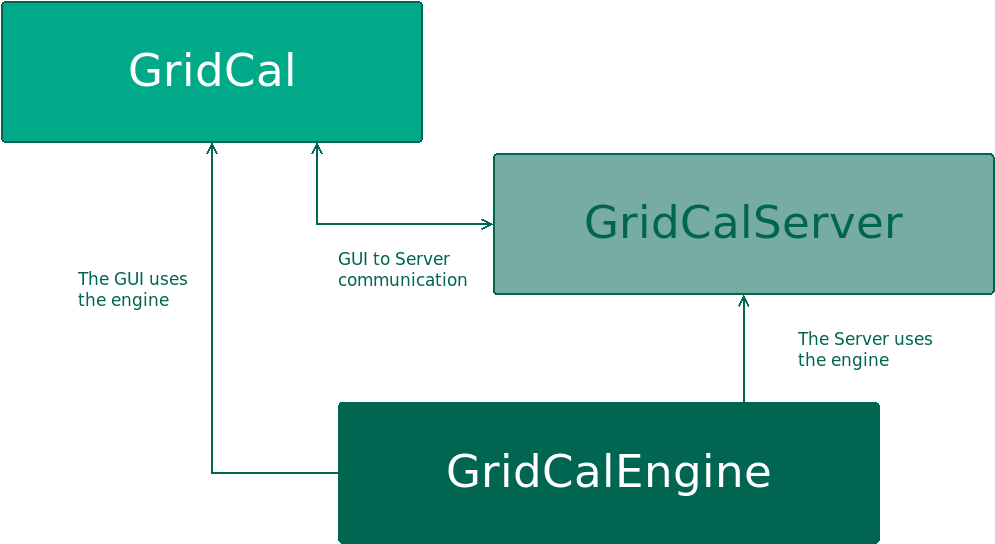
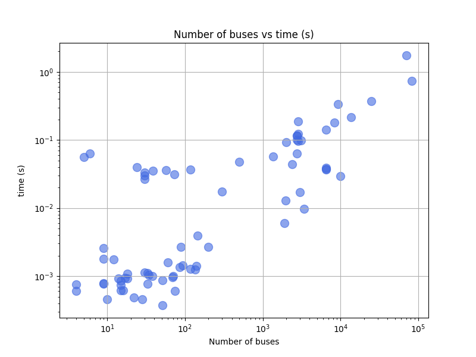

# GridCal

GridCal is a top tier power systems planning and simulation software.
As such it has all the static analysis studies that you can think of, plus
linear and non-linear optimization functions. Some of these functions are
well known, while others you may have never heard of as they are a
product of cutting-edge research.

[](https://www.youtube.com/watch?v=O-tb_um8YtU)

[](https://app.codacy.com/app/SanPen/GridCal?utm_source=github.com&utm_medium=referral&utm_content=SanPen/GridCal&utm_campaign=Badge_Grade_Dashboard)
[](https://gridcal.readthedocs.io/en/latest/?badge=latest) [](https://travis-ci.org/SanPen/GridCal)
[](https://www.zenodo.org/badge/latestdoi/49583206)
[](https://pepy.tech/project/gridcal)

GridCal started in 2015 with a clear objective: create a solid programming library and a user-friendly interface.
This straightforward approach sparked many innovations — some driven by the necessity
for commercial use, and others fueled by curiosity and research.

Whether you're a pro needing free tools, a researcher wanting a real-world tested platform,
a teacher sharing commercial-grade software insights, or a student diving into practical algorithms,
GridCal's got your back. It's a high quality product made for all of us now and
for the future generations.

## Installation

GridCal is a software made in the Python programming language.
Therefore, it needs a Python interpreter installed in your operative system.

The GridCal project is divided in three packages:

- GridCalEngine: A package with the database and calculations logic.
- GridCalServer: A package that serves an API-rest to use GridCalEngine remotely.
- GridCal: A package that contains the Graphical User Interface (GUI) and operates with `GridCalEngine` and
  `GridCalServer` seamlessly.

To install everything, you only need to install the GridCal package and the others will be installed as dependencies.



### Standalone setup

If you don't know what is this Python thing, we offer a windows installation:

[Windows setup](https://www.eroots.tech/software)

This will install GridCal as a normal windows program, and you don't need to worry
about any of the previous instructions. Still, if you need some guidance, the
following video might be of assistance: [Setup tutorial (video)](https://youtu.be/SY66WgLGo54).

### Package installation

We recommend to install the latest version of [Python](www.python.org) and then,
install GridCal with the following terminal command:

```
pip install GridCal
```

You may need to use `pip3` if you are under Linux or MacOS, both of which
come with Python pre-installed already.

### Install into an environment

```bash
python3 -m venv gc5venv
source gc5venv/bin/activate
pip install GridCal
gridcal
```

### Run the graphical user interface

Once you install GridCal in your local Python distribution, you can run the
graphical user interface with the following terminal command:

```
gridcal
```

If this doesn't work, try:

```
python -c "from GridCal.ExecuteGridCal import runGridCal; runGridCal()"
```

You may save this command in a shortcut for easy future access.

### Install only the engine

Some of you may only need GridCal as a library for some other purpose
like batch calculations, AI training or simple scripting. Whatever it may be,
you can get the GridCal engine with the following terminal command:

```
pip install GridCalEngine
```

This will install the `GridCalEngine` package that is a dependency of `GridCal`.

Again, you may need to use `pip3` if you are under Linux or MacOS.

## Features

GridCal is packed with features:

- Large collection of devices to model electricity grids
- AC/DC multi-grid power flow
- AC/DC multi-grid linear optimal power flow
- AC linear analysis (PTDF & LODF)
- AC linear net transfer capacity calculation
- AC+HVDC optimal net transfer capacity calculation
- AC/DC Stochastic power flow
- AC Short circuit
- AC Continuation power flow
- Contingency analysis (Power flow and LODF variants)
- Sigma analysis (one-shot stability analysis)
- Investments analysis
- Bus-branch schematic
- Substation-line map diagram
- Time series and snapshot for most simulations
- Overhead tower designer
- Inputs analysis
- Model bug report and repair
- Import many formats (PSSe .raw/rawx, epc, dgs, matpower, pypsa, json, cim, cgmes)
- Export in many formats (gridcal .xlsx/.gridcal/.json, cgmes, psse .raw/.rawx)

All of these are industry tested algorithms, some of which surpass most commercially available software.
The aim is to be a drop-in replacement for the expensive and less usable commercial
software, so that you can work, research and learn with it.

## Resources

In an effort to ease the simulation and construction of grids,
We have included extra materials to work with. These are included in the standalone setups.

- [Load profiles](https://github.com/SanPen/GridCal/tree/master/Grids_and_profiles/equipment) for your projects.
- [Grids](https://github.com/SanPen/GridCal/tree/master/Grids_and_profiles/grids) from IEEE and other open projects.
- [Equipment catalogue](https://gridcal.readthedocs.io/en/latest/data_sheets.html) (Wires, Cables and Transformers)
  ready to use in GridCal.

## Tutorials and examples

- [Getting started](https://gridcal.readthedocs.io/en/latest/rst_source/getting_started/index.html)

- [Cloning the repository (video)](https://youtu.be/59W_rqimB6w)

- [Making a grid with profiles (video)](https://youtu.be/H2d_2bMsIS0)

- [GridCal PlayGround repository](https://github.com/yasirroni/GridCalPlayground) with some notebooks and examples.

- [The tests](https://github.com/SanPen/GridCal/tree/master/src/tests) may serve as a valuable source of examples.


## Matpower grids

Matpower's excellent formulations and consistency has allowed this and other 
projects to develop, relying on its sound math. That is why GridCal reads Matpower 
cases out of the box, without you having to do anything special. 
And of course, GridCal solves all Matpower 8 provided grids, solving the continental USA case in about 1 second:


[](https://www.youtube.com/watch?v=O-tb_um8YtU)

Find the results at the [benchmarks page](https://gridcal.readthedocs.io/en/latest/rst_source/development/benchmarks.html) 
for more details.

_Results simulated with AMD 9750x and 64 GB of RAM under Ubuntu 24.04.
All solved using Newton-Raphson, and only using the provided solution 
that comes with the files when the flat start fails_. 


Cool right?

## API

Since day one, GridCal was meant to be used as a library as much as it was meant
to be used from the user interface. Following, we include some usage examples, but
feel free to check the [documentation](https://gridcal.readthedocs.io) out where you will find a complete
description of the theory, the models and the objects.

### Understanding the program structure

All simulations in GridCal are handled by the simulation drivers. The structure is as follows:


Any driver is fed with the data model (`MultiCircuit` object), the respective driver options, and often another
object relative to specific inputs for that driver. The driver is run, storing the driver results object.
Although this may seem overly complicated, it has proven to be maintainable and very convenient.

### Snapshot vs. time series

GridCal has dual structure to handle legacy cases (snapshot), as well as cases with many variations (time series)

- A **snapshot** is the grid for a particular moment in time.
  This includes the infrastructure plus the variable values of that infrastructure
  such as the load, the generation, the rating, etc.

- The **time series** record the variations of the magnitudes that can vary. These are applied along with
  the infrastructure definition.

In GridCal, the inputs do not get modified by the simulation results. This very important concept, helps
to maintain the independence of the inputs and outputs, allowing the replicability of the results.
This key feature is not true for other open-source of commercial programs.

A snapshot or any point of the time series, may be compiled to a `NumericalCircuit`. This object holds the
numerical arrays and matrices of a time step, ready for the numerical methods.
For those simulations that require many time steps, a collection of `NumericalCircuit` is compiled and used.


It may seem that this extra step is redundant. However, the compilation step is composed by mere copy operations,
which are fast. This steps benefits greatly the efficiency of the numerical calculations since the arrays are
aligned in memory. The GridCal data model is object-oriented, while the numerical circuit is array-oriented
(despite beign packed into objects)


### Loading a grid

```python
import GridCalEngine as gce

# load a grid (.gridcal, .m (Matpower), .raw (PSS/e) .rawx (PSS/e), .epc (PowerWorld), .dgs (PowerFactory)
my_grid = gce.open_file("my_file.gridcal")
```

In the case of CIM/CGMES, you may need to pass a list of files or a single zip file:

```python
import GridCalEngine as gce

# load a grid from many xml files
my_grid = gce.open_file(["grid_EQ.xml", "grid_TP.xml", "grid_SV.xml", ])

# or from a single zip assumed to contain CGMES files
my_grid = gce.open_file("my_cgmes_set_of_files.zip")

# or load a grid from a combination of xml and zip files assumed to be CGMES
my_grid = gce.open_file(["grid_EQ.xml", "grid_TP.xml", "grid_SV.xml", "boundary.zip"])
```

If you need to explore the CGMEs assets before conversion, you'll need to dive deeper in the API:

```python
import GridCalEngine as gce

fname = "tests/data/grids/CGMES_2_4_15/IEEE 118 Bus v2.zip"

logger = gce.Logger()
data_parser = gce.CgmesDataParser()
data_parser.load_files(files=[fname])
cgmes_circuit = gce.CgmesCircuit(cgmes_version=data_parser.cgmes_version,
                             cgmes_map_areas_like_raw=False, logger=logger)
cgmes_circuit.parse_files(data_parser=data_parser)

# print all the ac line segment names
for ac_line_segment in cgmes_circuit.cgmes_assets.ACLineSegment_list:
    print(ac_line_segment.name)

# print the logs
logger.print()
```

GridCal supports many file formats:

- CIM 16 (.zip and .xml)
- CGMES 2.4.15 and 3.0 (.zip and .xml)
- PSS/e raw and rawx versions 29 to 35, including USA market exchange RAW-30 specifics.
- Matpower .m files directly.
- DigSilent .DGS (not fully compatible)
- PowerWorld .EPC (not fully compatible, supports substation coordinates)

Similarly to CGMES you may be able to use the conversion objects to explore the original formats.

### Save a grid

```python
import GridCalEngine as gce

# load a grid
my_grid = gce.open_file("my_file.gridcal")

# save
gce.save_file(my_grid, "my_file_2.gridcal")
```

In the case of saving a model in CGMES mode, we need to specify some extra parameters.
To simplify we can use the API function `save_cgmes_file`:

```python
import GridCalEngine as gce

# load a grid
my_grid = gce.open_file("my_file.gridcal")

# run power flow (this is optional and it is used to generate the SV profile)
pf_results = gce.power_flow(my_grid)

# save the grid in CGMES mode
gce.save_cgmes_file(grid=my_grid,
                    filename="My_cgmes_model.zip",
                    cgmes_boundary_set_path="path_to_the_boundary_set.zip",
                    cgmes_version=CGMESVersions.v2_4_15,
                    pf_results=pf_results)

```

### Creating a Grid using the API objects

We are going to create a very simple 5-node grid from the excellent book
*Power System Load Flow Analysis by Lynn Powell*.

```python
import GridCalEngine as gce

# declare a circuit object
grid = gce.MultiCircuit()

# Add the buses and the generators and loads attached
bus1 = gce.Bus('Bus 1', Vnom=20)
# bus1.is_slack = True  # we may mark the bus a slack
grid.add_bus(bus1)

# add a generator to the bus 1
gen1 = gce.Generator('Slack Generator', vset=1.0)
grid.add_generator(bus1, gen1)

# add bus 2 with a load attached
bus2 = gce.Bus('Bus 2', Vnom=20)
grid.add_bus(bus2)
grid.add_load(bus2, gce.Load('load 2', P=40, Q=20))

# add bus 3 with a load attached
bus3 = gce.Bus('Bus 3', Vnom=20)
grid.add_bus(bus3)
grid.add_load(bus3, gce.Load('load 3', P=25, Q=15))

# add bus 4 with a load attached
bus4 = gce.Bus('Bus 4', Vnom=20)
grid.add_bus(bus4)
grid.add_load(bus4, gce.Load('load 4', P=40, Q=20))

# add bus 5 with a load attached
bus5 = gce.Bus('Bus 5', Vnom=20)
grid.add_bus(bus5)
grid.add_load(bus5, gce.Load('load 5', P=50, Q=20))

# add Lines connecting the buses
grid.add_line(gce.Line(bus1, bus2, name='line 1-2', r=0.05, x=0.11, b=0.02))
grid.add_line(gce.Line(bus1, bus3, name='line 1-3', r=0.05, x=0.11, b=0.02))
grid.add_line(gce.Line(bus1, bus5, name='line 1-5', r=0.03, x=0.08, b=0.02))
grid.add_line(gce.Line(bus2, bus3, name='line 2-3', r=0.04, x=0.09, b=0.02))
grid.add_line(gce.Line(bus2, bus5, name='line 2-5', r=0.04, x=0.09, b=0.02))
grid.add_line(gce.Line(bus3, bus4, name='line 3-4', r=0.06, x=0.13, b=0.03))
grid.add_line(gce.Line(bus4, bus5, name='line 4-5', r=0.04, x=0.09, b=0.02))
```

### Power Flow

Using the simplified API:

```python
import os
import GridCalEngine as gce

folder = os.path.join('..', 'Grids_and_profiles', 'grids')
fname = os.path.join(folder, 'IEEE39_1W.gridcal')
main_circuit = gce.open_file(fname)

results = gce.power_flow(main_circuit)

print(main_circuit.name)
print('Converged:', results.converged, 'error:', results.error)
print(results.get_bus_df())
print(results.get_branch_df())
```

Using the more complex library objects:

```python
import os
import GridCalEngine as gce

folder = os.path.join('..', 'Grids_and_profiles', 'grids')
fname = os.path.join(folder, 'IEEE14_from_raw.gridcal')
main_circuit = gce.open_file(fname)

options = gce.PowerFlowOptions(gce.SolverType.NR, verbose=False)
power_flow = gce.PowerFlowDriver(main_circuit, options)
power_flow.run()

print(main_circuit.name)
print('Converged:', power_flow.results.converged, 'error:', power_flow.results.error)
print(power_flow.results.get_bus_df())
print(power_flow.results.get_branch_df())
```

Output:

```text
IEEE14_from_raw

Converged: True error: 5.98e-08

Bus resuts:
           Vm     Va      P      Q
BUS 1    1.06   0.00 232.39 -16.55
BUS 2    1.04  -4.98  18.30  30.86
BUS 3    1.01 -12.73 -94.20   6.08
BUS 4    1.02 -10.31 -47.80   3.90
BUS 5    1.02  -8.77  -7.60  -1.60
BUS 6    1.07 -14.22 -11.20   5.23
BUS 7    1.06 -13.36   0.00   0.00
BUS 8    1.09 -13.36   0.00  17.62
BUS 9    1.06 -14.94 -29.50 -16.60
BUS 10   1.05 -15.10  -9.00  -5.80
BUS 11   1.06 -14.79  -3.50  -1.80
BUS 12   1.06 -15.08  -6.10  -1.60
BUS 13   1.05 -15.16 -13.50  -5.80
BUS 14   1.04 -16.03 -14.90  -5.00

Branch results:
                Pf         Qf          Pt         Qt               loading    Ploss     Qloss
1_2_1   156.882887 -20.404291 -152.585286  27.676248 15688288652036.908203 4.297600  7.271957
1_5_1    75.510380   3.854989  -72.747507   2.229360  7551037982438.064453 2.762872  6.084349
2_3_1    73.237578   3.560203  -70.914309   1.602232  7323757808601.912109 2.323269  5.162436
2_4_1    56.131495  -1.550352  -54.454837   3.020689  5613149456668.273438 1.676658  1.470337
2_5_1    41.516214   1.170996  -40.612460  -2.099032  4151621353697.657715 0.903753 -0.928036
3_4_1   -23.285691   4.473114   23.659136  -4.835650 -2328569062725.765625 0.373445 -0.362537
4_5_1   -61.158231  15.823642   61.672651 -14.201004 -6115823108351.800781 0.514420  1.622637
6_11_1    7.353277   3.560471   -7.297904  -3.444512   735327693069.753418 0.055373  0.115959
6_12_1    7.786067   2.503414   -7.714258  -2.353959   778606687855.751465 0.071809  0.149455
6_13_1   17.747977   7.216574  -17.535891  -6.798912  1774797671583.112793 0.212085  0.417662
7_8_1    -0.000000 -17.162967    0.000000  17.623448             -0.001718 0.000000  0.460481
7_9_1    28.074179   5.778690  -28.074179  -4.976621  2807417855964.891602 0.000000  0.802069
9_10_1    5.227551   4.219139   -5.214676  -4.184938   522755058212.680359 0.012875  0.034201
9_14_1    9.426380   3.610007   -9.310226  -3.362932   942638030136.208130 0.116154  0.247075
10_11_1  -3.785324  -1.615061    3.797906   1.644513  -378532426869.186707 0.012581  0.029451
12_13_1   1.614258   0.753959   -1.607959  -0.748260   161425771970.211853 0.006298  0.005698
13_14_1   5.643852   1.747172   -5.589774  -1.637068   564385175482.526855 0.054078  0.110105
4_7_1    28.074176  -9.681066  -28.074176  11.384281  2807417645485.176270 0.000000  1.703214
4_9_1    16.079758  -0.427611  -16.079758   1.732322  1607975830176.256104 0.000000  1.304711
5_6_1    44.087319  12.470682  -44.087319  -8.049520  4408731875605.579102 0.000000  4.421161
```

### Inputs analysis

GridCal can perform a summary of the inputs with the `InputsAnalysisDriver`:

```python
import os
import GridCalEngine as gce

folder = os.path.join('..', 'Grids_and_profiles', 'grids')
fname = os.path.join(folder, 'IEEE 118 Bus - ntc_areas.gridcal')

main_circuit = gce.open_file(fname)

drv = gce.InputsAnalysisDriver(grid=main_circuit)
mdl = drv.results.mdl(gce.ResultTypes.AreaAnalysis)
df = mdl.to_df()

print(df)
```

The results per area:

```text
               P    Pgen   Pload  Pbatt  Pstagen      Pmin      Pmax      Q    Qmin    Qmax
IEEE118-3  -57.0   906.0   963.0    0.0      0.0 -150000.0  150000.0 -345.0 -2595.0  3071.0
IEEE118-2 -117.0  1369.0  1486.0    0.0      0.0 -140000.0  140000.0 -477.0 -1431.0  2196.0
IEEE118-1  174.0  1967.0  1793.0    0.0      0.0 -250000.0  250000.0 -616.0 -3319.0  6510.0
```

### Linear analysis

We can run an PTDF equivalent of the power flow with the linear analysis drivers:

```python
import os
import GridCalEngine as gce

folder = os.path.join('..', 'Grids_and_profiles', 'grids')
fname = os.path.join(folder, 'IEEE 5 Bus.xlsx')

main_circuit = gce.open_file(fname)

# snapshot
results = gce.linear_power_flow(grid=main_circuit)

print("Bus results:\n", results.get_bus_df())
print("Branch results:\n", results.get_branch_df())
print("PTDF:\n", results.mdl(gce.ResultTypes.PTDF).to_df())
print("LODF:\n", results.mdl(gce.ResultTypes.LODF).to_df())
```

Simulating with a more detailed control of the objects:

```python
import os
import GridCalEngine as gce

folder = os.path.join('..', 'Grids_and_profiles', 'grids')
fname = os.path.join(folder, 'IEEE 5 Bus.xlsx')

main_circuit = gce.open_file(fname)

options_ = gce.LinearAnalysisOptions(distribute_slack=False, correct_values=True)

# snapshot
sn_driver = gce.LinearAnalysisDriver(grid=main_circuit, options=options_)
sn_driver.run()

print("Bus results:\n", sn_driver.results.get_bus_df())
print("Branch results:\n", sn_driver.results.get_branch_df())
print("PTDF:\n", sn_driver.results.mdl(gce.ResultTypes.PTDF).to_df())
print("LODF:\n", sn_driver.results.mdl(gce.ResultTypes.LODF).to_df())
```

Output:

```text
Bus results:
         Vm   Va       P    Q
Bus 0  1.0  0.0  2.1000  0.0
Bus 1  1.0  0.0 -3.0000  0.0
Bus 2  1.0  0.0  0.2349  0.0
Bus 3  1.0  0.0 -0.9999  0.0
Bus 4  1.0  0.0  4.6651  0.0

Branch results:
                   Pf   loading
Branch 0-1  2.497192  0.624298
Branch 0-3  1.867892  0.832394
Branch 0-4 -2.265084 -0.828791
Branch 1-2 -0.502808 -0.391900
Branch 2-3 -0.267908 -0.774300
Branch 3-4 -2.400016 -1.000006

PTDF:
                Bus 0     Bus 1     Bus 2  Bus 3     Bus 4
Branch 0-1  0.193917 -0.475895 -0.348989    0.0  0.159538
Branch 0-3  0.437588  0.258343  0.189451    0.0  0.360010
Branch 0-4  0.368495  0.217552  0.159538    0.0 -0.519548
Branch 1-2  0.193917  0.524105 -0.348989    0.0  0.159538
Branch 2-3  0.193917  0.524105  0.651011    0.0  0.159538
Branch 3-4 -0.368495 -0.217552 -0.159538    0.0 -0.480452

LODF:
             Branch 0-1  Branch 0-3  Branch 0-4  Branch 1-2  Branch 2-3  Branch 3-4
Branch 0-1   -1.000000    0.344795    0.307071   -1.000000   -1.000000   -0.307071
Branch 0-3    0.542857   -1.000000    0.692929    0.542857    0.542857   -0.692929
Branch 0-4    0.457143    0.655205   -1.000000    0.457143    0.457143    1.000000
Branch 1-2   -1.000000    0.344795    0.307071   -1.000000   -1.000000   -0.307071
Branch 2-3   -1.000000    0.344795    0.307071   -1.000000   -1.000000   -0.307071
Branch 3-4   -0.457143   -0.655205    1.000000   -0.457143   -0.457143   -1.000000
```
### Linear vs non-linear analysis comparison

Now let's make a comparison between the linear flows and the non-linear flows from Newton-Raphson:

```python
import os
from matplotlib import pyplot as plt
import GridCalEngine as gce

plt.style.use('fivethirtyeight')

folder = os.path.join('..', 'Grids_and_profiles', 'grids')
fname = os.path.join(folder, 'IEEE39_1W.gridcal')
main_circuit = gce.open_file(fname)

ptdf_driver = gce.LinearAnalysisTimeSeriesDriver(grid=main_circuit)
ptdf_driver.run()

pf_options_ = gce.PowerFlowOptions(solver_type=gce.SolverType.NR)
ts_driver = gce.PowerFlowTimeSeriesDriver(grid=main_circuit, options=pf_options_)
ts_driver.run()

fig = plt.figure(figsize=(30, 6))
ax1 = fig.add_subplot(131)
ax1.set_title('Newton-Raphson based flow')
ax1.plot(ts_driver.results.Sf.real)
ax1.set_ylabel('MW')
ax1.set_xlabel('Time')

ax2 = fig.add_subplot(132)
ax2.set_title('PTDF based flow')
ax2.plot(ptdf_driver.results.Sf.real)
ax2.set_ylabel('MW')
ax2.set_xlabel('Time')

ax3 = fig.add_subplot(133)
ax3.set_title('Difference')
diff = ts_driver.results.Sf.real - ptdf_driver.results.Sf.real
ax3.plot(diff)
ax3.set_ylabel('MW')
ax3.set_xlabel('Time')

fig.set_tight_layout(tight=True)

plt.show()
```


### Linear optimization

```python
import os
import numpy as np
import GridCalEngine as gce

folder = os.path.join('..', 'Grids_and_profiles', 'grids')
fname = os.path.join(folder, 'IEEE39_1W.gridcal')

main_circuit = gce.open_file(fname)

# declare the snapshot opf
opf_options = gce.OptimalPowerFlowOptions(mip_solver=gce.MIPSolvers.HIGHS)
opf_driver = gce.OptimalPowerFlowDriver(grid=main_circuit, options=opf_options)

print('Solving...')
opf_driver.run()

print("Status:", opf_driver.results.converged)
print('Angles\n', np.angle(opf_driver.results.voltage))
print('Branch loading\n', opf_driver.results.loading)
print('Gen power\n', opf_driver.results.generator_power)
print('Nodal prices \n', opf_driver.results.bus_shadow_prices)

# declare the time series opf
opf_ts_driver = gce.OptimalPowerFlowTimeSeriesDriver(grid=main_circuit)

print('Solving...')
opf_ts_driver.run()

print("Status:", opf_ts_driver.results.converged)
print('Angles\n', np.angle(opf_ts_driver.results.voltage))
print('Branch loading\n', opf_ts_driver.results.loading)
print('Gen power\n', opf_ts_driver.results.generator_power)
print('Nodal prices \n', opf_ts_driver.results.bus_shadow_prices)
```

#### Run a linear optimization and verify with power flow

Often ties, you want to dispatch the generation using a linear optimization, to then _verify_ the
results using the power exact power flow. With GridCal, to do so is as easy as passing the results of the OPF into the
PowerFlowDriver:

```python
import os
import GridCalEngine as gce

folder = os.path.join('..', 'Grids_and_profiles', 'grids')
fname = os.path.join(folder, 'IEEE39_1W.gridcal')

main_circuit = gce.open_file(fname)

# declare the snapshot opf
opf_driver = gce.OptimalPowerFlowDriver(grid=main_circuit)
opf_driver.run()

# create the power flow driver, with the OPF results
pf_options = gce.PowerFlowOptions(solver_type=gce.SolverType.NR)
pf_driver = gce.PowerFlowDriver(grid=main_circuit,
                                options=pf_options,
                                opf_results=opf_driver.results)
pf_driver.run()

# Print results
print('Converged:', pf_driver.results.converged, '\nError:', pf_driver.results.error)
print(pf_driver.results.get_bus_df())
print(pf_driver.results.get_branch_df())
```

Output:

```text
Converged: True 
Error: 5.553046023010211e-09
             Vm         Va           P           Q
bus 0  1.027155 -21.975050  -97.600000  -44.200000
bus 1  1.018508 -17.390151   -0.000000    0.000000
bus 2  0.979093 -21.508225 -322.000000   -2.400000
bus 3  0.934378 -19.864840 -500.000000 -184.000000
bus 4  0.931325 -16.488297   -0.000000    0.000000
bus 5  0.932254 -15.184820   -0.000000    0.000000
bus 6  0.925633 -18.287327 -233.800000  -84.000000
bus 7  0.927339 -19.147130 -522.000000 -176.600000
bus 8  1.008660 -21.901696   -6.500000   66.600000
bus 9  0.933232 -12.563826    0.000000    0.000000
bus 10 0.931530 -13.489535    0.000000   -0.000000
bus 11 0.911143 -13.919901   -8.530000  -88.000000
bus 12 0.932956 -14.194410   -0.000000    0.000000
bus 13 0.939456 -18.071831   95.000000   80.000000
bus 14 0.947946 -24.501201 -320.000000 -153.000000
bus 15 0.969547 -25.398839 -329.000000  -32.300000
bus 16 0.975073 -24.329289   -0.000000    0.000000
bus 17 0.974923 -23.729596 -158.000000  -30.000000
bus 18 0.978267 -32.658992    0.000000   -0.000000
bus 19 0.976962 -38.320718 -680.000000 -103.000000
bus 20 0.975875 -21.466364 -274.000000 -115.000000
bus 21 1.005675 -15.328363    0.000000    0.000000
bus 22 1.005660 -16.083736 -247.500000  -84.600000
bus 23 0.977732 -24.971264 -308.600000   92.200000
bus 24 1.008485 -18.545657 -224.000000  -47.200000
bus 25 1.000534 -20.462156 -139.000000  -17.000000
bus 26 0.981806 -23.507873 -281.000000  -75.500000
bus 27 1.008509 -15.740313 -206.000000  -27.600000
bus 28 1.012968 -12.490634 -283.500000  -26.900000
bus 29 1.049900  -8.627698  900.000000  251.046579
bus 30 0.982000   0.000000  959.172868  323.252930
bus 31 0.945335  -0.791018  900.000000  150.000000
bus 32 0.997200 -32.044975   80.000000  129.407620
bus 33 1.006817 -38.408267    0.000000  167.000000
bus 34 1.039299  -8.255317  900.000000  300.000000
bus 35 1.060037  -8.077926  550.259634  240.000000
bus 36 1.027500 -16.918435  128.970365   82.680976
bus 37 1.026500  -4.776516  900.000000  103.207961
bus 38 1.030000 -23.362551 -204.000000    6.956520
                   Pf          Qf          Pt          Qt     loading     Ploss       Qloss
branch 0  -199.490166    9.886924  200.882852  -66.631030  -33.248361  1.392685  -56.744105
branch 1   101.890166  -54.086924 -101.789768  -22.751166   10.189017  0.100398  -76.838090
branch 2   494.939507  226.957177 -491.146020 -208.562681   98.987901  3.793487   18.394496
branch 3   204.177641  -52.633324 -201.227524   41.260633   40.835528  2.950117  -11.372692
branch 4  -900.000000 -107.692823  900.000000  251.046579 -100.000000  0.000000  143.353757
branch 5  -110.112636  203.416014  110.898270 -210.820460  -22.022527  0.785633   -7.404446
branch 6   279.258656    2.746666 -278.361852  -12.311738   55.851731  0.896804   -9.565072
branch 7  -396.736291   53.024640  398.210339  -41.118140  -66.122715  1.474048   11.906501
branch 8  -214.161979  -26.204180  214.585979   20.909705  -42.832396  0.424000   -5.294474
branch 9  -757.052621   31.704768  758.376760  -18.259085  -63.087718  1.324139   13.445683
branch 10  358.842282    9.413372 -357.652308   -5.501385   39.871365  1.189974    3.911986
branch 11  510.748653   42.617618 -508.932128  -24.515536   56.749850  1.816525   18.102081
branch 12 -309.952545   33.292523  310.738787  -36.144659  -64.573447  0.786242   -2.852137
branch 13 -959.172868  -57.651055  959.172868  323.252930  -53.287382 -0.000000  265.601874
branch 14  275.132128  -59.484464 -274.764014   57.022428   30.570236  0.368114   -2.462036
branch 15  110.416322 -228.121043 -108.890865  216.489512   12.268480  1.525457  -11.631531
branch 16  102.390865 -149.889512 -102.210232   29.707685   11.376763  0.180633 -120.181827
branch 17  327.473237    5.932303 -326.980326   -6.970962   54.578873  0.492911   -1.038659
branch 18  572.526763  -42.245014 -571.014280   52.157064   95.421127  1.512483    9.912050
branch 19 -900.000000   36.312711  900.000000  150.000000 -100.000000  0.000000  186.312711
branch 20  -16.202399  -42.051495   16.241539   43.115621   -3.240480  0.039140    1.064126
branch 21    7.672399  -45.948505   -7.630574   47.085615    1.534480  0.041825    1.137109
branch 22  578.644854  -99.242678 -575.095683  123.970310   96.440809  3.549172   24.727632
branch 23  455.509704  -64.880015 -451.229578   83.883725   75.918284  4.280126   19.003709
branch 24  131.229578 -236.883725 -130.530951  228.460261   21.871596  0.698627   -8.423463
branch 25 -201.616968  -48.791645  201.933110   40.123973  -33.602828  0.316142   -8.667672
branch 26  610.218277  -68.716891 -603.829849  117.741029  101.703046  6.388428   49.024138
branch 27 -480.680339  -12.436131  482.646709   21.510035  -80.113390  1.966370    9.073904
branch 28 -126.390019 -130.815594  126.492978  126.394116  -21.065003  0.102959   -4.421477
branch 29 -120.254199    6.410659  120.361852  -17.688262  -20.042367  0.107653  -11.277602
branch 30  -81.678911  -46.534633   81.783480   17.137675  -13.613152  0.104569  -29.396957
branch 31  683.666914    8.361328 -680.247614   59.047728   75.962990  3.419300   67.409057
branch 32  -79.837065 -126.102358   80.000000  129.407620   -8.870785  0.162935    3.305263
branch 33    0.247614 -162.047728    0.000000  167.000000    0.027513  0.247614    4.952272
branch 34 -756.646709 -136.510035  761.585858  197.760507  -84.071857  4.939149   61.250472
branch 35  138.414142  -16.911352 -138.300144    0.065486   23.069024  0.113998  -16.845866
branch 36 -900.000000 -180.849155  900.000000  300.000000 -100.000000  0.000000  119.150845
branch 37  439.456180   68.098749 -435.092978  -34.194116   73.242697  4.363202   33.904632
branch 38 -548.656035 -152.764235  550.259634  240.000000  -60.961782  1.603599   87.235765
branch 39  106.064510  -10.937025 -105.702431  -38.989055   17.677418  0.362078  -49.926080
branch 40 -128.836985  -77.523608  128.970365   82.680976  -14.315221  0.133380    5.157368
branch 41  364.790468   90.170222 -362.783480  -92.637675   60.798411  2.006988   -2.467453
branch 42 -174.673027  -32.815129  175.985257  -31.448155  -29.112171  1.312230  -64.263284
branch 43 -223.415010  -35.366038  226.271920  -37.606217  -37.235835  2.856910  -72.972254
branch 44 -381.985257    3.848155  383.997464   -7.582852  -63.664210  2.012206   -3.734697
branch 45 -893.769383   18.289069  900.000000  103.207961  -74.480782  6.230617  121.497030
```

### Hydro linear OPF

The following example loads and runs the linear optimization for a system that integrates fluid elements into a regular
electrical grid.

```python
import os
import GridCalEngine as gce

folder = os.path.join('..', 'Grids_and_profiles', 'grids')
fname = os.path.join(folder, 'hydro_simple.gridcal')
grid = gce.open_file(fname)

# Run the simulation
opf_driver = gce.OptimalPowerFlowTimeSeriesDriver(grid=grid)

print('Solving...')
opf_driver.run()

print('Gen power\n', opf_driver.results.generator_power)
print('Branch loading\n', opf_driver.results.loading)
print('Reservoir level\n', opf_driver.results.fluid_node_current_level)
```

Output:

```text
OPF results:

time                | p2x_1_gen | pump_1_gen | turbine_1_gen | slack_gen
------------------- | --------- | ---------- | ------------- | ---------
2023-01-01 00:00:00 | 0.0       | -6.8237821 | 6.0           | 11.823782
2023-01-01 01:00:00 | 0.0       | -6.8237821 | 6.0           | 11.823782
2023-01-01 02:00:00 | 0.0       | -6.8237821 | 6.0           | 11.823782
2023-01-01 03:00:00 | 0.0       | -6.8237821 | 6.0           | 11.823782
2023-01-01 04:00:00 | 0.0       | -6.8237821 | 6.0           | 11.823782
2023-01-01 05:00:00 | 0.0       | -6.8237821 | 6.0           | 11.823782
2023-01-01 06:00:00 | 0.0       | -6.8237821 | 6.0           | 11.823782
2023-01-01 07:00:00 | 0.0       | -6.8237821 | 6.0           | 11.823782
2023-01-01 08:00:00 | 0.0       | -6.8237821 | 6.0           | 11.823782
2023-01-01 09:00:00 | 0.0       | -6.8237821 | 6.0           | 11.823782


time                | line1  | line2 | line3     | line4
------------------- | ------ | ----- | --------- | -----
2023-01-01 00:00:00 | 100.0  | 0.0   | 68.237821 | 40.0
2023-01-01 01:00:00 | 100.0  | 0.0   | 68.237821 | 40.0
2023-01-01 02:00:00 | 100.0  | 0.0   | 68.237821 | 40.0
2023-01-01 03:00:00 | 100.0  | 0.0   | 68.237821 | 40.0
2023-01-01 04:00:00 | 100.0  | 0.0   | 68.237821 | 40.0
2023-01-01 05:00:00 | 100.0  | 0.0   | 68.237821 | 40.0
2023-01-01 06:00:00 | 100.0  | 0.0   | 68.237821 | 40.0
2023-01-01 07:00:00 | 100.0  | 0.0   | 68.237821 | 40.0
2023-01-01 08:00:00 | 100.0  | 0.0   | 68.237821 | 40.0
2023-01-01 09:00:00 | 100.0  | 0.0   | 68.237821 | 40.0


time                | f1         | f2  | f3  | f4        
------------------- | ---------- | --- | --- | ----------
2023-01-01 00:00:00 | 49.998977  | 0.0 | 0.0 | 50.001022
2023-01-01 01:00:00 | 49.997954  | 0.0 | 0.0 | 50.002046
2023-01-01 02:00:00 | 49.996931  | 0.0 | 0.0 | 50.003068
2023-01-01 03:00:00 | 49.995906  | 0.0 | 0.0 | 50.004093
2023-01-01 04:00:00 | 49.994884  | 0.0 | 0.0 | 50.005116
2023-01-01 05:00:00 | 49.993860  | 0.0 | 0.0 | 50.006139
2023-01-01 06:00:00 | 49.992838  | 0.0 | 0.0 | 50.007162
2023-01-01 07:00:00 | 49.991814  | 0.0 | 0.0 | 50.008185
2023-01-01 08:00:00 | 49.990792  | 0.0 | 0.0 | 50.009208
2023-01-01 09:00:00 | 49.989768  | 0.0 | 0.0 | 50.010231
```

### Short circuit

GridCal has unbalanced short circuit calculations. Now let's run a line-ground short circuit in the third bus of
the South island of New Zealand grid example from reference book
_Computer Analysis of Power Systems by J. Arrillaga and C.P. Arnold_

```python
import os
import GridCalEngine as gce

folder = os.path.join('..', 'Grids_and_profiles', 'grids')
fname = os.path.join(folder, 'South Island of New Zealand.gridcal')

grid = gce.open_file(filename=fname)

# Define fault index explicitly
fault_index = 2

# Run a Line-Ground short circuit on the bus at index 2
# Since we do not provide any power flow results, it will run one for us
results = gce.short_circuit(grid, fault_index, fault_type=gce.FaultType.LG)

print("Short circuit power: ", results.SCpower[fault_index])
```

A more elaborated way to run the simulation, controlling all the steps:

```python
import os
import GridCalEngine as gce

folder = os.path.join('..', 'Grids_and_profiles', 'grids')
fname = os.path.join(folder, 'South Island of New Zealand.gridcal')

grid = gce.open_file(filename=fname)

pf_options = gce.PowerFlowOptions()
pf = gce.PowerFlowDriver(grid, pf_options)
pf.run()

fault_index = 2
sc_options = gce.ShortCircuitOptions(bus_index=fault_index,
                                     fault_type=gce.FaultType.LG)

sc = gce.ShortCircuitDriver(grid, options=sc_options,
                            pf_options=pf_options,
                            pf_results=pf.results)
sc.run()

print("Short circuit power: ", sc.results.SCpower[fault_index])
```

Output:

```text
Short circuit power:  -217.00 MW - 680.35j MVAr
```

Sequence voltage, currents and powers are also available.


### Continuation power flow

GridCal can run continuation power flows (voltage collapse studies) 

```python
import os
from matplotlib import pyplot as plt
import GridCalEngine as gce

plt.style.use('fivethirtyeight')

folder = os.path.join('..', 'Grids_and_profiles', 'grids')
fname = os.path.join(folder, 'South Island of New Zealand.gridcal')

# open the grid file
main_circuit = gce.open_file(fname)

# Run the continuation power flow with the default options
# Since we do not provide any power flow results, it will run one for us
results = gce.continuation_power_flow(grid=main_circuit, 
                                      factor=2.0, 
                                      stop_at=gce.CpfStopAt.Full)

# plot the results
fig = plt.figure(figsize=(18, 6))

ax1 = fig.add_subplot(121)
res = results.mdl(gce.ResultTypes.BusActivePower)
res.plot(ax=ax1)

ax2 = fig.add_subplot(122)
res = results.mdl(gce.ResultTypes.BusVoltage)
res.plot(ax=ax2)

plt.tight_layout()

plt.show()
```

A more elaborated way to run the simulation, controlling all the steps:

```python
import os
from matplotlib import pyplot as plt
import GridCalEngine as gce

plt.style.use('fivethirtyeight')

folder = os.path.join('..', 'Grids_and_profiles', 'grids')
fname = os.path.join(folder, 'South Island of New Zealand.gridcal')

# open the grid file
main_circuit = gce.FileOpen(fname).open()

# we need to initialize with a power flow solution
pf_options = gce.PowerFlowOptions()
power_flow = gce.PowerFlowDriver(grid=main_circuit, options=pf_options)
power_flow.run()

# declare the CPF options
vc_options = gce.ContinuationPowerFlowOptions(step=0.001,
                                              approximation_order=gce.CpfParametrization.ArcLength,
                                              adapt_step=True,
                                              step_min=0.00001,
                                              step_max=0.2,
                                              error_tol=1e-3,
                                              tol=1e-6,
                                              max_it=20,
                                              stop_at=gce.CpfStopAt.Full,
                                              verbose=False)

# We compose the target direction
factor = 2.0
base_power = power_flow.results.Sbus / main_circuit.Sbase
vc_inputs = gce.ContinuationPowerFlowInput(Sbase=base_power,
                                           Vbase=power_flow.results.voltage,
                                           Starget=base_power * factor)

# declare the CPF driver and run
vc = gce.ContinuationPowerFlowDriver(grid=main_circuit,
                                     options=vc_options,
                                     inputs=vc_inputs,
                                     pf_options=pf_options)
vc.run()

# plot the results
fig = plt.figure(figsize=(18, 6))

ax1 = fig.add_subplot(121)
res = vc.results.mdl(gce.ResultTypes.BusActivePower)
res.plot(ax=ax1)

ax2 = fig.add_subplot(122)
res = vc.results.mdl(gce.ResultTypes.BusVoltage)
res.plot(ax=ax2)

plt.tight_layout()

plt.show()
```


### Contingency analysis

GriCal has contingency simulations, and it features a quite flexible way of defining contingencies.
Firs you define a contingency group, and then define individual events that are assigned to that contingency group.
The simulation then tries all the contingency groups and apply the events registered in each group:

```python
import os
import GridCalEngine as gce

folder = os.path.join('Grids_and_profiles', 'grids')
fname = os.path.join(folder, 'IEEE 5 Bus.xlsx')

main_circuit = gce.open_file(fname)

branches = main_circuit.get_branches()

# manually generate the contingencies
for i, br in enumerate(branches):
  # add a contingency group
  group = gce.ContingencyGroup(name="contingency {}".format(i + 1))
  main_circuit.add_contingency_group(group)

  # add the branch contingency to the groups, only groups are failed at once
  con = gce.Contingency(device_idtag=br.idtag, name=br.name, group=group)
  main_circuit.add_contingency(con)

# add a special contingency
group = gce.ContingencyGroup(name="Special contingency")
main_circuit.add_contingency_group(group)
main_circuit.add_contingency(gce.Contingency(device_idtag=branches[3].idtag,
                                             name=branches[3].name, group=group))
main_circuit.add_contingency(gce.Contingency(device_idtag=branches[5].idtag,
                                             name=branches[5].name, group=group))

pf_options = gce.PowerFlowOptions(solver_type=gce.SolverType.NR)

# declare the contingency options
options_ = gce.ContingencyAnalysisOptions(use_provided_flows=False,
                                          Pf=None,
                                          contingency_method=gce.ContingencyMethod.PowerFlow,
                                          # if no power flow options are provided
                                          # a linear power flow is used
                                          pf_options=pf_options)

# Get all the defined contingency groups from the circuit
contingency_groups = main_circuit.get_contingency_groups()

# Pass the list of contingency groups as required
linear_multiple_contingencies = gce.LinearMultiContingencies(grid=main_circuit,
                                                             contingency_groups_used=contingency_groups)

simulation = gce.ContingencyAnalysisDriver(grid=main_circuit,
                                           options=options_,
                                           linear_multiple_contingencies=linear_multiple_contingencies)

simulation.run()

# print results
df = simulation.results.mdl(gce.ResultTypes.BranchActivePowerFrom).to_df()
print("Contingency flows:\n", df)

```

Output:

```text
Contingency flows:
                       Branch 0-1  Branch 0-3  Branch 0-4  Branch 1-2  Branch 2-3  Branch 3-4
# contingency 1          0.000000  322.256814 -112.256814 -300.000000 -277.616985 -350.438026
# contingency 2        314.174885    0.000000 -104.174887   11.387545   34.758624 -358.359122
# contingency 3        180.382705   29.617295    0.000000 -120.547317  -97.293581 -460.040537
# contingency 4        303.046401  157.540574 -250.586975    0.000000   23.490000 -214.130663
# contingency 5        278.818887  170.710914 -239.529801  -23.378976    0.000000 -225.076976
# contingency 6        323.104522  352.002620 -465.107139   20.157096   43.521763    0.000000
# Special contingency  303.046401  372.060738 -465.107139    0.000000   23.490000    0.000000
```

This simulation can also be done for time series.

### State estimation

Now lets program the example from the state estimation reference book
_State Estimation in Electric Power Systems by A. Monticelli_.

```python
import GridCalEngine as gce

m_circuit = gce.MultiCircuit()

b1 = gce.Bus('B1', is_slack=True)
b2 = gce.Bus('B2')
b3 = gce.Bus('B3')

br1 = gce.Line(b1, b2, name='Br1', r=0.01, x=0.03, rate=100.0)
br2 = gce.Line(b1, b3, name='Br2', r=0.02, x=0.05, rate=100.0)
br3 = gce.Line(b2, b3, name='Br3', r=0.03, x=0.08, rate=100.0)

# add measurements
m_circuit.add_pf_measurement(gce.PfMeasurement(0.888, 0.008, br1))
m_circuit.add_pf_measurement(gce.PfMeasurement(1.173, 0.008, br2))

m_circuit.add_qf_measurement(gce.QfMeasurement(0.568, 0.008, br1))
m_circuit.add_qf_measurement(gce.QfMeasurement(0.663, 0.008, br2))

m_circuit.add_pi_measurement(gce.PiMeasurement(-0.501, 0.01, b2))
m_circuit.add_qi_measurement(gce.QiMeasurement(-0.286, 0.01, b2))

m_circuit.add_vm_measurement(gce.VmMeasurement(1.006, 0.004, b1))
m_circuit.add_vm_measurement(gce.VmMeasurement(0.968, 0.004, b2))

m_circuit.add_bus(b1)
m_circuit.add_bus(b2)
m_circuit.add_bus(b3)

m_circuit.add_line(br1)
m_circuit.add_line(br2)
m_circuit.add_line(br3)

# Declare the simulation driver and run
se = gce.StateEstimation(circuit=m_circuit)
se.run()

print(se.results.get_bus_df())
print(se.results.get_branch_df())
```

Output:

```text
          Vm        Va         P        Q
B1  0.999629  0.000000  2.064016  1.22644
B2  0.974156 -1.247547  0.000000  0.00000
B3  0.943890 -2.745717  0.000000  0.00000

            Pf        Qf          Pt         Qt    loading    Ploss    Qloss
Br1  89.299199 55.882169  -88.188659 -52.550550  89.299199 1.110540 3.331619
Br2 117.102446 66.761871 -113.465724 -57.670065 117.102446 3.636722 9.091805
Br3  38.591163 22.775597  -37.956374 -21.082828  38.591163 0.634789 1.692770
```

### Export the results

A simple function is available to export the results of a driver.

```python
import GridCalEngine as gce

fname = os.path.join("data", "grids", "IEEE39_1W.gridcal")
grid = gce.open_file(fname)

# create the driver
pf_driver = gce.PowerFlowTimeSeriesDriver(grid=grid,
                                          options=gce.PowerFlowOptions(),
                                          time_indices=grid.get_all_time_indices())
# run
pf_driver.run()

# Save the driver results in a zip file with CSV files inside
gce.export_drivers(drivers_list=[pf_driver], file_name="IEEE39_1W_results.zip")
```

You could save many drivers in the same zip file passing then into the list `drivers_list`.

Also there is a function to save from the results objects themselves:

```python
import GridCalEngine as gce

fname = os.path.join("data", "grids", "IEEE39_1W.gridcal")
grid = gce.open_file(fname)

# run with the API shortcut functions
pf_results = gce.power_flow(grid)
pf_ts_results = gce.power_flow_ts(grid)

# Save the driver results in a zip file with CSV files inside
gce.export_results(results_list=[pf_results, pf_ts_results], file_name="IEEE39_1W_results.zip")
```

### Client - Server operation

To use the gridcal server, you need to install the `GridCalServer` python package. Once this is done,
the `gridcalserver`command will be available on the system.
To launch the server, simply type `gridcalserver`. This will launch a GridCal server on the machine,
on port 8000. This is `https://localhost:8000`

An example on how to send a grid from a script to the server:

```python
import os
import asyncio
import GridCalEngine as gce

# path to your file
fname = os.path.join('..', '..', '..', 'Grids_and_profiles', 'grids', "IEEE57.gridcal")

# read gridcal file
grid_ = gce.open_file(fname)

# define instruction for the server
instruction = gce.RemoteInstruction(operation=gce.SimulationTypes.NoSim)

# generate json to send
model_data = gce.gather_model_as_jsons_for_communication(circuit=grid_, instruction=instruction)

# get the sever certificate
gce.get_certificate(base_url="https://localhost:8000",
                    certificate_path=gce.get_certificate_path(),
                    pwd="")

# send json
reply_from_server = asyncio.get_event_loop().run_until_complete(
    gce.send_json_data(json_data=model_data,
                       endpoint_url="https://localhost:8000/upload",
                       certificate=gce.get_certificate_path())
)

print(reply_from_server)
```


## Tests

**GridCal** uses pytest for automatic software testing.

If you make changes to **GridCal** that you plan to submit, first make sure that all
tests are still passing. You can do this locally with `pytest`.

If you have added new functionality, you should also add a new function that tests this
functionality. pytest automatically detects all functions in the `src/tests` folder
that start with `test_` and are located in a file that also starts with `test_` as
relevant test cases. Unit test (for pytest) are included in `src/tests`. As defined in `pytest.ini`, all
files matching `test_*.py` are executed by running `pytest`.
    

Files matching `*_test.py` are not executed; they were not formatted specifically for
`pytest` but were mostly done for manual testing and documentation purposes.

Additional tests should be developed for each new and existing feature. `pytest`
should be run before each commit to prevent easily detectable bugs.


## Bug reporting

You have found a bug in **GridCal** or have a suggestion for a new functionality? Then
get in touch with us by opening up an issue on the [issue board](https://github.com/SanPen/GridCal/issues) to discuss possible new
developments with the community and the maintainers.

## Contributing

All contributions to the **GridCal** repository are made through pull requests to the
`devel` branch. You can either submit a pull request from the develop branch of your
fork or create a special feature branch that you keep the changes on. A feature branch
is the way to go if you have multiple issues that you are working on in parallel and
want to submit with separate pull requests. If you only have small, one-time changes
to submit, you can also use the `devel` branch to submit your pull request.

However, it is best to discuss your contribution before the pull request is ready to be officially
submitted. We only accept high quality contributions that align with the project design. 
Those are heavily reviewed, and you may expect joint work with us if your proposal is deemed good enough.

An easier alternative to contribute is to use the GridCal objects and functions to produce your contribution 
in a script-like fashion. Again, if that meets the functional and quality standards that we impose, 
we'll take care of the integration.

All contributions must come with testing.

## Contact

- Join the [Discord GridCal channel](https://discord.com/invite/dzxctaNbvu) for a friendly chat, or quick question.
- Submit questions or comments to our [form](https://forms.gle/MpjJAntAwZiLwE6B6).
- Submit bugs or requests in the [Issues](https://github.com/SanPen/GridCal/issues) section.
- Simply email [santiago@gridcal.org](santiago@gridcal.org)

## License

GridCal is licensed under the [Mozilla Public License 2.0](https://mozilla.org/MPL/2.0/) (MPLv2)

In practical terms this means that:

- You can use GridCal for commercial work.
- You can sell commercial services based on GridCal.
- If you distribute GridCal, you don't need to distribute GridCal's source code. However, with python in practice you do.
- GridCal license does not propagate, even if you use GridCal or pieces of it in your code.
  However, you must retain the individual files licensing.

Nonetheless, read the license carefully.

## Disclaimer

All trademarks mentioned in the documentation or the source code belong to their respective owners.
