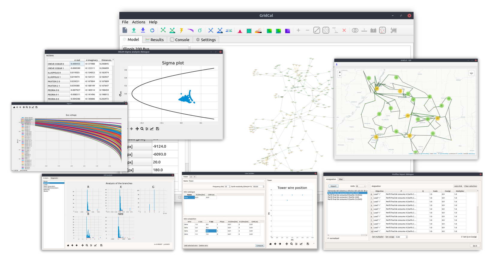
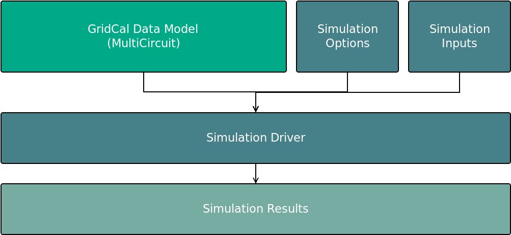
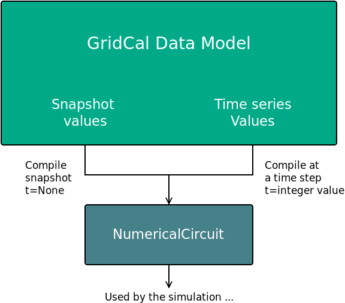

# GridCal

GridCal is a top tier power systems planning and simulation software. 
As such it has all the static analysis studies that you can think of, plus 
linear and non-linear optimization functions. Some of these functions are 
well known, while others you may have never heard of as they are a 
product of cutting-edge research.



[](https://app.codacy.com/app/SanPen/GridCal?utm_source=github.com&utm_medium=referral&utm_content=SanPen/GridCal&utm_campaign=Badge_Grade_Dashboard)
[](https://gridcal.readthedocs.io/en/latest/?badge=latest) [](https://travis-ci.org/SanPen/GridCal)
[](https://www.zenodo.org/badge/latestdoi/49583206)
[](https://pepy.tech/project/gridcal)


GridCal started in 2015 out of frustration with existing options. 
The goal was clear: create a solid programming library and a user-friendly interface. 
This straightforward approach sparked various innovations — some driven by the necessity 
of commercial use, and others fueled by curiosity and research.

Whether you're a pro needing free tools, a researcher wanting a real-world tested platform, 
a teacher sharing commercial-grade software insights, or a student diving into practical algorithms, 
GridCal's got your back. It's a high quality product made for all of us now and 
for the future generations.

## Installation

GridCal is a software made in the Python programming language. 
Therefore, it needs a python interpreter installed in your operative system. 
We recommend to install the latest version of [Python](www.python.org) and then, 
install GridCal with the following terminal command:

```
pip install GridCal
```

You may need to use `pip3` if you are under Linux or MacOS, both of which 
come with Python pre-installed already.

### Run th graphical user interface

Once you install GridCal in your local Python distribution, you can run the 
graphical user interface with the following terminal command:

```
python -c "from GridCal.ExecuteGridCal import run; run()"
```

You may save this command in a shortcut for easy future access.

### Install only the engine

Some of you may only need GridCal as a library for some other purpose 
like batch calculations, AI training or simple scripting. Whatever it may be, 
you can get the GridCal engine with the following terminal command:

```
pip install GridCalEngine
```

This will install the `GridCalEngine` package that is a dependency of `GridCal`.

Again, you may need to use `pip3` if you are under Linux or MacOS.

### Standalone setup

If you don't know what is this Python thing, we offer a windows installation:

[Windows setup](https://www.advancedgridinsights.com/gridcal)

This will install GridCal as a normal windows program and you need not to worry 
about any of the previous instructions. Still, if you need some guidance, the 
following video might be of assistance: [Setup tutorial (video)](https://youtu.be/SY66WgLGo54).


## Features

GridCal is packed with feautures:

- Large collection of devices to model electricity grids
- AC/DC multi-grid power flow
- AC/DC multi-grid linear optimal power flow
- AC linear analysis (PTDF & LODF)
- AC linear net transfer capacity calculation
- AC+HVDC optimal net transfer capacity calculation
- AC/DC Stochastic power flow
- AC Short circuit
- AC Continuation power flow
- Contingency analysis (Power flow and LODF variants)
- Sigma analysis (one-shot stability analysis)
- Investments analysis
- Bus-branch schematic
- Substation-line map diagram
- Time series and snapshot for most simulations
- Overhead tower designer
- Inputs analysis
- Model bug report and repair
- Import many formats (PSSe .raw/rawx, epc, dgs, matpower, pypsa, json, cim, cgmes)
- Export in many formats (gridcal .xlsx/.gridcal/.json, cgmes, psse .raw/.rawx)

All of these are industry tested algoriths, some of which surpass most comemercially available software.
The aim is to be a drop-in replacement for the expensive and less usable commercial
software, so that you can work, research and learn with it.

### Resources

In an effort to ease the simulation and construction of grids, 
We have included extra materials to work with. These are included in the standalone setups.

- [Load profiles](https://github.com/SanPen/GridCal/tree/master/Grids_and_profiles/equipment) for your projects.
- [Grids](https://github.com/SanPen/GridCal/tree/master/Grids_and_profiles/grids) from IEEE and other open projects.
- [Equipment catalogue](https://gridcal.readthedocs.io/en/latest/data_sheets.html) (Wires, Cables and Transformers) ready to use in GridCal.


### Tutorials and examples

- [Tutorials](https://gridcal.readthedocs.io/en/latest/tutorials/tutorials_module.html)

- [Cloning the repository (video)](https://youtu.be/59W_rqimB6w)

- [Making a grid with profiles (video)](https://youtu.be/H2d_2bMsIS0)

- [GridCal PlayGround repository](https://github.com/yasirroni/GridCalPlayground) with some notebooks and examples.

- [The tests](https://github.com/SanPen/GridCal/tree/master/src/tests) may serve as a valuable source of examples.

## API

Since day one, GridCal was meant to be used as a library as much as it was meant 
to be used from the user interface. Following, we include some usage examples, but 
feel free to check the [documentation](https://gridcal.readthedocs.io) out where you will find a complete
description of the theory, the models and the objects.

### Understanding the program structure

All simulations in GridCal are handled by the simulation drivers. The structure is as follows: 



Any driver is fed with the data model (`MultiCircuit` object), the respective driver options, and often another 
object relative to specific inputs for that driver. The driver is run, storing the driver results object. 
Although this may seem overly complicated, it has proven to be maintainable and very convenient.


### Snapshot vs. time series
GridCal has dual structure to handle legacy cases (snapshot), as well as cases with many variations (time series)

- A **snapshot** is the grid for a particular moment in time.
This includes the infrastructure plus the variable values of that infraestructure 
such as the load, the generation, the rating, etc.

- The **time series** record the variations of the magnitudes that can vary. These are aplied along with
the infrastructure definition.

In GridCal, the inputs do not get modified by the simulation results. This very important concept, helps
maintaining the independence of the inputs and outputs, allowing the replicability of the results. 
This key feature is not true for other open-source of comercial programs.

A snapshot or any point of the time series, may be compiled to a `NumericalCircuit`. This object holds the
numerical arrays and matrices of a time step, ready for the numerical methods. 
For those simulations that require many time steps, a collection of `NumericalCircuit` is compiled and used.



It may seem that this extra step is redundant. However the compilation step is composed by mere copy operations, 
which are fast. This steps benefits greatly the efficiency of the numerical calculations since the arrays are 
aligned in memory. The GridCal data model is object-oriented, while the numerical circuit is array-oriented 
(despite beign packed into objects)


### Loading a grid

```python
import GridCalEngine.api as gce

# load a grid
my_grid = gce.open_file("my_file.gridcal")
```

GridCal supports a plethora of file formats:

- CIM 16 (.zip and .xml)
- CGMES 2.4.15 (.zip and .xml)
- PSS/e raw and rawx versions 29 to 35, including USA market excahnge RAW-30 specifics.
- Matpower .m files directly.
- DigSilent .DGS (not fully compatible)
- PowerWorld .EPC (not fully compatible, supports substation coordinates)

### Save a grid

```python
import GridCalEngine.api as gce

# load a grid
my_grid = gce.open_file("my_file.gridcal")

# save
gce.save_file(my_grid, "my_file_2.gridcal")
```

### Creating a Grid using the API objects

We are going to create a very simple 5-node grid from the excellent book 
*Power System Load Flow Analysis by Lynn Powell*.

```python
import GridCalEngine.api as gce

# declare a circuit object
grid = gce.MultiCircuit()

# Add the buses and the generators and loads attached
bus1 = gce.Bus('Bus 1', vnom=20)
# bus1.is_slack = True  # we may mark the bus a slack
grid.add_bus(bus1)

# add a generator to the bus 1
gen1 = gce.Generator('Slack Generator', vset=1.0)
grid.add_generator(bus1, gen1)

# add bus 2 with a load attached
bus2 = gce.Bus('Bus 2', vnom=20)
grid.add_bus(bus2)
grid.add_load(bus2, gce.Load('load 2', P=40, Q=20))

# add bus 3 with a load attached
bus3 = gce.Bus('Bus 3', vnom=20)
grid.add_bus(bus3)
grid.add_load(bus3, gce.Load('load 3', P=25, Q=15))

# add bus 4 with a load attached
bus4 = gce.Bus('Bus 4', vnom=20)
grid.add_bus(bus4)
grid.add_load(bus4, gce.Load('load 4', P=40, Q=20))

# add bus 5 with a load attached
bus5 = gce.Bus('Bus 5', vnom=20)
grid.add_bus(bus5)
grid.add_load(bus5, gce.Load('load 5', P=50, Q=20))

# add Lines connecting the buses
grid.add_line(gce.Line(bus1, bus2, 'line 1-2', r=0.05, x=0.11, b=0.02))
grid.add_line(gce.Line(bus1, bus3, 'line 1-3', r=0.05, x=0.11, b=0.02))
grid.add_line(gce.Line(bus1, bus5, 'line 1-5', r=0.03, x=0.08, b=0.02))
grid.add_line(gce.Line(bus2, bus3, 'line 2-3', r=0.04, x=0.09, b=0.02))
grid.add_line(gce.Line(bus2, bus5, 'line 2-5', r=0.04, x=0.09, b=0.02))
grid.add_line(gce.Line(bus3, bus4, 'line 3-4', r=0.06, x=0.13, b=0.03))
grid.add_line(gce.Line(bus4, bus5, 'line 4-5', r=0.04, x=0.09, b=0.02))
```

### Power Flow

Using the simplified API:

```python
import os
import numpy as np
import GridCalEngine.api as gce

folder = os.path.join('..', 'Grids_and_profiles', 'grids')
fname = os.path.join(folder, 'IEEE39_1W.gridcal')
main_circuit = gce.open_file(fname)

results = gce.power_flow(main_circuit)

print('\n\n', main_circuit.name)
print('\t|V|:', np.abs(results.voltage))
print('\t|Sbranch|:', np.abs(results.Sf))
print('\t|loading|:', np.abs(results.loading) * 100)
print('\terr:', results.error)
print('\tConv:', results.converged)
```

Using the more complex library objects:

```python
import os
import numpy as np
import GridCalEngine.api as gce

folder = os.path.join('..', 'Grids_and_profiles', 'grids')
fname = os.path.join(folder, 'IEEE39_1W.gridcal')
main_circuit = gce.open_file(fname)

options = gce.PowerFlowOptions(gce.SolverType.NR, verbose=False)
power_flow = gce.PowerFlowDriver(main_circuit, options)
power_flow.run()

print('\n\n', main_circuit.name)
print('\t|V|:', np.abs(power_flow.results.voltage))
print('\t|Sbranch|:', np.abs(power_flow.results.Sf))
print('\t|loading|:', np.abs(power_flow.results.loading) * 100)
print('\terr:', power_flow.results.error)
print('\tConv:', power_flow.results.converged)
```

### Inputs analysis

```python
import os
import GridCalEngine.api as gce

folder = os.path.join('..', 'Grids_and_profiles', 'grids')
fname = os.path.join(folder, 'IEEE 118 Bus - ntc_areas.gridcal')

main_circuit = gce.open_file(fname)

drv = gce.InputsAnalysisDriver(grid=main_circuit)
mdl = drv.results.mdl(gce.ResultTypes.AreaAnalysis)
df = mdl.to_df()

print(df)
```

The results per area:
```text
               P    Pgen   Pload  Pbatt  Pstagen      Pmin      Pmax      Q    Qmin    Qmax
IEEE118-3  -57.0   906.0   963.0    0.0      0.0 -150000.0  150000.0 -345.0 -2595.0  3071.0
IEEE118-2 -117.0  1369.0  1486.0    0.0      0.0 -140000.0  140000.0 -477.0 -1431.0  2196.0
IEEE118-1  174.0  1967.0  1793.0    0.0      0.0 -250000.0  250000.0 -616.0 -3319.0  6510.0
```


### Linear analysis

```python
import os
import GridCalEngine.api as gce

folder = os.path.join('..', 'Grids_and_profiles', 'grids')
fname = os.path.join(folder, 'IEEE39_1W.gridcal')

main_circuit = gce.open_file(fname)

options_ = gce.LinearAnalysisOptions(distribute_slack=False, correct_values=True)

# snapshot
sn_driver = gce.LinearAnalysisDriver(grid=main_circuit, options=options_)
sn_driver.run()

# time series
ts_driver = gce.LinearAnalysisTimeSeriesDriver(grid=main_circuit, options=options_)
ts_driver.run()
```

Now let's make a comparison between the linear flows and the non-linear flows from Newton-Raphson:

```python
import os
from matplotlib import pyplot as plt
import GridCalEngine.api as gce

plt.style.use('fivethirtyeight')


folder = os.path.join('..', 'Grids_and_profiles', 'grids')
fname = os.path.join(folder, 'IEEE39_1W.gridcal')
main_circuit = gce.open_file(fname)

ptdf_driver = gce.LinearAnalysisTimeSeriesDriver(grid=main_circuit)
ptdf_driver.run()

pf_options_ = gce.PowerFlowOptions(solver_type=gce.SolverType.NR)
ts_driver = gce.PowerFlowTimeSeriesDriver(grid=main_circuit, options=pf_options_)
ts_driver.run()

fig = plt.figure(figsize=(30, 6))
ax1 = fig.add_subplot(131)
ax1.set_title('Newton-Raphson based flow')
ax1.plot(ts_driver.results.Sf.real)
ax1.set_ylabel('MW')
ax1.set_xlabel('Time')

ax2 = fig.add_subplot(132)
ax2.set_title('PTDF based flow')
ax2.plot(ptdf_driver.results.Sf.real)
ax2.set_ylabel('MW')
ax2.set_xlabel('Time')

ax3 = fig.add_subplot(133)
ax3.set_title('Difference')
diff = ts_driver.results.Sf.real - ptdf_driver.results.Sf.real
ax3.plot(diff)
ax3.set_ylabel('MW')
ax3.set_xlabel('Time')

fig.set_tight_layout(tight=True)

plt.show()
```


### Linear optimization

```python
import os
import numpy as np
import GridCalEngine.api as gce

folder = os.path.join('..', 'Grids_and_profiles', 'grids')
fname = os.path.join(folder, 'IEEE39_1W.gridcal')

main_circuit = gce.open_file(fname)

# declare the snapshot opf
opf_driver = gce.OptimalPowerFlowDriver(grid=main_circuit)

print('Solving...')
opf_driver.run()

print("Status:", opf_driver.results.converged)
print('Angles\n', np.angle(opf_driver.results.voltage))
print('Branch loading\n', opf_driver.results.loading)
print('Gen power\n', opf_driver.results.generator_power)
print('Nodal prices \n', opf_driver.results.bus_shadow_prices)


# declare the time series opf
opf_ts_driver = gce.OptimalPowerFlowTimeSeriesDriver(grid=main_circuit)

print('Solving...')
opf_ts_driver.run()

print("Status:", opf_ts_driver.results.converged)
print('Angles\n', np.angle(opf_ts_driver.results.voltage))
print('Branch loading\n', opf_ts_driver.results.loading)
print('Gen power\n', opf_ts_driver.results.generator_power)
print('Nodal prices \n', opf_ts_driver.results.bus_shadow_prices)
```

## Contact

- Join the [Discord GridCal channel](https://discord.com/invite/dzxctaNbvu) for a friendly chat, or quick question.
- Submit questions or comments to our [form](https://forms.gle/MpjJAntAwZiLwE6B6).
- Submit bugs or requests in the [Issues](https://github.com/SanPen/GridCal/issues) section.
- Simply email [santiago@gridcal.org](santiago@gridcal.org)

## License

GridCal is licensed under the [Lesser General Public License v3.0](https://www.gnu.org/licenses/lgpl-3.0.en.html) (LGPL)

In practical terms this means that:

- You can use GridCal for commercial work.
- You can sell commercial services based on GridCal.
- If you distrubute GridCal, you must distribute GridCal's source code as well. 
That is always achieved in practice with python code.
- GridCal license does not propagate to works that are not a derivative of GridCal. 
An example of a derivative work is if you write a module of the program, the the license 
of the modue must be LGPL too. An example of a non-derivative work is if you use 
GridCal's API for something else without modifying the API itself, for instance, 
using it as a library for another program.

Nonetheless, read the license carefully.

## Disclaimer

All trademarks mentioned in the documentation or the source code belong to their respective owners.