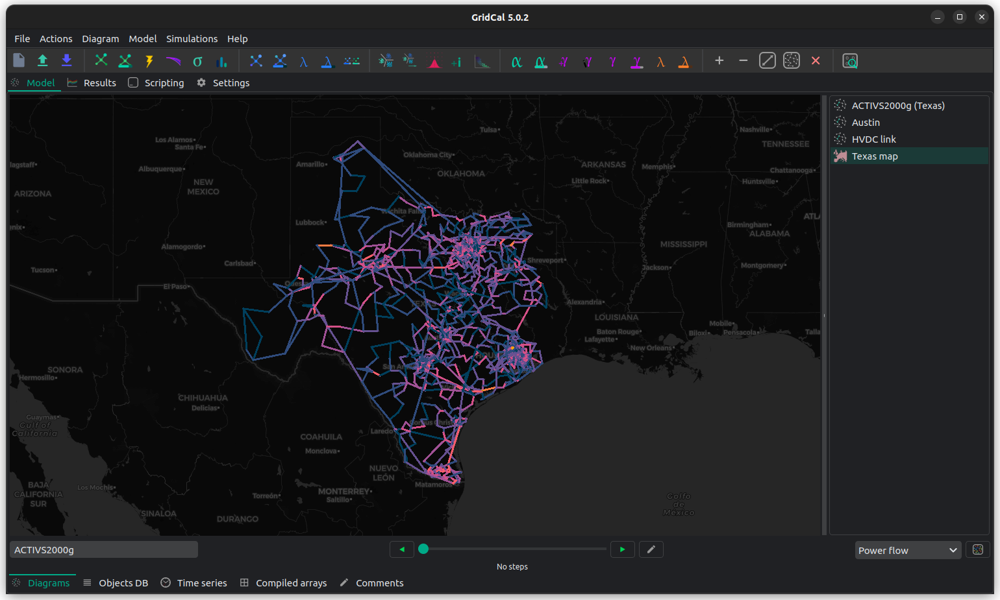

Welcome to GridCal's documentation!
===================================

GridCal is a top tier power systems planning and simulation software. As
such it has all the static analysis studies that you can think of, plus
linear and non-linear optimization functions. Some of these functions
are well known, while others you may have never heard of as they are a
product of cutting-edge research.

|Codacy Badge| |Documentation Status| |Build Status| |DOI| |Downloads|

GridCal started in 2015 with a clear objective: create a solid
programming library and a user-friendly interface. This straightforward
approach sparked many innovations — some driven by the necessity for
commercial use, and others fueled by curiosity and research.

Whether you’re a pro needing free tools, a researcher wanting a
real-world tested platform, a teacher sharing commercial-grade software
insights, or a student diving into practical algorithms, GridCal’s got
your back. It’s a high quality product made for all of us now and for
the future generations.

Contact
=======

-  Join the `Discord GridCal
   channel <https://discord.com/invite/dzxctaNbvu>`__ for a friendly
   chat, or quick question.
-  Submit questions or comments to our
   `form <https://forms.gle/MpjJAntAwZiLwE6B6>`__.
-  Submit bugs or requests in the
   `Issues <https://github.com/SanPen/GridCal/issues>`__ section.

Contents
=========

.. toctree::
    :maxdepth: 2

    md_source/installation.md
    md_source/user_interface.md
    md_source/structure.md
    md_source/modelling.md
    md_source/model_debugging.md
    md_source/file_operations.md

    md_source/topology.md
    md_source/clustering.md
    md_source/grid_reduction.md

    md_source/power_flow.md
    md_source/linear_analysis.md
    md_source/optimal_power_flow.md
    md_source/short_circuit.md
    md_source/stochastic_power_flow.md
    md_source/continuation_power_flow.md

    md_source/contingency_analysis.md
    md_source/investment_optimization.md
    md_source/cascading.md

    md_source/net_transfer_capacity.md
    md_source/nodal_hosting_capacity.md
    md_source/reliability.md
    md_source/state_estimation.md

    md_source/development.md
    md_source/plugins.md
    md_source/license.md
    rst_source/change_log
    md_source/data_models.md
    rst_source/api/auto/modules

Disclaimer
----------

All trademarks mentioned in the documentation or the source code belong
to their respective owners.

.. |Codacy Badge| image:: https://api.codacy.com/project/badge/Grade/75e794c9bcfd49bda1721b9ba8f6c790
   :target: https://app.codacy.com/app/SanPen/GridCal?utm_source=github.com&utm_medium=referral&utm_content=SanPen/GridCal&utm_campaign=Badge_Grade_Dashboard
.. |Documentation Status| image:: https://readthedocs.org/projects/gridcal/badge/?version=latest
   :target: https://gridcal.readthedocs.io/en/latest/?badge=latest
.. |Build Status| image:: https://travis-ci.org/SanPen/GridCal.svg?branch=master
   :target: https://travis-ci.org/SanPen/GridCal
.. |DOI| image:: https://www.zenodo.org/badge/49583206.svg
   :target: https://www.zenodo.org/badge/latestdoi/49583206
.. |Downloads| image:: https://static.pepy.tech/personalized-badge/gridcal?period=total&units=abbreviation&left_color=grey&right_color=green&left_text=Downloads
   :target: https://pepy.tech/project/gridcal

