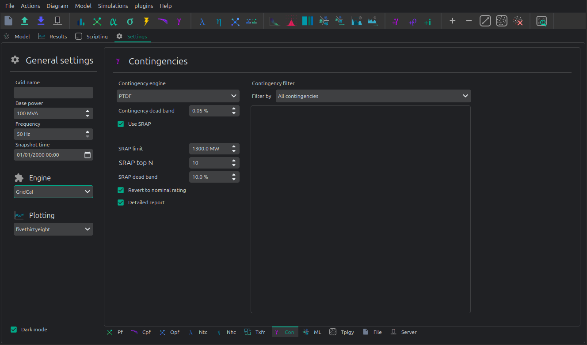

# 💥 Contingency analysis


GriCal has contingency simulations, and it features a quite flexible way of defining contingencies.
Firs you define a contingency group, and then define individual events that are assigned to that contingency group.
The simulation then tries all the contingency groups and apply the events registered in each group.



## API

### Snapshot contingency analysis

```python
import os
import GridCalEngine as gce

folder = os.path.join('Grids_and_profiles', 'grids')
fname = os.path.join(folder, 'IEEE 5 Bus.xlsx')

main_circuit = gce.open_file(fname)

branches = main_circuit.get_branches()

# manually generate the contingencies
for i, br in enumerate(branches):
  # add a contingency group
  group = gce.ContingencyGroup(name="contingency {}".format(i + 1))
  main_circuit.add_contingency_group(group)

  # add the branch contingency to the groups, only groups are failed at once
  con = gce.Contingency(device=br, name=br.name, group=group)
  main_circuit.add_contingency(con)

# add a special contingency
group = gce.ContingencyGroup(name="Special contingency")
main_circuit.add_contingency_group(group)
main_circuit.add_contingency(gce.Contingency(device=branches[3], name=branches[3].name, group=group))
main_circuit.add_contingency(gce.Contingency(device=branches[5], name=branches[5].name, group=group))

pf_options = gce.PowerFlowOptions(solver_type=gce.SolverType.NR)

# declare the contingency options
options_ = gce.ContingencyAnalysisOptions(use_provided_flows=False,
                                          Pf=None,
                                          contingency_method=gce.ContingencyMethod.PowerFlow,
                                          # if no power flow options are provided
                                          # a linear power flow is used
                                          pf_options=pf_options)

# Get all the defined contingency groups from the circuit
contingency_groups = main_circuit.get_contingency_groups()

# Pass the list of contingency groups as required
linear_multiple_contingencies = gce.LinearMultiContingencies(grid=main_circuit,
                                                             contingency_groups_used=contingency_groups)

simulation = gce.ContingencyAnalysisDriver(grid=main_circuit,
                                           options=options_,
                                           linear_multiple_contingencies=linear_multiple_contingencies)

simulation.run()

# print results
df = simulation.results.mdl(gce.ResultTypes.BranchActivePowerFrom).to_df()
print("Contingency flows:\n", df)

```

Output:

```text
Contingency flows:
                       Branch 0-1  Branch 0-3  Branch 0-4  Branch 1-2  Branch 2-3  Branch 3-4
# contingency 1          0.000000  322.256814 -112.256814 -300.000000 -277.616985 -350.438026
# contingency 2        314.174885    0.000000 -104.174887   11.387545   34.758624 -358.359122
# contingency 3        180.382705   29.617295    0.000000 -120.547317  -97.293581 -460.040537
# contingency 4        303.046401  157.540574 -250.586975    0.000000   23.490000 -214.130663
# contingency 5        278.818887  170.710914 -239.529801  -23.378976    0.000000 -225.076976
# contingency 6        323.104522  352.002620 -465.107139   20.157096   43.521763    0.000000
# Special contingency  303.046401  372.060738 -465.107139    0.000000   23.490000    0.000000
```

This simulation can also be done for time series.

### Contingency analysis time series

To perform the contingency analysis of a time series, it's easier to directly usi the API:

```python
import os
import GridCalEngine as gce

folder = os.path.join('Grids_and_profiles', 'grids')
fname = os.path.join(folder, 'IEEE39_1W.gridcal')
main_circuit = gce.open_file(fname)

results = gce.contingencies_ts(circuit=main_circuit,
                               detailed_massive_report=False,
                               contingency_deadband=0.0,
                               contingency_method=gce.ContingencyMethod.PowerFlow)
```

Note that the grid must have the declared contingencies saved already.
Also note that the results are statistics, and you will not get a cube because 
for large grids that demands terabytes of RAM memory.