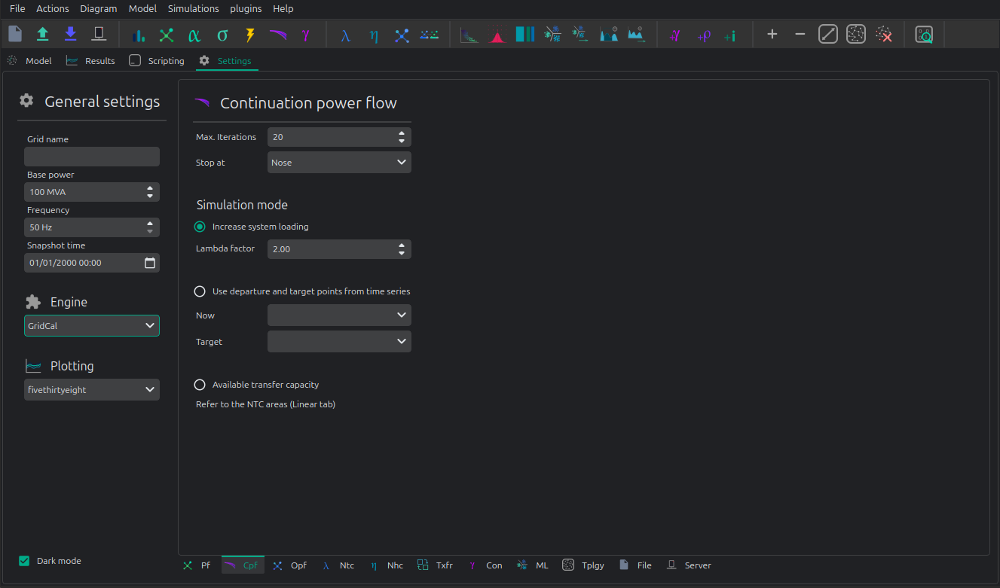

# ➿ Continuation power flow


VeraGrid can run continuation power flows (voltage collapse studies) 



Max. Iterations
    Number of iteration to perform at each voltage stability (predictor-corrector) stage.

Stop at
    Point of the curve to top at

    - Nose: Stop at the voltage collapse point
    - Full: Trace the full curve.

Use alpha target from the base situation
    The voltage collapse (stability) simulation is a "travel" from a base situation towards a "final" one.
    When this mode is selected the final situation is a linear combination of the base situation. All the
    power values are multiplied by the same number.

Use departure and target points from time series
    When this option is selected the base and the target points are given by time series points.
    This allows that the base and the final situations to have non even relationships while evolving
    from the base situation to the target situation.

## API

### Snapshot continuation power flow

```python
import os
from matplotlib import pyplot as plt
import VeraGridEngine as gce

plt.style.use('fivethirtyeight')

folder = os.path.join('..', 'Grids_and_profiles', 'grids')
fname = os.path.join(folder, 'South Island of New Zealand.veragrid')

# open the grid file
main_circuit = gce.open_file(fname)

# Run the continuation power flow with the default options
# Since we do not provide any power flow results, it will run one for us
results = gce.continuation_power_flow(grid=main_circuit,
                                      factor=2.0,
                                      stop_at=gce.CpfStopAt.Full)

# plot the results
fig = plt.figure(figsize=(18, 6))

ax1 = fig.add_subplot(121)
res = results.mdl(gce.ResultTypes.BusActivePower)
res.plot(ax=ax1)

ax2 = fig.add_subplot(122)
res = results.mdl(gce.ResultTypes.BusVoltageModule)
res.plot(ax=ax2)

plt.tight_layout()

plt.show()
```

A more elaborated way to run the simulation, controlling all the steps:

```python
import os
from matplotlib import pyplot as plt
import VeraGridEngine as gce

plt.style.use('fivethirtyeight')

folder = os.path.join('..', 'Grids_and_profiles', 'grids')
fname = os.path.join(folder, 'South Island of New Zealand.veragrid')

# open the grid file
main_circuit = gce.FileOpen(fname).open()

# we need to initialize with a power flow solution
pf_options = gce.PowerFlowOptions()
power_flow = gce.PowerFlowDriver(grid=main_circuit, options=pf_options)
power_flow.run()

# declare the CPF options
vc_options = gce.ContinuationPowerFlowOptions(step=0.001,
                                              approximation_order=gce.CpfParametrization.ArcLength,
                                              adapt_step=True,
                                              step_min=0.00001,
                                              step_max=0.2,
                                              error_tol=1e-3,
                                              tol=1e-6,
                                              max_it=20,
                                              stop_at=gce.CpfStopAt.Full,
                                              verbose=False)

# We compose the target direction
factor = 2.0
base_power = power_flow.results.Sbus / main_circuit.Sbase
vc_inputs = gce.ContinuationPowerFlowInput(Sbase=base_power,
                                           Vbase=power_flow.results.voltage,
                                           Starget=base_power * factor)

# declare the CPF driver and run
vc = gce.ContinuationPowerFlowDriver(grid=main_circuit,
                                     options=vc_options,
                                     inputs=vc_inputs,
                                     pf_options=pf_options)
vc.run()

# plot the results
fig = plt.figure(figsize=(18, 6))

ax1 = fig.add_subplot(121)
res = vc.results.mdl(gce.ResultTypes.BusActivePower)
res.plot(ax=ax1)

ax2 = fig.add_subplot(122)
res = vc.results.mdl(gce.ResultTypes.BusVoltageModule)
res.plot(ax=ax2)

plt.tight_layout()

plt.show()
```


## Theory

The continuation power flow is a technique that traces a trajectory from a 
base situation given to a combination of power $S_0$ and voltage $V_0$, 
to another situation determined by another combination of power $S'$. 
When the final power situation is undefined, then the algorithm continues 
until the Jacobian is singular, tracing the voltage collapse curve.

The method uses a predictor-corrector technique to trace this trajectory.

### Predictor step

$$

    \begin{bmatrix}
        \theta \\
        V \\
        \lambda \\
    \end{bmatrix}^{predicted}
    =
    \begin{bmatrix}
            \theta \\
            V \\
            \lambda \\
        \end{bmatrix}^{i}
    +
    \sigma \cdot
    \begin{bmatrix}
        J11  &  J12  & P_{base} \\
        J21  &  J22  & Q_{base} \\
        0    & 0    & 1 \\
    \end{bmatrix}^{-1}
    \times
    \begin{bmatrix}
        \hat{0} \\
        \hat{0} \\
        1\\
    \end{bmatrix}
$$

### Corrector step

$$

    \begin{bmatrix}
        d\theta \\
        dV \\
        d\lambda \\
    \end{bmatrix}
    =
    \begin{bmatrix}
            d\theta_0\\
            dV_0 \\
            d\lambda_0 \\
        \end{bmatrix}
    +
    \sigma \cdot
    \begin{bmatrix}
        J11  &  J12  & P_{base} \\
        J21  &  J22  & Q_{base} \\
        0    & -1    & 0 \\
    \end{bmatrix}^{-1}
    \times
    \begin{bmatrix}
        \hat{0} \\
        \hat{0} \\
        1\\
    \end{bmatrix}

$$
