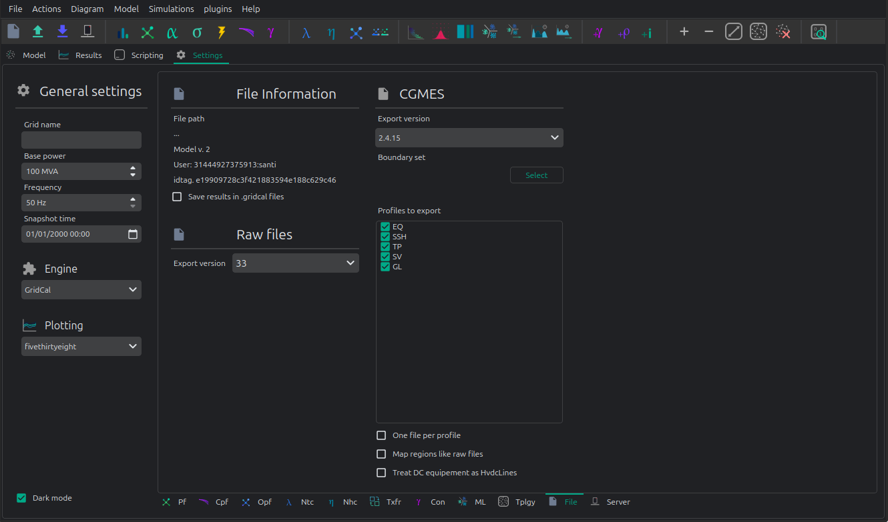

# 💾 File loading and saving


To load a grid, just drag & drop the file (or files) into the user interface.
Alternatively, use the open dialogue and select the file or files.
You may be presented with a logs dialogue, and in the case of CGMES a 
new window showing the CGMES information.
Regardless of the file format, whenever you load a file into VeraGrid it gets converted to the
native internal object structures (MultiCircuit). 
From there you may further edit or export in any of the supported formats.

VeraGrid supports a great deal of file formats. 

|                    |read   | write |
|--------------------|-------|-------|
| VeraGrid            |✅      | ✅     |
| Json               |✅      | ✅     |
| CIM                |✅      | ✅     |
| CGMES 2.4.15       |✅      | ✅     |
| CGMES 3.0          |✅      | ✅     |
| ucte (UCTE)        |✅      |       |
| m (Matpower)       |✅      |       |
| p (Pandapower)     |✅      |       |
| nc (PyPSA)         |✅      |       |
| raw/rawx (PSS/e)   |✅      | ✅     |
| epc (PSLF)         |✅      |       |
| dgs (PowerFactory) |✅      |       |

**Compatibility caveat**

- Install the PandaPower package to load the `.p` format since it is an optional dependency. `pip install pandapower`
- Install the PyPSA package to load the `.nc` format since it is an optional dependency. `pip install pypsa`

The other supported formats are handled natively.


Some additional file settings are found at the Settings>File tab:



These are specially relevant for CGMES and raw/rawx formats.


## API

### Loading a grid

```python
import VeraGridEngine as gce

# load a grid (.veragrid, .m (Matpower), .raw (PSS/e) .rawx (PSS/e), .epc (PSLF), .dgs (PowerFactory)
my_grid = gce.open_file("my_file.veragrid")
```

In the case of CIM/CGMES, you may need to pass a list of files or a single zip file:

```python
import VeraGridEngine as gce

# load a grid from many xml files
my_grid = gce.open_file(["grid_EQ.xml", "grid_TP.xml", "grid_SV.xml", ])

# or from a single zip assumed to contain CGMES files
my_grid = gce.open_file("my_cgmes_set_of_files.zip")

# or load a grid from a combination of xml and zip files assumed to be CGMES
my_grid = gce.open_file(["grid_EQ.xml", "grid_TP.xml", "grid_SV.xml", "boundary.zip"])
```

If you need to explore the CGMEs assets before conversion, you'll need to dive deeper in the API:

```python
import VeraGridEngine as gce

fname = "tests/data/grids/CGMES_2_4_15/IEEE 118 Bus v2.zip"

logger = gce.Logger()
data_parser = gce.CgmesDataParser()
data_parser.load_files(files=[fname])
cgmes_circuit = gce.CgmesCircuit(cgmes_version=data_parser.cgmes_version,
                                 cgmes_map_areas_like_raw=False, logger=logger)
cgmes_circuit.parse_files(data_parser=data_parser)

# print all the ac line segment names
for ac_line_segment in cgmes_circuit.cgmes_assets.ACLineSegment_list:
    print(ac_line_segment.name)

# print the logs
logger.print()
```

VeraGrid supports many file formats:

- CIM 16 (.zip and .xml)
- UCTE.
- CGMES 2.4.15 and 3.0 (.zip and .xml)
- PSS/e raw and rawx versions 29 to 35, including USA market exchange RAW-30 specifics.
- Matpower .m files directly.
- DigSilent .DGS (not fully compatible)
- PSLF .EPC (not fully compatible, supports substation coordinates)

Similarly to CGMES you may be able to use the conversion objects to explore the original formats.

### Save a grid

```python
import VeraGridEngine as gce

# load a grid
my_grid = gce.open_file("my_file.veragrid")

# save
gce.save_file(my_grid, "my_file_2.veragrid")
```

In the case of saving a model in CGMES mode, we need to specify some extra parameters.
To simplify we can use the API function `save_cgmes_file`:

```python
import VeraGridEngine as gce

# load a grid
my_grid = gce.open_file("my_file.veragrid")

# run power flow (this is optional and it is used to generate the SV profile)
pf_results = gce.power_flow(my_grid)

# save the grid in CGMES mode
gce.save_cgmes_file(grid=my_grid,
                    filename="My_cgmes_model.zip",
                    cgmes_boundary_set_path="path_to_the_boundary_set.zip",
                    cgmes_version=gce.CGMESVersions.v2_4_15,
                    pf_results=pf_results)

```


### Export the results

A simple function is available to export the results of a driver.

```python
import os
import VeraGridEngine as gce

fname = os.path.join("data", "grids", "IEEE39_1W.veragrid")
grid = gce.open_file(fname)

# create the driver
pf_driver = gce.PowerFlowTimeSeriesDriver(grid=grid,
                                          options=gce.PowerFlowOptions(),
                                          time_indices=grid.get_all_time_indices())
# run
pf_driver.run()

# Save the driver results in a zip file with CSV files inside
gce.export_drivers(drivers_list=[pf_driver], file_name="IEEE39_1W_results.zip")
```

You could save many drivers in the same zip file passing then into the list `drivers_list`.

Also there is a function to save from the results objects themselves:

```python
import os
import VeraGridEngine as gce

fname = os.path.join("data", "grids", "IEEE39_1W.veragrid")
grid = gce.open_file(fname)

# run with the API shortcut functions
pf_results = gce.power_flow(grid)
pf_ts_results = gce.power_flow_ts(grid)

# Save the driver results in a zip file with CSV files inside
gce.export_results(results_list=[pf_results, pf_ts_results], file_name="IEEE39_1W_results.zip")
```


### Client - Server operation

To use the VeraGrid server, you need to install the `VeraGridServer` python package. Once this is done,
the `veragridserver`command will be available on the system.
To launch the server, simply type `veragridserver`. This will launch a VeraGrid server on the machine,
on port 8000. This is `https://localhost:8000`

An example on how to send a grid from a script to the server:

```python
import os
import asyncio
import VeraGridEngine as gce

# path to your file
fname = os.path.join('..', '..', '..', 'Grids_and_profiles', 'grids', "IEEE57.veragrid")

# read veragrid file
grid_ = gce.open_file(fname)

# define instruction for the server
instruction = gce.RemoteInstruction(operation=gce.SimulationTypes.NoSim)

# generate json to send
model_data = gce.gather_model_as_jsons_for_communication(circuit=grid_, instruction=instruction)

# get the sever certificate
gce.get_certificate(base_url="https://localhost:8000",
                    certificate_path=gce.get_certificate_path(),
                    pwd="")

# send json
reply_from_server = asyncio.get_event_loop().run_until_complete(
    gce.send_json_data(json_data=model_data,
                       endpoint_url="https://localhost:8000/upload",
                       certificate=gce.get_certificate_path())
)

print(reply_from_server)
```
