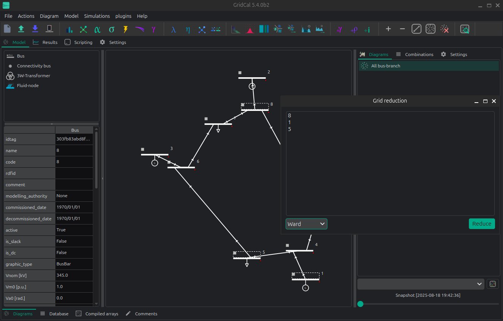

# 👾 Grid Reduction

GridCal has the ability to perform planning-style grid reductions.

A) From the schematic:

1. First, Select the buses that you want to reduce in the schematic.

2. The launch the grid reduction window by selecting the menu option `Model > Grid Reduction`

B) From the database:

1. Select the buses according to some rule in the database view. 
2. Right click and call the **grid reduction** action in the context menu.

A small window  will pop up indicating the list of buses that you are going to remove.
By accepting, the grid will be reduced according to the theory developed by [1].
You can expect that the reduced grid flows behave roughly like the original grid.

Changing the injections, or further topological changes will alter the equivalent behavior.

This action cannot be undone.

## API

## Theory

### Di-Shi grid equivalent

The PhD dissertation of Di-Shi presented in [1] [2], expands on the traditional ward equivalent reduction method.
The proposed method allows the generators to be *just moved* to the boundary buses. Later, 
the injections are calibrated to compensate for that. It is a very friendly method for 
planning engineers that want to reduce the grid, and still need to keep the generators as previously 
defined for dispatching.

**Step 0 – Define bus sets**

- I: set of internal buses.
- E: set of external buses: those that we want to remove.
- B: set of boundary buses between E and I.

**Step 1 – First Ward reduction**

This first reduction is to obtain the equivalent admittance matrix $Y_eq^{(1}$ that serves
to create the inter-boundary branches that represent the grid that we are going to remove.
For this the buses to keep are the internal (I) + boundary (B).

**Step 2 – Second Ward reduction: Extending to the external generation buses**

The second reduction is to generate another equivalent admittance matrix $Y_eq^{(2}$
that we use as adjacency matrix to search the closest bus to move each generator that is external.
For this the buses to keep are the internal (I) + boundary (B) + the generation buses of E.

**Step 3 – Relocate generators**

Using the matrix $Y_eq^{(2}$, we calculate the shortest paths from every 
external generation bus, to all the other buses in I + B. The end of each 
path will be the relocation bus of every external generator.

**Step 4 – Relocate loads with inverse power flow**

Let's not forget about the loads! in order to move the external loads such that
the reduced flows resemble the original flows (even after brutally moving the generators!),
we need to perform an *inverse power flow*.

First, we need to run a linear power flow in the original system. 
That will get us the original voltage angles.

Second, we need to form the admittance matrix of the reduced grid 
(including the inter-boundary branches), and multiply this admittance
matrix by the original voltage angles for the reduced set of buses.
This gets us the "final" power injections in the reduced system.

From those, we need to subtract the reduced grid injections. 
This will provide us with a vector of new loads that we need to add at 
the corresponding reduced grid buses in order to have a final equivalent.

[1]: [Power System Network Reduction for Engineering and Economic 
Analysis by Di Shi, 
2012 Arizona State University](https://core.ac.uk/download/pdf/79564835.pdf).

[2]: [Optimal Generation Investment Planning: Pt 1: Network Equivalents](https://ieeexplore.ieee.org/document/6336375)
