# 🏦 Investment optimization


Planning power grids involves determining an appropriate set of assets that makes sense from both
technical and economical optics. This challenge can be understood as an optimization problem, where one tries to
minimize the total cost $C = CAPEX+OPEX$, while simultaneously minimizing the technical restrictions
$t_r$. While apparently simple to comprehend, such a problem in its original form is arduous to solve and a
satisfying solution may not even be reached.

At this point, we have to ask ourselves what the underlying issue is. If the puzzle is rigorously formulated, it
becomes of the type MINLP. Not only it can include continuous variables (such as the rating of a substation), but
also a wide set of integer variables (the potential investments to make). It is well-known that even solving a
single-period OPF with only continuous variables becomes a very complicated problem, to the point where the
original scenario is often convexified to solve it with acceptable precision and time. Now imagine we have to find a
solution to such a problem, but considering the full 8760 hours in a year and thousands of investment combinations.
The result would be catastrophic given the astronomically high computational time.

Hence, it is clear we desire an algorithm that can provide us with a list of optimal investments and not suffer from
the curse of dimensionality. The methodology we have adopted here consists of:

- Building a machine-learning model that captures the behavior of the grid under diverse scenarios.
- Optimizing such a model in a matter of a few seconds.

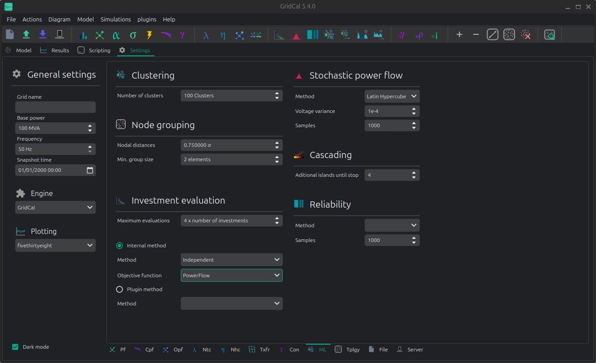

## API

```python
import VeraGridEngine as gce

# some grid with investments declared
gce.open_file("my_grid.veragrid")

# run a investment evaluation
problem = gce.AdequacyInvestmentProblem(
    grid=grid,
    n_monte_carlo_sim=n_monte_carlo_sim,
    use_monte_carlo=use_monte_carlo,
    save_file=False
)

options = gce.InvestmentsEvaluationOptions(max_eval=max_eval)

drv = gce.InvestmentsEvaluationDriver(
    grid=grid,
    options=options,
    problem=problem
)
drv.run()

# Save excel
df_pareto_points = drv.results.mdl(result_type=gce.ResultTypes.InvestmentsParetoReportResults).to_df()
df_all = drv.results.mdl(result_type=gce.ResultTypes.InvestmentsReportResults).to_df()
```

## Theory Pt.1

### Formulation

1. **Basic objective function**

The selected objective function considers both technical and economical criteria. In particular, it is defined as:

$$
f_o(x) = \sum{C_l(x)_{br}} + \sum C_o(x)_{br} + \sum C_{vm}(x)_b + \sum C_{va}(x)_b + \sum CAPEX(x)_i + \sum OPEX(x)_i
$$


where $C_l$ is a penalty function associated with active power losses, $C_o$ accounts for branch
overloadings, $C_{vm}$ gathers the undervoltage and overvoltage module penalties, and $C_{va}$ represents the
voltage angle deviation penalties. Power losses and overloadings are calculated for every branch
of the grid $br$, the voltage-related costs are computed at every bus $b$ and the CAPEX and OPEX are related
to each active investment $i$. Note here that the unknown $x$ is used to represent the investment
combination under consideration. That is, $x$ has to be seen as a vector that contains an $n$ -length
set of boolean variables that account for the activated or deactivated investments:

$$
x = [x_1, x_2, ..., x_n]
$$

or in compact form, equivalently, $x \in \mathbb{Z}^n_2$.


2. **Costs calculation**

Active power losses are calculated directly from the simulation results, such as power flow results.
All branches, including lines, transformers, DC lines, etc., are considered. The losses are summed 
to get $C_l(x)$.

For branch overloadings, the procedure is similar. The loading of each branch is computed from 
simulation results, and branches with loads above 100% of the rating are penalized. 
The penalty is calculated by multiplying the associated overload cost and the loading:

$$
\sum{C_o(x)_{br}} = \sum_{idx \in {branches\_idx}} P_o[idx] \cdot loading[idx] ,
$$

where $branches\_idx$ is the set of indices where $loading > 1$ and $P_o$ is the
corresponding overload penalization of the branch.

Regarding the undervoltages and overvoltages, the associated penalty is computed as:

$$
C_{vm}(x) =  P_{vm} \cdot ( \max(V_m - V^{\text{max}}_m, 0) +  \max(V^{\text{min}}_m - V_m, 0) )
$$

where $V_m , V^{\text{max}}_m, V^{\text{min}}_m, P_{vm}$ are vectors containing 
voltage module results, allowed maximum voltage, minimum voltage limit and voltage 
module penalization for each bus.

3. **Machine-learning algorithm**
Once the objective function is defined, each evaluation is sent to the 
machine-learning model previously mentioned. The algorithm being tested is the so-called 
Mixed-Variable ReLU-based Surrogate Modelling (MVRSM). 
For further information, the reader can find the reference [paper](https://dl.acm.org/doi/pdf/10.1145/3449726.3463136) 
to understand the insights of the model.

As for the electrical problem, it is not initially relevant what goes on inside the machine-learning algorithm, it
works as a black-box model. The objective function is evaluated and sent to the model in each iteration and in the end,
the model outputs the optimal point.


### Testing on a Grid

#### Grid

In order to test the algorithm for different variations of the objective function, a 
130-bus grid has been prepared with 389 Investment Candidates including lines and buses. 
The diagram of the grid is shown in Figure 1.

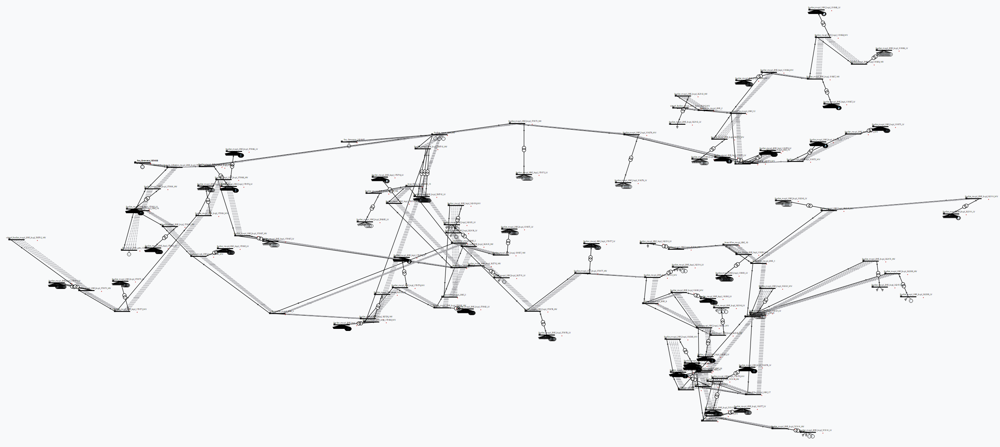
    Figure 1: Test grid diagram. Grey lines and repeated elements are investment candidates.

#### Base case

Initially, the algorithm did not include the economical criteria in the objective function. 
Although it is clear that it is needed to somehow include the CAPEX and OPEX in the minimization, 
the results shown in Figure 2 are useful to later grasp the effect of modifying the minimization function.

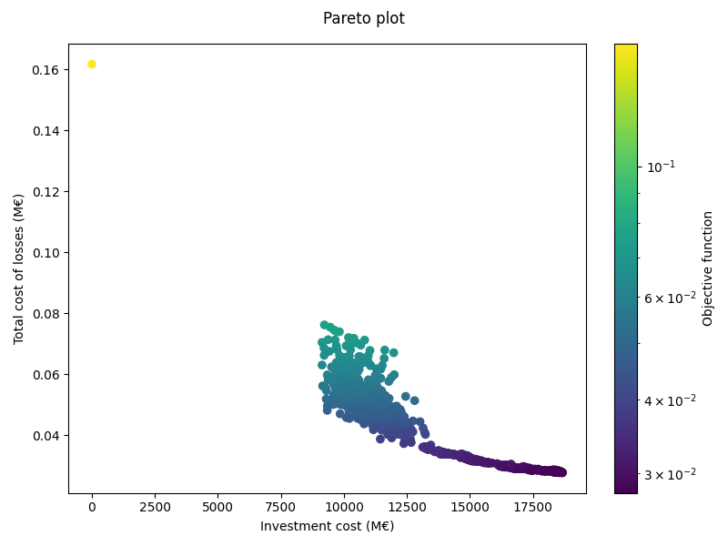
Figure 2: Paretto plot for investments evaluation without CAPEX inside the objective function.

It is clear in Figure 2 that the more investments are selected, the lower the technical 
criteria are and, therefore, the lower the objective function. Hence, the algorithm learns 
that more investments equals minimum objective function values. By adding the CAPEX to the 
objective function, it is expected to correct this tendency and instead find an optimal point
regarding both technical and economic criteria.

### Initial tests

Including the CAPEX in the objective function is a delicate problem. 
As seen in Figure 2, the CAPEX values can be above $10^4$ while the technical criteria are 
below $10^{-1}$. Therefore, when adding these values to the objective
function, the CAPEX will inherently have more weight and unbalance the results.
As an example, the reader can find below the graphs corresponding to multiplying 
the CAPEX by different minimization factors

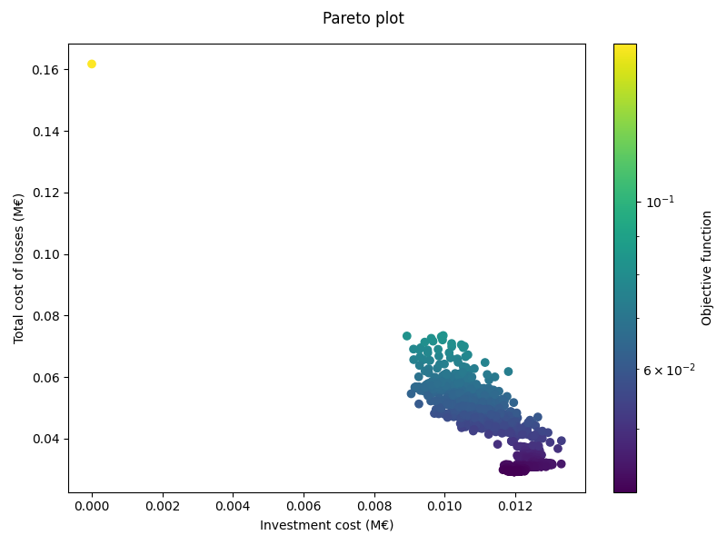
Figure 3: Results obtained when CAPEX is multiplied by $10^{-6}$.

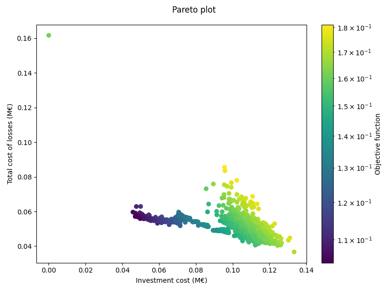
Figure 4: Results obtained when CAPEX is multiplied by $10^{-5}$.

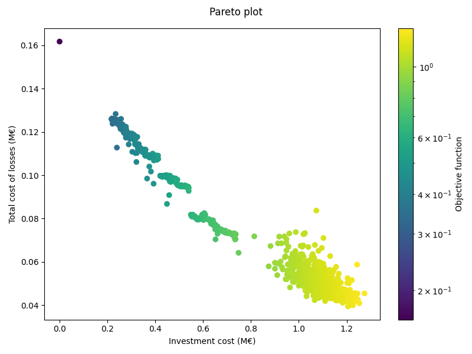
Figure 5: Results obtained when CAPEX is multiplied by $10^{-4}$.

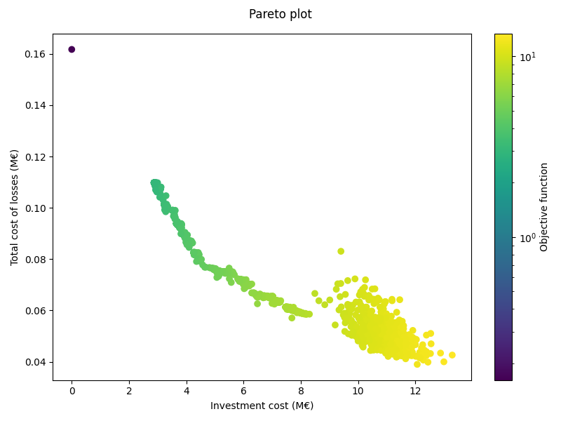
Figure 6: Results obtained when CAPEX is multiplied by $10^{-3}$.

The previous figures show that the more disparate the economic and technical 
criterion are, the more likely is the objective function to tend to lesser investments 
solutions. The situation from the Base case is reverted, but another problem arises: 
How should the different criteria values be computed so that all elements in the objective
function are around the same order of magnitude?

### Normalization

When dealing with multi-criteria optimization, it is common to establish some 
reference values for each criterion in the objective function and normalize the terms 
by dividing the factors by the reference point. In essence, the basic
objective function presented in Formulation would be modified as:

$$
f_o(x) = \frac{\sum{C_l(x)_{br}}}{l_{ref}} + \frac{\sum C_o(x)_{br}}{o_{ref}} + \frac{\sum C_{vm}(x)_b}{vm_{ref}} +
\frac{\sum C_{va}(x)_b}{va_{ref}} + \frac{\sum CAPEX(x)_i}{CAPEX_{ref}} + \frac{\sum OPEX(x)_i}{OPEX_{ref}}
$$

However, given the nature of the problem being solved, it is not possible to determine 
reference values for each criteria beforehand. Hence, some solutions are proposed. 
The reader can find the explanation and results obtained in the following subsections.

4.1. First iteration normalization

The first solution studied consists of taking the values of the terms for the first iteration with investments,
compute scaling factors referent to that iteration as

$$
sf_{i} = \frac{min(mean)}{mean_i}
$$

being:

- $sf_{i}$: the scale factor for each $i$ criteria; losses scaling factor, overload scaling factor, etc.,
- $mean_i$: the mean between the maximum and minimum value of each criteria; $\frac{max(losses) + min(losses)}{2}$,
- $mean$: an array of all the computed means of the factors; $[mean_{losses}, mean_{overload}, mean_{vm}, ... ]$.

and multiply each term for its scaling factor throughout the rest of the iterations. Therefore,
the objective function ends up being:

$$
f_o(x) = sf_l \sum{C_l(x)_{br}} + sf_o \sum C_o(x)_{br} + sf_{vm} \sum C_{vm}(x)_b +
sf_{va} \sum C_{va}(x)_b + sf_{CAPEX} \sum CAPEX(x)_i + sf_{OPEX} \sum OPEX(x)_i
$$

The results obtained in this normalization resemble the ones shown in Figure 5, 
given that the CAPEX scaling factor is essentially $$10^{-4}$$.

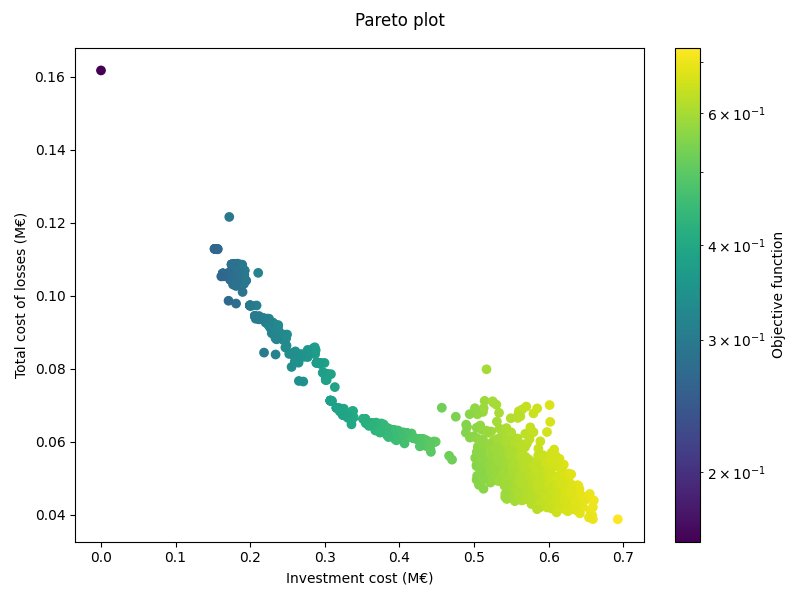
Figure 7: Results obtained for the first normalization type.

4.2. Scale after random evaluations

For the second solution, the MVRSM is altered so that the normalization of the different criteria is done internally.
The new algorithm consists first of some random evaluations, in the studied case, 1.5 times the number of possible investments.
During the random evaluations, the model is not updated nor the $x$ are updated by minimizing the model.
Afterwards, the maximum $y_{max}$ and minimum $y_{min}$ values throughout the evaluations are saved in
order to apply the normalization as:

$$
y_{norm} = \frac{y - y_{min}}{y_{max} - y_{min}}
$$

where $y$ is a vector containing the values of the criteria before normalization and $y_{norm}$ represents
the values after normalization. Hence, this normalization is applied to all the values found in the random process and
the model is now updated with the normalized values.

The second and final part of the algorithm consists of the rest of the evaluations, where each time the criteria are
found, they are normalized and the model is updated and minimized.

Therefore, the algorithm ends up being:

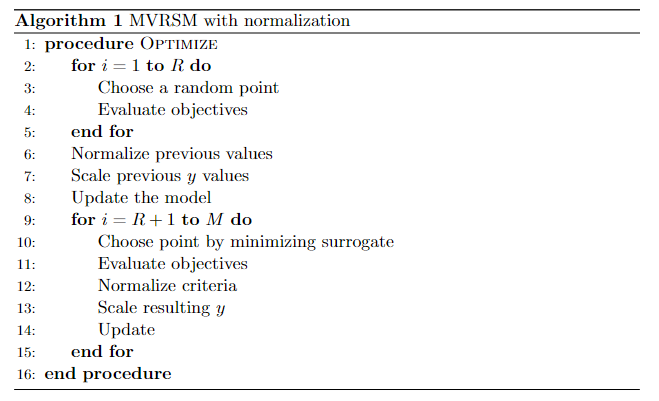
Figure 8: Updated algorithm "grosso modo".

This new configuration has been tested using two different functions:

- Using Rosenbrock's function $f(x, y) = (1 - x)^2 + 100 \cdot (y - x^2)^2$ where 
$x \in [-200, 200]$ and $y \in [-1,3]$. this way, $x,y$ are the criteria that need 
to be normalized before entering the objective function $f$
- Using a Sum function $f(x, y) = x + y$ where $x$ is computed by multiplying a 
binary vector and a costs vector and $y = \frac{1}{k+1}$ where $k$ is the number 
of 1 in the binary vector previously mentioned.

The results obtained show that the algorithm works and tends to the actual minimum point of the functions.

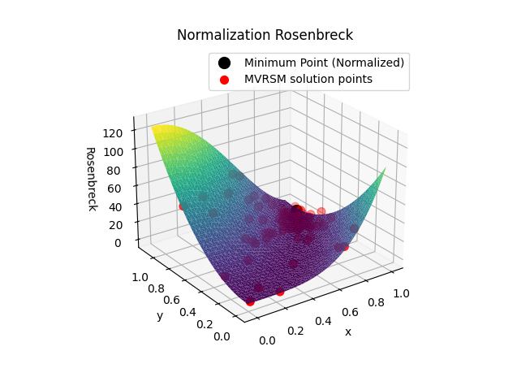
Figure 9: Results obtained for the Rosenbrock function.

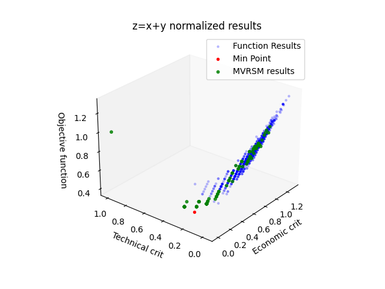
Figure 10: Results obtained for the Sum function.

Finally, the algorithm is tested in the presented grid.

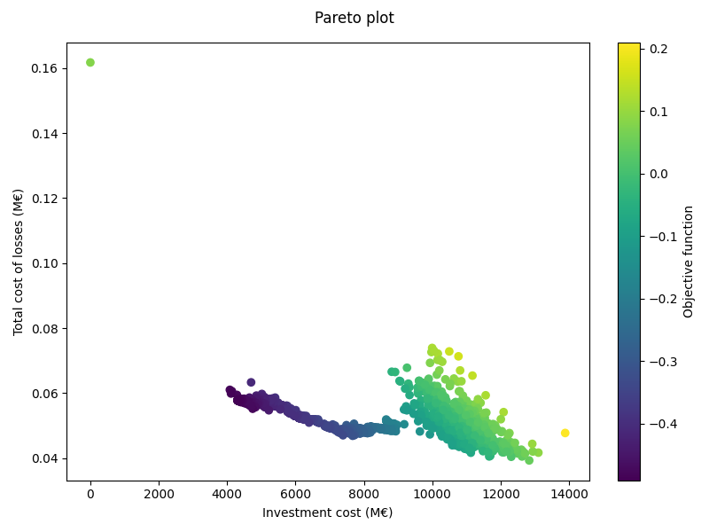
Figure 11: Results obtained for the updated algorithm.

The results show a similar points distribution as Figure 4. This is not a coincidence, given that by applying the
normalization, both the technical and economic criteria end up being in a similar order of magnitude, which is the same
case as the one shown in Figure 4.

It is worth mentioning that because the objective function can now take negative values, the normalization
used in the colors visualization can no longer be LogNorm() and has been changed to Normalize().

### Random evaluations process

Given that all previous figures share a similar shape in terms of point distribution, with two separated regions,
it is questioned that the algorithm is exploring all the possible solutions, especially during the random evaluation iterations.
One would expect a continuous Pareto front, whereas the obtained results show no solutions at the intermediate points.

Therefore, it is determined that when creating random $x$ vectors the probability of getting a 0 or a 1 must
change for each random iteration. Then, the random vectors obtained represent combinations of varying number
of investments. For the previous testing, the probability was fixed to 0.5 which meant that the vectors had more or
less the same number of investments each random iteration.

The results obtained with the scaled algorithm show a clear Pareto front as seen in Figure 12.

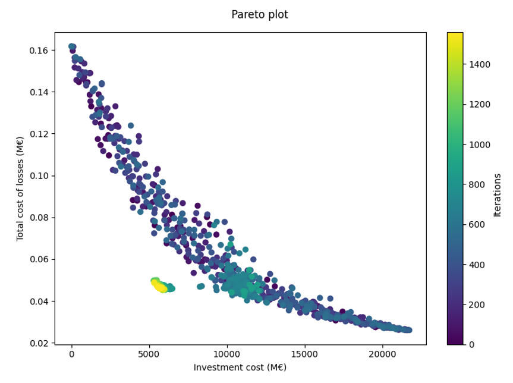
Figure 12: Results obtained for the updated random evaluation iterations.

However, the results show that the obtained Pareto front is only due to the random iterations. The points that represent the minimization process, 
which begins after roughly 600 iterations are clearly centered around two areas which are not that far from the areas obtained in previous figures. 
Therefore, given that the algorithm is not actively exploring the Pareto front, it is thought that there may be a whole set of points more optimal than the ones 
obtained during the random iterations, as shown in red in Figure 13.

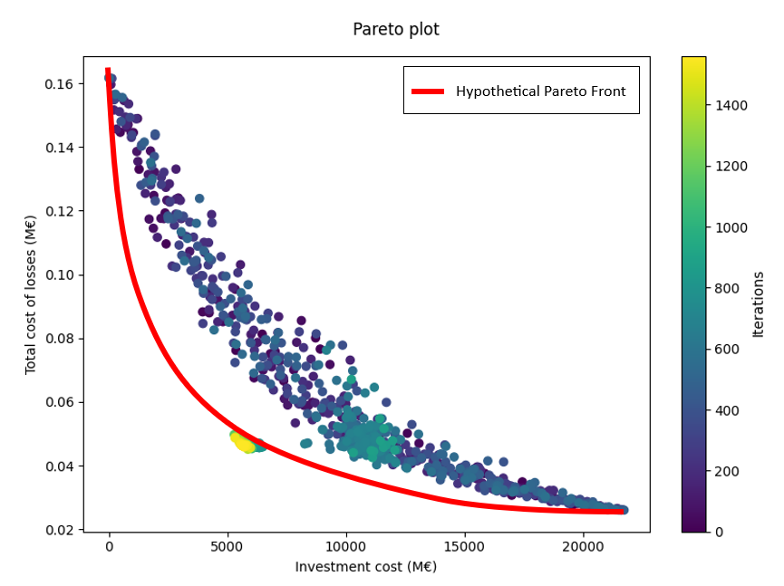
Figure 13: Hypothetical unexplored Pareto front.


### Multi-objective optimization

Another line of research includes modifying the MVRSM model to support multi-objective minimization. This way, the
scaling process after the random evaluations is not necessary, instead, the model works directly with the values obtained
for each cost computation (losses cost, overload cost, CAPEX,...). Hence, the problem becomes a 6-objective minimization problem.

On the one hand, the MVRSM is adapted so that the surrogate model can predict an outcome for every objective.
What was previously done for one objective has to be repeated now six times, hence, the computation time is significantly higher
than for the previous case.

On the other hand, to minimize the model, random weights are chosen for each objective ( the sum of the weights must be 1),
then a single value is computed as the sum of each objective multiplied by its weight. In every iteration, these random
weights must change. This way, it is still possible to use Scipy's tool "minimize", since the model still returns one
single value. The reader can find a more in-depth explanation of the reasoning behind this process in
this [reference paper](https://arxiv.org/abs/2006.04655).

The results obtained show a similar distribution as in Figure 14, however, the algorithm does not find the points outside
the curve and closer to the optimal point (0,0).

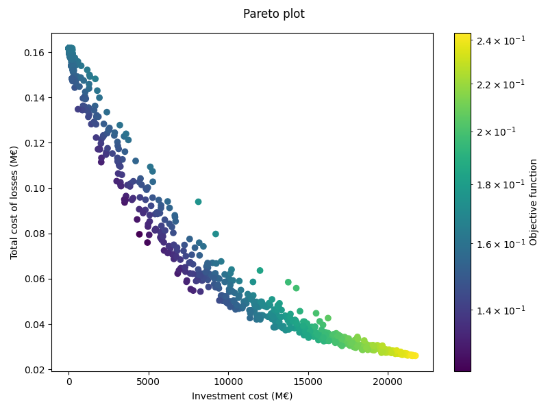
    Figure 14: Results obtained for the multi objective optimization.

### Testing on ZDT3

This section covers the testing of both the multi-objective and single-objective with normalization algorithms on a
typical test function for multi-objective optimization.

**Test function for optimization**

The function to be tested is the Zitzler–Deb–Thiele's function N3 (ZDT3): 

$$
    \text{Minimize:} \, f_1(x) = x_1 \, ,\; \; f_2(x) = g(x) \cdot h(f_1(x),g(x)) ,

    \text{where:} \, g(x) = 1 + \frac{9}{29} \sum_{i=2}^{30} x_i  \, ,\; \;
                         h(f_1(x),g(x))= 1 - \frac{\sqrt{f_1(x)}}{\sqrt{g(x)}} - \frac{f_1(x)}{g(x)} sin(10\pi f_1(x)) ,

    \text{with:} \, 1 \leq i \leq 30  \, ,\; \; 0 \leq x_i \leq 1 .
$$

This test function shares one particularity with the grid problem at hand: 
the objective $f_2(x)$ is highly dependent on the number of variables 
that take non-zero values, given the presence of a summation $\sum_{i=2}^{30} x_i$. 
In the electrical case, this relates to the CAPEX objective, which also 
depends on the number of investments evaluated, the more investments are active, 
the higher the total investment will tend to be. The Pareto front expected can be seen in Figure 15.

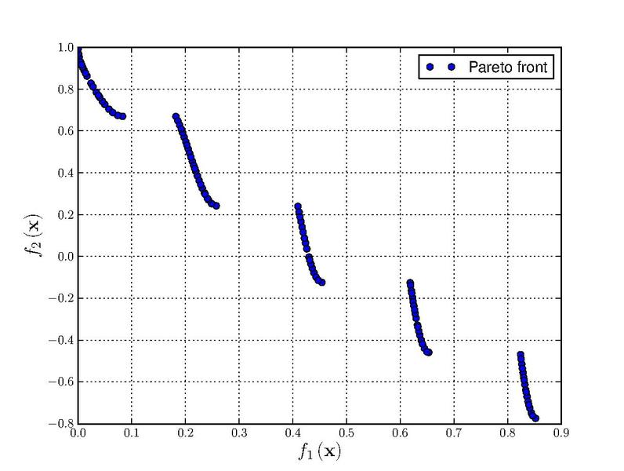
Figure 15: Expected Pareto front for ZDT3.

On the one hand, the multi-objective algorithm is tested. The results for different 
simulations are shown in Figures 16-18.

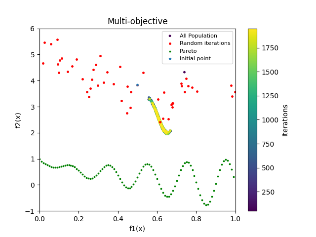
Figure 16: Results obtained for ZDT3 with multi-objective adapted algorithm, simulation 1.


Figure 17: Results obtained for ZDT3 with multi-objective adapted algorithm, simulation 2.


Figure 18: Results obtained for ZDT3 with multi-objective adapted algorithm, simulation 3.


As demonstrated in the previous figures, the multi-objective algorithm fails to 
approximate the Pareto front of ZDT3. Instead, its exploration during the minimization 
process shows an unwanted concentration around the best point identified in the random iteration phase. 
This not only results in a deviation from the desired functionality but also 
underscores a lack of robustness, as the final outcome is excessively influenced by 
the random iterations process. The algorithm, therefore, not only falls short of meeting 
the desired objectives but also reveals susceptibility in its performance.

On the other hand, the following figures show the results for the single-objective 
algorithm with normalization, Figures 19-21.

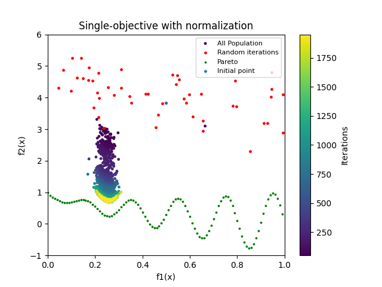
Figure 19: Results obtained for ZDT3 with single-objective adapted algorithm, simulation 1.

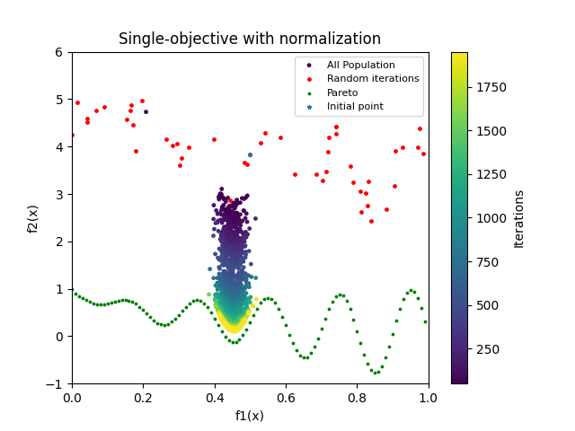
Figure 20: Results obtained for ZDT3 with single-objective adapted algorithm, simulation 2.

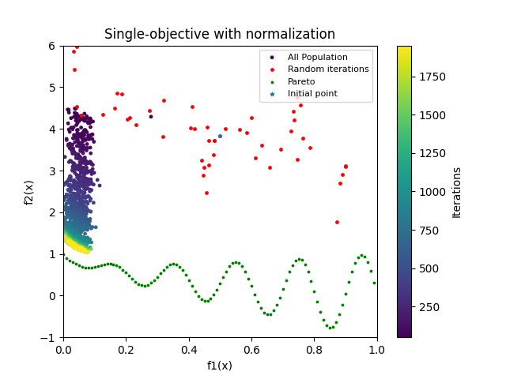
Figure 21: Results obtained for ZDT3 with single-objective adapted algorithm, simulation 3.

As shown in the preceding figures, the single-objective algorithm approaches the Pareto 
front during the minimization process, albeit requires a substantial number of iterations 
to get sufficiently close. Moreover, similar to the multi-objective algorithm, 
its performance is extremely linked to the best point found during the random iterations process, 
then, the final result is different depending on the simulation. 

Furthermore, the observed behavior in the case of ZDT3 draws parallels to the earlier 
tests performed on the grid. The algorithm does get close to the Pareto front but 
does not extensively explore it during the minimization process, which would be the desired situation. 

### Conclusions

Based on the results obtained throughout the different tests, some conclusions can be drawn.
    - The single-objective algorithm's performance is significantly influenced by the order of magnitude of the criteria.
    - While the single-objective algorithm successfully minimizes the function, it falls short of exploring the entire Pareto front, which would be the desired outcome.
    - The current adaptation of the surrogate model to support multi-objective minimization does not minimize the function correctly, at the moment. 
    - Neither algorithm performs the desired minimization. 

In light of these observations, future work should include the exploration of established 
multi-objective black-box optimization methods and alternative algorithms 
for multi-objective minimization, such as the application of NSGA-III.

## Theory Pt.2

### Improving the NSGA-3 investments

In continuation to prior advancements in solving the power grid optimisation problem, this report presents the NSGA-III
machine learning algorithm, which has been researched, developed and implemented into VeraGrid with the aim of improving
investment evaluation performance.

This multi-objective optimisation problem is currently defined by two objective functions, (Equations 1 & 2).
They aim to minimise the total investment cost, C = CAPEX + OPEX, while simultaneously minimising the technical cost,
which is the sum of monetary penalties applied to technical violations within the grid and power losses.

$$
    f_1(x) = \sum (CAPEX(x)_i + \sum OPEX(x)_i)
$$

$$
    f_2(x) = \sum C_l(x)_{br} + \sum C_o(x)_{br} + \sum C_{vm}(x)_b + \sum C_{va}(x)_b
$$

Please see the investment evaluation documentation on VeraGrid’s GitHub for their
detailed definitions [1].

Previously, the Mixed-Variable ReLU-based Surrogate Modelling (MVRSM) algorithm
was developed to solve this non-linear optimisation problem. For multi-objective, it
was not minimised correctly. For a single-objective function, though optimal solutions
were found and shown via a Pareto front, it was only obtained due to random iterations, concluding that MVRSM
did not actively explore the Pareto front. As seen in Figure 1, its optimal solutions also tended to a concentrated
area. A set of more optimal points passing through this area was hypothesised to be discovered by a genetic
algorithm.


    Figure 1: MVRSM results with hypothetical improved Pareto front


### NSGA-III Theory

The Non-Dominated Sorting Genetic Algorithm III is an evolutionary (genetic) algorithm designed to find the Pareto
curve of optimal solutions for multi-objective or many-objective functions. It was implemented for this optimisation
problem using Pymoo’s problem and algorithm library [2].

NSGA-III [3] starts by performing non-dominated sorting for its survival stage. It then assigns solutions to reference
directions in the objective space. From the splitting front, solutions are selected, filling up the least represented
reference directions first. If a reference direction does not have any solution assigned to it, NSGA-III selects the
solution with the smallest perpendicular distance in the normalised objective space to survive. If a second solution
is added to a reference direction, it is assigned randomly to maintain diversity.

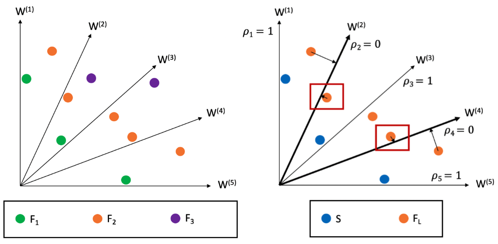
Figure 2: (a) Non-dominated sorting (b) Points assigned to reference lines


As NSGA-III converges, each reference direction seeks to find a representative non-
dominated solution, eventually achieving a balanced distribution of solutions across
the Pareto front.


### Hypertuning

The carefully tuned parameters that direct the algorithm are explained below, with
comparisons shown where necessary, to validate the settings chosen. The algorithm
was simulated several times on the investment grid in Figure 6, to test which parameters most effectively
solved the minimisation problem.

#### Population Size

The population size refers to the number of individuals in each generation of the
algorithm. In this case, it represents the pool of investment configurations sampled
by NSGA-III. When trying different scale factors, it was discovered that using a population size
equal to a fraction, such as one-fifth, of the total number of investments
produced the best Pareto curve. This may be because if the population size is too
high, it is more likely that suboptimal solutions begin to dominate the population
over time; genetic drift. This may cause the solutions to converge prematurely to
suboptimal regions of the Pareto front. The population size should not be too low,
however, as the algorithm may struggle to adequately explore the solution space.

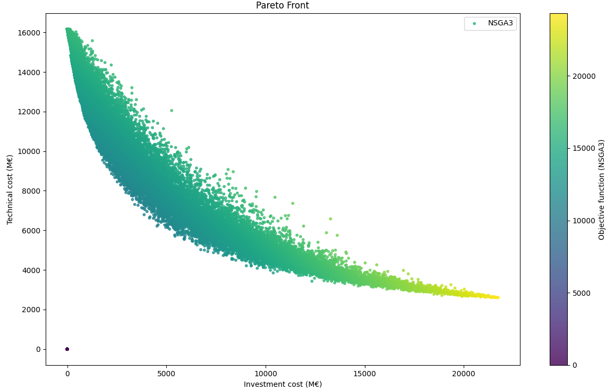
    Figure 3: (a) Dimension scaled by 2 has shallow curvature


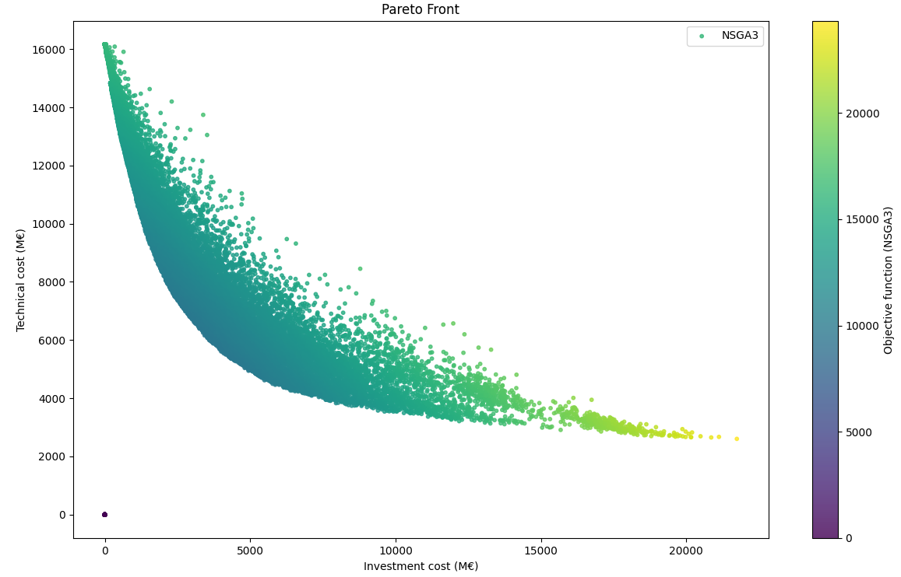
     (b) Dimension scaled by 0.2 provides finds more optimal solutions due to its deeper curve


#### Reference Directions

The reference direction used during the optimisation defines its rows as the reference lines and its
columns the variables. This partitions the points in the objective
space and assigns each variable to a line. The reference direction is set equal to
the population size for this problem, since we would like to obtain a solution for
all inputs. A smaller value would partition the points with larger spacing, reducing
the number of points identified and therefore possibly inadvertently discarding some
optimal solutions, as shown in the sparse vs full plots in Figure 4. The algorithm’s
construction does not allow for reference lines to go above the population size, so
the maximum number of partitions is the population’s dimension.

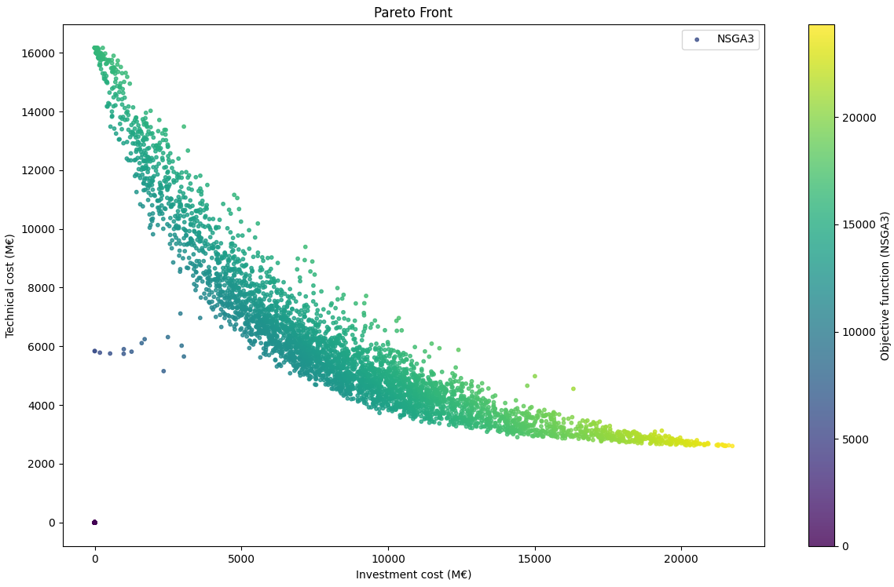
    Figure 4: (a) No. partitions = population size / 10


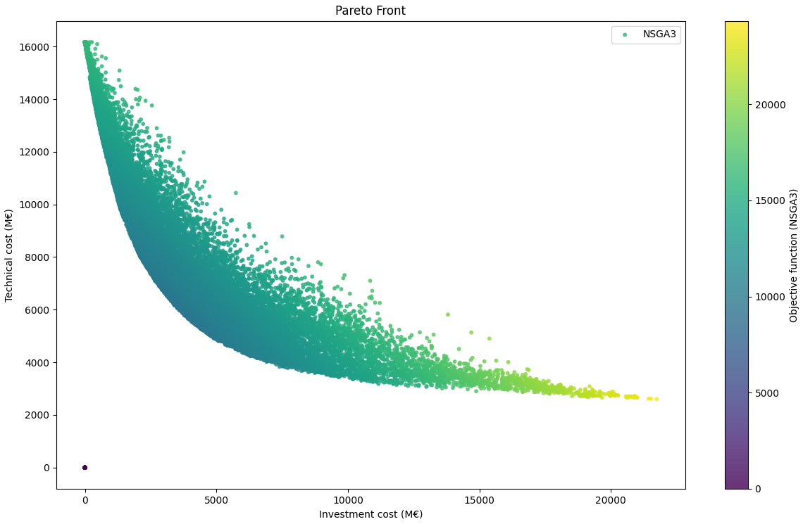
     (b) No. partitions = population size


There are also different types of reference direction sources: The uniform and das-
dennis methods generate an even distribution of points across the objective space,
providing a balanced exploration of solutions. However, they are not effective for
nonlinear problems. The energy generation distributes the reference directions more
densely in regions of high energy. This prioritises sampling in areas with significant variations
in objective values, improving the coverage of the Pareto front. This type works well for the problem at hand.
The reduction type reduces overlap between reference directions, without sacrificing exploration,
which effectively solves our multi-objective problem, whilst also removing any unnecessary computation

#### Sampling Technique

The sampling process defines the initial set of solutions; from which NSGA-III starts
its optimisation. The choice of sampling technique is significant, as it influences the
diversity and coverage of the initial population, a poor choice potentially resulting
in restricted exploration of the solution space.

There are several types of sampling techniques available in Pymoo, including integer,
float and binary random sampling and latin hypercube sampling. It is also possible to
write a personalised sampling method. For this case, since the variables are binary,
and a systematic sampling method is desired to explore the entire Pareto front, a
binary uniform sampling method was created. Figure 5 presents the different types
of sampling, the first three are unable to explore points past an investment cost of
≈12000 MC, whereas binary uniform explores the entire front past 20000 MC.

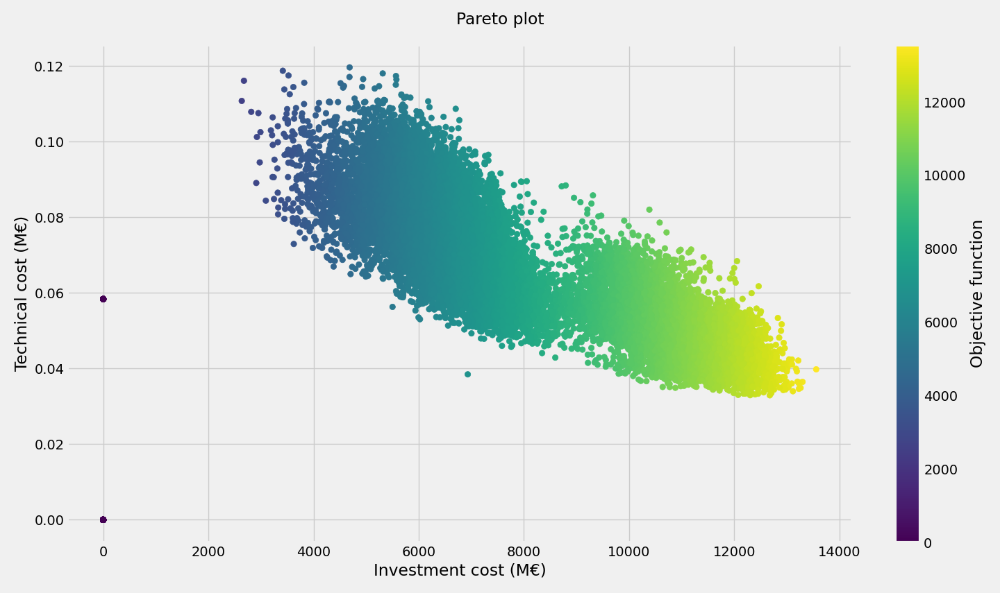
    Figure 5: (a) latin hypercube sampling


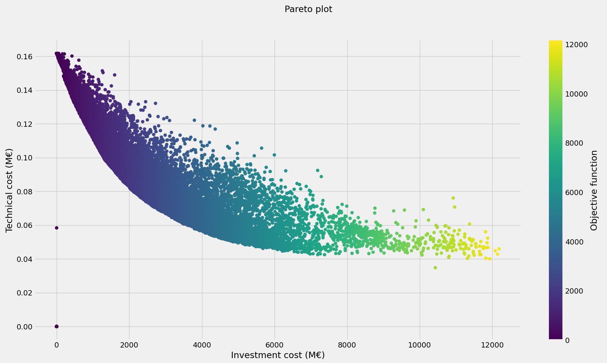
    (b) integer random


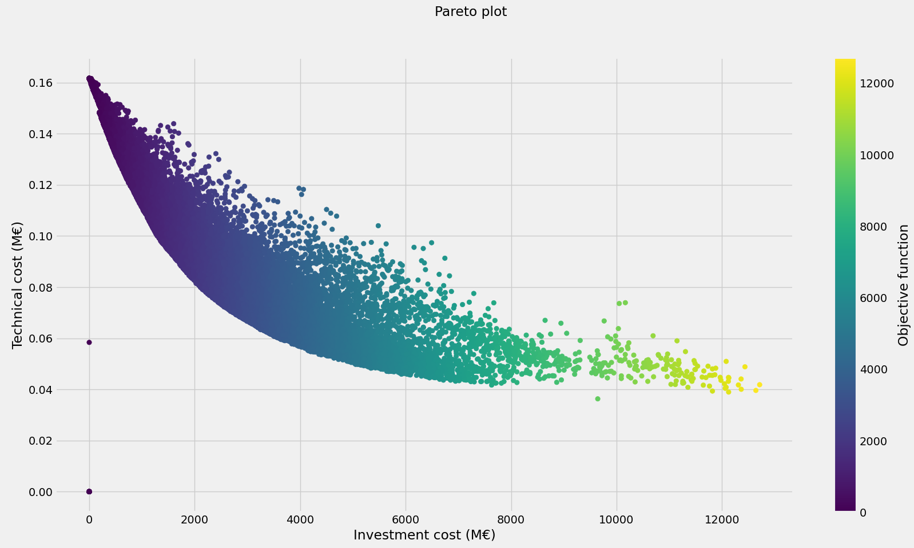
    (c) binary random

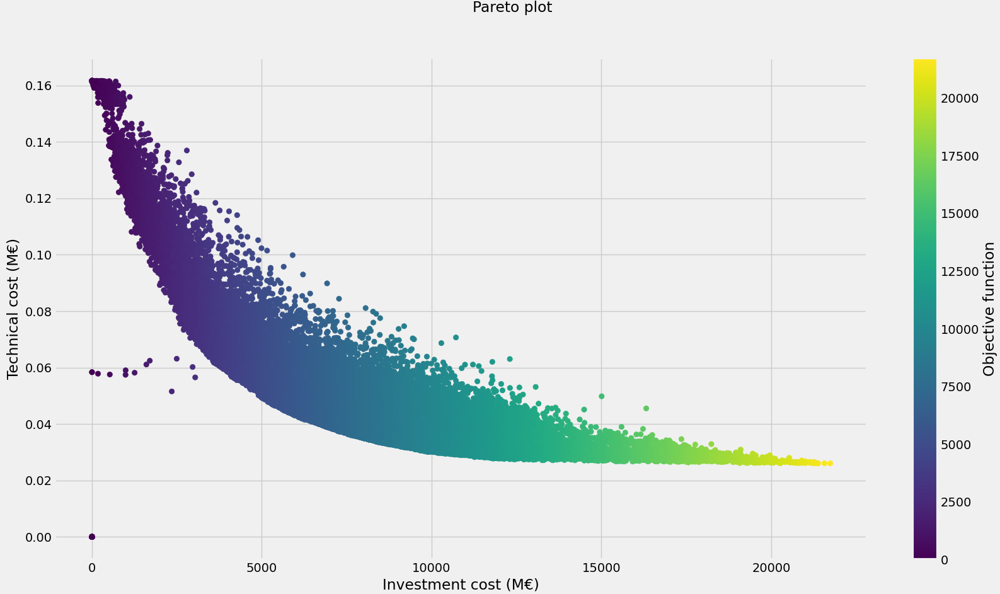
    (d) binary uniform


#### Selection

A genetic algorithm requires a mating selection so that parents are selected for each
generation to produce new offspring using different recombinations and mutation
operators. Different strategies for selecting parents are available, such as random,
neighborhood, and tournament (to introduce some selection pressure).
This is set to random since we would like to shuffle and thoroughly explore all
possible combinations, in the hope of finding all optimal solutions.

#### Crossover

The crossover operator combines genetic information from parent individuals to create offspring during evolution.
The best probability found was a high value, close to 1, which ensured that offspring were frequently generated
through recombination of parent solutions, promoting genetic diversity. This encourages further exploration
of the solution space.

#### Mutation

Performing mutation after crossover introduces random changes to individual solutions through each generation.
A higher probability of mutation increases the diversity in the population, potentially leading to the discovery
of more optimal solutions. However, very high mutation may result in the loss of good solutions if they
are changed or lost during evolution. It was therefore set to 0.5 to ensure a balance
between exploration and exploitation.

#### Crowding Distance

The eta value, which defines the crowding distance, influences the degree of curvature in the Pareto front.
It was set to a high value between 10 and 30 which produced the most curvature due to a greater dispersion of
solutions along the Pareto front.


### Results

The two algorithms were tested on the 130-bus grid (Figure 6) prepared with 389
Investment Candidates including lines and buses in order to visually compare their
performances.


    Figure 6: 130-bus grid for evaluating investments


After testing for an equal amount of time, the plots in Figure 7 proves the NSGA-
III outperforms MVRSM and fully explores the Pareto frontier, passing through the
concentrated MVRSM area as predicted.

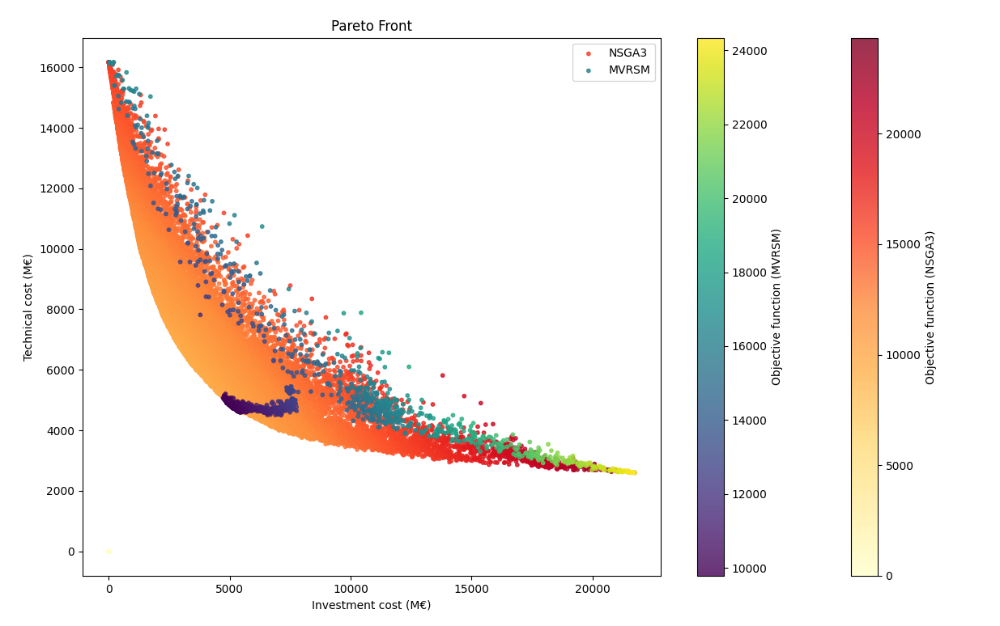
    Figure 7: Pareto front comparison after 10 minutes of simulation


In addition to this, NSGA-III is approximately 25 times faster, computationally, which
is a promising result for future evaluation on larger grids. Though it still takes a
significant amount of time to generate a very smooth and complete curve, a plot
more optimal than MVRSM’s can still be produced with few iterations.

Optimum Parameter Configuration:

   | Parameter name   | Setting                   |
   |------------------|---------------------------|
   | Population size  | No. investment groups / 5 |   
   | No. partitions   | Population size           |
   | Sampling         | Binary uniform            |
   | Crossover        | Probability 0.8           |
   | Mutation         | Probability 0.5           |
   | Eta              | 30                        |


### Future Development

Improvement at this stage would involve creating a surrogate model in order to
decrease the time taken to evaluate the investments. Though faster than MVRSM,
NSGA-III still takes some time to run, which we would ideally like to reduce.

As seen by the scatter plot, many points that are distant to the optimal frontier are stored.
By eliminating these, the memory and time taken could be lowered.

To ensure robustness of this algorithm, it should be tested on multiple grids, including simpler and smaller,
and more complex and larger systems.


References
_____________________
[1] https://github.com/SanPen/VeraGrid/blob/204_investments_evaluation/doc/rst_source/theory/investments_evaluation.rst

[2] https://pymoo.org/algorithms/moo/nsga3.html

[3] K. Deb and H. Jain, ”An Evolutionary Many-Objective Optimization Algorithm Using Reference-Point-Based
Nondominated Sorting Approach, Part I: Solving Problems With Box Constraints,” in IEEE Transactions on
Evolutionary Computation, vol. 18, no. 4, pp. 577-601, Aug. 2014, doi: 10.1109/TEVC.2013.2281535.
https://ieeexplore.ieee.org/stamp/stamp.jsp?tp=&arnumber=6600851

[4] K. Deb, A. Pratap, S. Agarwal and T. Meyarivan, ”A fast and elitist multiobjective genetic algorithm:
NSGA-II,” in IEEE Transactions on Evolutionary Computation, vol. 6, no. 2, pp. 182-197, April 2002,
doi: 10.1109/4235.996017. https://ieeexplore.ieee.org/document/996017


This chapter was authored by Cristina Fray on 6th May 2024.