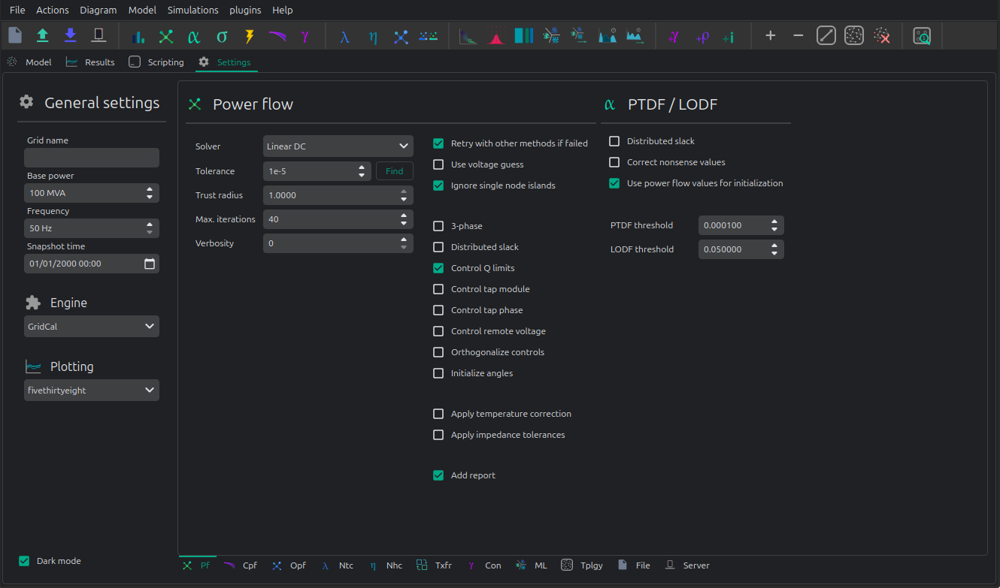

# 📏 Linear analysis




## API


We can run an PTDF equivalent of the power flow with the linear analysis drivers:

```python
import os
import VeraGridEngine as gce

folder = os.path.join('..', 'Grids_and_profiles', 'grids')
fname = os.path.join(folder, 'IEEE 5 Bus.xlsx')

main_circuit = gce.open_file(fname)

# snapshot
results = gce.linear_power_flow(grid=main_circuit)

print("Bus results:\n", results.get_bus_df())
print("Branch results:\n", results.get_branch_df())
print("PTDF:\n", results.mdl(gce.ResultTypes.PTDF).to_df())
print("LODF:\n", results.mdl(gce.ResultTypes.LODF).to_df())
```

Simulating with a more detailed control of the objects:

```python
import os
import VeraGridEngine as gce

folder = os.path.join('..', 'Grids_and_profiles', 'grids')
fname = os.path.join(folder, 'IEEE 5 Bus.xlsx')

main_circuit = gce.open_file(fname)

options_ = gce.LinearAnalysisOptions(distribute_slack=False, correct_values=True)

# snapshot
sn_driver = gce.LinearAnalysisDriver(grid=main_circuit, options=options_)
sn_driver.run()

print("Bus results:\n", sn_driver.results.get_bus_df())
print("Branch results:\n", sn_driver.results.get_branch_df())
print("PTDF:\n", sn_driver.results.mdl(gce.ResultTypes.PTDF).to_df())
print("LODF:\n", sn_driver.results.mdl(gce.ResultTypes.LODF).to_df())
```

Output:

```text
Bus results:
         Vm   Va       P    Q
Bus 0  1.0  0.0  2.1000  0.0
Bus 1  1.0  0.0 -3.0000  0.0
Bus 2  1.0  0.0  0.2349  0.0
Bus 3  1.0  0.0 -0.9999  0.0
Bus 4  1.0  0.0  4.6651  0.0

Branch results:
                   Pf   loading
Branch 0-1  2.497192  0.624298
Branch 0-3  1.867892  0.832394
Branch 0-4 -2.265084 -0.828791
Branch 1-2 -0.502808 -0.391900
Branch 2-3 -0.267908 -0.774300
Branch 3-4 -2.400016 -1.000006

PTDF:
                Bus 0     Bus 1     Bus 2  Bus 3     Bus 4
Branch 0-1  0.193917 -0.475895 -0.348989    0.0  0.159538
Branch 0-3  0.437588  0.258343  0.189451    0.0  0.360010
Branch 0-4  0.368495  0.217552  0.159538    0.0 -0.519548
Branch 1-2  0.193917  0.524105 -0.348989    0.0  0.159538
Branch 2-3  0.193917  0.524105  0.651011    0.0  0.159538
Branch 3-4 -0.368495 -0.217552 -0.159538    0.0 -0.480452

LODF:
             Branch 0-1  Branch 0-3  Branch 0-4  Branch 1-2  Branch 2-3  Branch 3-4
Branch 0-1   -1.000000    0.344795    0.307071   -1.000000   -1.000000   -0.307071
Branch 0-3    0.542857   -1.000000    0.692929    0.542857    0.542857   -0.692929
Branch 0-4    0.457143    0.655205   -1.000000    0.457143    0.457143    1.000000
Branch 1-2   -1.000000    0.344795    0.307071   -1.000000   -1.000000   -0.307071
Branch 2-3   -1.000000    0.344795    0.307071   -1.000000   -1.000000   -0.307071
Branch 3-4   -0.457143   -0.655205    1.000000   -0.457143   -0.457143   -1.000000
```

### Linear vs non-linear analysis comparison

Now let's make a comparison between the linear flows and the non-linear flows from Newton-Raphson:

```python
import os
from matplotlib import pyplot as plt
import VeraGridEngine as gce

plt.style.use('fivethirtyeight')

folder = os.path.join('..', 'Grids_and_profiles', 'grids')
fname = os.path.join(folder, 'IEEE39_1W.veragrid')
main_circuit = gce.open_file(fname)

ptdf_driver = gce.LinearAnalysisTimeSeriesDriver(grid=main_circuit)
ptdf_driver.run()

pf_options_ = gce.PowerFlowOptions(solver_type=gce.SolverType.NR)
ts_driver = gce.PowerFlowTimeSeriesDriver(grid=main_circuit, options=pf_options_)
ts_driver.run()

fig = plt.figure(figsize=(30, 6))
ax1 = fig.add_subplot(131)
ax1.set_title('Newton-Raphson based flow')
ax1.plot(ts_driver.results.Sf.real)
ax1.set_ylabel('MW')
ax1.set_xlabel('Time')

ax2 = fig.add_subplot(132)
ax2.set_title('PTDF based flow')
ax2.plot(ptdf_driver.results.Sf.real)
ax2.set_ylabel('MW')
ax2.set_xlabel('Time')

ax3 = fig.add_subplot(133)
ax3.set_title('Difference')
diff = ts_driver.results.Sf.real - ptdf_driver.results.Sf.real
ax3.plot(diff)
ax3.set_ylabel('MW')
ax3.set_xlabel('Time')

fig.set_tight_layout(tight=True)

plt.show()
```


### SRAP: Automatic Power Reduction System

The Automatic Power Reduction System or SRAP from its acronym in Spanish is a mechanism that allows
to dismiss contingencies if they can be solved by generation increase or decrease.


The concept is better explained with an example:

Imagine that we have a line, that under a certain system contingency, overloads by 5 MW.
There are three plants that have been previously spotted as significant in such conditions:

- plant 1: Generating 80 MW, with 0.11 PTDF sensitivity.
- plant 2: Generating 30 MW, with 0.09 PTDF sensitivity.
- plant 3: Generating 50 MW, with 0.07 PTDF sensitivity.

We set the SRAP limit arbitrarily to 90 MW of generation shifting.

We construct a pair of arrays sorted by sensitivity:

- sensitivity = [0.11, 0.09, 0.07]
- p_availbale = [80, 30, 30]

With this, we construct the function $f = sensitivity * p_available$

Now, we find the cut point of the SRAP limit with this function. In this case 9.4.
This is the maximum overload that we can solve with our generation set.
Since 9.4 > 5, the overload can be solved with the SRAP mechanism, hence it can be dismissed.

A contingency study with SRAP activated can be run with the following commands:

```python
con_options = ContingencyAnalysisOptions()
con_options.use_srap = True
con_options.engine = ContingencyEngine.PTDF

con_drv = ContingencyAnalysisDriver(grid=grid,
                                    options=con_options,
                                    engine=EngineType.VeraGrid)

con_drv.run()
```

## Benchmark

###  Linear algebra frameworks benchmark

#### IEEE 39 1-year time series

The experiment is to test the time taken by the time series simulation using different linear algebra solvers.

The power flow tolerance is ser to 1e-4.


The time in seconds taken using each of the solvers is:

|         | KLU   | LAPACK | ILU   | SuperLU | Pardiso |
|---------|-------|--------|-------|---------|---------|
| Test 1  | 82.03 | 82.10  | 81.79 | 82.88   | 93.23   |
| Test 2  | 80.22 | 80.84  | 81.71 | 81.37   | 95.29   |
| Test 3  | 79.53 | 82.32  | 82.75 | 80.98   | 92.62   |
| Test 4  | 80.06 | 82.66  | 82.14 | 80.17   | 97.60   |
| Test 5  | 80.07 | 80.51  | 81.94 | 80.03   | 93.39   |
| Average | 80.38 | 81.68  | 82.07 | 81.09   | 94.42   |


#### 2869 Pegase 1-week time series

The experiment is to test the time taken by the time series simulation using different linear algebra solvers.

The power flow tolerance is ser to 1e-4.


The time in seconds taken using each of the solvers is:

|         | KLU   | LAPACK | ILU   | SuperLU | Pardiso |
|---------|-------|--------|-------|---------|---------|
| Test 1  | 2.46  | 2.50   | 2.52  | 2.48    | 2.54    |
| Test 2  | 2.35  | 2.31   | 2.36  | 2.32    | 2.59    |
| Test 3  | 2.40  | 2.42   | 2.46  | 2.46    | 2.46    |
| Test 4  | 2.33  | 2.31   | 2.34  | 2.33    | 2.42    |
| Test 5  | 2.31  | 2.32   | 2.45  | 2.33    | 2.51    |
| Average | 2.37  | 2.37   | 2.43  | 2.39    | 2.51    |

So from the light of these tests the solvers are roughly equivalent except the Pardiso one with is
worse than the others for these type of simulations.