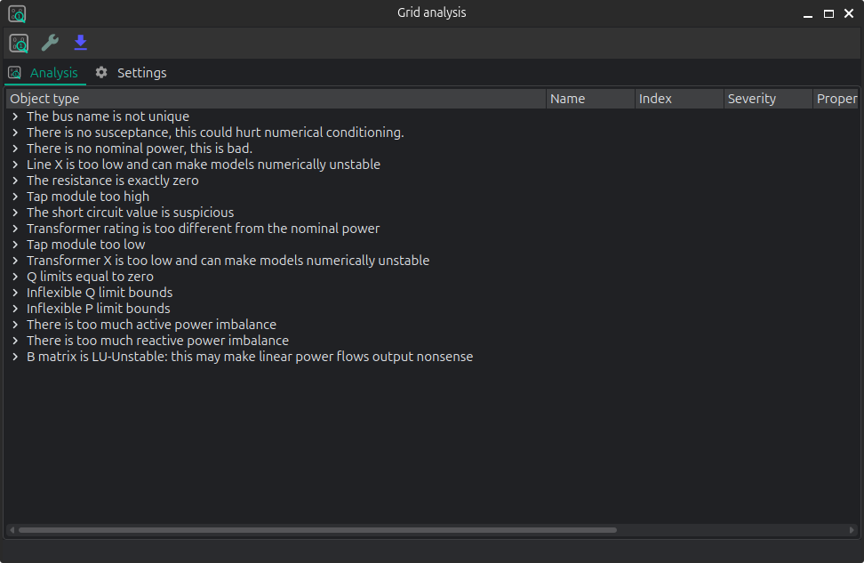

# 🪲 Model debugging



## API

### Inputs analysis

VeraGrid can perform a summary of the inputs with the `InputsAnalysisDriver`:

```python
import os
import VeraGridEngine as gce

folder = os.path.join('..', 'Grids_and_profiles', 'grids')
fname = os.path.join(folder, 'IEEE 118 Bus - ntc_areas.veragrid')

main_circuit = gce.open_file(fname)

drv = gce.InputsAnalysisDriver(grid=main_circuit)
mdl = drv.results.mdl(gce.ResultTypes.AreaAnalysis)
df = mdl.to_df()

print(df)
```

The results per area:

```text
               P    Pgen   Pload  Pbatt  Pstagen      Pmin      Pmax      Q    Qmin    Qmax
IEEE118-3  -57.0   906.0   963.0    0.0      0.0 -150000.0  150000.0 -345.0 -2595.0  3071.0
IEEE118-2 -117.0  1369.0  1486.0    0.0      0.0 -140000.0  140000.0 -477.0 -1431.0  2196.0
IEEE118-1  174.0  1967.0  1793.0    0.0      0.0 -250000.0  250000.0 -616.0 -3319.0  6510.0
```
