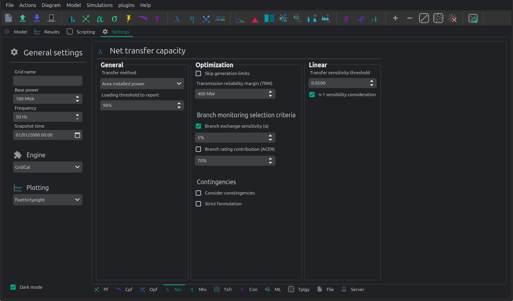

# 🚢 Net transfer capacity optimization

The net transfer capacity optimization is an optimization routine that
tries to move as much power between two given areas as possible.
This optimization is done using linear programming.



## API

```python
import VeraGridEngine as gce

fname = os.path.join('test', 'data', 'grids', 'ACTIVSg2000.veragrid')
grid = gce.open_file(fname)

info = grid.get_inter_aggregation_info(
    objects_from=[grid.areas[6]],  # Coast
    objects_to=[grid.areas[7]]  # East
)

# declare the opf options
opf_options = gce.OptimalPowerFlowOptions(
    consider_contingencies=True,
    contingency_groups_used=grid.contingency_groups
)

# declare the linear analysis options
lin_options = gce.LinearAnalysisOptions()

# declare the NTC options
ntc_options = gce.OptimalNetTransferCapacityOptions(
    sending_bus_idx=info.idx_bus_from,
    receiving_bus_idx=info.idx_bus_to,
    transfer_method=gce.AvailableTransferMode.InstalledPower,
    loading_threshold_to_report=98.0,
    skip_generation_limits=True,
    transmission_reliability_margin=0.1,
    branch_exchange_sensitivity=0.05,
    use_branch_exchange_sensitivity=True,
    branch_rating_contribution=1.0,
    monitor_only_ntc_load_rule_branches=False,
    consider_contingencies=False,
    strict_formulation=False,
    opf_options=opf_options,
    lin_options=lin_options
)

# declate the driver and run
drv = gce.OptimalNetTransferCapacityDriver(grid, ntc_options)
drv.run()

res = drv.results
ntc_no_contingencies = res.inter_area_flows

# check basics from the results
assert abs(res.nodal_balance.sum()) < 1e-6
assert res.converged
assert res.inter_area_flows < res.structural_inter_area_flows
```

To run a time series of NTC optimizations:
```python
# same inputs as before ...

# declare the time series NTC driver
drv = gce.OptimalNetTransferCapacityTimeSeriesDriver(
    grid, 
    ntc_options,
    time_indices=grid.get_all_time_indices()
)
drv.run()

res = drv.results
assert abs(res.nodal_balance.sum()) < 1e-6
assert res.converged.all()
```

## Theory 

We decide to compute the injections per node directly.
We use a function to summ up all generation present at a
node and obtain the power injection limits of that node.


The power increment sent, must be equal to the power increment received:

$$
    \Delta P_{Send} = \Delta P_{Receive}
$$

Where:

$$
    \Delta P_i = share_i \cdot  \Delta P_{Send} \quad \forall i \in send
$$

$$
    \Delta P_i = share_i \cdot  \Delta P_{Receive} \quad \forall i \in receive
$$

Finally, we add the nodal injection to the nodal balance summation

$$
    P_{{balance}_i} = Pbase_i + \Delta P_i
$$


>   To apply these equations, the generation and the load must be numerically equal in the grid,
    this is, equal to the complete precision of the computer. This requirement is impossible in real life
    since there would be losses; However, in this formulation we are
    forcing everything to be linear and lossless. This means the the summation of the
    $Pbase` vector must be exactly zero.


-$A_{send}$: Node indices of the sending area.

-$A_{receive}$: Node indices of the receiving area.

-$\Delta P_i$: Power increment at the node i.

-$P_{{balance}_i}$: Power balance at the node i. In the end this will be a summation of terms.

-$share_i$: scale for the increment at the node i. This is akin to the GLSK's.

-$Pbase_i$: Power injection (generation - load) of the base situation at the node i.


### Branches


The flow at the "from" node in a branch is:

$$
    flow_k = \frac{\theta_f - \theta_t}{x_k}
$$

In case of a phase shifter transformer:

$$
    flow_k = \frac{\theta_f - \theta_t + \tau_k}{x_k}
$$

We need to limit the flow to the line specified rating:

$$
    - rate_k \leq flow_k \leq rate_k
$$

Finally, we add the flows to the nodal balance summation:

$$
    P_{{balance}_f} -= flow_k
$$

$$
    P_{{balance}_t} += flow_k
$$

-$f$: index of the node "from"

-$t$: index of the node "to"

-$\theta_f$: Nodal voltage angle at the node f.

-$\theta_t$: Nodal voltage angle at the node t.

-$x_k$: Branch k reactance.

-$rate_k$: Branch k power rating.

-$\tau_k$: Tap angle of the branch k.

-$P_f$: Power balance at the node f.

-$P_t$: Power balance at the node t.


### HVDC converters


These are controlled branches for which the flow is determined by a control equation.
The $flow_k` value will differ depending on the control mode chosen:

#### Power control mode

This is the most common control mode of an HVDC
converter, where the active power send is controlled and fixed.
For out optimization, the variable $flow_k` is an optimization value
that moves freely between the +/- rating values.

$$
    - rate_k \leq flow_k \leq rate_k
$$


#### Angle droop mode (AC emulation)

This is a very uncommon control decision solely used by the INELFE HVDC
between Spain and France. It is uncommon because the DC equipment is made
to vary depending on an AC magnitude measured as the difference between
the AC voltage angle at the AC sides of both converters.
This can only work because the two areas are also joined by AC lines already.

For the purpose of running an old-fashioned ac power flow, this is very
convenient, since we don't need to come up with a proper DC formulation
using voltage magnitudes on top of using the classic linear formulations
based on susceptances and angles.

This mode, introduces some complexity; The angles are only coupled by the
expression "$y`" when the converter power is within limits, otherwise
the converter flow is set to the maximum value and the angles are set free.
This is of course because of the artificial coupling imposed by the math,
since in reality the voltage angles are independent of this of that control
mode. To appropriately express this, we need to use a piece-wise function
formulation:

$$
    flow_k =
    \begin{cases}
        -rate_k & if \quad  flow\_lin \le -rate_k \\
        P_0 + k(\theta_f - \theta_t) & if \quad -rate_k < flow\_lin < rate_k \\
        rate_k & if \quad flow\_lin \ge rate_k
    \end{cases}
$$

To implement this piecewise function we need to perform a serious
amount of MIP magic.

Selector constraint:

$$
    z_{neg} + z_{mid} + z_{pos} = 1
$$

Linear flow expression:

$$
    flow\_lin = P_0 + k(\theta_f - \theta_t)
$$

Lower flow definitionNegative flow saturation:

$$
    flow_k \le -rate_k + M(1 - z_{neg}) \\
    flow_k \ge -rate_k - M(1 - z_{neg}) \\
    flow\_lin \le -rate_k + M(1 - z_{neg})
$$

Mid-range: the droop operation zone:

$$
    flow_k \le flow\_lin + M(1 - z_{mid}) \\
    flow_k \ge flow\_lin - M(1 - z_{mid}) \\
    flow\_lin \le rate_k - \varepsilon + M(1 - z_{mid}) \\
    flow\_lin \ge -rate_k + \varepsilon - M(1 - z_{mid})
$$

Upper flow definitionNegative flow saturation:

$$
    flow_k \le rate_k + M(1 - z_{pos}) \\
    flow_k \ge rate_k - M(1 - z_{pos}) \\
    flow\_lin \ge rate_k - M(1 - z_{pos})
$$

- $K_k$: Arbitrary control parameter used.
- $P0_k$: Base power (i.e. the given market exchange for the line).
- $flow_k$: real variable to be computed
- $flow\_lin$: Auxiliary variable.
- $rate_k$: maximum allowable flow in either direction
- $M$: large constant for Big-M logic (e.g., $M \ge 2 \cdot rate`)
- $\varepsilon$: small tolerance for strict inequalities
- $z_{neg}, z_{mid}, z_{pos} \in \{0, 1\}`

Finally, we add the flows to the nodal balance summation, just like we would with the branches:

$$
    P_{{balance}_f} -= flow_k
$$

$$
    P_{{balance}_t} += flow_k
$$

### Nodal balance

To respect the nodal flows, we create constraints where every nodal power
summation is equal to zero to fulfill the Bucherot theorem:
*All power summation at a node is zero*.


$$
    \sum^{Nodes}_i {P_{{balance}_i} =0 }
$$


The expressions contained in $P_{{balance}_i}$ will be dependent on the angles
$\theta$ because of the branches and HVDC formulations.
Therefore, the angles will be solved by the optimization too.
However, we must take care to set the slack angles to exactly zero:

$$
    \theta_{slack} = 0
$$