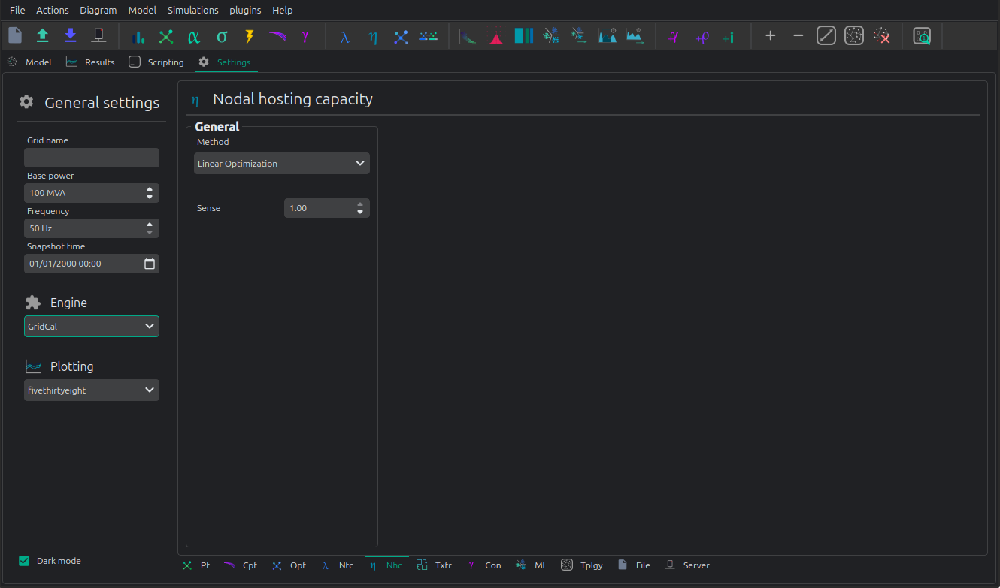

# 🏭 Nodal hosting capacity

The hosting capacity on GridCal is just a modification that lives in the respective
linear and non-linear optimal power flow routines.




## API

### Linear hosting capacity

Using the API shortcut it is very easy to specify a nodal hosting optimization.

The key parameters are:
- optimize_nodal_capacity: Optimize for hosting capacity?
- nodal_capacity_sign: Sense of the optimization (>0 for generation hosting, <0 for load hosting)
- capacity_nodes_idx: array of bus indices to optimize.

```python
import VeraGridEngine as gce

fname = os.path.join('data', 'grids', 'IEEE 14 zip costs.gridcal')
grid = gce.FileOpen(fname).open()

# Linear OPF
res = gce.run_linear_opf_ts(
    grid=grid,
    optimize_nodal_capacity=True,
    time_indices=None,
    nodal_capacity_sign=-1.0,
    capacity_nodes_idx=np.array([10, 11])
)

print('P linear nodal capacity: ', res.nodal_capacity_vars.P)
```

> P linear nodal hosting capacity: [4.85736901, 1.52653874] p.u.

### Non-linear example for IEEE-14.

Observe that we are using the more complex objects formation of the code instead of the API shortcut.
Here, the key parameters are passed onto the `OptimalPowerFlowOptions object.

```python
import VeraGridEngine as gce

fname = os.path.join('data', 'grids', 'IEEE 14 zip costs.gridcal')
grid = gce.FileOpen(fname).open()

# Nonlinear OPF
pf_options = gce.PowerFlowOptions(solver_type=gce.SolverType.NR)

# declate the optimal power flow options
opf_options = gce.OptimalPowerFlowOptions(
    solver=gce.SolverType.NONLINEAR_OPF,
    ips_tolerance=1e-8,
    ips_iterations=50,
    verbose=0,
    acopf_mode=AcOpfMode.ACOPFstd
)

# Run a non-linear ACOPF to get the hosting capacity
res = run_nonlinear_opf(
    grid=grid,
    pf_options=pf_options,
    opf_options=opf_options,
    plot_error=False,
    pf_init=True,
    optimize_nodal_capacity=True,
    nodal_capacity_sign=-1.0,
    capacity_nodes_idx=np.array([10, 11])
)

print('P non-linear nodal capacity: ', res.nodal_capacity)
```
> P non-linear nodal hosting capacity: [5.0114640, 1.693406] p.u.
 

