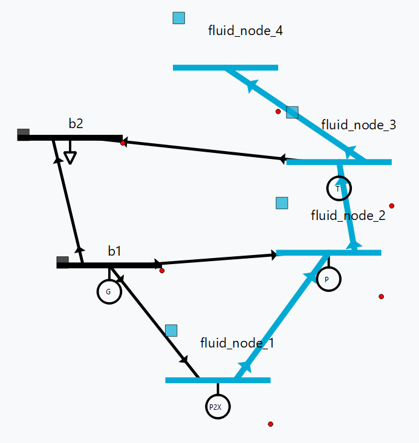

#  🏁 Optimal power flow


Solver
    Optimal power flow solver to use

    DC OPF: classic optimal power flow mixing active power with lines reactance.
    AC OPF: Innovative linear AC optimal power flow based on the AC linear power flow implemented in VeraGrid.

Load shedding
    This option activates the load shedding slack.
    It is possible to assign an arbitrary weight to this slack.

Generation shedding
    This option activated the generation shedding slack.
    It is possible to assign an arbitrary weight to this slack.

Show the real associated values
    Compute a power flow with the OPF results and show that as the OPF results.

Control batteries
    Control the batteries state of charge when running the optimization in time series.


## API

### Linear optimization

```python
import os
import numpy as np
import VeraGridEngine as gce

folder = os.path.join('..', 'Grids_and_profiles', 'grids')
fname = os.path.join(folder, 'IEEE39_1W.veragrid')

main_circuit = gce.open_file(fname)

# declare the snapshot opf
opf_options = gce.OptimalPowerFlowOptions(mip_solver=gce.MIPSolvers.HIGHS)
opf_driver = gce.OptimalPowerFlowDriver(grid=main_circuit, options=opf_options)

print('Solving...')
opf_driver.run()

print("Status:", opf_driver.results.converged)
print('Angles\n', np.angle(opf_driver.results.voltage))
print('Branch loading\n', opf_driver.results.loading)
print('Gen power\n', opf_driver.results.generator_power)
print('Nodal prices \n', opf_driver.results.bus_shadow_prices)

# declare the time series opf
opf_ts_driver = gce.OptimalPowerFlowTimeSeriesDriver(grid=main_circuit)

print('Solving...')
opf_ts_driver.run()

print("Status:", opf_ts_driver.results.converged)
print('Angles\n', np.angle(opf_ts_driver.results.voltage))
print('Branch loading\n', opf_ts_driver.results.loading)
print('Gen power\n', opf_ts_driver.results.generator_power)
print('Nodal prices \n', opf_ts_driver.results.bus_shadow_prices)
```

### Run a linear optimization and verify with power flow

Often ties, you want to dispatch the generation using a linear optimization, to then _verify_ the
results using the power exact power flow. With VeraGrid, to do so is as easy as passing the results of the OPF into the
PowerFlowDriver:

```python
import os
import VeraGridEngine as gce

folder = os.path.join('..', 'Grids_and_profiles', 'grids')
fname = os.path.join(folder, 'IEEE39_1W.veragrid')

main_circuit = gce.open_file(fname)

# declare the snapshot opf
opf_driver = gce.OptimalPowerFlowDriver(grid=main_circuit)
opf_driver.run()

# create the power flow driver, with the OPF results
pf_options = gce.PowerFlowOptions(solver_type=gce.SolverType.NR)
pf_driver = gce.PowerFlowDriver(grid=main_circuit,
                                options=pf_options,
                                opf_results=opf_driver.results)
pf_driver.run()

# Print results
print('Converged:', pf_driver.results.converged, '\nError:', pf_driver.results.error)
print(pf_driver.results.get_bus_df())
print(pf_driver.results.get_branch_df())
```

Output:

```text
Converged: True 
Error: 5.553046023010211e-09
             Vm         Va           P           Q
bus 0  1.027155 -21.975050  -97.600000  -44.200000
bus 1  1.018508 -17.390151   -0.000000    0.000000
bus 2  0.979093 -21.508225 -322.000000   -2.400000
bus 3  0.934378 -19.864840 -500.000000 -184.000000
bus 4  0.931325 -16.488297   -0.000000    0.000000
bus 5  0.932254 -15.184820   -0.000000    0.000000
bus 6  0.925633 -18.287327 -233.800000  -84.000000
bus 7  0.927339 -19.147130 -522.000000 -176.600000
bus 8  1.008660 -21.901696   -6.500000   66.600000
bus 9  0.933232 -12.563826    0.000000    0.000000
bus 10 0.931530 -13.489535    0.000000   -0.000000
bus 11 0.911143 -13.919901   -8.530000  -88.000000
bus 12 0.932956 -14.194410   -0.000000    0.000000
bus 13 0.939456 -18.071831   95.000000   80.000000
bus 14 0.947946 -24.501201 -320.000000 -153.000000
bus 15 0.969547 -25.398839 -329.000000  -32.300000
bus 16 0.975073 -24.329289   -0.000000    0.000000
bus 17 0.974923 -23.729596 -158.000000  -30.000000
bus 18 0.978267 -32.658992    0.000000   -0.000000
bus 19 0.976962 -38.320718 -680.000000 -103.000000
bus 20 0.975875 -21.466364 -274.000000 -115.000000
bus 21 1.005675 -15.328363    0.000000    0.000000
bus 22 1.005660 -16.083736 -247.500000  -84.600000
bus 23 0.977732 -24.971264 -308.600000   92.200000
bus 24 1.008485 -18.545657 -224.000000  -47.200000
bus 25 1.000534 -20.462156 -139.000000  -17.000000
bus 26 0.981806 -23.507873 -281.000000  -75.500000
bus 27 1.008509 -15.740313 -206.000000  -27.600000
bus 28 1.012968 -12.490634 -283.500000  -26.900000
bus 29 1.049900  -8.627698  900.000000  251.046579
bus 30 0.982000   0.000000  959.172868  323.252930
bus 31 0.945335  -0.791018  900.000000  150.000000
bus 32 0.997200 -32.044975   80.000000  129.407620
bus 33 1.006817 -38.408267    0.000000  167.000000
bus 34 1.039299  -8.255317  900.000000  300.000000
bus 35 1.060037  -8.077926  550.259634  240.000000
bus 36 1.027500 -16.918435  128.970365   82.680976
bus 37 1.026500  -4.776516  900.000000  103.207961
bus 38 1.030000 -23.362551 -204.000000    6.956520
                   Pf          Qf          Pt          Qt     loading     Ploss       Qloss
branch 0  -199.490166    9.886924  200.882852  -66.631030  -33.248361  1.392685  -56.744105
branch 1   101.890166  -54.086924 -101.789768  -22.751166   10.189017  0.100398  -76.838090
branch 2   494.939507  226.957177 -491.146020 -208.562681   98.987901  3.793487   18.394496
branch 3   204.177641  -52.633324 -201.227524   41.260633   40.835528  2.950117  -11.372692
branch 4  -900.000000 -107.692823  900.000000  251.046579 -100.000000  0.000000  143.353757
branch 5  -110.112636  203.416014  110.898270 -210.820460  -22.022527  0.785633   -7.404446
branch 6   279.258656    2.746666 -278.361852  -12.311738   55.851731  0.896804   -9.565072
branch 7  -396.736291   53.024640  398.210339  -41.118140  -66.122715  1.474048   11.906501
branch 8  -214.161979  -26.204180  214.585979   20.909705  -42.832396  0.424000   -5.294474
branch 9  -757.052621   31.704768  758.376760  -18.259085  -63.087718  1.324139   13.445683
branch 10  358.842282    9.413372 -357.652308   -5.501385   39.871365  1.189974    3.911986
branch 11  510.748653   42.617618 -508.932128  -24.515536   56.749850  1.816525   18.102081
branch 12 -309.952545   33.292523  310.738787  -36.144659  -64.573447  0.786242   -2.852137
branch 13 -959.172868  -57.651055  959.172868  323.252930  -53.287382 -0.000000  265.601874
branch 14  275.132128  -59.484464 -274.764014   57.022428   30.570236  0.368114   -2.462036
branch 15  110.416322 -228.121043 -108.890865  216.489512   12.268480  1.525457  -11.631531
branch 16  102.390865 -149.889512 -102.210232   29.707685   11.376763  0.180633 -120.181827
branch 17  327.473237    5.932303 -326.980326   -6.970962   54.578873  0.492911   -1.038659
branch 18  572.526763  -42.245014 -571.014280   52.157064   95.421127  1.512483    9.912050
branch 19 -900.000000   36.312711  900.000000  150.000000 -100.000000  0.000000  186.312711
branch 20  -16.202399  -42.051495   16.241539   43.115621   -3.240480  0.039140    1.064126
branch 21    7.672399  -45.948505   -7.630574   47.085615    1.534480  0.041825    1.137109
branch 22  578.644854  -99.242678 -575.095683  123.970310   96.440809  3.549172   24.727632
branch 23  455.509704  -64.880015 -451.229578   83.883725   75.918284  4.280126   19.003709
branch 24  131.229578 -236.883725 -130.530951  228.460261   21.871596  0.698627   -8.423463
branch 25 -201.616968  -48.791645  201.933110   40.123973  -33.602828  0.316142   -8.667672
branch 26  610.218277  -68.716891 -603.829849  117.741029  101.703046  6.388428   49.024138
branch 27 -480.680339  -12.436131  482.646709   21.510035  -80.113390  1.966370    9.073904
branch 28 -126.390019 -130.815594  126.492978  126.394116  -21.065003  0.102959   -4.421477
branch 29 -120.254199    6.410659  120.361852  -17.688262  -20.042367  0.107653  -11.277602
branch 30  -81.678911  -46.534633   81.783480   17.137675  -13.613152  0.104569  -29.396957
branch 31  683.666914    8.361328 -680.247614   59.047728   75.962990  3.419300   67.409057
branch 32  -79.837065 -126.102358   80.000000  129.407620   -8.870785  0.162935    3.305263
branch 33    0.247614 -162.047728    0.000000  167.000000    0.027513  0.247614    4.952272
branch 34 -756.646709 -136.510035  761.585858  197.760507  -84.071857  4.939149   61.250472
branch 35  138.414142  -16.911352 -138.300144    0.065486   23.069024  0.113998  -16.845866
branch 36 -900.000000 -180.849155  900.000000  300.000000 -100.000000  0.000000  119.150845
branch 37  439.456180   68.098749 -435.092978  -34.194116   73.242697  4.363202   33.904632
branch 38 -548.656035 -152.764235  550.259634  240.000000  -60.961782  1.603599   87.235765
branch 39  106.064510  -10.937025 -105.702431  -38.989055   17.677418  0.362078  -49.926080
branch 40 -128.836985  -77.523608  128.970365   82.680976  -14.315221  0.133380    5.157368
branch 41  364.790468   90.170222 -362.783480  -92.637675   60.798411  2.006988   -2.467453
branch 42 -174.673027  -32.815129  175.985257  -31.448155  -29.112171  1.312230  -64.263284
branch 43 -223.415010  -35.366038  226.271920  -37.606217  -37.235835  2.856910  -72.972254
branch 44 -381.985257    3.848155  383.997464   -7.582852  -63.664210  2.012206   -3.734697
branch 45 -893.769383   18.289069  900.000000  103.207961  -74.480782  6.230617  121.497030
```

### Hydro linear OPF


```python
import datetime as dt
import numpy as np
import pandas as pd
import gridcal.engine as gce

grid = gce.MultiCircuit(name="hydro_grid")

# master time profile
start = dt.datetime(2023, 1, 1)
time_index = pd.date_range(start, periods=10, freq="H")
profile = pd.Series(np.linspace(0, 10, len(time_index)), index=time_index)

grid.time_profile = profile.index
```

#### Add fluid side

```python
# Electrical buses for the fluid nodes
a_fb1, a_fb2, a_fb3 = (gce.Bus(name=n) for n in ("fb1", "fb2", "fb3"))
for b in (a_fb1, a_fb2, a_fb3):
    grid.add_bus(b)

# Fluid nodes
f1 = gce.FluidNode(name="fluid_node_1", min_level=0, max_level=100, current_level=50,
                   spillage_cost=10, inflow=0, bus=a_fb1)
f2 = gce.FluidNode(name="fluid_node_2", spillage_cost=10, bus=a_fb2)
f3 = gce.FluidNode(name="fluid_node_3", spillage_cost=10, bus=a_fb3)
f4 = gce.FluidNode(name="fluid_node_4", min_level=0, max_level=100, current_level=50,
                   spillage_cost=10, inflow=0)
for n in (f1, f2, f3, f4):
    grid.add_fluid_node(n)

# Paths
p1 = gce.FluidPath(name="path_1", source=f1, target=f2, min_flow=-50, max_flow=50)
p2 = gce.FluidPath(name="path_2", source=f2, target=f3, min_flow=-50, max_flow=50)
p3 = gce.FluidPath(name="path_3", source=f3, target=f4, min_flow=-50, max_flow=50)
for p in (p1, p2, p3):
    grid.add_fluid_path(p)

# Generators linked to fluid devices
g1 = gce.Generator(name="turb_1_gen", Pmax=1000, Pmin=0, Cost=0.5)
g2 = gce.Generator(name="pump_1_gen", Pmax=0, Pmin=-1000, Cost=-0.5)
g3 = gce.Generator(name="p2x_1_gen", Pmax=0, Pmin=-1000, Cost=-0.5)

grid.add_generator(a_fb3, g1)
grid.add_generator(a_fb2, g2)
grid.add_generator(a_fb1, g3)

# Devices
turb1 = gce.FluidTurbine(name="turbine_1", plant=f3, generator=g1,
                         max_flow_rate=45, efficiency=0.95)
grid.add_fluid_turbine(f3, turb1)

pump1 = gce.FluidPump(name="pump_1", reservoir=f2, generator=g2,
                      max_flow_rate=49, efficiency=0.85)
grid.add_fluid_pump(f2, pump1)

p2x1 = gce.FluidP2x(name="p2x_1", plant=f1, generator=g3,
                    max_flow_rate=49, efficiency=0.9)
grid.add_fluid_p2x(f1, p2x1)
```

#### Remaining electrical network

```python
b1 = gce.Bus(name="b1", vnom=10, is_slack=True)
b2 = gce.Bus(name="b2", vnom=10)

grid.add_bus(b1)
grid.add_bus(b2)

g0 = gce.Generator(name="slack_gen", Pmax=1000, Pmin=0, Cost=0.8)
grid.add_generator(b1, g0)

l1 = gce.Load(name="l1", P=11, Q=0)
grid.add_load(b2, l1)

line1 = gce.Line(name="line1", bus_from=b1, bus_to=b2, rate=5, x=0.05)
line2 = gce.Line(name="line2", bus_from=b1, bus_to=a_fb1, rate=10, x=0.05)
line3 = gce.Line(name="line3", bus_from=b1, bus_to=a_fb2, rate=10, x=0.05)
line4 = gce.Line(name="line4", bus_from=a_fb3, bus_to=b2, rate=15, x=0.05)
for ln in (line1, line2, line3, line4):
    grid.add_line(ln)
```

The resulting system is depicted below.



#### Run optimization

```python
opf = gce.OptimalPowerFlowTimeSeriesDriver(grid)
print("Solving…")
opf.run()

print("Status:", opf.results.converged)
print("Angles:\n", np.angle(opf.results.voltage))
print("Branch loading:\n", opf.results.loading)
print("Gen power:\n", opf.results.generator_power)
```

#### Sample results

##### Generation power (MW)

| time | p2x_1_gen | pump_1_gen | turb_1_gen | slack_gen |
|------|-----------|------------|------------|-----------|
| 2023‑01‑01 00:00 | 0.0 | −6.8237821 | 6.0 | 11.823782 |
| 2023‑01‑01 01:00 | 0.0 | −6.8237821 | 6.0 | 11.823782 |
| 2023‑01‑01 02:00 | 0.0 | −6.8237821 | 6.0 | 11.823782 |
| 2023‑01‑01 03:00 | 0.0 | −6.8237821 | 6.0 | 11.823782 |
| 2023‑01‑01 04:00 | 0.0 | −6.8237821 | 6.0 | 11.823782 |
| 2023‑01‑01 05:00 | 0.0 | −6.8237821 | 6.0 | 11.823782 |
| 2023‑01‑01 06:00 | 0.0 | −6.8237821 | 6.0 | 11.823782 |
| 2023‑01‑01 07:00 | 0.0 | −6.8237821 | 6.0 | 11.823782 |
| 2023‑01‑01 08:00 | 0.0 | −6.8237821 | 6.0 | 11.823782 |
| 2023‑01‑01 09:00 | 0.0 | −6.8237821 | 6.0 | 11.823782 |

##### Fluid node level (m³)

| time | fluid_node_1 | fluid_node_2 | fluid_node_3 | fluid_node_4 |
|------|--------------|--------------|--------------|--------------|
| 2023‑01‑01 00:00 | 49.998977 | 0.0 | 0.0 | 50.001023 |
| 2023‑01‑01 01:00 | 49.997954 | 0.0 | 0.0 | 50.002046 |
| 2023‑01‑01 02:00 | 49.996931 | 0.0 | 0.0 | 50.003069 |
| 2023‑01‑01 03:00 | 49.995907 | 0.0 | 0.0 | 50.004093 |
| 2023‑01‑01 04:00 | 49.994884 | 0.0 | 0.0 | 50.005116 |
| 2023‑01‑01 05:00 | 49.993861 | 0.0 | 0.0 | 50.006139 |
| 2023‑01‑01 06:00 | 49.992838 | 0.0 | 0.0 | 50.007162 |
| 2023‑01‑01 07:00 | 49.991815 | 0.0 | 0.0 | 50.008185 |
| 2023‑01‑01 08:00 | 49.990792 | 0.0 | 0.0 | 50.009208 |
| 2023‑01‑01 09:00 | 49.989768 | 0.0 | 0.0 | 50.010232 |

##### Path flow (m³/s)

| time | path_1 | path_2 | path_3 |
|------|--------|--------|--------|
| 2023‑01‑01 00:00 | 0.284211 | 0.284211 | 0.284211 |
| 2023‑01‑01 01:00 | 0.284211 | 0.284211 | 0.284211 |
| 2023‑01‑01 02:00 | 0.284211 | 0.284211 | 0.284211 |
| 2023‑01‑01 03:00 | 0.284211 | 0.284211 | 0.284211 |
| 2023‑01‑01 04:00 | 0.284211 | 0.284211 | 0.284211 |
| 2023‑01‑01 05:00 | 0.284211 | 0.284211 | 0.284211 |
| 2023‑01‑01 06:00 | 0.284211 | 0.284211 | 0.284211 |
| 2023‑01‑01 07:00 | 0.284211 | 0.284211 | 0.284211 |
| 2023‑01‑01 08:00 | 0.284211 | 0.284211 | 0.284211 |
| 2023‑01‑01 09:00 | 0.284211 | 0.284211 | 0.284211 |


> **Note**  All units are in per‑unit unless otherwise specified. 
> Feel free to adapt cost coefficients, efficiencies or time profiles to your own study.


#### Another Hydro example


The following example loads and runs the linear optimization for a system that integrates fluid elements into a regular
electrical grid.

```python
import os
import VeraGridEngine as gce

folder = os.path.join('..', 'Grids_and_profiles', 'grids')
fname = os.path.join(folder, 'hydro_simple.veragrid')
grid = gce.open_file(fname)

# Run the simulation
opf_driver = gce.OptimalPowerFlowTimeSeriesDriver(grid=grid)

print('Solving...')
opf_driver.run()

print('Gen power\n', opf_driver.results.generator_power)
print('Branch loading\n', opf_driver.results.loading)
print('Reservoir level\n', opf_driver.results.fluid_node_current_level)
```

Output:

```text
OPF results:

time                | p2x_1_gen | pump_1_gen | turbine_1_gen | slack_gen
------------------- | --------- | ---------- | ------------- | ---------
2023-01-01 00:00:00 | 0.0       | -6.8237821 | 6.0           | 11.823782
2023-01-01 01:00:00 | 0.0       | -6.8237821 | 6.0           | 11.823782
2023-01-01 02:00:00 | 0.0       | -6.8237821 | 6.0           | 11.823782
2023-01-01 03:00:00 | 0.0       | -6.8237821 | 6.0           | 11.823782
2023-01-01 04:00:00 | 0.0       | -6.8237821 | 6.0           | 11.823782
2023-01-01 05:00:00 | 0.0       | -6.8237821 | 6.0           | 11.823782
2023-01-01 06:00:00 | 0.0       | -6.8237821 | 6.0           | 11.823782
2023-01-01 07:00:00 | 0.0       | -6.8237821 | 6.0           | 11.823782
2023-01-01 08:00:00 | 0.0       | -6.8237821 | 6.0           | 11.823782
2023-01-01 09:00:00 | 0.0       | -6.8237821 | 6.0           | 11.823782


time                | line1  | line2 | line3     | line4
------------------- | ------ | ----- | --------- | -----
2023-01-01 00:00:00 | 100.0  | 0.0   | 68.237821 | 40.0
2023-01-01 01:00:00 | 100.0  | 0.0   | 68.237821 | 40.0
2023-01-01 02:00:00 | 100.0  | 0.0   | 68.237821 | 40.0
2023-01-01 03:00:00 | 100.0  | 0.0   | 68.237821 | 40.0
2023-01-01 04:00:00 | 100.0  | 0.0   | 68.237821 | 40.0
2023-01-01 05:00:00 | 100.0  | 0.0   | 68.237821 | 40.0
2023-01-01 06:00:00 | 100.0  | 0.0   | 68.237821 | 40.0
2023-01-01 07:00:00 | 100.0  | 0.0   | 68.237821 | 40.0
2023-01-01 08:00:00 | 100.0  | 0.0   | 68.237821 | 40.0
2023-01-01 09:00:00 | 100.0  | 0.0   | 68.237821 | 40.0


time                | f1         | f2  | f3  | f4        
------------------- | ---------- | --- | --- | ----------
2023-01-01 00:00:00 | 49.998977  | 0.0 | 0.0 | 50.001022
2023-01-01 01:00:00 | 49.997954  | 0.0 | 0.0 | 50.002046
2023-01-01 02:00:00 | 49.996931  | 0.0 | 0.0 | 50.003068
2023-01-01 03:00:00 | 49.995906  | 0.0 | 0.0 | 50.004093
2023-01-01 04:00:00 | 49.994884  | 0.0 | 0.0 | 50.005116
2023-01-01 05:00:00 | 49.993860  | 0.0 | 0.0 | 50.006139
2023-01-01 06:00:00 | 49.992838  | 0.0 | 0.0 | 50.007162
2023-01-01 07:00:00 | 49.991814  | 0.0 | 0.0 | 50.008185
2023-01-01 08:00:00 | 49.990792  | 0.0 | 0.0 | 50.009208
2023-01-01 09:00:00 | 49.989768  | 0.0 | 0.0 | 50.010231
```


### Non-linear optimization


## Theory

### Linear optimal power flow

#### General indices and dimensions

| Variable | Description |
| --- | --- |
| n | Number of nodes |
| m | Number of branches |
| ng | Number of generators |
| nb | Number of batteries |
| nl | Number of loads |
| pqpv | Vector of node indices of the PQ and PV buses. |
| vd | Vector of node indices of the Slack (or VD) buses. |

#### Objective function

The objective function minimizes the cost of generation plus all the slack variables set in the problem.

$$
\min\; f = \sum_g cost_g \cdot Pg_g \\
         + \sum_b cost_b \cdot Pb_b \\
         + \sum_l cost_l \cdot LSlack_l \\
         + \sum_b Fslack1_b + Fslack2_b
$$

#### Power injections

This equation is not a restriction but the computation of the power injections 
(fixed and LP variables) that are injected per node, such that the vector $P$ 
is dimensionally coherent with the number of buses.

$$
P = C_{bus\_gen} \times Pg + C_{bus\_bat} \times Pb - C_{bus\_load} \times (LSlack + Load)
$$

| Variable | Description | Dimensions | Type | Units |
| --- | --- | --- | --- | --- |
| $P$ | Vector of active power per node. | n | Float + LP | p.u. |
| $C_{bus\_gen}$ | Bus-Generators connectivity matrix. | n, ng | int | 1/0 |
| $Pg$ | Vector of generators active power. | ng | LP | p.u. |
| $C_{bus\_bat}$ | Bus-Batteries connectivity matrix. | n, nb | int | 1/0 |
| $Pb$ | Vector of batteries active power. | nb | LP | p.u. |
| $C_{bus\_load}$ | Bus-Loads connectivity matrix. | n, nl | int | 1/0 |
| $Load$ | Vector of active power loads. | nl | Float | p.u. |
| $LSlack$ | Vector of active power load slack variables. | nl | LP | p.u. |

#### Nodal power balance

These two restrictions are set as hard equality constraints because we want the 
electrical balance to be fulfilled. Note that this formulation splits the slack nodes 
from the non-slack nodes. This is faithful to the original DC power-flow formulation 
which allows for implicit losses computation.

**Equilibrium at the non-slack nodes**

$$
B_{pqpv, pqpv} \times \theta_{pqpv} = P_{pqpv}
$$

**Equilibrium at the slack nodes**

$$
B_{vd, :} \times \theta = P_{vd}
$$

| Variable | Description | Dimensions | Type | Units |
| --- | --- | --- | --- | --- |
| $B$ | Matrix of susceptances (imaginary part of Ybus). | n, n | Float | p.u. |
| $P$ | Vector of active power per node. | n | Float + LP | p.u. |
| $\theta$ | Vector of bus voltage angles. | n | LP | radians |

#### Branch loading restriction

We need to check that the branch flows respect the established limits. 
Note that because of the linear simplifications, the computed solution in 
active power might actually be dangerous for the grid. That is why a real 
power flow should counter-check the OPF solution.

First we compute the arrays of nodal voltage angles for each of the **from** and **to** sides of each branch (a helper calculation):

$$
\theta_{from} = C_{branch\_bus\_{from}} \times \theta
$$

$$
\theta_{to} = C_{branch\_bus\_{to}} \times \theta
$$

The branch flow must respect the rating in both directions:

$$
B_{series}\, (\theta_{from} - \theta_{to}) \leq F_{max} + F_{slack1}
$$

$$
B_{series}\, (\theta_{to} - \theta_{from}) \leq F_{max} + F_{slack2}
$$

We may also impose that the loading slacks are equal because they represent the extra capacity needed in either direction:

$$
F_{slack1} = F_{slack2}
$$

| Variable | Description | Dimensions | Type | Units |
| --- | --- | --- | --- | --- |
| $B_{series}$ | Vector of series susceptances of the branches ($\operatorname{Im}\bigl(1/(r + jx)\bigr)$). | m | Float | p.u. |
| $C_{branch\_bus_{from}}$ | Branch-Bus connectivity matrix at the **from** end. | m, n | int | 1/0 |
| $C_{branch\_bus_{to}}$ | Branch-Bus connectivity matrix at the **to** end. | m, n | int | 1/0 |
| $\theta_{from}$ | Voltage angles at the **from** end. | m | LP | radians |
| $\theta_{to}$ | Voltage angles at the **to** end. | m | LP | radians |
| $\theta$ | Vector of bus voltage angles. | n | LP | radians |
| $F_{max}$ | Vector of branch ratings. | m | Float | p.u. |
| $F_{slack1}$ | Branch-rating slacks (from→to). | m | LP | p.u. |
| $F_{slack2}$ | Branch-rating slacks (to→from). | m | LP | p.u. |


### Linear optimal power flow considering hydro plants

Just as power systems can be optimized by accounting for all their electrical assets, the same applies to hydropower infrastructure. In practice the operator ends up managing **two coupled networks of different natures**: one where electrons flow and another where fluid is transported. These networks must therefore be **simultaneously optimized**. VeraGrid now integrates models for a fluid (hydro‑electric) grid and extends the optimization routines to include them.

This document outlines the main additions:

- The fluid‑grid component models.
- How these new devices affect the optimization problem.
- A worked example that illustrates the concepts.


#### 1  Fluid models

Five new models have been introduced:

- **Node** – A point in the fluid network with a fluid level, attached devices (turbines, pumps, P2Xs) and paths (both electrical and fluid).
- **Path** – A connection between two fluid nodes with flow limits.
- **Turbine** – Converts mechanical energy in the fluid into electrical energy. Has a linked generator.
- **Pump** – The reverse of a turbine, converting electrical to mechanical energy.
- **P2X** – A “power‑to‑X” device that creates fluid from consumed electrical power (e.g. hydrogen production).


Each model exposes a set of attributes described below.

##### Node

| name | class_type | unit | description |
|------|------------|------|-------------|
| `idtag` | `str` | — | Unique ID |
| `name` | `str` | — | Node name |
| `code` | `str` | — | Secondary ID |
| `min_level` | `float` | hm³ | Minimum fluid level |
| `max_level` | `float` | hm³ | Maximum fluid level |
| `initial_level` | `float` | hm³ | Initial level |
| `bus` | `Bus` | — | Linked electrical bus |
| `build_status` | `BuildStatus` | — | Status (used in expansion planning) |
| `spillage_cost` | `float` | €/ (m³/s) | Cost of spillage |
| `inflow` | `float` | m³/s | Natural inflow |

##### Path

| name | class_type | unit | description |
|------|------------|------|-------------|
| `idtag` | `str` | — | Unique ID |
| `name` | `str` | — | Path name |
| `code` | `str` | — | Secondary ID |
| `source` | `FluidNode` | — | Upstream node |
| `target` | `FluidNode` | — | Downstream node |
| `min_flow` | `float` | m³/s | Minimum flow |
| `max_flow` | `float` | m³/s | Maximum flow |

##### Turbine

| name | class_type | unit | description |
|------|------------|------|-------------|
| `idtag` | `str` | — | Unique ID |
| `name` | `str` | — | Turbine name |
| `code` | `str` | — | Secondary ID |
| `efficiency` | `float` | MWh/m³ | Energy produced per unit of fluid |
| `max_flow_rate` | `float` | m³/s | Maximum flow |
| `plant` | `FluidNode` | — | Connected node |
| `generator` | `Generator` | — | Linked electrical machine |
| `build_status` | `BuildStatus` | — | Expansion status |

##### Pump

| name | class_type | unit | description |
|------|------------|------|-------------|
| `idtag` | `str` | — | Unique ID |
| `name` | `str` | — | Pump name |
| `code` | `str` | — | Secondary ID |
| `efficiency` | `float` | MWh/m³ | Electrical‑to‑fluid efficiency |
| `max_flow_rate` | `float` | m³/s | Maximum flow |
| `plant` | `FluidNode` | — | Connected node |
| `generator` | `Generator` | — | Linked electrical machine |
| `build_status` | `BuildStatus` | — | Expansion status |

##### P2X

| name | class_type | unit | description |
|------|------------|------|-------------|
| `idtag` | `str` | — | Unique ID |
| `name` | `str` | — | Device name |
| `code` | `str` | — | Secondary ID |
| `efficiency` | `float` | MWh/m³ | Electrical‑to‑fluid efficiency |
| `max_flow_rate` | `float` | m³/s | Maximum flow |
| `plant` | `FluidNode` | — | Connected node |
| `generator` | `Generator` | — | Linked electrical machine |
| `build_status` | `BuildStatus` | — | Expansion status |

Turbines, pumps and P2Xs are **fluid devices coupled to an electrical generator** 
created automatically when the device is added.  
The corresponding generator limits and cost signs must obey:

| Fluid‑device type | Cost sign | Pmax | Pmin |
|-------------------|-----------|------|------|
| Turbine | ≥ 0 | > 0 | ≥ 0 |
| Pump | ≤ 0 | ≤ 0 | < 0 |
| P2X | ≤ 0 | ≤ 0 | < 0 |

---

#### 2  Optimization adaptation

Fluid transport is treated analogously to power flow: **mass balance** must hold at every node for every time step.

##### 2.1  Objective function

The general objective already includes the generators linked to turbines, pumps and P2Xs.  A single extra term must be added for spillage costs:

$$
 f_{obj} \;+= \sum_{m}^{n_{m}} cost\_{spill}[m] \sum_{t}^{n_{t}} spill[t,m]
$$

where
- $f_{obj}$ is the current objective value,
- $m$ indexes fluid nodes ($n_m$ total),
- $t$ indexes time steps ($n_t$ total).

##### 2.2  Balance constraint

For each node $m$ and time $t$ the water‑balance reads

$$
\begin{aligned}
level[t,m] &= level[t-1,m] \\
           &\quad + dt\,inflow[m] \\
           &\quad + dt\,flow\_{in}[t,m] \\
           &\quad + dt\,flow\_{p2x}[t,m] \\
           &\quad - dt\,spill[t,m] \\
           &\quad - dt\,flow\_{out}[t,m].
\end{aligned}
$$

For the first step use $level[t-1,m]=initial\_level[m]$.

###### Coupling with injection devices

Turbines draw water:

$$
flow\_{out}[t,m] \;+=\; \sum\_{i \in m}^{n_i} \frac{p[t,g]\;flow\_{max}[i]}{p\_{max}[g]\;turb\_eff[i]}
$$

Pumps inject water:

$$
flow\_{in}[t,m] \;-=\; \sum\_{i \in m}^{n_i} \frac{p[t,g]\;flow\_{max}[i]\;pump\_eff[i]}{|p\_{min}[g]|}
$$

P2X behaves like a pump:

$$
flow\_{p2x}[t,m] \;+=\; \sum\_{i \in m}^{n_i} \frac{p[t,g]\;flow\_{max}[i]\;p2x\_eff[i]}{|p\_{min}[g]|}
$$

##### 2.3  Output results

###### Node results

| name | class_type | unit | description |
|------|------------|------|-------------|
| `fluid_node_current_level` | `float` | hm³ | Node level |
| `fluid_node_flow_in` | `float` | m³/s | Total inflow from paths |
| `fluid_node_flow_out` | `float` | m³/s | Total outflow to paths |
| `fluid_node_p2x_flow` | `float` | m³/s | Inflow from P2X devices |
| `fluid_node_spillage` | `float` | m³/s | Spilled flow |

###### Path results

| name | class_type | unit | description |
|------|------------|------|-------------|
| `fluid_path_flow` | `float` | m³/s | Flow through the path |

###### Injection device results (turbine, pump, P2X)

| name | class_type | unit | description |
|------|------------|------|-------------|
| `fluid_injection_flow` | `float` | m³/s | Flow injected or withdrawn by the device |


### AC - Optimal Power Flow using an Interior-Point Solver

Planning the generation for a given power network is typically done with **DC-Optimal Power Flow (DC-OPF)**, 
which approximates the power-flow problem as a linear program to gain speed at the expense of accuracy.  
Several works tackle the full non-linear **AC-OPF** instead, the most notable being the **MATPOWER** package.

This technical note describes how the MATPOWER interior-point solver is integrated into the **VeraGrid** 
environment (Python) in order to add new modelling capabilities (e.g. transformer tap optimisation or 
soft constraints for faster studies).

The document is structured as follows:

- Model construction from a VeraGrid object
- Objective function and constraints
- KKT conditions and Newton-Raphson method
- Interior-Point algorithm
- Optimisation output

---

#### 1 Grid model

The grid is defined by

* **Buses** - connection points where power is consumed/produced.
* **Branches** - lines/transformers interconnecting buses.
* **Slack buses** - voltage magnitude/angle references.
* **Generators** - active/reactive power sources.

Branch orientation distinguishes the **from** and **to** buses, fixing the sign convention for branch powers.

If the grid has only one generator its bus is the *slack*; with multiple generators, 
a subset with large/firm capacity is chosen as slack.  Each generator has a (quadratic) cost curve.

All operational limits (voltages, flows, generation) enter the optimisation as constraints.

##### 1.1 `NumericalCircuit` data extracted from VeraGrid

| name | class / type | unit | description (size)                                     |
|------|--------------|------|--------------------------------------------------------|
| `slack` | `Array[int]` | - | Slack bus IDs ($n_{\text{slack}}$)                     |
| `pv` | `Array[int]` | - | PV-bus indices ($n_{\text{pv}}$)                       |
| `pq` | `Array[int]` | - | PQ-bus indices ($n_{\text{pq}}$)                       |
| `from_idx` | `Array[int]` | - | **from**-bus IDs ($n_l$)                               |
| `to_idx` | `Array[int]` | - | **to**-bus IDs ($n_l$)                                 |
| `k_m` | `Array[int]` | - | Module-controllable transformers ($n_{\text{tap}m}$)   |
| `k_tau` | `Array[int]` | - | Phase-controllable transformers ($n_{\text{tap}\tau}$) |
| `f_disp_hvdc` | `Array[int]` | - | Dispatchable HVDC **from** buses ($n_{dc}$)            |
| `t_disp_hvdc` | `Array[int]` | - | Dispatchable HVDC **to** buses ($n_{dc}$)              |
| `f_nd_hvdc` | `Array[int]` | - | Non-dispatchable HVDC **from** buses ($n_{ndc}$)       |
| `t_nd_hvdc` | `Array[int]` | - | Non-dispatchable HVDC **to** buses ($n_{ndc}$)         |
| `gen_disp_idx` | `Array[int]` | - | Dispatchable generator indices ($n_{ig}$)              |
| `gen_undisp_idx` | `Array[int]` | - | Non-dispatchable generator indices ($n_{nig}$)         |
| `br_mon_idx` | `Array[int]` | - | Monitored branch indices ($m$)                         |
| `Ybus` | `Matrix[complex]` | p.u. | Bus admittance ($n_{bus}\times n_{bus}$)               |
| `Yf`/`Yt` | `Matrix[complex]` | p.u. | From/To admittance ($n_l\times n_{bus}$)               |
| `Cg` | `Matrix[int]` | - | Generator-bus connectivity                             |
| `Cf`, `Ct` | `Matrix[int]` | - | From/To connectivity                                   |
| `Sbase` | `float` | MW | Power base                                             |
| `pf` | `Array[float]` | p.u. | Generator power factor ($n_{gen}$)                     |
| `Sg_undisp` | `Array[complex]` | p.u. | Non-dispatchable generator power ($n_{nig}$)           |
| `Pf_nondisp` | `Array[float]` | p.u. | Non-dispatchable HVDC power ($n_{dc}$)                 |
| `R`, `X` | `Array[float]` | p.u. | Branch resistance/reactance ($n_l$)                    |
| `Sd` | `Array[complex]` | p.u. | Load per bus ($n_{bus}$)                               |
| `Pg_max/min` | `Array[float]` | p.u. | Generator $P$ limits ($n_{gen}$)                       |
| `Qg_max/min` | `Array[float]` | p.u. | Generator $Q$ limits ($n_{gen}$)                       |
| `Vm_max/min` | `Array[float]` | p.u. | Voltage limits ($n_{bus}$)                             |
| `rates` | `Array[float]` | p.u. | Branch MVA limits ($n_l$)                              |
| `c_0`, `c_1`, `c_2` | `Array[float]` | € / €/MWh / €/MWh² | Generator cost coefficients ($n_{gen}$)                |
| `c_s` | `Array[float]` | € | Branch-slack penalty ($m$)                             |
| `c_v` | `Array[float]` | € | Voltage-slack penalty ($n_{bus}$)                      |

 

#### 2 Variables, objective and constraints

The AC-OPF is cast as

$$
\begin{aligned}
\min\; & f(x) \\
\text{s.t.}\; & G(x)=0 \\
& H(x)\le 0
\end{aligned}
$$

where
* $x$ - decision vector,
* $f$ - objective,
* $G$ - equality constraints,
* $H$ - inequality constraints.

##### 2.1 Decision variables

- **Bus voltage magnitude** $v$
- **Bus voltage angle** $\theta$ (angle of a primary slack bus fixed to 0)
- **Generator active power** $P_g$ (dispatchable)
- **Generator reactive power** $Q_g$ (dispatchable)
- **Transformer tap ratio** $m_p$ (controllable modulus)
- **Transformer phase shift** $\tau$ (controllable angle)
- **HVDC link power** $P_{DC}$ (taken positive in the *from* direction)

If soft limits are enabled additional non-negative slacks are added:

- Branch flow slacks $\operatorname{sl}_{sf},\operatorname{sl}_{st}$ (each monitored branch)
- Voltage slacks $\operatorname{sl}_{v\max},\operatorname{sl}_{v\min}$ (each bus)

The stacked variable vector is

$$
x = \bigl[\,v,\; \theta,\; P_g,\; Q_g,\; \operatorname{sl}_{sf},\; \operatorname{sl}_{st},\; \operatorname{sl}_{v\max},\; \operatorname{sl}_{v\min},\; m_p,\; \tau,\; P_{DC}\bigr]
$$

with

$$
N_V = 2n_{bus} + 2n_g + n_{sl} + n_{tapm} + n_{tapt} + n_{dc}, \qquad n_{sl}=2n_{bus}+2m.
$$

##### 2.2 Objective function

Generator cost is quadratic:

$$
\min f = c_2^{\top} P_g^{\circ 2} + c_1^{\top} P_g + c_0.
$$
If slacks are active:

$$
\min f = c_2^{\top} P_g^{\circ 2} + c_1^{\top} P_g + c_0 + c_s^{\top}(\operatorname{sl}_{sf}+\operatorname{sl}_{st}) + c_v^{\top}(\operatorname{sl}_{v\max}+\operatorname{sl}_{v\min}).
$$

##### 2.3 Equality constraints

* **AC power-balance** ($n_{bus}$ complex equations):

$$
S^{bus} = V I_{bus}^* = V (Y_{bus}^* V^*)
$$

$$
G^{S} = S^{bus} + S_d - C_g[:,\text{disp}]\,(P_g + jQ_g) - C_g[:,\text{undisp}]\,S_{g,\text{undisp}}
$$

For HVDC links ($\text{link}$ index):

$$
G^{S}[f_{dc}[\text{link}]]\;{+}= P_{f,DC}[\text{link}],\qquad
G^{S}[t_{dc}[\text{link}]]\;{-}= P_{f,DC}[\text{link}].
$$

* **PV-bus voltage magnitude**:

$$
G^{PV}=v_{pv}-V_{\max}[pv]
$$

* **Angle reference**:

$$
G^{\theta}=\theta[slack]
$$

All equalities are gathered as

$$
G(x)=\bigl[\operatorname{Re}G^{S},\;\operatorname{Im}G^{S},\;G^{PV},\;G^{\theta}\bigr].
$$

##### 2.4 Inequality constraints

Branch apparent-power limits (monitored set):
$$
H^{sf}= |S^{f}|^{2}-{S_{\max}}^{2}, \qquad H^{st}= |S^{t}|^{2}-{S_{\max}}^{2}.
$$

Voltage, generation, tap and DC bounds provide simple box inequalities. 
Collecting all terms yields
$$
H(x)=\bigl[H^{sf},\,H^{st},\,H^{v_u},H^{p_u},H^{q_u},H^{v_l},H^{p_l},H^{q_l},\,H^{slsf},H^{slst},H^{slv\max},H^{slv\min},H^{tapm_u},H^{tapt_u},H^{tapm_l},H^{tapt_l},H^{dc_u},H^{dc_l}\bigr].
$$

 

#### 3 KKT conditions & Newton-Raphson solution

##### 3.1 Karush-Kuhn-Tucker system

Slack variables $Z\ge0$ convert inequalities to equalities $H(x)+Z=0$. 
Introducing multipliers $\lambda$ (for $G$) and $\mu\ge0$ (for $H$) the KKT conditions are

$$
\begin{aligned}
&\nabla f(x)+\nabla G(x)^{\top}\lambda+\nabla H(x)^{\top}\mu = 0, \\
&G(x)=0, \qquad H(x)+Z=0, \\
&\mu\odot Z = \gamma\mathbf 1, \qquad \mu,Z\ge0.
\end{aligned}
$$

Parameter $\gamma$ is reduced geometrically towards 0 to drive complementarity.

##### 3.2 Newton step

The full NR vector is $y=[x,\lambda,\mu,Z]$.  
A reduced system a la **MIPS** solves for $\Delta X,\Delta\lambda$:

$$
\begin{bmatrix}M & G_X^{\top}\\ G_X & 0\end{bmatrix}
\begin{bmatrix}\Delta X\\ \Delta\lambda\end{bmatrix}=\begin{bmatrix}-N\\ -G(X)\end{bmatrix}
$$

with

$$
\begin{aligned}
M &= L_{XX}+H_X^{\top}[Z]^{-1}[\mu]H_X,\\
N &= L_X+H_X^{\top}[Z]^{-1}\bigl(\gamma\mathbf 1+[\mu]H(X)\bigr),\\
L_X &= f_X+G_X^{\top}\lambda+H_X^{\top}\mu,\\
L_{XX} &= f_{XX}+G_{XX}(\lambda)+H_{XX}(\mu).
\end{aligned}
$$

Updates for $Z$ and $\mu$ follow

$$
\Delta Z = -H(X)-Z-H_X\Delta X, \qquad
\Delta\mu = -\mu+[Z]^{-1}\bigl(\gamma\mathbf1-[\mu]\Delta Z\bigr).
$$

##### 3.3 Step length & positivity safeguard

A back-tracking merit-function test limits the step factor $\alpha\in(0,1]$.  
Positivity of $(\mu,Z)$ is enforced by

$$
\alpha_p = \min\bigl(1,\,\tau\min_{\Delta Z_m<0}\!-Z_m/\Delta Z_m\bigr),\qquad
\alpha_d = \min\bigl(1,\,\tau\min_{\Delta\mu_m<0}\! -\mu_m/\Delta \mu_m\bigr),
$$

with $\tau\approx0.995$. Finally

$$
\begin{aligned}
X &\leftarrow X+\alpha_p\Delta X, & Z &\leftarrow Z+\alpha_p\Delta Z,\\
\lambda &\leftarrow \lambda+\alpha_d\Delta\lambda, & \mu &\leftarrow \mu+\alpha_d\Delta\mu,\\
\gamma &\leftarrow \sigma\,\frac{Z^{\top}\mu}{n_{ineq}},\; \sigma\in(0,1).
\end{aligned}
$$

 

#### 4 Derivatives

##### 4.1 Objective

For $f=c_2^{\top}P_g^{\circ2}+c_1^{\top}P_g+c_0$:

$$
\nabla_{P_g}f = 2\,c_2\odot P_g + c_1,\qquad
\nabla^2_{P_gP_g}f = 2\operatorname{diag}(c_2).
$$

Slack-penalty gradients add constants $c_s$ and $c_v$ in the appropriate positions.

##### 4.2 Power-balance derivatives

(Only the main formulas are listed; see MATPOWER docs and FUBM for full derivations.)

First derivatives w.r.t. voltage:
$$
\frac{\partial G^{S}}{\partial v} = [V]\bigl([I_{bus}]^* + Y_{bus}^*[V]^*\bigr)\left[\frac1v\right],\qquad
\frac{\partial G^{S}}{\partial \theta} = j[V]\bigl([I_{bus}]^*-Y_{bus}^*[V]^*\bigr).
$$

Transformer tap ($m_p$) and phase ($\tau$) derivatives are obtained via *from/to* power decomposition
$$
S^{bus}=C_f^{\top}S^{f}+C_t^{\top}S^{t}
$$
and application of the Flexible Universal Branch Model.

*(Detailed first- and second-order expressions omitted for brevity; they have been transcribed verbatim from the original note into the source markdown so you can inspect them.)*

##### 4.3 Inequality (branch-limit) derivatives

For monitored branches

$$
H^{sf}=|S^{f}|^{2}-S_{\max}^{2}, \quad H^{st}=|S^{t}|^{2}-S_{\max}^{2},
$$
the Jacobians are

$$
\frac{\partial H^{sf}}{\partial X}=2\bigl(\operatorname{Re}(S^{f})\operatorname{Re}\tfrac{\partial S^{f}}{\partial X}+\operatorname{Im}(S^{f})\operatorname{Im}\tfrac{\partial S^{f}}{\partial X}\bigr)
$$

and analogously for $H^{st}$.  
Second derivatives are assembled using the chain-rule with branch multipliers $\mu_f,\mu_t$.

 

*The remainder of the document (detailed second-order tap derivatives, code snippets, etc.) 
has been preserved exactly as in the source and is viewable in the canvas. 
Feel free to adjust, expand or remove sections as needed.*
