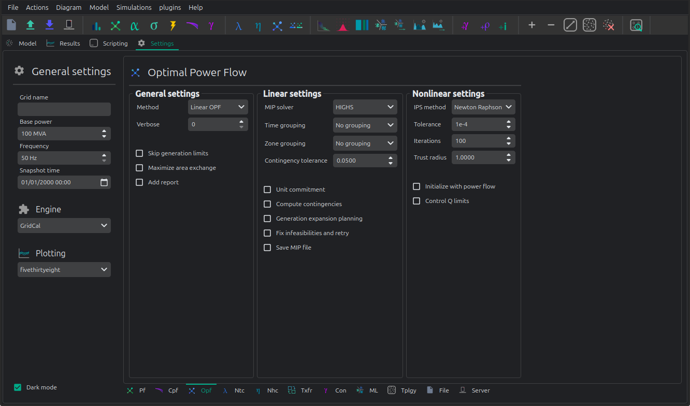

#  🏁 Optimal power flow




Solver
    Optimal power flow solver to use

    DC OPF: classic optimal power flow mixing active power with lines reactance.
    AC OPF: Innovative linear AC optimal power flow based on the AC linear power flow implemented in GridCal.

Load shedding
    This option activates the load shedding slack.
    It is possible to assign an arbitrary weight to this slack.

Generation shedding
    This option activated the generation shedding slack.
    It is possible to assign an arbitrary weight to this slack.

Show the real associated values
    Compute a power flow with the OPF results and show that as the OPF results.

Control batteries
    Control the batteries state of charge when running the optimization in time series.


## API

### Linear optimization

```python
import os
import numpy as np
import GridCalEngine as gce

folder = os.path.join('..', 'Grids_and_profiles', 'grids')
fname = os.path.join(folder, 'IEEE39_1W.gridcal')

main_circuit = gce.open_file(fname)

# declare the snapshot opf
opf_options = gce.OptimalPowerFlowOptions(mip_solver=gce.MIPSolvers.HIGHS)
opf_driver = gce.OptimalPowerFlowDriver(grid=main_circuit, options=opf_options)

print('Solving...')
opf_driver.run()

print("Status:", opf_driver.results.converged)
print('Angles\n', np.angle(opf_driver.results.voltage))
print('Branch loading\n', opf_driver.results.loading)
print('Gen power\n', opf_driver.results.generator_power)
print('Nodal prices \n', opf_driver.results.bus_shadow_prices)

# declare the time series opf
opf_ts_driver = gce.OptimalPowerFlowTimeSeriesDriver(grid=main_circuit)

print('Solving...')
opf_ts_driver.run()

print("Status:", opf_ts_driver.results.converged)
print('Angles\n', np.angle(opf_ts_driver.results.voltage))
print('Branch loading\n', opf_ts_driver.results.loading)
print('Gen power\n', opf_ts_driver.results.generator_power)
print('Nodal prices \n', opf_ts_driver.results.bus_shadow_prices)
```

### Run a linear optimization and verify with power flow

Often ties, you want to dispatch the generation using a linear optimization, to then _verify_ the
results using the power exact power flow. With GridCal, to do so is as easy as passing the results of the OPF into the
PowerFlowDriver:

```python
import os
import GridCalEngine as gce

folder = os.path.join('..', 'Grids_and_profiles', 'grids')
fname = os.path.join(folder, 'IEEE39_1W.gridcal')

main_circuit = gce.open_file(fname)

# declare the snapshot opf
opf_driver = gce.OptimalPowerFlowDriver(grid=main_circuit)
opf_driver.run()

# create the power flow driver, with the OPF results
pf_options = gce.PowerFlowOptions(solver_type=gce.SolverType.NR)
pf_driver = gce.PowerFlowDriver(grid=main_circuit,
                                options=pf_options,
                                opf_results=opf_driver.results)
pf_driver.run()

# Print results
print('Converged:', pf_driver.results.converged, '\nError:', pf_driver.results.error)
print(pf_driver.results.get_bus_df())
print(pf_driver.results.get_branch_df())
```

Output:

```text
Converged: True 
Error: 5.553046023010211e-09
             Vm         Va           P           Q
bus 0  1.027155 -21.975050  -97.600000  -44.200000
bus 1  1.018508 -17.390151   -0.000000    0.000000
bus 2  0.979093 -21.508225 -322.000000   -2.400000
bus 3  0.934378 -19.864840 -500.000000 -184.000000
bus 4  0.931325 -16.488297   -0.000000    0.000000
bus 5  0.932254 -15.184820   -0.000000    0.000000
bus 6  0.925633 -18.287327 -233.800000  -84.000000
bus 7  0.927339 -19.147130 -522.000000 -176.600000
bus 8  1.008660 -21.901696   -6.500000   66.600000
bus 9  0.933232 -12.563826    0.000000    0.000000
bus 10 0.931530 -13.489535    0.000000   -0.000000
bus 11 0.911143 -13.919901   -8.530000  -88.000000
bus 12 0.932956 -14.194410   -0.000000    0.000000
bus 13 0.939456 -18.071831   95.000000   80.000000
bus 14 0.947946 -24.501201 -320.000000 -153.000000
bus 15 0.969547 -25.398839 -329.000000  -32.300000
bus 16 0.975073 -24.329289   -0.000000    0.000000
bus 17 0.974923 -23.729596 -158.000000  -30.000000
bus 18 0.978267 -32.658992    0.000000   -0.000000
bus 19 0.976962 -38.320718 -680.000000 -103.000000
bus 20 0.975875 -21.466364 -274.000000 -115.000000
bus 21 1.005675 -15.328363    0.000000    0.000000
bus 22 1.005660 -16.083736 -247.500000  -84.600000
bus 23 0.977732 -24.971264 -308.600000   92.200000
bus 24 1.008485 -18.545657 -224.000000  -47.200000
bus 25 1.000534 -20.462156 -139.000000  -17.000000
bus 26 0.981806 -23.507873 -281.000000  -75.500000
bus 27 1.008509 -15.740313 -206.000000  -27.600000
bus 28 1.012968 -12.490634 -283.500000  -26.900000
bus 29 1.049900  -8.627698  900.000000  251.046579
bus 30 0.982000   0.000000  959.172868  323.252930
bus 31 0.945335  -0.791018  900.000000  150.000000
bus 32 0.997200 -32.044975   80.000000  129.407620
bus 33 1.006817 -38.408267    0.000000  167.000000
bus 34 1.039299  -8.255317  900.000000  300.000000
bus 35 1.060037  -8.077926  550.259634  240.000000
bus 36 1.027500 -16.918435  128.970365   82.680976
bus 37 1.026500  -4.776516  900.000000  103.207961
bus 38 1.030000 -23.362551 -204.000000    6.956520
                   Pf          Qf          Pt          Qt     loading     Ploss       Qloss
branch 0  -199.490166    9.886924  200.882852  -66.631030  -33.248361  1.392685  -56.744105
branch 1   101.890166  -54.086924 -101.789768  -22.751166   10.189017  0.100398  -76.838090
branch 2   494.939507  226.957177 -491.146020 -208.562681   98.987901  3.793487   18.394496
branch 3   204.177641  -52.633324 -201.227524   41.260633   40.835528  2.950117  -11.372692
branch 4  -900.000000 -107.692823  900.000000  251.046579 -100.000000  0.000000  143.353757
branch 5  -110.112636  203.416014  110.898270 -210.820460  -22.022527  0.785633   -7.404446
branch 6   279.258656    2.746666 -278.361852  -12.311738   55.851731  0.896804   -9.565072
branch 7  -396.736291   53.024640  398.210339  -41.118140  -66.122715  1.474048   11.906501
branch 8  -214.161979  -26.204180  214.585979   20.909705  -42.832396  0.424000   -5.294474
branch 9  -757.052621   31.704768  758.376760  -18.259085  -63.087718  1.324139   13.445683
branch 10  358.842282    9.413372 -357.652308   -5.501385   39.871365  1.189974    3.911986
branch 11  510.748653   42.617618 -508.932128  -24.515536   56.749850  1.816525   18.102081
branch 12 -309.952545   33.292523  310.738787  -36.144659  -64.573447  0.786242   -2.852137
branch 13 -959.172868  -57.651055  959.172868  323.252930  -53.287382 -0.000000  265.601874
branch 14  275.132128  -59.484464 -274.764014   57.022428   30.570236  0.368114   -2.462036
branch 15  110.416322 -228.121043 -108.890865  216.489512   12.268480  1.525457  -11.631531
branch 16  102.390865 -149.889512 -102.210232   29.707685   11.376763  0.180633 -120.181827
branch 17  327.473237    5.932303 -326.980326   -6.970962   54.578873  0.492911   -1.038659
branch 18  572.526763  -42.245014 -571.014280   52.157064   95.421127  1.512483    9.912050
branch 19 -900.000000   36.312711  900.000000  150.000000 -100.000000  0.000000  186.312711
branch 20  -16.202399  -42.051495   16.241539   43.115621   -3.240480  0.039140    1.064126
branch 21    7.672399  -45.948505   -7.630574   47.085615    1.534480  0.041825    1.137109
branch 22  578.644854  -99.242678 -575.095683  123.970310   96.440809  3.549172   24.727632
branch 23  455.509704  -64.880015 -451.229578   83.883725   75.918284  4.280126   19.003709
branch 24  131.229578 -236.883725 -130.530951  228.460261   21.871596  0.698627   -8.423463
branch 25 -201.616968  -48.791645  201.933110   40.123973  -33.602828  0.316142   -8.667672
branch 26  610.218277  -68.716891 -603.829849  117.741029  101.703046  6.388428   49.024138
branch 27 -480.680339  -12.436131  482.646709   21.510035  -80.113390  1.966370    9.073904
branch 28 -126.390019 -130.815594  126.492978  126.394116  -21.065003  0.102959   -4.421477
branch 29 -120.254199    6.410659  120.361852  -17.688262  -20.042367  0.107653  -11.277602
branch 30  -81.678911  -46.534633   81.783480   17.137675  -13.613152  0.104569  -29.396957
branch 31  683.666914    8.361328 -680.247614   59.047728   75.962990  3.419300   67.409057
branch 32  -79.837065 -126.102358   80.000000  129.407620   -8.870785  0.162935    3.305263
branch 33    0.247614 -162.047728    0.000000  167.000000    0.027513  0.247614    4.952272
branch 34 -756.646709 -136.510035  761.585858  197.760507  -84.071857  4.939149   61.250472
branch 35  138.414142  -16.911352 -138.300144    0.065486   23.069024  0.113998  -16.845866
branch 36 -900.000000 -180.849155  900.000000  300.000000 -100.000000  0.000000  119.150845
branch 37  439.456180   68.098749 -435.092978  -34.194116   73.242697  4.363202   33.904632
branch 38 -548.656035 -152.764235  550.259634  240.000000  -60.961782  1.603599   87.235765
branch 39  106.064510  -10.937025 -105.702431  -38.989055   17.677418  0.362078  -49.926080
branch 40 -128.836985  -77.523608  128.970365   82.680976  -14.315221  0.133380    5.157368
branch 41  364.790468   90.170222 -362.783480  -92.637675   60.798411  2.006988   -2.467453
branch 42 -174.673027  -32.815129  175.985257  -31.448155  -29.112171  1.312230  -64.263284
branch 43 -223.415010  -35.366038  226.271920  -37.606217  -37.235835  2.856910  -72.972254
branch 44 -381.985257    3.848155  383.997464   -7.582852  -63.664210  2.012206   -3.734697
branch 45 -893.769383   18.289069  900.000000  103.207961  -74.480782  6.230617  121.497030
```

### Hydro linear OPF

The following example loads and runs the linear optimization for a system that integrates fluid elements into a regular
electrical grid.

```python
import os
import GridCalEngine as gce

folder = os.path.join('..', 'Grids_and_profiles', 'grids')
fname = os.path.join(folder, 'hydro_simple.gridcal')
grid = gce.open_file(fname)

# Run the simulation
opf_driver = gce.OptimalPowerFlowTimeSeriesDriver(grid=grid)

print('Solving...')
opf_driver.run()

print('Gen power\n', opf_driver.results.generator_power)
print('Branch loading\n', opf_driver.results.loading)
print('Reservoir level\n', opf_driver.results.fluid_node_current_level)
```

Output:

```text
OPF results:

time                | p2x_1_gen | pump_1_gen | turbine_1_gen | slack_gen
------------------- | --------- | ---------- | ------------- | ---------
2023-01-01 00:00:00 | 0.0       | -6.8237821 | 6.0           | 11.823782
2023-01-01 01:00:00 | 0.0       | -6.8237821 | 6.0           | 11.823782
2023-01-01 02:00:00 | 0.0       | -6.8237821 | 6.0           | 11.823782
2023-01-01 03:00:00 | 0.0       | -6.8237821 | 6.0           | 11.823782
2023-01-01 04:00:00 | 0.0       | -6.8237821 | 6.0           | 11.823782
2023-01-01 05:00:00 | 0.0       | -6.8237821 | 6.0           | 11.823782
2023-01-01 06:00:00 | 0.0       | -6.8237821 | 6.0           | 11.823782
2023-01-01 07:00:00 | 0.0       | -6.8237821 | 6.0           | 11.823782
2023-01-01 08:00:00 | 0.0       | -6.8237821 | 6.0           | 11.823782
2023-01-01 09:00:00 | 0.0       | -6.8237821 | 6.0           | 11.823782


time                | line1  | line2 | line3     | line4
------------------- | ------ | ----- | --------- | -----
2023-01-01 00:00:00 | 100.0  | 0.0   | 68.237821 | 40.0
2023-01-01 01:00:00 | 100.0  | 0.0   | 68.237821 | 40.0
2023-01-01 02:00:00 | 100.0  | 0.0   | 68.237821 | 40.0
2023-01-01 03:00:00 | 100.0  | 0.0   | 68.237821 | 40.0
2023-01-01 04:00:00 | 100.0  | 0.0   | 68.237821 | 40.0
2023-01-01 05:00:00 | 100.0  | 0.0   | 68.237821 | 40.0
2023-01-01 06:00:00 | 100.0  | 0.0   | 68.237821 | 40.0
2023-01-01 07:00:00 | 100.0  | 0.0   | 68.237821 | 40.0
2023-01-01 08:00:00 | 100.0  | 0.0   | 68.237821 | 40.0
2023-01-01 09:00:00 | 100.0  | 0.0   | 68.237821 | 40.0


time                | f1         | f2  | f3  | f4        
------------------- | ---------- | --- | --- | ----------
2023-01-01 00:00:00 | 49.998977  | 0.0 | 0.0 | 50.001022
2023-01-01 01:00:00 | 49.997954  | 0.0 | 0.0 | 50.002046
2023-01-01 02:00:00 | 49.996931  | 0.0 | 0.0 | 50.003068
2023-01-01 03:00:00 | 49.995906  | 0.0 | 0.0 | 50.004093
2023-01-01 04:00:00 | 49.994884  | 0.0 | 0.0 | 50.005116
2023-01-01 05:00:00 | 49.993860  | 0.0 | 0.0 | 50.006139
2023-01-01 06:00:00 | 49.992838  | 0.0 | 0.0 | 50.007162
2023-01-01 07:00:00 | 49.991814  | 0.0 | 0.0 | 50.008185
2023-01-01 08:00:00 | 49.990792  | 0.0 | 0.0 | 50.009208
2023-01-01 09:00:00 | 49.989768  | 0.0 | 0.0 | 50.010231
```

### Non-linear optimization

