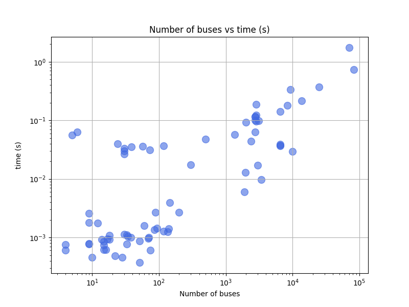
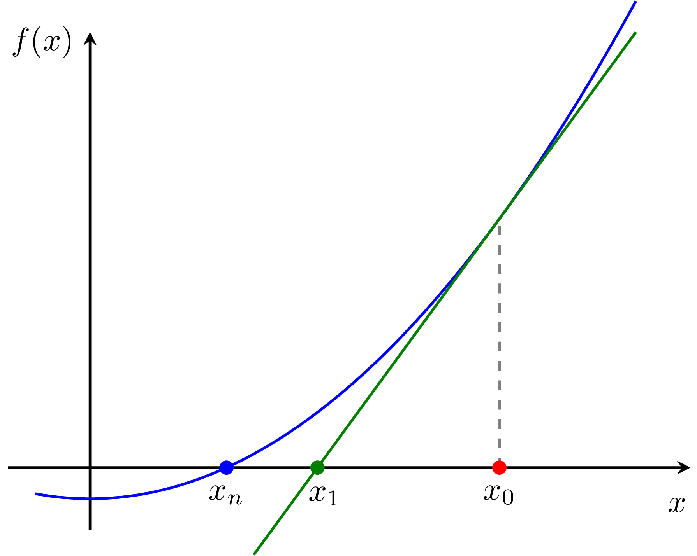
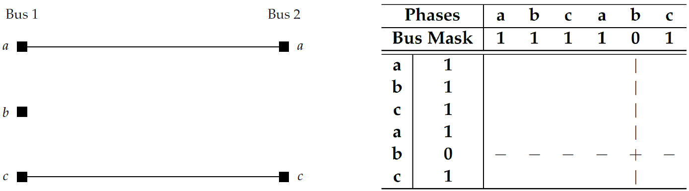
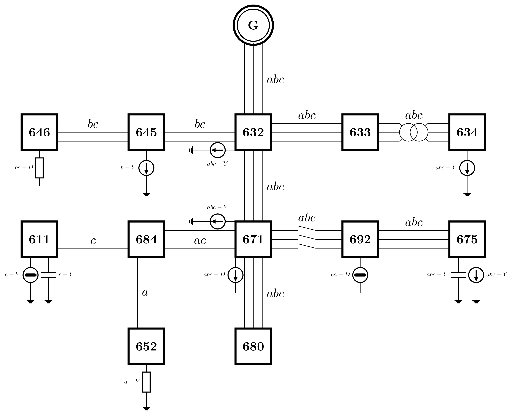
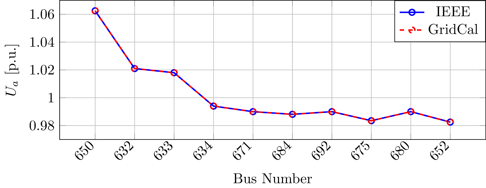
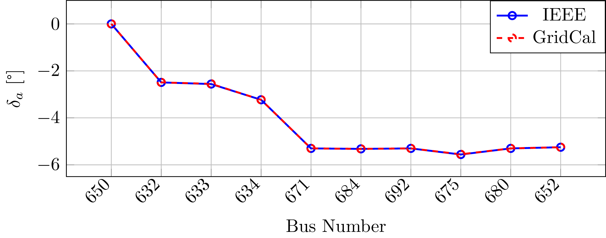
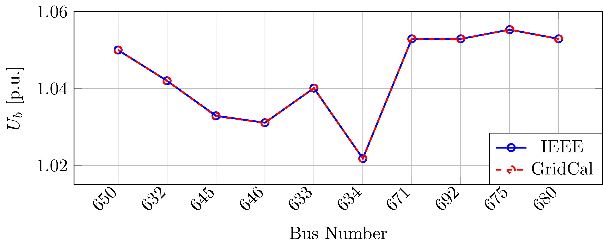
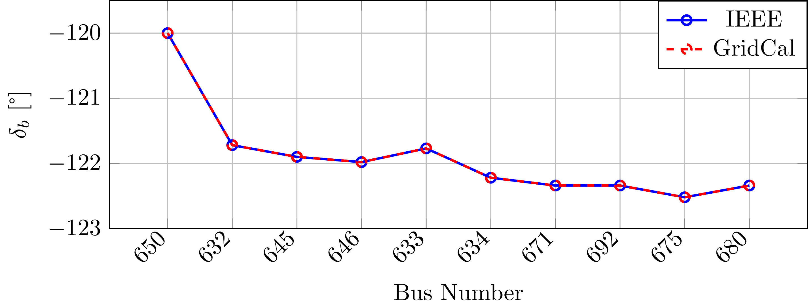
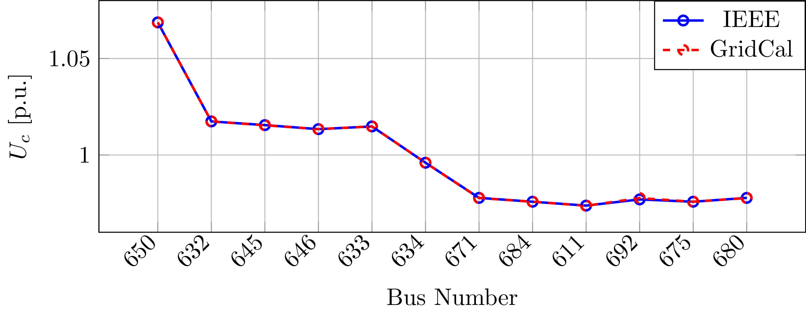
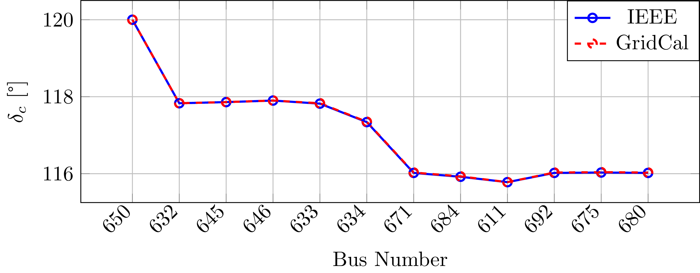

# 🔥 Power flow

VeraGrid has the most power flow features in any open-source software.
This is the power flow settings page:


Below, a list of the parameters and solvers available.

Settings:

- **Solver**: The power flow solver to use.

    - Newton-Raphson in power:
    - Newton-Raphson in current:
    - Newton-Raphson-Iwamoto:
    - Levenberg-Marquardt:
    - Fast-Decoupled:
    - Holomorphic-Embedding:
    - Linear "AC" approximation:
    - "DC" approximation

The following table relates which power flow controls are available in each solver:

|                                                                                         | Newton <br/>Raphson  |Powell <br/>Dog-leg|Levenberg-<br/>Marquardt|Iwamoto|Fast-<br/>decoupled|Gauss-<br/>seidel|Holomorphic <br/>embedding|Linear <br/>without <br/>voltage modules|Linear <br/>with voltage <br/>modules|
|-----------------------------------------------------------------------------------------|---|---|---|---|---|---|---|---|---|
| Local voltage <br/>control using <br/>a Generator.                                      |  ✅ | ✅  | ✅  |  ✅ | ✅  | ✅  |  ✅ | ✅ |  ✅ |
| Remote voltage <br/>control using <br/>a Generator.                                     | ✅  |  ✅ |  ✅ |  ✅ |  ✅ |   |   |   |   |
| Generator <br/>reactive power <br/>limits.                                              | ✅  |  ✅ |  ✅ |  ✅ | ✅  |  ✅ |   |   |   |
| Local and <br/>remote voltage <br/>control using <br/>a transformer's <br/>tap changer. | ✅  |  ✅ |  ✅ |   |   |   |   |   |   |
| Local active <br/>power control <br/>using a <br/>transformer's <br/>tap changer.       |  ✅ | ✅  |  ✅ |   |   |   |   |   |   |
| Local reactive <br/>power control <br/>using a <br/>transformer's <br/>tap changer.     | ✅  | ✅  | ✅  |   |   |   |   |   |   |
| Local and <br/>remote <br/>AC and DC <br/>voltage control <br/>using a <br/>converter.  | ✅  | ✅  | ✅  |   |   |   |   |   |   |
| Local <br/>AC and DC <br/>active power<br/> control using <br/>a converter.                  |✅   | ✅  |  ✅ |   |   |   |   |   |   |
| Local AC <br/>reactive power <br/>control using <br/>a converter.                                      | ✅  | ✅  |  ✅ |   |   |   |   |   |   |
| 3-phase <br/>unbalanced.                                                                     | ✅  | ✅  |  ✅ |   |   |   |   |   |   |


- **Tolerance**: per-unit error tolerance to use in the solver. Exponent of the numerical precision. i.e. `4` corresponds to `1e-4` MW in p.u. of precision

- **Automatic precision (find)**:
    The precision to use for the numerical solvers depends on the magnitude of the power injections.
    If we are dealing with hundreds of MW, the precision may be `1e-3`, but if we are dealing with Watts, the precision has
    to be greater. The automatic precision checks the loading for a suitable precision such that the results are fine.

- **Trust radius**: For newton-like methods this is the solution trust radius to use
- **Max. Iterations**: Maximum number of iterations in the solver.
- **Verbosity**: Level of verbosity (0: none, 1: some, >=2: all)

Flags:

- **Retry with other methods is failed**:
    This option tries other numerical solvers to try to find a power flow solution.
    This option is relevant because different numerical algorithms may be more suited to certain grid configurations.
    In general the Newton-Raphson implementation in VeraGrid includes back-tracing and other innovations that make it
    a very competitive method to consider by default.

- **Use initial guess**: In the buses there are two properties `Vm0`and `Va0` both serve to 
specify the initial voltage guess. If selected those values are used to initialize the power flow solution.
- **Ignore single island nodes**: If selected, the islands of 1 one are considered in blackout and not calculated.
- **3-phase**: If selected a three phase power flow is run. For now only supporting simple local voltage controls.
- **Distributed slack**: If selected, the slack power is distributed simply among the existing generators.
- **Control Q limits**: This is the mode of reactive power control for the generators that are set in PV mode. 
This is a node-level control, so for this to work, there must not be more than one generator per bus. Otherwise a 
per-node repartition will be made, but the limits respecting cannot be ensured. For that use the AC-OPF.
- **Control tap module**: If selected the tap module controls are possible, if active at device level.
- **Control tap phase**: If selected the tap phase controls are possible, if active at device level.
- **Control remote voltages**: If selected, the remote voltage controls are possible if set at device level.
- **Orthogonalize controls**: If selected, the controls are "orthogonalized" to their device specified steps. 
This applies to transformer tap changers and non-linear shunts.

- **Initialize angles**: If selected the power flow angles are initialized with a linear power flow. 
For Holomorphic embedding this is not necessary.
- **Apply temperature correction**: When selected the branches apply the correction of the resistance due to the temperature.
- **Apply impedance tolerances**:
- **Add report**: Inspect the results looking for violations to report in the power flow logger.


## API

Using the simplified API:

```python
import os
import VeraGridEngine as gce

folder = os.path.join('..', 'Grids_and_profiles', 'grids')
fname = os.path.join(folder, 'IEEE39_1W.veragrid')
main_circuit = gce.open_file(fname)

results = gce.power_flow(main_circuit)

print(main_circuit.name)
print('Converged:', results.converged, 'error:', results.error)
print(results.get_bus_df())
print(results.get_branch_df())
```

Using the more complex library objects:

```python
import os
import VeraGridEngine as gce

folder = os.path.join('..', 'Grids_and_profiles', 'grids')
fname = os.path.join(folder, 'IEEE14_from_raw.veragrid')
main_circuit = gce.open_file(fname)

options = gce.PowerFlowOptions(gce.SolverType.NR, verbose=False)
power_flow = gce.PowerFlowDriver(main_circuit, options)
power_flow.run()

print(main_circuit.name)
print('Converged:', power_flow.results.converged, 'error:', power_flow.results.error)
print(power_flow.results.get_bus_df())
print(power_flow.results.get_branch_df())
```

Output:

```text
IEEE14_from_raw

Converged: True error: 5.98e-08

Bus resuts:
           Vm     Va      P      Q
BUS 1    1.06   0.00 232.39 -16.55
BUS 2    1.04  -4.98  18.30  30.86
BUS 3    1.01 -12.73 -94.20   6.08
BUS 4    1.02 -10.31 -47.80   3.90
BUS 5    1.02  -8.77  -7.60  -1.60
BUS 6    1.07 -14.22 -11.20   5.23
BUS 7    1.06 -13.36   0.00   0.00
BUS 8    1.09 -13.36   0.00  17.62
BUS 9    1.06 -14.94 -29.50 -16.60
BUS 10   1.05 -15.10  -9.00  -5.80
BUS 11   1.06 -14.79  -3.50  -1.80
BUS 12   1.06 -15.08  -6.10  -1.60
BUS 13   1.05 -15.16 -13.50  -5.80
BUS 14   1.04 -16.03 -14.90  -5.00

Branch results:
                Pf         Qf          Pt         Qt               loading    Ploss     Qloss
1_2_1   156.882887 -20.404291 -152.585286  27.676248 15688288652036.908203 4.297600  7.271957
1_5_1    75.510380   3.854989  -72.747507   2.229360  7551037982438.064453 2.762872  6.084349
2_3_1    73.237578   3.560203  -70.914309   1.602232  7323757808601.912109 2.323269  5.162436
2_4_1    56.131495  -1.550352  -54.454837   3.020689  5613149456668.273438 1.676658  1.470337
2_5_1    41.516214   1.170996  -40.612460  -2.099032  4151621353697.657715 0.903753 -0.928036
3_4_1   -23.285691   4.473114   23.659136  -4.835650 -2328569062725.765625 0.373445 -0.362537
4_5_1   -61.158231  15.823642   61.672651 -14.201004 -6115823108351.800781 0.514420  1.622637
6_11_1    7.353277   3.560471   -7.297904  -3.444512   735327693069.753418 0.055373  0.115959
6_12_1    7.786067   2.503414   -7.714258  -2.353959   778606687855.751465 0.071809  0.149455
6_13_1   17.747977   7.216574  -17.535891  -6.798912  1774797671583.112793 0.212085  0.417662
7_8_1    -0.000000 -17.162967    0.000000  17.623448             -0.001718 0.000000  0.460481
7_9_1    28.074179   5.778690  -28.074179  -4.976621  2807417855964.891602 0.000000  0.802069
9_10_1    5.227551   4.219139   -5.214676  -4.184938   522755058212.680359 0.012875  0.034201
9_14_1    9.426380   3.610007   -9.310226  -3.362932   942638030136.208130 0.116154  0.247075
10_11_1  -3.785324  -1.615061    3.797906   1.644513  -378532426869.186707 0.012581  0.029451
12_13_1   1.614258   0.753959   -1.607959  -0.748260   161425771970.211853 0.006298  0.005698
13_14_1   5.643852   1.747172   -5.589774  -1.637068   564385175482.526855 0.054078  0.110105
4_7_1    28.074176  -9.681066  -28.074176  11.384281  2807417645485.176270 0.000000  1.703214
4_9_1    16.079758  -0.427611  -16.079758   1.732322  1607975830176.256104 0.000000  1.304711
5_6_1    44.087319  12.470682  -44.087319  -8.049520  4408731875605.579102 0.000000  4.421161
```


## Benchmark


### Running Matpower grids



Matpower's excellent formulations and consistency has allowed this and other
projects to develop, relying on its sound math. That is why VeraGrid reads Matpower
cases out of the box, without you having to do anything special.
And of course, VeraGrid solves all Matpower 8 provided grids,
solving the continental USA case in about 1 second:

| name                    | n_buses | n_branches | P imbalance (%) | Flat start | converged | error (p.u.) | iterations | time (ms) |
|-------------------------|---------|------------|-----------------|------------|-----------|--------------|------------|-----------|
| case_SyntheticUSA.m     |   82000 |     104121 |           -0.12 |      FALSE |      TRUE |     2.03E-08 |         13 |   3181.41 |
| case_ACTIVSg70k.m       |   70000 |      88207 |            0.64 |      FALSE |      TRUE |     8.00E-07 |          4 |   1170.59 |
| case_ACTIVSg25k.m       |   25000 |      32230 |           -2.72 |       TRUE |      TRUE |     7.77E-10 |         13 |    993.16 |
| case13659pegase.m       |   13659 |      20467 |         2411.01 |       TRUE |      TRUE |     1.66E-07 |          8 |    284.45 |
| case_ACTIVSg10k.m       |   10000 |      12706 |           -7.61 |      FALSE |      TRUE |     3.81E-11 |          5 |    152.66 |
| case9241pegase.m        |    9241 |      16049 |          683.53 |       TRUE |      TRUE |     9.97E-11 |         11 |    319.74 |
| case8387pegase.m        |    8387 |      14561 |          -44.18 |       TRUE |      TRUE |     1.27E-11 |         15 |    362.14 |
| case6515rte.m           |    6515 |       9037 |          -47.51 |      FALSE |      TRUE |     9.36E-08 |          7 |    132.49 |
| case6495rte.m           |    6495 |       9019 |          -48.91 |      FALSE |      TRUE |     1.08E-07 |          6 |    111.79 |
| case6470rte.m           |    6470 |       9005 |          -47.97 |      FALSE |      TRUE |     7.89E-09 |          7 |    130.71 |
| case6468rte.m           |    6468 |       9000 |          -46.27 |      FALSE |      TRUE |     1.20E-09 |          7 |    145.08 |
| case3375wp.m            |    3374 |       4161 |          -73.29 |      FALSE |      TRUE |     2.26E-09 |          5 |     52.88 |
| case3120sp.m            |    3120 |       3693 |          -99.96 |       TRUE |      TRUE |     1.56E-08 |         12 |    142.90 |
| case3012wp.m            |    3012 |       3572 |          -98.93 |      FALSE |      TRUE |     2.85E-10 |          6 |     67.21 |
| case2869pegase.m        |    2869 |       4582 |          561.42 |       TRUE |      TRUE |     1.22E-11 |         10 |     78.79 |
| case2868rte.m           |    2868 |       3808 |          -46.03 |       TRUE |      TRUE |     5.05E-07 |         15 |    119.37 |
| case2848rte.m           |    2848 |       3776 |          -41.34 |       TRUE |      TRUE |     1.30E-11 |         18 |    153.64 |
| case2746wp.m            |    2746 |       3514 |          -95.83 |       TRUE |      TRUE |     9.13E-09 |          9 |     72.19 |
| case2746wop.m           |    2746 |       3514 |          -96.55 |       TRUE |      TRUE |     2.78E-07 |          9 |    128.23 |
| case2737sop.m           |    2737 |       3506 |          -94.20 |       TRUE |      TRUE |     3.01E-10 |         11 |     94.70 |
| case2736sp.m            |    2736 |       3504 |          -95.17 |       TRUE |      TRUE |     1.74E-09 |         10 |    114.32 |
| case2383wp.m            |    2383 |       2896 |          -97.43 |       TRUE |      TRUE |     5.17E-12 |         10 |     87.65 |
| case_ACTIVSg2000.m      |    2000 |       3206 |           10.84 |       TRUE |      TRUE |     6.16E-10 |         12 |    136.57 |
| case1951rte.m           |    1951 |       2596 |          -45.97 |      FALSE |      TRUE |     6.67E-07 |          4 |     31.74 |
| case1888rte.m           |    1888 |       2531 |          -47.08 |      FALSE |      TRUE |     1.56E-07 |          5 |     39.21 |
| case1354pegase.m        |    1354 |       1991 |          862.85 |       TRUE |      TRUE |     7.43E-09 |          8 |     56.87 |
| case_ACTIVSg500.m       |     500 |        597 |            2.78 |       TRUE |      TRUE |     4.17E-09 |          7 |     19.51 |
| case300.m               |     300 |        411 |          -38.64 |       TRUE |      TRUE |     1.54E-09 |          8 |      7.69 |
| case_ACTIVSg200.m       |     200 |        245 |            6.48 |       TRUE |      TRUE |     3.07E-10 |          5 |     11.00 |
| case145.m               |     145 |        453 |         -100.00 |       TRUE |      TRUE |     1.04E-09 |          8 |     14.71 |
| case141.m               |     141 |        140 |         -100.00 |       TRUE |      TRUE |     4.69E-09 |          2 |      1.15 |
| case136ma.m             |     136 |        156 |         -100.00 |       TRUE |      TRUE |     1.14E-08 |          2 |      1.11 |
| case118zh.m             |     118 |        132 |         -100.00 |       TRUE |      TRUE |     1.46E-08 |          2 |      1.35 |
| case118.m               |     118 |        186 |          -28.33 |       TRUE |      TRUE |     1.94E-07 |          7 |      3.05 |
| case94pi.m              |      94 |         93 |         -100.00 |       TRUE |      TRUE |     2.08E-11 |          2 |      1.32 |
| case89pegase.m          |      89 |        210 |            4.19 |       TRUE |      TRUE |     2.81E-09 |          4 |      2.54 |
| case85.m                |      85 |         84 |         -100.00 |       TRUE |      TRUE |     7.90E-12 |          2 |      1.13 |
| case74ds.m              |      74 |         73 |         -100.00 |       TRUE |      TRUE |     8.74E-07 |          1 |      0.58 |
| case_RTS_GMLC.m         |      73 |        120 |          -80.55 |       TRUE |      TRUE |     1.62E-07 |          7 |     11.74 |
| case70da.m              |      70 |         76 |         -100.00 |       TRUE |      TRUE |     2.17E-12 |          2 |      0.89 |
| case69.m                |      69 |         68 |         -100.00 |       TRUE |      TRUE |     7.20E-09 |          2 |      0.78 |
| case60nordic.m          |      60 |         88 |           96.26 |       TRUE |      TRUE |     5.15E-08 |          4 |      1.35 |
| case57.m                |      57 |         80 |         -100.00 |       TRUE |      TRUE |     2.82E-10 |          7 |     11.47 |
| case51ga.m              |      51 |         50 |         -100.00 |       TRUE |      TRUE |     1.85E-12 |          2 |      0.86 |
| case51he.m              |      51 |         50 |         -100.00 |       TRUE |      TRUE |     6.16E-07 |          1 |      0.40 |
| case39.m                |      39 |         46 |          -26.13 |       TRUE |      TRUE |     1.93E-11 |          7 |     10.79 |
| case38si.m              |      38 |         37 |         -100.00 |       TRUE |      TRUE |     7.26E-12 |          2 |      1.06 |
| case34sa.m              |      34 |         33 |         -100.00 |       TRUE |      TRUE |     8.24E-13 |          2 |      0.74 |
| case33bw.m              |      33 |         37 |         -100.00 |       TRUE |      TRUE |     7.38E-09 |          2 |      1.09 |
| case33mg.m              |      33 |         37 |         -100.00 |       TRUE |      TRUE |     7.46E-12 |          2 |      0.70 |
| case30.m                |      30 |         41 |          -39.59 |       TRUE |      TRUE |     9.57E-10 |          3 |      1.13 |
| case_ieee30.m           |      30 |         41 |           -3.24 |       TRUE |      TRUE |     5.18E-08 |          3 |      0.92 |
| case30pwl.m             |      30 |         41 |          -39.59 |       TRUE |      TRUE |     9.57E-10 |          3 |      0.89 |
| case30Q.m               |      30 |         41 |          -39.59 |       TRUE |      TRUE |     9.57E-10 |          3 |      0.92 |
| case28da.m              |      28 |         27 |         -100.00 |       TRUE |      TRUE |     6.85E-07 |          1 |      0.53 |
| case24_ieee_rts.m       |      24 |         38 |          -70.52 |       TRUE |      TRUE |     1.63E-08 |          5 |      9.04 |
| case22.m                |      22 |         21 |         -100.00 |       TRUE |      TRUE |     2.13E-07 |          1 |      0.47 |
| case18.m                |      18 |         17 |         -100.00 |       TRUE |      TRUE |     1.27E-08 |          3 |      0.74 |
| case18nbr.m             |      18 |         17 |         -100.00 |       TRUE |      TRUE |     1.35E-07 |          2 |      0.84 |
| case17me.m              |      17 |         16 |         -100.00 |       TRUE |      TRUE |     3.19E-08 |          3 |      0.91 |
| case16ci.m              |      16 |         16 |         -100.00 |       TRUE |      TRUE |     1.38E-09 |          2 |      0.47 |
| case15da.m              |      15 |         14 |         -100.00 |       TRUE |      TRUE |     8.57E-07 |          1 |      0.68 |
| case15nbr.m             |      15 |         14 |         -100.00 |       TRUE |      TRUE |     5.43E-08 |          2 |      0.63 |
| case16am.m              |      15 |         14 |         -100.00 |       TRUE |      TRUE |     1.22E-07 |          2 |      0.89 |
| case14.m                |      14 |         20 |            1.26 |       TRUE |      TRUE |     5.98E-08 |          3 |      0.61 |
| case12da.m              |      12 |         11 |         -100.00 |       TRUE |      TRUE |     2.71E-07 |          1 |      1.36 |
| case10ba.m              |      10 |          9 |         -100.00 |       TRUE |      TRUE |     6.22E-08 |          2 |      0.52 |
| case9target.m           |       9 |          9 |          -41.08 |       TRUE |      TRUE |     1.40E-07 |          5 |      2.12 |
| case9_gurobi_test.m     |       9 |          9 |            1.68 |       TRUE |      TRUE |     3.42E-07 |          3 |      1.61 |
| case9.m                 |       9 |          9 |            1.68 |       TRUE |      TRUE |     3.42E-07 |          3 |      0.67 |
| case9Q.m                |       9 |          9 |          -21.27 |       TRUE |      TRUE |     5.71E-07 |          3 |      0.64 |
| case6ww.m               |       6 |         11 |          -47.62 |       TRUE |      TRUE |     2.09E-10 |          3 |      1.43 |
| case5.m                 |       5 |          6 |          -36.35 |       TRUE |      TRUE |     6.42E-11 |          3 |      1.87 |
| case4_dist.m            |       4 |          3 |         -100.00 |       TRUE |      TRUE |     4.63E-11 |          6 |      8.03 |
| case4gs.m               |       4 |          4 |         -100.00 |       TRUE |      TRUE |     6.59E-14 |          6 |      1.14 |
| contab_ACTIVSg200.m     |       0 |          0 |            0.00 |       TRUE |      TRUE |     0.00E+00 |          0 |      0.00 |
| contab_ACTIVSg500.m     |       0 |          0 |            0.00 |       TRUE |      TRUE |     0.00E+00 |          0 |      0.00 |
| scenarios_ACTIVSg200.m  |       0 |          0 |            0.00 |       TRUE |      TRUE |     0.00E+00 |          0 |      0.00 |
| contab_ACTIVSg10k.m     |       0 |          0 |            0.00 |       TRUE |      TRUE |     0.00E+00 |          0 |      0.00 |
| contab_ACTIVSg2000.m    |       0 |          0 |            0.00 |       TRUE |      TRUE |     0.00E+00 |          0 |      0.00 |
| scenarios_ACTIVSg2000.m |       0 |          0 |            0.00 |       TRUE |      TRUE |     0.00E+00 |          0 |      0.00 |

_Results simulated with AMD 9750x and 64 GB of RAM under Ubuntu 24.04.
All solved using Newton-Raphson, and only using the provided solution
that comes with the files when the flat start fails.

Cool right? This is the code to reproduce the results:

```python
import os
import pandas as pd
import multiprocessing as mp
import VeraGridEngine as gce

folder = "[some path...]/matpower8.0b1/data"


def run_grid(fname):
    grid = gce.open_file(fname)
    name = os.path.basename(fname)

    if grid.get_bus_number() > 0:

        res = gce.power_flow(
            grid=grid,
            options=gce.PowerFlowOptions(solver_type=gce.SolverType.NR,
                                         retry_with_other_methods=False,
                                         use_stored_guess=False)
        )
        flat_start = True

        if not res.converged:
            # if it does not converge, retry with the provided solution
            res = gce.power_flow(
                grid=grid,
                options=gce.PowerFlowOptions(solver_type=gce.SolverType.NR,
                                             retry_with_other_methods=False,
                                             use_stored_guess=True)
            )
            flat_start = False

        info = {
            "name": name,
            "n_buses": grid.get_bus_number(),
            "n_branches": grid.get_branch_number(),
            "P imbalance (%)": grid.get_imbalance() * 100.0,
            "Flat start": flat_start,
            "converged": res.converged,
            "error (p.u.)": res.error,
            "iterations": res.iterations,
            "time (ms)": res.elapsed * 1000.0,
        }


    else:
        info = {
            "name": name,
            "n_buses": grid.get_bus_number(),
            "n_branches": grid.get_branch_number(),
            "P imbalance (%)": 0.0,
            "Flat start": True,
            "converged": True,
            "error (p.u.)": 0,
            "iterations": 0,
            "time (ms)": 0,
        }

    return info


# run this one to compile all JIT routines and have fair measurements
gce.power_flow(gce.open_file(os.path.join(folder, "case_ieee30.m")))

data = list()
files_list = list()
for root, dirs, files in os.walk(folder):
    for file in files:
        if file.endswith(".m"):
            path = os.path.join(root, file)
            files_list.append(path)

with mp.Pool(mp.cpu_count()) as p:
    data = p.map(run_grid, files_list)

df = pd.DataFrame(data).sort_values(by='n_buses', ascending=False)
df.to_excel("All matpower grids.xlsx", index=False)
```

## Three-phase Unbalanced Power Flow

The power flow problem, or load flow problem, consists of computing the flow of electrical power in a steady-state
system. In practice, this amounts to calculating the voltage phasor in each bus of the power network.
Once the bus voltages are known, the other electrical variables are easy to compute. Mathematical equations for the
power flow problem can be obtained by combining the complex power equation with Ohm's law.

The injected complex power $\vec{S_i}$ can be written as the product of the voltage phasor $\vec{U_i}$ and the
conjugated current phasor $\vec{I_i}^*$ in the bus $i$.

$$
\vec{S_i} = \vec{U_i} \vec{I_i}^*
$$

Ohm's law relates the current $\vec{I_i}$ flowing through the bus $i$ with the bus voltage $\vec{U_i}$ and its
impedance $\vec{Z_i}$. We can express it in terms of admittance $\vec{Y_i}$, which is the impedance inverse.

$$
\vec{I_i} = \frac{\vec{U_i}}{\vec{Z_i}} = \vec{Y_i}\vec{U_i}
$$

Therefore, by substituting the current from the first equation into the second equation, the fundamental expression to
be solved is obtained as:

$$
\vec{S_i} = \vec{U_i}(\vec{Y_i}\vec{U_i})^*
$$

The following magnitudes are defined for each bus $i$:

- $U$: Voltage module.
- $\delta$: Voltage angle.
- $P$: Active power injection or consumption.
- $Q$: Reactive power injection or consumption.

In some buses we artificially define the voltage module and angle (slack buses), in some buses we just know the
consumption power (load buses or PQ), and in some others we know the active power injection and the voltage module
(generation buses or PV). Thus, the different bus types are summarised in the following table.
At least one slack bus is required in order to solve the power flow problem.

|       | $U$      | $\delta$ | $P$      | $Q$      |
|-------|----------|----------|----------|----------|
| Slack | Set      | Set      | Computed | Computed |
| PQ    | Computed | Computed | Set      | Set      |
| PV    | Set      | Computed | Set      | Computed |


### The Newton-Raphson Method

The Newton-Raphson method is used to solve the power flow problem, which consists of a zero-finding algorithm that
produces successively better approximations to the zeros of a function. A zero of a function $f$ is the $x$ value such
that $f(x)=0$. The idea is to start with an initial guess $x_0$, then to approximate the function by its tangent line,
and finally to compute the x-axis interception of this tangent line.
As shown in the following figure, the $x_1$ interception will typically be a better approximation to the
function's real zero $x_n$ than the initial guess $x_0$, and the method can be iterated.



If a function $y=f(x)$ is expanded about an operating point $x_0$ using a Taylor series expansion and ignoring all
terms of higher order than 1, the following equation can be obtained:

$$
y = f(x_0) + \frac{df(x_0)}{dx} (x - x_0)
$$

Returning to the power flow problem and considering again the fundamental equation $\vec{S_i} = \vec{U_i}(\vec{Y_i}\vec{U_i})^*$
to be solved, it can be noted that it may be expressed as $\vec{S}_i = f(\vec{U}_i)$, in the same way as a generic function $y = f(x)$.
Therefore, it can be solved using the Newton-Raphson method.

### Solving the Three-phase Unbalanced Power Flow Problem

From the previous consideration, the solution of the function $\vec{S_i} = f(\vec{U_i})$ can be written in the form of 
the expression above, the fundamental Newton-Raphson expression for the solution of the power flow problem,
where $J$ is the Jacobian matrix:

$$
\varDelta \vec{S} = -J \cdot \vec{U}
$$

If the previous equation is developed such that the complex power is expressed in its respective active $P$ and
reactive $Q$ components, $J$ is the Jacobian matrix composed by the partial derivatives, and the voltage is isolated
and expressed in polar coordinates with angle $\delta$ and module $U$. Then, its matrix full representation is as follows:

$$
\begin{bmatrix}
\delta \\
U
\end{bmatrix}
=-
\begin{bmatrix}
\dfrac{\partial P}{\partial \delta} & \dfrac{\partial P}{\partial U} \\ \\
\dfrac{\partial Q}{\partial \delta} & \dfrac{\partial Q}{\partial U}
\end{bmatrix}^{-1}
\begin{bmatrix}
\varDelta P \\
\varDelta Q
\end{bmatrix}
$$

Therefore, the system will be solved iteratively until the difference between the specified power $S_\text{spec}$ and
the calculated power $S_\text{calc}$ is negligible, meaning that the zero of the function has been found:

$$
\varDelta \vec{S} = \vec{S}_\text{calc} - \vec{S}_\text{spec}
$$

The calculated power can be obtained using the voltage and the admittance matrices of the lines and
transformers, as previously developed:

$$
\vec{S}_\text{calc} = \vec{U} \, (\vec{Y} \, \vec{U})^*
$$

In contrast, the specified power incorporates the injection values of the different elements defined by
the user. As previously discussed in the modelling section, these elements may be defined in terms of specified power
$\vec{S}_0$, current $\vec{I}_0$, or admittance $\vec{Y}_0$. Then, the equivalent specified power is calculated using
the following expression:

$$
\vec{S}_\text{spec} = \vec{S}_0 + (\vec{I}_0 + \vec{Y}_0 \, \vec{U})^* \, \vec{U}
$$

The voltage term $\vec{U}$ is a vector composed by the voltage values at each of the system's buses, and therefore has
a size equal to $n$, that is, the total number of buses. The admittance term $\vec{Y}$ is a matrix comprising the
admittance of the lines and transformers, therefore the elements that interconnect the buses with one another.
As a result, it has a size of $n \times n$.

On the other hand, the specified power and current injection vectors, $\vec{S}_0$ and $\vec{I}_0$, have the same length
as the voltage vector $\vec{U}$, while the specified admittance $\vec{Y}_0$ has the same dimensions as the branch
admittance matrix $\vec{Y}$.

One might assume that, in order to formulate a three-phase power flow, it would be sufficient to simply multiply the
number of buses by three, to account for the $abc$ phases. While this assumption could be valid in transmission systems,
it does not hold true when we enter the domain of distribution networks. In such systems, all kinds of elements can be
present, with three-phase, two-phase, and single-phase components.

Since VeraGrid aims to address both transmission and distribution systems, the assumption of simply tripling the number
of buses is not sufficient. A more advanced method must be implemented to accurately detect the real number of buses,
taking into account the presence or absence of the three phases.

This system for detecting the existing phases at each bus must begin with the branches (lines and transformers).
These are the elements where the presence of phases transporting electrical energy is specified. Based on this
information, a binary vector, referred to as the bus **mask**, is constructed. This vector contains ones for the phases
that are present and zeros for those positions where one of the three standard phases is absent.

This mask $M$ must be applied to several variables. The first is the admittance matrix, which will be processed by
multiplying both its rows and columns by the bus mask. In this way, the entries corresponding to non-existent phases
are removed. As a result, the matrix remains of size equal to $n \times n$, that this time corresponds to the total
number of **active buses**.

$$
\vec{Y}_{\text{masked}} = M \cdot \vec{Y} \cdot M^{\top}
$$

Considering a simple example of two buses connected through a line that only has phases $a$ and $c$ active, phase $b$
cannot exist at the second bus. Therefore, the bus mask will contain a zero in that position, effectively removing the
corresponding rows and columns from the admittance matrix:



Naturally, the bus mask must also be applied to the voltage vector at each bus in order to eliminate the entries
corresponding to non-existent buses:

$$
\vec{U}_{\text{masked}} = M^{\top} \cdot \vec{U}
$$

And the same operation must be carried out equivalently for the current injection vector and the power vector
at each bus:

$$
\vec{I}_{\text{masked}} = M^{\top} \cdot \vec{I}
$$

$$
\vec{S}_{\text{masked}} = M^{\top} \cdot \vec{S}
$$

In this way, all the elements required for the power flow are now correctly dimensioned, and the algorithm can be
applied in a manner equivalent to the traditional single-phase power flow.

### Benchmark - IEEE 13 Node Test Feeder

To validate the implementation in VeraGrid of the three-phase power flow algorithm, the IEEE 13 Node Test Feeder has 
been selected as a reference benchmark. This distribution system model, published by the IEEE Distribution System
Analysis Subcommittee, represents a typical North American urban radial distribution network.



The network, depicted in the figure above, includes a variety of distribution elements such as:

- Unbalanced overhead power lines with different phasing configurations (three-phase, two-phase, and single-phase).
- A distribution transformer between buses 633 and 634.
- Multiple balanced and unbalanced loads modelled as constant impedance (Z), constant power (P), and constant current (I), with three-phase connections in star (Y) and delta (D), connections between two phases, and also between one phase and the ground.
- Shunt capacitor banks for reactive power compensation, also with different phasing configurations (three-phase and single-phase).

The base voltage levels of the system are 4,16 kV on the distribution side, with a
downstream low-voltage level of 0,48 kV at bus 634. The total nominal load is around 3,8 MVA, distributed across
residential, commercial, and industrial consumers. Due to the network's unbalanced and mixed-phase nature, this test feeder is widely recognised as a challenging yet
representative case for validating unbalanced power flow solvers.

The following code can be used to model the IEEE 13 Node Test Feeder in VeraGrid and to perform the three-phase
unbalanced power flow, obtaining the voltage results depicted bellow.

```python
import VeraGridEngine.api as gce
from VeraGridEngine import WindingType, ShuntConnectionType
import numpy as np

logger = gce.Logger()

grid = gce.MultiCircuit()
grid.fBase = 60

# ----------------------------------------------------------------------------------------------------------------------
# Buses
# ----------------------------------------------------------------------------------------------------------------------
bus_632 = gce.Bus(name='632', Vnom=4.16, xpos=0, ypos=0)
bus_632.is_slack = True
grid.add_bus(obj=bus_632)
gen = gce.Generator(vset=1.0)
grid.add_generator(bus=bus_632, api_obj=gen)

bus_633 = gce.Bus(name='633', Vnom=4.16, xpos=100 * 5, ypos=0)
grid.add_bus(obj=bus_633)

bus_634 = gce.Bus(name='634', Vnom=0.48, xpos=200 * 5, ypos=0)
grid.add_bus(obj=bus_634)

bus_645 = gce.Bus(name='645', Vnom=4.16, xpos=-100 * 5, ypos=0)
grid.add_bus(obj=bus_645)

bus_646 = gce.Bus(name='646', Vnom=4.16, xpos=-200 * 5, ypos=0)
grid.add_bus(obj=bus_646)

bus_652 = gce.Bus(name='652', Vnom=4.16, xpos=-100 * 5, ypos=200 * 5)
grid.add_bus(obj=bus_652)

bus_671 = gce.Bus(name='671', Vnom=4.16, xpos=0, ypos=100 * 5)
grid.add_bus(obj=bus_671)

bus_675 = gce.Bus(name='675', Vnom=4.16, xpos=200 * 5, ypos=100 * 5)
grid.add_bus(obj=bus_675)

bus_611 = gce.Bus(name='611', Vnom=4.16, xpos=-200 * 5, ypos=100 * 5)
grid.add_bus(obj=bus_611)

bus_680 = gce.Bus(name='680', Vnom=4.16, xpos=0, ypos=200 * 5)
grid.add_bus(obj=bus_680)

bus_684 = gce.Bus(name='684', Vnom=4.16, xpos=-100 * 5, ypos=100 * 5)
grid.add_bus(obj=bus_684)

# ----------------------------------------------------------------------------------------------------------------------
# Impedances [Ohm/km]
# ----------------------------------------------------------------------------------------------------------------------
z_601 = np.array([
    [0.3465 + 1j * 1.0179, 0.1560 + 1j * 0.5017, 0.1580 + 1j * 0.4236],
    [0.1560 + 1j * 0.5017, 0.3375 + 1j * 1.0478, 0.1535 + 1j * 0.3849],
    [0.1580 + 1j * 0.4236, 0.1535 + 1j * 0.3849, 0.3414 + 1j * 1.0348]
], dtype=complex) / 1.60934

z_602 = np.array([
    [0.7526 + 1j * 1.1814, 0.1580 + 1j * 0.4236, 0.1560 + 1j * 0.5017],
    [0.1580 + 1j * 0.4236, 0.7475 + 1j * 1.1983, 0.1535 + 1j * 0.3849],
    [0.1560 + 1j * 0.5017, 0.1535 + 1j * 0.3849, 0.7436 + 1j * 1.2112]
], dtype=complex) / 1.60934

z_603 = np.array([
    [1.3294 + 1j * 1.3471, 0.2066 + 1j * 0.4591],
    [0.2066 + 1j * 0.4591, 1.3238 + 1j * 1.3569]
], dtype=complex) / 1.60934

z_604 = np.array([
    [1.3238 + 1j * 1.3569, 0.2066 + 1j * 0.4591],
    [0.2066 + 1j * 0.4591, 1.3294 + 1j * 1.3471]
], dtype=complex) / 1.60934

z_605 = np.array([
    [1.3292 + 1j * 1.3475]
], dtype=complex) / 1.60934

z_606 = np.array([
    [0.7982 + 1j * 0.4463, 0.3192 + 1j * 0.0328, 0.2849 + 1j * -0.0143],
    [0.3192 + 1j * 0.0328, 0.7891 + 1j * 0.4041, 0.3192 + 1j * 0.0328],
    [0.2849 + 1j * -0.0143, 0.3192 + 1j * 0.0328, 0.7982 + 1j * 0.4463]
], dtype=complex) / 1.60934

z_607 = np.array([
    [1.3425 + 1j * 0.5124]
], dtype=complex) / 1.60934

# ----------------------------------------------------------------------------------------------------------------------
# Admittances [S/km]
# ----------------------------------------------------------------------------------------------------------------------
y_601 = np.array([
    [1j * 6.2998, 1j * -1.9958, 1j * -1.2595],
    [1j * -1.9958, 1j * 5.9597, 1j * -0.7417],
    [1j * -1.2595, 1j * -0.7417, 1j * 5.6386]
], dtype=complex) / 10 ** 6 / 1.60934

y_602 = np.array([
    [1j * 5.6990, 1j * -1.0817, 1j * -1.6905],
    [1j * -1.0817, 1j * 5.1795, 1j * -0.6588],
    [1j * -1.6905, 1j * -0.6588, 1j * 5.4246]
], dtype=complex) / 10 ** 6 / 1.60934

y_603 = np.array([
    [1j * 4.7097, 1j * -0.8999],
    [1j * -0.8999, 1j * 4.6658]
], dtype=complex) / 10 ** 6 / 1.60934

y_604 = np.array([
    [1j * 4.6658, 1j * -0.8999],
    [1j * -0.8999, 1j * 4.7097]
], dtype=complex) / 10 ** 6 / 1.60934

y_605 = np.array([
    [1j * 4.5193]
], dtype=complex) / 10 ** 6 / 1.60934

y_606 = np.array([
    [1j * 96.8897, 1j * 0.0000, 1j * 0.0000],
    [1j * 0.0000, 1j * 96.8897, 1j * 0.0000],
    [1j * 0.0000, 1j * 0.0000, 1j * 96.8897]
], dtype=complex) / 10 ** 6 / 1.60934

y_607 = np.array([
    [1j * 88.9912]
], dtype=complex) / 10 ** 6 / 1.60934

# ----------------------------------------------------------------------------------------------------------------------
# Loads
# ----------------------------------------------------------------------------------------------------------------------
load_634 = gce.Load(P1=0.160,
                    Q1=0.110,
                    P2=0.120,
                    Q2=0.090,
                    P3=0.120,
                    Q3=0.090)
load_634.conn = ShuntConnectionType.GroundedStar
grid.add_load(bus=bus_634, api_obj=load_634)

load_645 = gce.Load(P1=0.0,
                    Q1=0.0,
                    P2=0.170,
                    Q2=0.125,
                    P3=0.0,
                    Q3=0.0)
load_645.conn = ShuntConnectionType.GroundedStar
grid.add_load(bus=bus_645, api_obj=load_645)

load_646 = gce.Load(G1=0.0,
                    B1=0.0,
                    G2=0.230,
                    B2=-0.132,
                    G3=0.0,
                    B3=0.0)
load_646.conn = ShuntConnectionType.Delta
grid.add_load(bus=bus_646, api_obj=load_646)

load_652 = gce.Load(G1=0.128,
                    B1=-0.086,
                    G2=0.0,
                    B2=0.0,
                    G3=0.0,
                    B3=0.0)
load_652.conn = ShuntConnectionType.GroundedStar
grid.add_load(bus=bus_652, api_obj=load_652)

load_671 = gce.Load(P1=0.385,
                    Q1=0.220,
                    P2=0.385,
                    Q2=0.220,
                    P3=0.385,
                    Q3=0.220)
load_671.conn = ShuntConnectionType.Delta
grid.add_load(bus=bus_671, api_obj=load_671)

load_671_692 = gce.Load(Ir1=0.0,
                        Ii1=0.0,
                        Ir2=0.0,
                        Ii2=0.0,
                        Ir3=0.170,
                        Ii3=0.151)
load_671_692.conn = ShuntConnectionType.Delta
grid.add_load(bus=bus_671, api_obj=load_671_692)

load_611 = gce.Load(Ir1=0.0,
                    Ii1=0.0,
                    Ir2=0.0,
                    Ii2=0.0,
                    Ir3=0.170,
                    Ii3=0.080)
load_611.conn = ShuntConnectionType.GroundedStar
grid.add_load(bus=bus_611, api_obj=load_611)

load_632_distrib = gce.Load(P1=0.017 / 2,
                            Q1=0.010 / 2,
                            P2=0.066 / 2,
                            Q2=0.038 / 2,
                            P3=0.117 / 2,
                            Q3=0.068 / 2)
load_632_distrib.conn = ShuntConnectionType.GroundedStar
grid.add_load(bus=bus_632, api_obj=load_632_distrib)

load_671_distrib = gce.Load(P1=0.017 / 2,
                            Q1=0.010 / 2,
                            P2=0.066 / 2,
                            Q2=0.038 / 2,
                            P3=0.117 / 2,
                            Q3=0.068 / 2)
load_671_distrib.conn = ShuntConnectionType.GroundedStar
grid.add_load(bus=bus_671, api_obj=load_671_distrib)

load_675 = gce.Load(P1=0.485,
                    Q1=0.190,
                    P2=0.068,
                    Q2=0.060,
                    P3=0.290,
                    Q3=0.212)
load_675.conn = ShuntConnectionType.GroundedStar
grid.add_load(bus=bus_675, api_obj=load_675)

# ----------------------------------------------------------------------------------------------------------------------
# Capacitors
# ----------------------------------------------------------------------------------------------------------------------
cap_675 = gce.Shunt(B1=0.2,
                    B2=0.2,
                    B3=0.2)
cap_675.conn = ShuntConnectionType.GroundedStar
grid.add_shunt(bus=bus_675, api_obj=cap_675)

cap_611 = gce.Shunt(B1=0.0,
                    B2=0.0,
                    B3=0.1)
cap_611.conn = ShuntConnectionType.GroundedStar
grid.add_shunt(bus=bus_611, api_obj=cap_611)

# ----------------------------------------------------------------------------------------------------------------------
# Line Configurations
# ----------------------------------------------------------------------------------------------------------------------
config_601 = gce.create_known_abc_overhead_template(name='Config. 601',
                                                    z_abc=z_601,
                                                    ysh_abc=y_601,
                                                    phases=np.array([1, 2, 3]),
                                                    Vnom=4.16,
                                                    frequency=60)
grid.add_overhead_line(config_601)

config_602 = gce.create_known_abc_overhead_template(name='Config. 602',
                                                    z_abc=z_602,
                                                    ysh_abc=y_602,
                                                    phases=np.array([1, 2, 3]),
                                                    Vnom=4.16,
                                                    frequency=60)

grid.add_overhead_line(config_602)

config_603 = gce.create_known_abc_overhead_template(name='Config. 603',
                                                    z_abc=z_603,
                                                    ysh_abc=y_603,
                                                    phases=np.array([2, 3]),
                                                    Vnom=4.16,
                                                    frequency=60)

grid.add_overhead_line(config_603)

config_604 = gce.create_known_abc_overhead_template(name='Config. 604',
                                                    z_abc=z_604,
                                                    ysh_abc=y_604,
                                                    phases=np.array([1, 3]),
                                                    Vnom=4.16,
                                                    frequency=60)

grid.add_overhead_line(config_604)

config_605 = gce.create_known_abc_overhead_template(name='Config. 605',
                                                    z_abc=z_605,
                                                    ysh_abc=y_605,
                                                    phases=np.array([3]),
                                                    Vnom=4.16,
                                                    frequency=60)

grid.add_overhead_line(config_605)

config_606 = gce.create_known_abc_overhead_template(name='Config. 606',
                                                    z_abc=z_606,
                                                    ysh_abc=y_606,
                                                    phases=np.array([1, 2, 3]),
                                                    Vnom=4.16,
                                                    frequency=60)

grid.add_overhead_line(config_606)

config_607 = gce.create_known_abc_overhead_template(name='Config. 607',
                                                    z_abc=z_607,
                                                    ysh_abc=y_607,
                                                    phases=np.array([1]),
                                                    Vnom=4.16,
                                                    frequency=60)

grid.add_overhead_line(config_607)

# ----------------------------------------------------------------------------------------------------------------------
# Lines and Transformers
# ----------------------------------------------------------------------------------------------------------------------
line_632_645 = gce.Line(bus_from=bus_632,
                        bus_to=bus_645,
                        length=500 * 0.0003048)
line_632_645.apply_template(config_603, grid.Sbase, grid.fBase, logger)
grid.add_line(obj=line_632_645)

line_645_646 = gce.Line(bus_from=bus_645,
                        bus_to=bus_646,
                        length=300 * 0.0003048)
line_645_646.apply_template(config_603, grid.Sbase, grid.fBase, logger)
grid.add_line(obj=line_645_646)

line_632_633 = gce.Line(bus_from=bus_632,
                        bus_to=bus_633,
                        length=500 * 0.0003048)
line_632_633.apply_template(config_602, grid.Sbase, grid.fBase, logger)
grid.add_line(obj=line_632_633)

XFM_1 = gce.Transformer2W(name='XFM-1',
                          bus_from=bus_633,
                          bus_to=bus_634,
                          HV=4.16,
                          LV=0.48,
                          nominal_power=0.5,
                          rate=0.5,
                          r=1.1 * 2,
                          x=2 * 2)
XFM_1.conn_f = WindingType.GroundedStar
XFM_1.conn_t = WindingType.GroundedStar
grid.add_transformer2w(XFM_1)

line_632_671 = gce.Line(bus_from=bus_632,
                        bus_to=bus_671,
                        length=2000 * 0.0003048)
line_632_671.apply_template(config_601, grid.Sbase, grid.fBase, logger)
grid.add_line(obj=line_632_671)

line_671_684 = gce.Line(bus_from=bus_671,
                        bus_to=bus_684,
                        length=300 * 0.0003048)
line_671_684.apply_template(config_604, grid.Sbase, grid.fBase, logger)
grid.add_line(obj=line_671_684)

line_684_611 = gce.Line(bus_from=bus_684,
                        bus_to=bus_611,
                        length=300 * 0.0003048)
line_684_611.apply_template(config_605, grid.Sbase, grid.fBase, logger)
grid.add_line(obj=line_684_611)

line_684_652 = gce.Line(bus_from=bus_684,
                        bus_to=bus_652,
                        length=800 * 0.0003048)
line_684_652.apply_template(config_607, grid.Sbase, grid.fBase, logger)
grid.add_line(obj=line_684_652)

line_671_680 = gce.Line(bus_from=bus_671,
                        bus_to=bus_680,
                        length=1000 * 0.0003048)
line_671_680.apply_template(config_601, grid.Sbase, grid.fBase, logger)
grid.add_line(obj=line_671_680)

line_671_675 = gce.Line(bus_from=bus_671,
                        bus_to=bus_675,
                        length=500 * 0.0003048)
line_671_675.apply_template(config_606, grid.Sbase, grid.fBase, logger)
grid.add_line(obj=line_671_675)

# ----------------------------------------------------------------------------------------------------------------------
# Run power flow
# ----------------------------------------------------------------------------------------------------------------------
res = gce.power_flow(grid=grid, options=gce.PowerFlowOptions(three_phase_unbalanced=True))

# ----------------------------------------------------------------------------------------------------------------------
# Show the results
# ----------------------------------------------------------------------------------------------------------------------
print(res.get_bus_df())

# ----------------------------------------------------------------------------------------------------------------------
# Save the grid
# ----------------------------------------------------------------------------------------------------------------------
gce.save_file(grid, "IEEE 13 Node Test Feeder.veragrid")
```

#### Phase A

Voltage magnitude:


Voltage angle:


#### Phase B:

Voltage magnitude:


Voltage angle:


#### Phase C:

Voltage magnitude:


Voltage angle:
