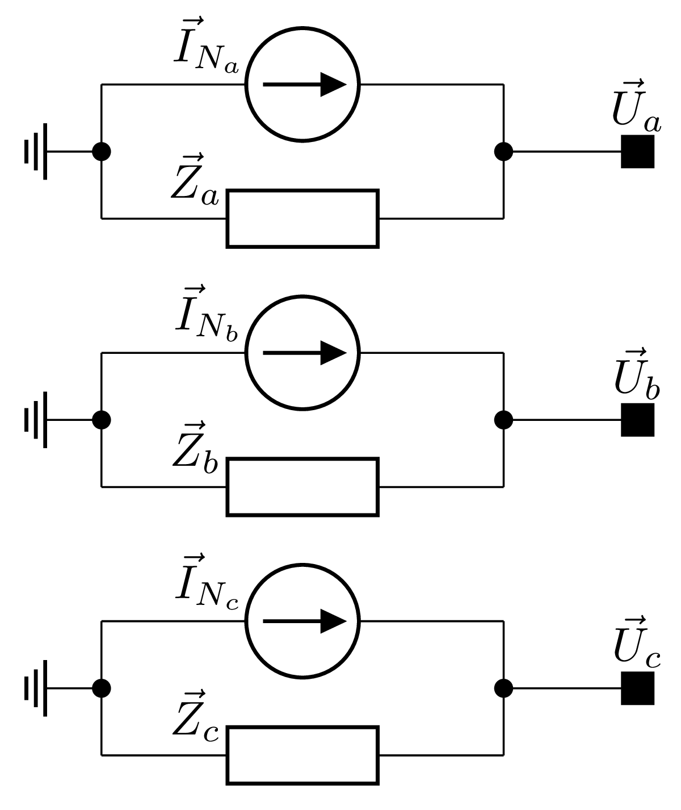

# ⚡ Short-Circuit

Short-circuit current calculations are essential for the safe and reliable operation of power systems. They ensure that
equipment such as circuit breakers, transformers, and grounding systems can withstand fault conditions, and they guide
the correct setting of protection relays. These studies are performed during system design and periodically updated
to account for network changes, equipment ageing, and new loads.

Faults can occur between phases or between phases and earth, with the three-phase fault being the only balanced type.
Most faults are unbalanced and can evolve during the fault period, for example, a single-phase-to-earth fault becoming
a two-phase-to-earth fault. In overhead line systems, about 90% of faults occur on the lines, 70% of which are
phase-to-ground. Weather events such as lightning, wind, ice, and salt pollution are the main causes, followed by
equipment failures and human error.

## Short-Circuit in the Phase Reference Frame

In VeraGrid, modelling the network directly in the phase reference frame allows short-circuit faults of any type to be
simulated by adding a fault impedance at the desired bus. This avoids sequence transformations and provides voltage and
current results directly in their real phase values, simplifying both setup and analysis.

### Linearisation

The first step in performing the short-circuit calculation is to determine the state of the network prior to the fault.
To achieve this, VeraGrid will perform the three-phase power flow calculation, which has been developed to determine
the voltage at each bus before the fault $\vec{U}_{pf}$. This initial step will also provide the other electrical
magnitudes of the system, such as the admittance matrix of the branches $\vec{Y}_b$, the power $\vec{S}_0$,
current $\vec{I}_0$, and admittance $\vec{Y}_0$ matrices of the loads or shunt elements, and the complex power vector
for each bus $\vec{S}_{pf}$.

Once the power flow calculation has been performed and the necessary results obtained, the second step is to linearise
the entire system, that is, to convert all power and current injections to their equivalent admittance values.
This way, the system can be solved simply by applying Ohm's law, without the need for any iterative algorithms like
Newton-Raphson.

The admittance of the branches, $\vec{Y}_b$, is already known, as well as that of the loads defined as constant
admittance, $\vec{Y}_0$. However, the loads defined as constant power must be converted by dividing by the square of
the voltage vector's magnitude:

$$
\vec{Y}_{0_S} = \dfrac{\vec{S}_0^*}{U_{pf}^2}
$$

The loads defined as constant current must also be converted to their equivalent admittance by dividing by the voltage
vector:

$$
\vec{Y}_{0_I} = \dfrac{\vec{I}_0}{\vec{U}_{pf}}
$$

Therefore, the sum of these three admittances will make up the admittance matrix of the loads:

$$
\vec{Y}_{\text{loads}} = \vec{Y}_0 + \vec{Y}_{0_S} + \vec{Y}_{0_I}
$$

In the unbalanced three-phase power flow simulation, the generators had been modelled as simple power injections into
the system, which was completely valid. However, this is not sufficient when performing the short-circuit analysis, as
the impedance of the generator must also be taken into account. VeraGrid has been programmed to accept a $3 \times 3$
impedance matrix, which includes both the self and mutual impedances between the $abc$ phases. Furthermore, it is
common to encounter generator impedances in the sequence domain. Therefore, Fortescue’s theorem must be applied to
obtain the equivalent values for the three phases:

$$
\vec{Z}_{gen_{abc}} =
\begin{bmatrix}
\vec{Z}_0 + \vec{Z}_1 + \vec{Z}_2 & \vec{Z}_0 + \vec{a}\vec{Z}_1 + \vec{a}^2\vec{Z}_2 & \vec{Z}_0 + \vec{a}^2\vec{Z}_1 + \vec{a}\vec{Z}_2 \\
\vec{Z}_0 + \vec{a}^2\vec{Z}_1 + \vec{a}\vec{Z}_2 & \vec{Z}_0 + \vec{Z}_1 + \vec{Z}_2 & \vec{Z}_0 + \vec{a}\vec{Z}_1 + \vec{a}^2\vec{Z}_2 \\
\vec{Z}_0 + \vec{a}\vec{Z}_1 + \vec{a}^2\vec{Z}_2 & \vec{Z}_0 + \vec{a}^2\vec{Z}_1 + \vec{a}\vec{Z}_2 & \vec{Z}_0 + \vec{Z}_1 + \vec{Z}_2
\end{bmatrix}
$$

Where the transformation eigenvector $\vec{a} = e^{j2\pi/3}$ is used. Then, the impedance matrix is linearly inverted 
to finally find the admittance of the generators:

$$
\vec{Y}_{\text{gen}} = \dfrac{1}{\vec{Z}_{\text{gen}}}
$$

Finally, the only remaining admittance to be obtained is that of the fault itself. For instance, in the case of a
phase-to-earth fault, this impedance must be connected between the affected phase and earth. This fault impedance
$\vec{Z}_{f}$ shall be specified by the VeraGrid user on the bus on which the short-circuit is to be simulated, as well
as the short-circuit type and the affected phases. Again, this impedance will be inverted to obtain the fault admittance:

$$
\vec{Y}_{f} = \dfrac{1}{\vec{Z}_{f}}
$$

Thus, the total linearised admittance will be equal to the sum of the admittance of the branches, the loads, the
generators, and the fault admittance:

$$
\vec{Y}_{\text{linear}} = \vec{Y}_b + \vec{Y}_{\text{loads}} + \vec{Y}_{\text{gen}} + \vec{Y}_{f}
$$

### Induced Electromotive Force

Another key parameter that must be transferred from the power flow to the short-circuit analysis is the induced
electromotive force (EMF) in the generators, $\vec{E}$, as this is the only voltage that will not change during the
fault. The electromotive force depends on the flux induced in the machine's rotor, and therefore on the excitation
current. It can be assumed that the internal voltage $\vec{E}$ of the generator remains constant during the duration
of the fault. The generator could be modelled during the short-circuit using the classic Thévenin equivalent, that is,
as an ideal voltage source in series with the generator’s impedance, as shown in the electrical circuit of figure bellow:

<div style="text-align: center;">
    
</div>

This circuit allows us to obtain the value of the induced electromotive force, given the voltage $\vec{U}_{pf}$ and
power $\vec{S}_{pf}$ before the fault at the generator’s output bus:

$$
\vec{E} = \vec{U}_{pf} + \vec{Z}_{\text{gen}} \cdot \vec{I}_{pf} = \vec{U}_{pf} + \dfrac{\vec{S}_{pf}^*}{\vec{Y}_{\text{gen}} \cdot \vec{U}_{pf}^*}
$$

### Norton Current and Short-Circuit Voltage

However, this would require to add a fictitious bus into the original system between the generator’s impedance and the
ideal voltage source. This presents a significant challenge because both the values of the power flow voltage vector
$\vec{U}_{pf}$ and the already linearised admittance matrix $\vec{Y}_{\text{linear}}$ are referenced by bus, and all
these connections would be more difficult to handle. Therefore, the generator is modelled using its Norton equivalent,
that is, an ideal current source in parallel with the generator’s impedance, as shown in the following schematic:

<div style="text-align: center;">
    
</div>

The Norton current source will take the value of the internal voltage multiplied by its admittance:

$$
\vec{I}_{N} = \vec{Y}_{\text{gen}} \cdot \ \vec{E}
$$

This Norton current vector will be of size $n$ buses, but only the nodes with a connected generator will have these
founded values, while the rest will simply have a value of zero. Finally, this current vector $\vec{I}_{N}$ will be
multiplied by the inverse of the linearised admittance matrix $\vec{Y}_{\text{linear}}$ of size $n \times n$,
resulting in the short-circuit voltage vector for the different buses:

$$
\vec{U}_{sc} = \vec{Y}_{\text{linear}}^{-1} \cdot \vec{I}_{N}
$$

### Single Line-to-Ground Fault (SLG)

A single line-to-ground fault (SLG) occurs when one phase conductor accidentally makes contact with the ground.
It is illustrated in the figure bellow for phase a, and the corresponding fault admittance matrix is given by:

$$
\vec{Y}_{f} =
\begin{bmatrix}
    \vec{Y}_{f}^a & 0 & 0 \\
    0 & 0 & 0 \\
    0 & 0 & 0 \\
\end{bmatrix}
$$

<div style="text-align: center;">
    
</div>

```python
import VeraGridEngine.api as gce
from VeraGridEngine.enumerations import FaultType, MethodShortCircuit, PhasesShortCircuit

sc_options = gce.ShortCircuitOptions(bus_index=4,
                                     fault_type=FaultType.LG,
                                     method=MethodShortCircuit.phases,
                                     phases=PhasesShortCircuit.a)
```

### Line-to-Line Fault (LL)

A line-to-line fault (LL) occurs when two phase conductors come into contact with each other.
The following figure shows the fault between phases c and a, and the corresponding fault admittance matrix is given by:

$$
\vec{Y}_{f} =
\begin{bmatrix}
    \vec{Y}_{f}^{ca} & 0 & -\vec{Y}_{f}^{ca} \\
    0 & 0 & 0 \\
    -\vec{Y}_{f}^{ca} & 0 & \vec{Y}_{f}^{ca} \\
\end{bmatrix}
$$

<div style="text-align: center;">
    
</div>

```python
import VeraGridEngine.api as gce
from VeraGridEngine.enumerations import FaultType, MethodShortCircuit, PhasesShortCircuit

sc_options = gce.ShortCircuitOptions(bus_index=4,
                                     fault_type=FaultType.LL,
                                     method=MethodShortCircuit.phases,
                                     phases=PhasesShortCircuit.ca)
```

### Double Line-to-Ground Fault (DLG)

A double line-to-ground fault (DLG) occurs when two phase conductors simultaneously make contact with the ground.
The following figure illustrates the fault involving phases c and a, and the corresponding fault admittance matrix
is given by:

$$
\vec{Y}_{f} =
\begin{bmatrix}
    \vec{Y}_{f}^a & 0 & 0 \\
    0 & 0 & 0 \\
    0 & 0 & \vec{Y}_{f}^c \\
\end{bmatrix}
$$

<div style="text-align: center;">
    
</div>

```python
import VeraGridEngine.api as gce
from VeraGridEngine.enumerations import FaultType, MethodShortCircuit, PhasesShortCircuit

sc_options = gce.ShortCircuitOptions(bus_index=4,
                                     fault_type=FaultType.LLG,
                                     method=MethodShortCircuit.phases,
                                     phases=PhasesShortCircuit.ca)
```

### Three-Phase Fault (LLL)

A three-phase (LLL) fault occurs when all three phase conductors come into contact with each other.
The following figure shows the fault between phases a, b, and c, and the corresponding fault admittance matrix is given by:

$$
\vec{Y}_{f} =
\begin{bmatrix}
    \vec{Y}_{f}^{ab} + \vec{Y}_{f}^{ca} & -\vec{Y}_{f}^{ab} & -\vec{Y}_{f}^{ca} \\
    -\vec{Y}_{f}^{ab} & \vec{Y}_{f}^{ab} + \vec{Y}_{f}^{bc} & -\vec{Y}_{f}^{bc} \\
    -\vec{Y}_{f}^{ca} & -\vec{Y}_{f}^{bc} & \vec{Y}_{f}^{bc} + \vec{Y}_{f}^{ca} \\
\end{bmatrix}
$$

<div style="text-align: center;">
    
</div>

```python
import VeraGridEngine.api as gce
from VeraGridEngine.enumerations import FaultType, MethodShortCircuit, PhasesShortCircuit

sc_options = gce.ShortCircuitOptions(bus_index=4,
                                     fault_type=FaultType.LLL,
                                     method=MethodShortCircuit.phases,
                                     phases=PhasesShortCircuit.abc)
```

### Three-Phase-to-Ground Fault (LLLG)

A three-phase-to-ground (LLLG) fault occurs when all three-phase conductors come into simultaneous contact with the
ground. The following figure illustrates the fault involving phases a, b, and c, and the corresponding fault admittance
matrix is given by:

$$
\vec{Y}_{f} =
\begin{bmatrix}
    \vec{Y}_{f}^a & 0 & 0 \\
    0 & \vec{Y}_{f}^b & 0 \\
    0 & 0 & \vec{Y}_{f}^c \\
\end{bmatrix}
$$

<div style="text-align: center;">
    
</div>

```python
import VeraGridEngine.api as gce
from VeraGridEngine.enumerations import FaultType, MethodShortCircuit, PhasesShortCircuit

sc_options = gce.ShortCircuitOptions(bus_index=4,
                                     fault_type=FaultType.ph3,
                                     method=MethodShortCircuit.phases,
                                     phases=PhasesShortCircuit.abc)
```

### Benchmark - SLG Fault in the IEEE 13 Node Test Feeder

The short-circuit calculation method can be tested using the 13-bus test network, which was already constructed for
the power flow. As shown in the schematic of the figure bellow, a fault will be simulated on phase \textit{a} to earth
at bus 634 with two fault impedance values.

<div style="text-align: center;">
    
</div>

A generator has been added to bus 632, providing an equivalent power to the network to which the system was connected.
The sequence impedance values for the generator are $Z_1 = 0.004 + 0.5j$ p.u. for the positive sequence,
$Z_2 = 0.02 + 0.5j$ p.u. for the negative sequence, and $Z_0 = 0.01 + 0.08j$ p.u. for the zero sequence.

```python
import VeraGridEngine.api as gce
from VeraGridEngine import WindingType, ShuntConnectionType
import numpy as np
from VeraGridEngine.enumerations import FaultType, MethodShortCircuit, PhasesShortCircuit

logger = gce.Logger()

grid = gce.MultiCircuit()
grid.fBase = 60

# ----------------------------------------------------------------------------------------------------------------------
# Buses
# ----------------------------------------------------------------------------------------------------------------------
bus_632 = gce.Bus(name='632', Vnom=4.16, xpos=0, ypos=0)
bus_632.is_slack = True
grid.add_bus(obj=bus_632)
gen = gce.Generator(vset=1.0, r1=0.004, x1=0.5, r2=0.02, x2=0.5, r0=0.01, x0=0.08)
grid.add_generator(bus=bus_632, api_obj=gen)

bus_645 = gce.Bus(name='645', Vnom=4.16, xpos=-100 * 5, ypos=0)
grid.add_bus(obj=bus_645)

bus_646 = gce.Bus(name='646', Vnom=4.16, xpos=-200 * 5, ypos=0)
grid.add_bus(obj=bus_646)

bus_633 = gce.Bus(name='633', Vnom=4.16, xpos=100 * 5, ypos=0)
grid.add_bus(obj=bus_633)

# Affected Bus 634 -----------------------------------------------------------------------------------------------------
bus_634 = gce.Bus(name='634', Vnom=0.48, xpos=200 * 5, ypos=0, r_fault=0.1)
grid.add_bus(obj=bus_634)
# ----------------------------------------------------------------------------------------------------------------------

bus_671 = gce.Bus(name='671', Vnom=4.16, xpos=0, ypos=100 * 5)
grid.add_bus(obj=bus_671)

bus_684 = gce.Bus(name='684', Vnom=4.16, xpos=-100 * 5, ypos=100 * 5)
grid.add_bus(obj=bus_684)

bus_611 = gce.Bus(name='611', Vnom=4.16, xpos=-200 * 5, ypos=100 * 5)
grid.add_bus(obj=bus_611)

bus_675 = gce.Bus(name='675', Vnom=4.16, xpos=200 * 5, ypos=100 * 5)
grid.add_bus(obj=bus_675)

bus_680 = gce.Bus(name='680', Vnom=4.16, xpos=0, ypos=200 * 5)
grid.add_bus(obj=bus_680)

bus_652 = gce.Bus(name='652', Vnom=4.16, xpos=-100 * 5, ypos=200 * 5)
grid.add_bus(obj=bus_652)

# ----------------------------------------------------------------------------------------------------------------------
# Impedances [Ohm/km]
# ----------------------------------------------------------------------------------------------------------------------
z_601 = np.array([
    [0.3465 + 1j * 1.0179, 0.1560 + 1j * 0.5017, 0.1580 + 1j * 0.4236],
    [0.1560 + 1j * 0.5017, 0.3375 + 1j * 1.0478, 0.1535 + 1j * 0.3849],
    [0.1580 + 1j * 0.4236, 0.1535 + 1j * 0.3849, 0.3414 + 1j * 1.0348]
], dtype=complex) / 1.60934

z_602 = np.array([
    [0.7526 + 1j * 1.1814, 0.1580 + 1j * 0.4236, 0.1560 + 1j * 0.5017],
    [0.1580 + 1j * 0.4236, 0.7475 + 1j * 1.1983, 0.1535 + 1j * 0.3849],
    [0.1560 + 1j * 0.5017, 0.1535 + 1j * 0.3849, 0.7436 + 1j * 1.2112]
], dtype=complex) / 1.60934

z_603 = np.array([
    [1.3294 + 1j * 1.3471, 0.2066 + 1j * 0.4591],
    [0.2066 + 1j * 0.4591, 1.3238 + 1j * 1.3569]
], dtype=complex) / 1.60934

z_604 = np.array([
    [1.3238 + 1j * 1.3569, 0.2066 + 1j * 0.4591],
    [0.2066 + 1j * 0.4591, 1.3294 + 1j * 1.3471]
], dtype=complex) / 1.60934

z_605 = np.array([
    [1.3292 + 1j * 1.3475]
], dtype=complex) / 1.60934

z_606 = np.array([
    [0.7982 + 1j * 0.4463, 0.3192 + 1j * 0.0328, 0.2849 + 1j * -0.0143],
    [0.3192 + 1j * 0.0328, 0.7891 + 1j * 0.4041, 0.3192 + 1j * 0.0328],
    [0.2849 + 1j * -0.0143, 0.3192 + 1j * 0.0328, 0.7982 + 1j * 0.4463]
], dtype=complex) / 1.60934

z_607 = np.array([
    [1.3425 + 1j * 0.5124]
], dtype=complex) / 1.60934

# ----------------------------------------------------------------------------------------------------------------------
# Admittances [S/km]
# ----------------------------------------------------------------------------------------------------------------------
y_601 = np.array([
    [1j * 6.2998, 1j * -1.9958, 1j * -1.2595],
    [1j * -1.9958, 1j * 5.9597, 1j * -0.7417],
    [1j * -1.2595, 1j * -0.7417, 1j * 5.6386]
], dtype=complex) / 10 ** 6 / 1.60934

y_602 = np.array([
    [1j * 5.6990, 1j * -1.0817, 1j * -1.6905],
    [1j * -1.0817, 1j * 5.1795, 1j * -0.6588],
    [1j * -1.6905, 1j * -0.6588, 1j * 5.4246]
], dtype=complex) / 10 ** 6 / 1.60934

y_603 = np.array([
    [1j * 4.7097, 1j * -0.8999],
    [1j * -0.8999, 1j * 4.6658]
], dtype=complex) / 10 ** 6 / 1.60934

y_604 = np.array([
    [1j * 4.6658, 1j * -0.8999],
    [1j * -0.8999, 1j * 4.7097]
], dtype=complex) / 10 ** 6 / 1.60934

y_605 = np.array([
    [1j * 4.5193]
], dtype=complex) / 10 ** 6 / 1.60934

y_606 = np.array([
    [1j * 96.8897, 1j * 0.0000, 1j * 0.0000],
    [1j * 0.0000, 1j * 96.8897, 1j * 0.0000],
    [1j * 0.0000, 1j * 0.0000, 1j * 96.8897]
], dtype=complex) / 10 ** 6 / 1.60934

y_607 = np.array([
    [1j * 88.9912]
], dtype=complex) / 10 ** 6 / 1.60934

# ----------------------------------------------------------------------------------------------------------------------
# Loads
# ----------------------------------------------------------------------------------------------------------------------
load_634 = gce.Load(P1=0.160,
                    Q1=0.110,
                    P2=0.120,
                    Q2=0.090,
                    P3=0.120,
                    Q3=0.090)
load_634.conn = ShuntConnectionType.GroundedStar
grid.add_load(bus=bus_634, api_obj=load_634)

load_645 = gce.Load(P1=0.0,
                    Q1=0.0,
                    P2=0.170,
                    Q2=0.125,
                    P3=0.0,
                    Q3=0.0)
load_645.conn = ShuntConnectionType.GroundedStar
grid.add_load(bus=bus_645, api_obj=load_645)

load_646 = gce.Load(G1=0.0,
                    B1=0.0,
                    G2=0.230,
                    B2=-0.132,
                    G3=0.0,
                    B3=0.0)
load_646.conn = ShuntConnectionType.Delta
grid.add_load(bus=bus_646, api_obj=load_646)

load_652 = gce.Load(G1=0.128,
                    B1=-0.086,
                    G2=0.0,
                    B2=0.0,
                    G3=0.0,
                    B3=0.0)
load_652.conn = ShuntConnectionType.GroundedStar
grid.add_load(bus=bus_652, api_obj=load_652)

load_671 = gce.Load(P1=0.385,
                    Q1=0.220,
                    P2=0.385,
                    Q2=0.220,
                    P3=0.385,
                    Q3=0.220)
load_671.conn = ShuntConnectionType.Delta
grid.add_load(bus=bus_671, api_obj=load_671)

load_675 = gce.Load(P1=0.485,
                    Q1=0.190,
                    P2=0.068,
                    Q2=0.060,
                    P3=0.290,
                    Q3=0.212)
load_675.conn = ShuntConnectionType.GroundedStar
grid.add_load(bus=bus_675, api_obj=load_675)

load_671_692 = gce.Load(Ir1=0.0,
                        Ii1=0.0,
                        Ir2=0.0,
                        Ii2=0.0,
                        Ir3=0.170,
                        Ii3=0.151)
load_671_692.conn = ShuntConnectionType.Delta
grid.add_load(bus=bus_671, api_obj=load_671_692)

load_611 = gce.Load(Ir1=0.0,
                    Ii1=0.0,
                    Ir2=0.0,
                    Ii2=0.0,
                    Ir3=0.170,
                    Ii3=0.080)
load_611.conn = ShuntConnectionType.GroundedStar
grid.add_load(bus=bus_611, api_obj=load_611)

load_632_distrib = gce.Load(P1=0.017 / 2,
                            Q1=0.010 / 2,
                            P2=0.066 / 2,
                            Q2=0.038 / 2,
                            P3=0.117 / 2,
                            Q3=0.068 / 2)
load_632_distrib.conn = ShuntConnectionType.GroundedStar
grid.add_load(bus=bus_632, api_obj=load_632_distrib)

load_671_distrib = gce.Load(P1=0.017 / 2,
                            Q1=0.010 / 2,
                            P2=0.066 / 2,
                            Q2=0.038 / 2,
                            P3=0.117 / 2,
                            Q3=0.068 / 2)
load_671_distrib.conn = ShuntConnectionType.GroundedStar
grid.add_load(bus=bus_671, api_obj=load_671_distrib)

# ----------------------------------------------------------------------------------------------------------------------
# Capacitors
# ----------------------------------------------------------------------------------------------------------------------
cap_675 = gce.Shunt(B1=0.2,
                    B2=0.2,
                    B3=0.2)
cap_675.conn = ShuntConnectionType.GroundedStar
grid.add_shunt(bus=bus_675, api_obj=cap_675)

cap_611 = gce.Shunt(B1=0.0,
                    B2=0.0,
                    B3=0.1)
cap_611.conn = ShuntConnectionType.GroundedStar
grid.add_shunt(bus=bus_611, api_obj=cap_611)

# ----------------------------------------------------------------------------------------------------------------------
# Line Configurations
# ----------------------------------------------------------------------------------------------------------------------
config_601 = gce.create_known_abc_overhead_template(name='Config. 601',
                                                    z_abc=z_601,
                                                    ysh_abc=y_601,
                                                    phases=np.array([1, 2, 3]),
                                                    Vnom=4.16,
                                                    frequency=60)
grid.add_overhead_line(config_601)

config_602 = gce.create_known_abc_overhead_template(name='Config. 602',
                                                    z_abc=z_602,
                                                    ysh_abc=y_602,
                                                    phases=np.array([1, 2, 3]),
                                                    Vnom=4.16,
                                                    frequency=60)
grid.add_overhead_line(config_602)

config_603 = gce.create_known_abc_overhead_template(name='Config. 603',
                                                    z_abc=z_603,
                                                    ysh_abc=y_603,
                                                    phases=np.array([2, 3]),
                                                    Vnom=4.16,
                                                    frequency=60)
grid.add_overhead_line(config_603)

config_604 = gce.create_known_abc_overhead_template(name='Config. 604',
                                                    z_abc=z_604,
                                                    ysh_abc=y_604,
                                                    phases=np.array([1, 3]),
                                                    Vnom=4.16,
                                                    frequency=60)
grid.add_overhead_line(config_604)

config_605 = gce.create_known_abc_overhead_template(name='Config. 605',
                                                    z_abc=z_605,
                                                    ysh_abc=y_605,
                                                    phases=np.array([3]),
                                                    Vnom=4.16,
                                                    frequency=60)
grid.add_overhead_line(config_605)

config_606 = gce.create_known_abc_overhead_template(name='Config. 606',
                                                    z_abc=z_606,
                                                    ysh_abc=y_606,
                                                    phases=np.array([1, 2, 3]),
                                                    Vnom=4.16,
                                                    frequency=60)
grid.add_overhead_line(config_606)

config_607 = gce.create_known_abc_overhead_template(name='Config. 607',
                                                    z_abc=z_607,
                                                    ysh_abc=y_607,
                                                    phases=np.array([1]),
                                                    Vnom=4.16,
                                                    frequency=60)
grid.add_overhead_line(config_607)

# ----------------------------------------------------------------------------------------------------------------------
# Lines and Transformers
# ----------------------------------------------------------------------------------------------------------------------
line_632_645 = gce.Line(bus_from=bus_632,
                        bus_to=bus_645,
                        length=500 * 0.0003048)
line_632_645.apply_template(config_603, grid.Sbase, grid.fBase, logger)
grid.add_line(obj=line_632_645)

line_645_646 = gce.Line(bus_from=bus_645,
                        bus_to=bus_646,
                        length=300 * 0.0003048)
line_645_646.apply_template(config_603, grid.Sbase, grid.fBase, logger)
grid.add_line(obj=line_645_646)

line_632_633 = gce.Line(bus_from=bus_632,
                        bus_to=bus_633,
                        length=500 * 0.0003048)
line_632_633.apply_template(config_602, grid.Sbase, grid.fBase, logger)
grid.add_line(obj=line_632_633)

XFM_1 = gce.Transformer2W(name='XFM-1',
                          bus_from=bus_633,
                          bus_to=bus_634,
                          HV=4.16,
                          LV=0.48,
                          nominal_power=0.5,
                          rate=0.5,
                          r=1.1 * 2,
                          x=2 * 2)
XFM_1.conn_f = WindingType.GroundedStar
XFM_1.conn_t = WindingType.GroundedStar
grid.add_transformer2w(XFM_1)

line_632_671 = gce.Line(bus_from=bus_632,
                        bus_to=bus_671,
                        length=2000 * 0.0003048)
line_632_671.apply_template(config_601, grid.Sbase, grid.fBase, logger)
grid.add_line(obj=line_632_671)

line_671_684 = gce.Line(bus_from=bus_671,
                        bus_to=bus_684,
                        length=300 * 0.0003048)
line_671_684.apply_template(config_604, grid.Sbase, grid.fBase, logger)
grid.add_line(obj=line_671_684)

line_684_611 = gce.Line(bus_from=bus_684,
                        bus_to=bus_611,
                        length=300 * 0.0003048)
line_684_611.apply_template(config_605, grid.Sbase, grid.fBase, logger)
grid.add_line(obj=line_684_611)

line_671_675 = gce.Line(bus_from=bus_671,
                        bus_to=bus_675,
                        length=500 * 0.0003048)
line_671_675.apply_template(config_606, grid.Sbase, grid.fBase, logger)
grid.add_line(obj=line_671_675)

line_684_652 = gce.Line(bus_from=bus_684,
                        bus_to=bus_652,
                        length=800 * 0.0003048)
line_684_652.apply_template(config_607, grid.Sbase, grid.fBase, logger)
grid.add_line(obj=line_684_652)

line_671_680 = gce.Line(bus_from=bus_671,
                        bus_to=bus_680,
                        length=1000 * 0.0003048)
line_671_680.apply_template(config_601, grid.Sbase, grid.fBase, logger)
grid.add_line(obj=line_671_680)

# ----------------------------------------------------------------------------------------------------------------------
# Run power flow
# ----------------------------------------------------------------------------------------------------------------------
res_pf = gce.power_flow(grid=grid, options=gce.PowerFlowOptions(three_phase_unbalanced=True))

# ----------------------------------------------------------------------------------------------------------------------
# Short-circuit
# ----------------------------------------------------------------------------------------------------------------------
sc_options = gce.ShortCircuitOptions(bus_index=4,
                                     fault_type=FaultType.LG,
                                     method=MethodShortCircuit.phases,
                                     phases=PhasesShortCircuit.a)

sc_driver = gce.ShortCircuitDriver(grid=grid,
                                   options=sc_options,
                                   pf_options=gce.PowerFlowOptions(three_phase_unbalanced=True),
                                   pf_results=res_pf)
sc_driver.run()

res_sc = sc_driver.results
print(res_sc.get_voltage_3ph_df())
```

The following figure shows the VeraGrid results for the voltage magnitude across the various system buses in the faulted
phase a. As expected, there is a sharp voltage drop at the affected bus (634), as well as a significant reduction at
the bus immediately upstream of the fault (633), which becomes more pronounced as the fault resistance decreases.

<div style="text-align: center;">
    
</div>

On the other hand, the following figures present the voltage profiles for the healthy phases b and c.
A slight voltage rise can be observed at the most affected buses (634 and 633), while the voltage decreases across the
remaining buses in the network.

<div style="text-align: center;">
    
</div>

<div style="text-align: center;">
    
</div>

## Short-Circuit in the Sequence Components

VeraGrid has also unbalanced short-circuit calculations in the sequence and rectangular components.

### API

 Now let's run a line-ground short circuit in the third bus of
the South island of New Zealand grid example from reference book
Computer Analysis of Power Systems by J. Arrillaga and C.P. Arnold.

```python
import os
import VeraGridEngine as gce

folder = os.path.join('..', 'Grids_and_profiles', 'grids')
fname = os.path.join(folder, 'South Island of New Zealand.veragrid')

grid = gce.open_file(filename=fname)

# Define fault index explicitly
fault_index = 2

# Run a Line-Ground short circuit on the bus at index 2
# Since we do not provide any power flow results, it will run one for us
results = gce.short_circuit(grid, fault_index, fault_type=gce.FaultType.LG)

print("Short circuit power: ", results.SCpower[fault_index])
```

A more elaborated way to run the simulation, controlling all the steps:

```python
import os
import VeraGridEngine as gce

folder = os.path.join('..', 'Grids_and_profiles', 'grids')
fname = os.path.join(folder, 'South Island of New Zealand.veragrid')

grid = gce.open_file(filename=fname)

pf_options = gce.PowerFlowOptions()
pf = gce.PowerFlowDriver(grid, pf_options)
pf.run()

fault_index = 2
sc_options = gce.ShortCircuitOptions(bus_index=fault_index,
                                     fault_type=gce.FaultType.LG)

sc = gce.ShortCircuitDriver(grid, options=sc_options,
                            pf_options=pf_options,
                            pf_results=pf.results)
sc.run()

print("Short circuit power: ", sc.results.SCpower[fault_index])
```

Output:

```text
Short circuit power:  -217.00 MW - 680.35j MVAr
```

Sequence voltage, currents and powers are also available.

### Theory


### 3-Phase Short Circuit

First, declare an array of zeros of size equal to the number of nodes in the
circuit.

$$
    \textbf{I} = \{0, 0, 0, 0, ..., 0\}
$$

Then for single bus failure, compute the short circuit current at the selected bus $i$ and assign
that value in the $i^{th}$ position of the array $\textbf{I}$.

$$
    \textbf{I}_i = - \frac{\textbf{V}_{pre-failure, i}}{\textbf{Z}_{i, i} + z_f}
$$

Then, compute the voltage increment for all the circuit nodes as:

$$
    \Delta \textbf{V} = \textbf{Z} \times \textbf{I}
$$

Finally, define the voltage at all the nodes as:

$$
    \textbf{V}_{post-failure} = \textbf{V}_{pre-failure} + \Delta \textbf{V}
$$


- $\textbf{I}$: Array of fault currents at the system nodes.
- $\textbf{I}_B$: Subarray of $\textbf{I}$ such that all entries for non-selected buses are removed.
- $\textbf{V}_{pre-failure}$: Array of system voltages prior to the failure. This is obtained from the power flow study.
- $\textbf{V}_{pre-failure, B}$: Subarray of $\textbf{V}_{pre-failure}$ such that all entries for non-selected buses are removed.
- $z_f$: Impedance of the failure itself. This is a given value, although you can set it to zero if you don't know.
- $\textbf{z}_{f, B}$: Impedance of the failures of selected buses $B$.
- $\textbf{Z}$: system impedance matrix. Obtained as the inverse of the complete system admittance matrix.
- $\textbf{Z}_B$: submatrix of $\textbf{Z}$ such that all rows and columns for non-selected buses are removed.
