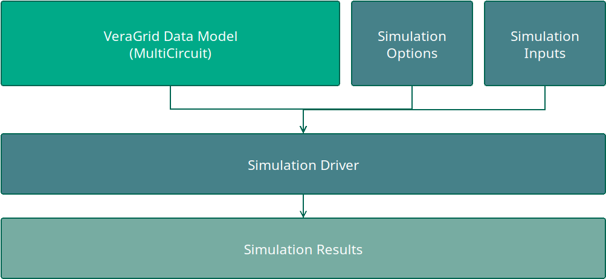
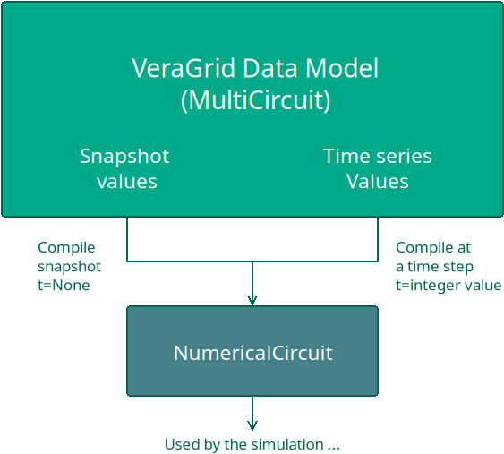

# 🌁 Structure of VeraGrid

VeraGrid is arranged in three packages: 

- VeraGridEngine: A package with the database and calculations logic.
- VeraGridServer: A package that serves an API-rest to use VeraGridEngine remotely.
- VeraGrid: A package that contains the Graphical User Interface (GUI) and operates with `VeraGridEngine` and
  `VeraGridServer` seamlessly.


The information in VeraGrid is stored in objects, arranged in a database (`MultiCircuit`) that gets compiled into
simpler  structures (`NumericalCircuit`) that contains arrays ready for calculation.
All simulations in VeraGridEngine are managed by simulation "drivers". The structure is as follows:



Any driver is fed with the data model (`MultiCircuit` object), the respective driver options, and often another
object relative to specific inputs for that driver. The driver is run, storing the driver results object.
Although this may seem overly complicated, it has proven to be maintainable and very convenient.


## Snapshot vs. time series

VeraGrid has a dual structure to handle legacy cases (snapshot), as well as cases with many variations (time series)

- A **snapshot** is the grid for a particular moment in time.
  This includes the infrastructure plus the variable values of that infrastructure
  such as the load, the generation, the rating, etc.

- The **time series** record the variations of the magnitudes that can vary. These are applied along with
  the infrastructure definition.

In VeraGrid, the inputs do not get modified by the simulation results. This very important concept, helps
to maintain the independence of the inputs and outputs, allowing the replicability of the results.
This key feature is not true for other open-source of commercial programs.

A snapshot or any point of the time series, may be compiled to a `NumericalCircuit`. This object holds the
numerical arrays and matrices of a time step, ready for the numerical methods.
For those simulations that require many time steps, a collection of `NumericalCircuit` is compiled and used.



It may seem that this extra step is redundant. However, the compilation step is composed by mere copy operations,
which are fast. This steps benefits greatly the efficiency of the numerical calculations since the arrays are
aligned in memory. The VeraGrid data model is object-oriented, while the numerical circuit is array-oriented
(despite being packed into objects)


Over the years, we have observed that the number one thing that prevents the usage of VeraGrid
among power systems researchers is the usage of an object-oriented design. Incidentally,
this is exactly why people with formal programming background love it. This section
explains the design of VeraGrid departing from a table-based design which is how it started,
until reaching the multidimensional object-oriented design of today.

## From tables to objects: The entry level barrier

All of us have used a table based power system simulator during our formative years.
Usually, each table represents a type of object (Bus, branch, Load, Generator, ...)
This simplicity makes it straight forward to start working. The tables live directly
in the software library, and we don't need to think too much about it. We fill the tables,
run a power flow, and go back to the tables to see the results. Easy.

To continue with the simplicity, we see ourselves in the need to link tables with
each other; For instance, to Buses table with the Branches table we might think
using numerical indices is the easiest way:

Buses:


| I | Name  | V  |
|---|-------|----|
| 1 | Bus 1 | 10 |
| 2 | Bus 2 | 15 |
| 3 | Bus 3 | 45 |

Branches:

| F | T | Name     | Rate |
|---|---|----------|------|
| 1 | 2 | Line 1-2 | 30   |
| 1 | 3 | Line 1-3 | 35   |
| 2 | 3 | Line 2-3 | 20   |


It is very easy to construct these tables, and anyone could immediately get
into modifying them.


### Using Pandas as the main structure

In python, the Pandas library is synonymous with table. Hence, it is only natural
that when adopting a table based structure, one shall immediately think of pandas
to implement the structure. Furthermore, a dictionary of tables seems to be the
most flexible.

```python
{
  "buses": pd.DataFrame(...),
  "branches": pd.DataFrame(...),
  "loads": pd.DataFrame(...),
  "generators": pd.DataFrame(...),
  ...
}
```


VeraGrid started like this; Using tables with a simple indexing and using Pandas.
In the next sections we will show how these decisions are objectively harmful in
the long term.


    Design errors here:

    - Using numerical indices to identify elements.
    - Using a third party library as the center of your design.
    - Using dictionaries to store the data structures.
    - Using strings (or simply dynamic properties) to define the properties.


### Writing the results in the inputs


All these table-based power system software write the results back in the inputs.
In informatics class back in school I was taught that functions messing the inputs
was of bad manners. After 20+ years, I'll add that it is also a great way to shoot
yourself in the foot. Lets examine why.

**Reason #1: Replicability**

Imagine you have a set of inputs in your nice tables. One of those inputs is the
voltage solution. After running the power flow, the voltage solution is overwritten
with the new one, seeding the next power flow in a different way. Hence, to replicate
the first power flow you'll have to reload the initial solution somehow. From disk?
Smelly.

**Reason #2: Expandability**

What if I want to run a power flow and then an optimal power flow. Will the OPF
smash my PF results? What if I want to store many results coming from a time series?
I already need to start thinking hard about that...

**Reason #3: Expensive parallelism**

What if I want to run that time series in parallel? If every parallel power flow
instance is going to write the results in the inputs, I get a good old data race.
To do it properly I'll have to take all my input tables and make a memory copy
per thread. Expensive.

>    Design errors here:
> - Not having a proper control of the results origin.
> - Changing the initial point of operation.
> - Making parallelism prohibitively expensive.

### Choosing the units

When designing what information should represent the devices, it is
only fair that we departure from the engineering design magnitudes. For instance,
it is logical and natural that we choose Ohms for the impedance and other nameplate
characteristics for the devices. However, when you go in the world and observe
the data available, most of it is available in the so-called per-unit system.

The per unit compatible system of units is the following:

- Active power: MW
- Reactive Power: MVAr
- Impedances: Per-unit in the system base (Sbase=100)
- Voltage: kV
- Current: kA

Why are these units compatible? Because roughly speaking, kV times kA is MVA.
And if you divide the MW by the impedances base, all clicks.

On the other hand, if we were representing the values in V, A, W and Ohm,
things would not match so easily, and we would require some calculations every time
we would like to run a simulation since numerical simulations require the
per-unit system. Furthermore, we discovered that using the compatible units
as input does not forbid to provide the design units trough extra functions or design focused parameters.
We can have the cake and eat it too.


```python
elm = Line(bus_from=bus1, bus_to=bus2, name="Line 1,
           r=resistance in per unit,
           x=reactance in per unit,
           b=shunt susceptance in per-unit,
           rate=rating in MVA)

# Now, we overwrite the values with new parameters
elm.fill_design_properties(
    r_ohm=resistance in ohms,
    x_ohm=reactance in ohms,
    c_nf=capacity in nano farads,
    length=length in km,
    Imax=maximum current in kA,
    freq=50,
    Sbase=100
)
```


We chose that the default data input be made using the per-unit compatible units because
of the legacy data. It is also way more efficient to do that since the only data
modification required is dividing the power by Sbase. 


>  Design errors here:
>  - Thinking there is no legacy data.
>  - Forcing yourself into expensive unit conversion pre-processing.


### The MultiCircuit

By VeraGrid v2 everything was migrated from tables to lists of objects living in
another object called the `MultiCircuit`. You may think of the `MultiCircuit as a database. 
The benefits of this were apparent pretty soon.

Compared to tables, now we are able to:

- Have easier CRUD (Create, Read, Update, Delete) management of the data. This is specially
  important since VeraGrid has an interactive user interface.
- Easier handling of the objects evolution over time; Yes code evolves!
- We could have objects within objects. In table terms, this would be equivalent to having a table inside a cell.
  For instance, it is natural to have a tap changer object inside the transformer object.
  Achieving that with a table is close to impossible.
- The use of objects allows to reference an object from another object.
  For instance a line will have pointers to the "from" and "to" buses that it connects.
- Because objects within objects are possible, we can store the profiles of properties within the object.
  In VeraGrid, the loads active power is P and P_prof is the property that stores the active power profile.
  That is far easier, cleaner, maintainable and extensible than having a P table with the profiles somewhere.
  It is however, less evident for people accustomed to tables.


>   Design errors avoided:
>   - The data management is easier, both for the user and the developer.
>   - Handling complex relationships is possible without tricks or bad practice.
>   - Time is a first class citizen, not an afterthought.
>   - References are maintained properly, as opposed to using number or other referencing method.


However, the MultiCircuit proposes another challenge; Traversing lists of objects for numerical
computations is very slow. Practice (and common sense) shows that all those papers claiming
object oriented power flows are nothing but a waste of computational power. What shall we do?


### The NumericalCircuit

In order to feed the numerical processes with arrays for very fast execution, we created
the `NumericalCircuit`. 
A NumericalCircuit is a snapshot of the MultiCircuit data for calculation at a particular time step.

There were many iterations of this design until reaching the current stage. We tried with structures with 2D arrays,
but those proved to be extremely hard to maintain and operate properly since the number of calculation 
nodes changes with time. So we settled for a collection of classes containing 1D arrays inside.

This allows for a number of amenities:

- We can decouple the inputs, while making them blazing fast for execution.
- We can have many of them decoupled from the inputs: Parallelism is trivial and safe.
- The numerical processes get what they need.
- We can tweak the numerical circuits how we need; For instance,
  we can split by island into more NumericalCircuits.
- Furthermore, we can modify the NumericalCircuit with topological processing effortlessly.


>    Design errors avoided:
>    - Effective decoupling of the inputs from the processes.
>    - Enables trivial parallelism.
>    - Enables topology processing without messing with the inputs.

The numerical circuit is constructed by what we call the compilation step:

```python
nc = compile_numerical_circuit_at(circuit=my_grid, t_idx=None)
```


### The Driver

A driver in VeraGrid is the central mechanism that orchestrates simulations.
There is a driver for each simulation type.
A Driver is responsible for preparing the inputs, executing the calculations, and providing
the necessary configurations to run a specific analysis. Think of the driver
as the engine of the process, where it takes the user's specifications, performs
the heavy lifting, and prepares the outputs for further use in a coherent manner.

This allows:

- Modularity: Each driver is tailored to a specific type of analysis (e.g., load flow,
  short-circuit analysis, contingency simulations). This modular design ensures that
  each driver is optimized for its task.

- Abstraction: The driver abstracts the complexity of the underlying calculations,
  allowing users to focus on configuring their analyses without worrying about the
  mathematical intricacies.

- Reusability: Drivers can be reused across multiple scenarios, reducing duplication
  of effort and enabling consistent workflows.

The Driver objects simplify simulation workflows by encapsulating all the steps needed to perform an analysis.
It ensures consistency and repeatability by standardizing how simulations are executed.
It makes the framework extensible, as new types of analyses can be introduced by
adding, combining or modifying drivers.

Each driver produces a result object;


### The Results object

The result object is the product of the execution of a driver. It captures and organizes the
the simulation outputs in a structured and accessible format (1D or 2D arrays).

Each result includes contextual metadata, such as simulation parameters, timestamps, or names,
making it easy to understand the origin and context of the results data.

It removes the limitations of traditional table-based outputs by allowing
users to explore and manipulate results programmatically.

It enhances clarity by organizing data in ways that reflect the
underlying network structure (e.g., by bus or branch).

It provides flexibility for advanced analyses, such as comparing results
across multiple scenarios or extracting specific performance metrics.
Furthermore, the results object provides a unified structure to access all results
in a coherent manner from the GUI, providing specialized functions where needed
like grouping per area or zone or special plots.


### Conclusion

Let's recapitulate the design mistakes avoided:

- Using numerical indices to identify elements.
- Using a third party library as the center of your design.
- Using dictionaries to store the data structures.
- Using strings (or simply dynamic properties) to define the properties.
- Not having a proper control of the results' origin.
- Changing the initial point of operation.
- Making parallelism prohibitively expensive or simply unsafe.
- Thinking there is no legacy data.
- Forcing yourself into expensive unit conversion pre-processing.

This is just an initial list, because there are plenty of design errors that 
come from using tables not as a storage means but as the software structure.

In order to avoid those design pitfalls, VeraGrid's internals have undergone
significant refactoring over the past decade. This iterative process
has been essential for ensuring the software's ability to evolve and incorporate
new features without compromising maintainability. By adhering to a principled
development approach, we can focus on delivering a robust and scalable solution
without cutting corners.

This commitment has allowed VeraGrid to grow from a humble beginning into a
professional-grade tool trusted by experts worldwide for critical real-world
applications—all while remaining open source.

And now you understand why it's not so simple.
