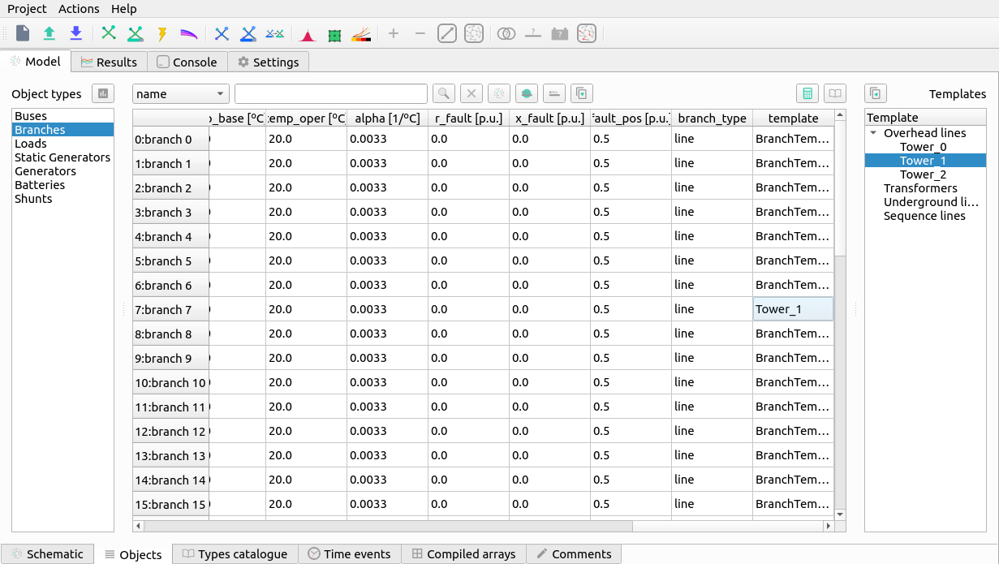
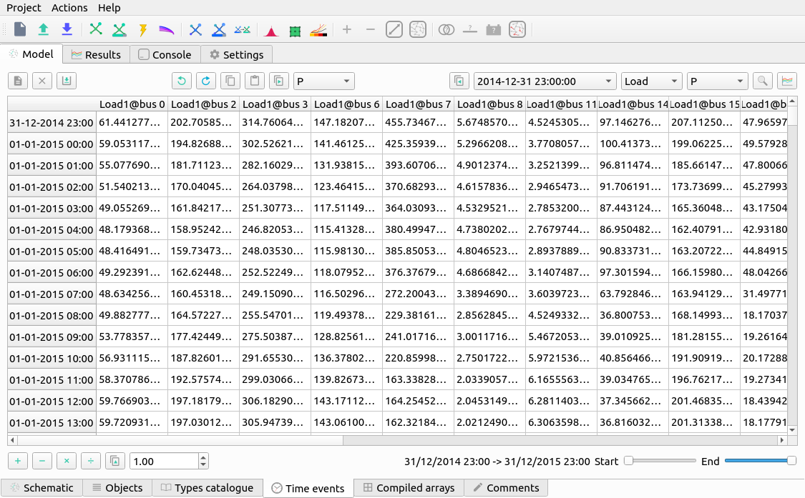

# 📊 User interface


The user interface of VeraGrid is written using the Qt graphical interface
framework. This allows VeraGrid to be multi-platform and to have sufficient
performance to handle thousands of graphical items in the editor, to be
responsive and plenty of other attributes of consumer software.

    
    VeraGrid user interface representing  a zoom of a ~600 node distribution grid.

The graphical user interface (GUI) makes extensive use of tooltip texts. These area yellow tags that appear
when you hover the mouse cursor over a button from the interface. The tooltip texts are meant to be explanatory
so that reading a manual is not really needed unless you need the technical details.
Nevertheless, this guide hopes to guide you through the GUI well enough so that the program is usable.

## Model view


The model view is where all the editing is done.


## Schematic editor


The schematic view is where you construct the grid in VeraGrid. The usage is quite simple:

- Drag & Drop the buses from the left upper side into the main panel.
- Click on a bus bar (black line) and drag the link into another bus bar, a branch will be created.

  - Branch types can be selected (branch, transformer, line, switch, reactance).
  - If you double-click a branch and the type is Line or Transformer, a simplified editor will pop up.

- To add loads, generators, shunts, etc... just right click on  bus and select from the context menu.

- The context menu from the buses allow plenty of operations such as view the bus profiles (extended
  is time series results are present) or setting a bus as a short circuit point.

The schematic objects are coloured based on the results of the latest simulation.


When more than one simulation is available (i.e. power flow and power flow time series)
the schematic editor is augmented with a bar that allows you to select the appropriate simulation colouring
of the grid. When the simulation has a time component, like time series or voltage collapse, the bar will
allow you to visualize each individual step of the simulation and navigate through them.


## Tabular editor

Sometimes is far more practical to edit the objects in bulk. For that, VeraGrid features the tabular view
of the objects. All the static properties of the objects can be edited here. For the properties with time series
we have the "time events" tab.


There are some filtering options that can be performed; See the search chapter.


If the branch objects are selected, then it is possible to extend the view with the catalogue of template elements
available to assign to each branch. When a template is assigned to a branch, some properties are affected by  the
template. The properties affected are the resistance (R), reactance (X), Conductance (G), Susceptance (B)
and the branch rating (Rate).




### Search queries


The database and the results tab contain search boxes to perform advanced searches.

Here we explain how to compose a search query.

Queries in VeraGrid are made by using the following synthax:

```
    [subject] [operation] [value] [and/or] [subject] [operation] [value] [and/or] ...
```

Observe that this query is composed by smaller sub-queries that are joined by the *and* / *or* operations

Each subquery is composed as:

```
    [subject] [operation] [value]
```

The subject is what to compare. Possible subjects:

- val: Value
- col: column value
- idx: Index value
- colobj: Object underlying
- idxobj: Object underlying

The operation is how to compare. Possible operations:

- <: less than the value
- <= less or equal than the value
- >: Greater than the value
- >=: Greater or equal than the value
- "=": Equal than the value
- "!=": Different than the value
- "like": The value is in the subject
- "notlike": The value is not in the subject
- "starts": The subject starts with the value
- "ends": The subject ends with the value

Finally, the value is what to compare to. The value can be a single entity
or a list of values provided between brackets [val1, val2, ...]

## Grid analysis and diagnostic

VeraGrid features an analysis and diagnostics tool (F8) that allows to inspect at a glance the main magnitudes
of the grid objects. For instance if there were outliers in the branches resistance, it would be evident
from the histogram charts.


A detailed table of common problems is provided in the diagnostics tab. This allows you to go back to the
tabular editor and fix the issues found.


## Templates

The branch templates are defined here. The templates are designed to ease the process of defining the
properties of the branch objects.

- *Wires*: A wire is not strictly a branch, but it is required to be able to define an overhead line.
- *Overhead lines*: It is a composition of wires bundled by phase (A:1, B:2, C:3, Neutral:0) that represents an overhead
  line. The overhead lines can be further edited using the Overhead Line Editor (see below)
- *Underground lines*: Underground lines are defined with the zero sequence and positive sequence parameters.
- *Sequence lines*: Generic sequence lines are defined with the zero sequence and positive sequence parameters.
- *Transformers*: The three-phase transformers are defined with the short circuit study parameters.

Visit the theory section to learn more about these models.


## Overhead line editor

The overhead line editor allows you to define an overhead line in any way you want, bundling many wires per phase if you
need and including the neutral. The equations for this functionality are taken from the EMTP theory book.


Z: This tab shows the series impedance matrices with the reduced neutral (3x3) and without the reduced neutral (4x4) if
the neutral wire is present.

Y: This tab shows the shunt admittance  matrices with the reduced neutral (3x3) and without the reduced neutral (4x4) if
the neutral wire is present.

## Time series

This screen allows you to visualize, create and manipulate the profiles of the
various magnitudes of the program.



The time series is what make VeraGrid what it is. To handle time series efficiently by design is what made me
design this program.

## Profiles importer

From the time series you can access the time series importer. This is a program to read excel and csv files from which
to import the profiles. Each column of the imported file is treated as an individual profile.
The imported profiles can be normalized and scaled. Each profile can be assigned in a number of ways to the objects for
which the profiles are being imported.


Linking methods:

- Automatically based on the profile name and the object's names.
- Random links between profiles and objects; Each object is assigned with a random profile.
- Assign the selected profile to all objects.
- Assign the selected profile to the selected objects.

## Array viewer

The array viewer is a utility to inspect the array-like objects that are being passed to the numerical methods.
These are arranged per island of the circuit.


## Comments editor

Simple text box where to write comments about the project.


## Results

The results view is where ou can visualize the results for all the available simulations.
This feature stands out from the commercial power systems software where to simply view the results is not
standardized or simple.


## Tabular view

The tabular view of the results displays the same information as the graphical view but numerically such that you can
copy it to a spreadsheet software, or save them for later use.


## Console


The console in VeraGrid is a very nice addition that allows some degree of automation within the graphical
user interface. The console is a normal python console (embedded in a python program!) where the circuit declared
in the user interface (app) is accessible (App.circuit).


Some logs from the simulations will be displayed here. Apart from this any python command or operation that you can
perform with scripts can be done here.

## Settings

The general settings are:

Base power
    VeraGrid works with the magnitudes in per unit.
    In the per unit system the base magnitude is set in advance.
    This is the base value of the power in MVA. It is advised not to be changed.

Frequency
    The value of the frequency of the grid in Hertz (Hz).

Use multiprocessing
    For simulations that can be run in parallel, the software allows to use all the processing power
    by launching simulations ina parallel. This is only available for UNIX systems due to the way parallelism is
    implemented in the windows versions of python.

Export visualization
    Factor of resolution when exporting the schematic. This is a multiplier of the resolution 1080 x 1920 pixels.

Plotting style
    Matplotlib plotting style.


