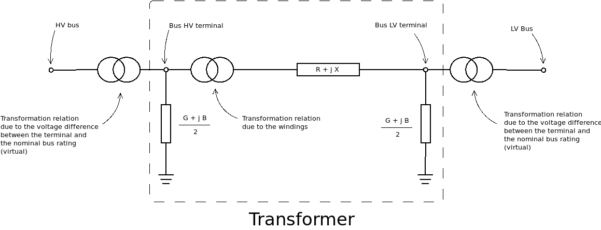

.. _branch_model:

Universal Branch Model
======================

This section describes the branch model implemented in GridCal. This branch model is a positive sequence model that
has been formulated such that it is state of the art.

    π model of a branch
    
To define the π branch model we need to specify the following magnitudes:

Where:

.. list-table::
   :widths: 15 10 80
   :header-rows: 1

   * - Magnitude
     - Units
     - Description

   * - :math:`R`
     - p.u.
     - Resistance of the equivalent branch model.

   * - :math:`X`
     - p.u.
     - Reactance of the equivalent branch model.

   * - :math:`G`
     - p.u.
     - Shunt conductance of the equivalent branch model.

   * - :math:`B`
     - p.u.
     - Shunt susceptance of the equivalent branch model.

   * - :math:`|tap|`
     - p.u.
     - Transformer tap module. This value indicates the internal voltage regulation and it is around 1.
       i.e. 0.98, or 1.05.

   * - :math:`\delta`
     - radians
     - Phase shift angle.

   * - :math:`tap_f`
     - p.u.
     - Virtual tap that appears because the difference of bus HV rating and the transformer HV rating.

   * - :math:`tap_t`
     - p.u.
     - Virtual tap that appears because the difference of bus LV rating and the transformer LV rating.

GridCal computes :math:`tap_f` and :math:`tap_t` automatically from the values. Also bear in mind that the sense in
which the transformer is connected matters. This is dealt with automatically as well.

The basic complex magnitudes are:

.. math::
    Y_s = \frac{1}{R + j \cdot X}

.. math::
    Y_{sh} = G + j \cdot B

.. math::
    tap = |tap| \cdot e^{j \cdot \delta}

.. math::
    tap_f = V_{HV} / V_{bus, HV}

.. math::
    tap_t = V_{LV} / V_{bus, LV}

The compete formulation of the branch primitives for the admittance matrix is:

.. math::

    Y_{tt} = \frac{Y_s + Y_{sh}}{2 \cdot tap_t^2}

.. math::
    Y_{ff} = \frac{Y_s + Y_{sh}}{2 \cdot tap_f^2 \cdot tap \cdot tap^*}

.. math::
    Y_{ft} = - \frac{Y_s}{tap_f \cdot tap_t \cdot tap^*}

.. math::
    Y_{tf} = - \frac{Y_s}{tap_t \cdot tap_f \cdot tap}

In GridCal the primitives of all the branches are computed at once in a matrix fashion, but for didactic purposes
the non-matrix formulas are included here.

Temperature correction
----------------------

The general branch model of gridCal features correction of the resistance due to the temperature. This feature is most
applicable to lines. Usually the wires' catalogue resistance is measured at 20ºC. To account for corrections GridCal

.. math::
    R' = R \cdot (1 + \alpha \cdot \Delta t)

Where :math:`\alpha` is a parameter that depends of the material of the wires anf :math:`\Delta t` is the temperature
difference between the base and the operational temperatures.

For example

.. list-table::
   :widths: 5 5 5
   :header-rows: 1

   * - Material
     - Test temperature (ºC)
     - :math:`\alpha` (1/ºC)

   * - Copper
     - 20
     - 0.004041

   * - Copper
     - 75
     - 0.00323

   * - Annealed copper
     - 20
     - 0.00393

   * - Aluminum
     - 20
     - 0.004308

   * - Aluminum
     - 75
     - 0.00330

Embedded Tap changer
--------------------

The general branch model features a discrete tap changer to be able to regulate the :math:`|tap|` parameter manually
and automatically from the power flow routines in a realistic way.