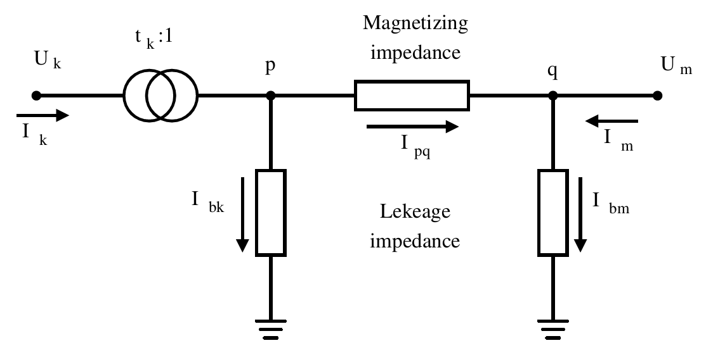

.. _branch_model:

Universal Branch Model
======================

The following describes the model that is applied to each type of admittance matrix in the `apply_to()` function inside the `Branch` object seen before. The model implemented to describe the behavior of the transformers and lines is the π model.

    π model of a branch
    
To define the π branch model we need to specify the following magnitudes:

- :math:`z_{series}`: Magnetizing impedance or simply series impedance in per unit.
- :math:`y_{shunt}`: Leakage impedance or simply shunt impedance in per unit.
- tap_module: Module of the tap changer, magnitude around 1.
- tap_angle: Angle of the tap changer in radians.

In order to apply the effect of a branch to the admittance matrices, first we compute the complex tap value.

.. math::

    tap = tap\_module \cdot e^{−j \cdot tap\_angle}

Then we compose the equivalent series and shunt admittance values of the branch. Both values are complex.

.. math::

    Y_s = \frac{1}{z_{series}}

.. math::

    Y_{sh} = \frac{y_{shunt}}{2}

- :math:`z_{series}`: Complex series impedance of the branch composed by the line resistance and its inductance.
- :math:`y_{shunt}`: Complex shunt admittance of the line composed by the conductance and the susceptance.
