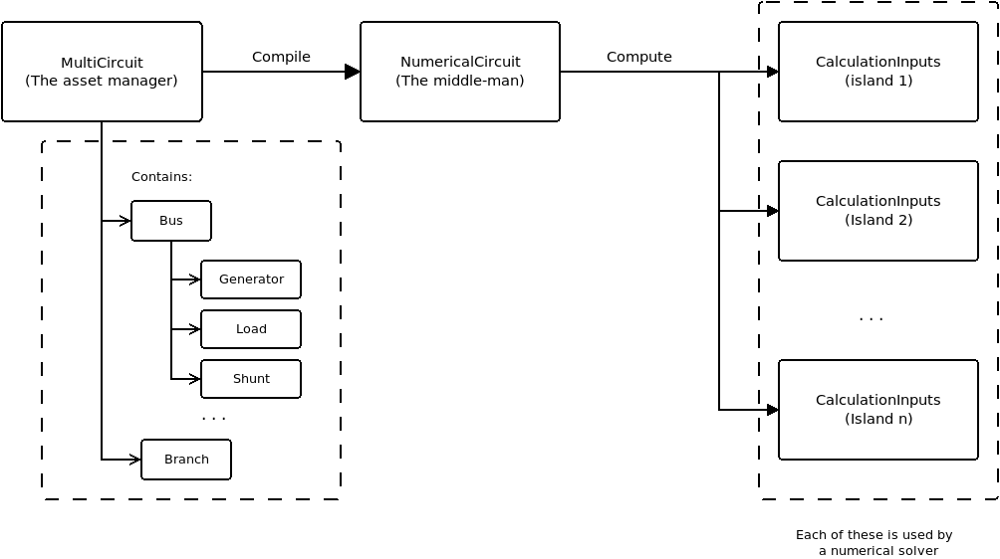

The assets manager: from objects to matrices
============================================

One of the key things that make GridCal special is that the devices
of the electrical grids are handled by an object-oriented asset manager.
This means that the real-life objects like generators are objects in GridCal
too, instead of a row in a database or table. This makes the handling of the
information very flexible and maintainable. If I had to pinpoint the biggest
advantage of GridCal it would be this one.

Most (if not all) other open source grid calculation tools use tables as input;
The advantage of a table based management of the information is that it is
more or less easy to compose the calculation matrices from those tables.
The disadvantage is that maintaining and extending a table-based model is
hard. GridCal started out being table-based too, but soon this approach
was disregarded because of the limitations this design imposes.

This object oriented approach and the structure used in GridCal seems to make
it harder for most electrical engineers when getting started developing with GridCal.
It is hard, because the structure might seem over-engineered, however it is 
this structure what enables seamless multi-island calculations and the
easy handling of time series, so it is key to explain "why" and "how".
In this section I'll explain the information "compilation" procedure used in 
GridCal, hoping that this makes GridCal more approachable for future 
contributors.

Structure
---------

The structure used to compile the information might seem convoluted and 
unnecessary. Experience has proven that this structure is very fast and it 
scales well (it is future-proof). 
Bear in mind that GridCal is not only a calculation library, but
it tries to make it as simple as possible for the user to input data, hence 
there is a careful equilibrium between usability and performance.

    Objects compilation process
 
MultiCircuit
^^^^^^^^^^^^
The multi-circuit, or asset manager is the main object in GridCal. 
It represents a group of objects conforming an electrical grid

NumericalCircuit
^^^^^^^^^^^^^^^^
The numerical circuit contains the information of the objects in 1-dimensional 
arrays (vectors) ready to compute the topology of the grid and the calculation 
matrices and vectors. It also contains the connectivity matrices between 
objects.

This module is the one doing all the heavy lifting; For the computations ahead 
we will need to have a number of admittance-based matrices. 
We will compose matrices and vector for the complete circuit, and 
then split those per circuit island (CalculationInputs objects). 
Remember that the calculation matrices are only valid for island circuits, 
this is because multi-island circuits present singular admittance matrices that 
lead to no numerical solution by their own.

.. figure:: ../figures/ElementBusAgregation.png
    :alt: Element bus aggregations

    Element bus aggregations

The logic is to have a vector of magnitudes of an object type (i.e. all the 
active power power for all the generators) and a connectivity matrix that 
relates the generators with the buses of the grid. Multiplying the connectivity 
matrix by the element magnitudes vector we obtain the buses magnitudes vector 
that we need for calculation.

Power, current and voltage vectors
""""""""""""""""""""""""""""""""""

Power injections complex array:

.. math::
	[S_{l} ]= [C_{l,bus}]^\top \cdot [load_S]

.. math::
	[S_{g}]= [C_{g,bus}]^\top \cdot [generation_S]

.. math::
	[S_{bus}] = [S_{g}]  - [S_{l}]

Current complex injections array:

.. math::
	[I_{bus}] = - [C_{l,bus}]^\top \cdot [load_I]

Where:

.. list-table::
   :widths: 25 20 80
   :header-rows: 1

   * - Magnitude
     - Dimensions
     - Description

   * - :math:`[S_{l}]`
     - #bus, 1
     - Array of complex power injections due to the load (will have a negative sign).
       Size: number of buses.

   * - :math:`[C_{l,bus}]`
     - #load, #bus
     - Connectivity of loads and buses.

   * - :math:`[load_S]`
     - #load, 1
     - Array of complex load power values

   * - :math:`[S_{g}]`
     - #bus, 1
     - Connectivity of loads and buses.

   * - :math:`[C_{g,bus}]`
     - #generators, #bus
     - Connectivity of generators and buses.

   * - :math:`[generation_S]`
     - #generators, #1
     - Array of generators power injections.

   * - :math:`[S_{bus}]`
     - #bus, 1
     - Nodal power injections array (positive: generation, negative: load).

   * - :math:`[load_I]`
     - #load, 1
     - Array of complex load current values

   * - :math:`[I_bus]`
     - #bus, 1
     - Nodal current injections array (positive: generation, negative: load).

Admittance matrix
"""""""""""""""""
The calculation of the admittance matrix in GridCal is completely vectorized.
It features

Put together the branch magnitudes to composes the Series admittance the
shunt admittance and the tap shift.

.. math::
    [Ys] = \frac{1}{[R] + j \cdot [X]}

    [GBc] = [G] + j \cdot [B]

    [tap] = [tap_{module}] \cdot e^{j \cdot [tap_{angle}]}

Where:

.. list-table::
   :widths: 25 20 20 80
   :header-rows: 1

   * - Magnitude
     - Dimensions
     - Units
     - Description

   * - :math:`[Ys]`
     - #branch, 1
     - p.u.
     - Array of branch series admittances.

   * - :math:`[GBc]`
     - #branch, 1
     - p.u.
     - Array of branch shunt admittances.

   * - :math:`[tap]`
     - #branch, 1
     - p.u.
     - Array of branch complex tap shifts.

   * - :math:`[R]`
     - #branch, 1
     - p.u.
     - Array of branch resistance.

   * - :math:`[X]`
     - #branch, 1
     - p.u.
     - Array of branch reactances.

   * - :math:`[G]`
     - #branch, 1
     - p.u.
     - Array of branch conductances.

   * - :math:`[B]`
     - #branch, 1
     - p.u.
     - Array of branch susceptances.

   * - :math:`[tap_{module}]`
     - #branch, 1
     - p.u.
     - Array of tap modules.

   * - :math:`[tap_{angle}]`
     - #branch, 1
     - Radians
     - Array of tap shift angles.

Compute the branch primitives:

.. math::

    [Y_{tt}] = \frac{\frac{[Ys] + [GBc]}{2}}{[tap_t] \cdot [tap_t]}

    [Y_{ff}] = \frac{\frac{[Ys] + [GBc]}{2}}{[tap_f] \cdot [tap_f] \cdot [tap] \cdot [tap]^*}

    [Y_{ft}] = - \frac{Ys}{[tap_f] \cdot [tap_t] \cdot [tap]^*}

    [Y_{tf}] = - \frac{Ys}{[tap_t] \cdot [tap_f] \cdot [tap]}

.. list-table::
   :widths: 25 20 80
   :header-rows: 1

   * - Magnitude
     - Dimensions
     - Description

   * - :math:`[Y_{ff}]`, :math:`[Y_{tt}]`,

       :math:`[Y_{ft}]`, :math:`[Y_{tf}]`
     - #branch, 1
     - Arrays of the bus connected admittances from-from, to-to, from-to and to-from

   * - :math:`[tap_f]`, :math:`[tap_t]`
     - #branch, 1
     - Array of tap modules that appear due to
       the voltage difference rating from
       transformers and the bus rating at the
       "from" and "to" side of a transformer branch.

Compose the "from", "to" and complete admittance matrices:

.. math::
    [Y_{sh}]= [C_{s,bus}]^\top \cdot [shunt_Y] + [C_{l,bus}]^\top \cdot [load_Y]

    [Y_f] = diag([Y_{ff}]) \times [C_f] + diag([Y_{ft}]) \times [C_t]

    [Y_t] = diag([Y_{tf}]) \times [C_f] + diag([Y_{tt}]) \times [C_t]

    [Y_{bus}] = [C_f]^\top \times [Y_f] + [C_t]^\top \times Y_t + diag([Y_{sh}])

Where:

.. list-table::
   :widths: 25 20 80
   :header-rows: 1

   * - Magnitude
     - Dimensions
     - Description

   * - :math:`[Y_{sh}]`
     - #bus, #bus
     - Diagonal sparse matrix of the shunt admittances due to the load admittance component and the
       shunt admittances.

   * - :math:`[C_{s,bus}]`
     - #shunt, #bus
     - Connectivity of shunts and buses.

   * - :math:`[shunt_Y]`
     - #shunt, 1
     - Array of complex admittances from the shunt devices.

   * - :math:`[C_{l,bus}]`
     - #load, #bus
     - Connectivity of loads and buses.

   * - :math:`[load_Y]`
     - #load, 1
     - Array of complex admittances from the load devices.

   * - :math:`[C_f]`, :math:`[C_t]`
     - #branch, #bus
     - Connectivity matrices of branches and "from" and "to" buses.

   * - :math:`[Y_f]`, :math:`[Y_t]`
     - #branch, #bus
     - Admittance matrices of branches and "from" and "to" buses.

   * - :math:`[Y_{bus}]`
     - #bus, #bus
     - Circuit admittance matrix.

A snippet from the code where the admittances are computed:

.. code::

    # form the connectivity matrices with the states applied
    states_dia = diags(self.branch_states)
    Cf = states_dia * self.C_branch_bus_f
    Ct = states_dia * self.C_branch_bus_t

    # use the specified of the temperature-corrected resistance
    if apply_temperature:
        R = self.R_corrected
    else:
        R = self.R

    # modify the branches impedance with the lower, upper tolerance values
    if branch_tolerance_mode == BranchImpedanceMode.Lower:
        R *= (1 - self.impedance_tolerance / 100.0)
    elif branch_tolerance_mode == BranchImpedanceMode.Upper:
        R *= (1 + self.impedance_tolerance / 100.0)
    else:
        pass

    Ys = 1.0 / (R + 1.0j * self.X)
    GBc = self.G + 1.0j * self.B
    tap = self.tap_mod * np.exp(1.0j * self.tap_ang)

    # branch primitives in vector form
    Ytt = (Ys + GBc / 2.0) / (self.tap_t * self.tap_t)
    Yff = (Ys + GBc / 2.0) / (self.tap_f * self.tap_f * tap * np.conj(tap))
    Yft = - Ys / (self.tap_f * self.tap_t * np.conj(tap))
    Ytf = - Ys / (self.tap_t * self.tap_f * tap)

    # form the admittance matrices
    Yf = diags(Yff) * Cf + diags(Yft) * Ct
    Yt = diags(Ytf) * Cf + diags(Ytt) * Ct
    Ybus = csc_matrix(Cf.T * Yf + Ct.T * Yt + diags(Ysh))

Adjacency matrix
""""""""""""""""

THe computation of the circuit adjacency matrix from matrices that we need anyway
for the admittance matrix computation is a very efficient way of dealing with the
topological computation. First we establish the total branch-bus connectivity matrix:

.. math::
    [C_{branch-bus}] = [C_f] + [C_t]

Then we compute the bus-bus connectivity matrix, which is the graph adjacency matrix:

.. math::
        [A] = [C_{branch-bus}]^\top \times [C_{branch-bus}]

Islands detection
"""""""""""""""""

The admittance matrix of a circuit with more than one island is singular.
Therefore, the circuit has to be split in sub-circuits in order to be solved.
The suggested algorithm to find the islands of a circuit is the Depth First Search
algorithm (DFS).

Previously it was already determined that the circuit complete graph is given by
the Bus-Bus connectivity matrix :math:`[C_{bus, bus}]`. This matrix is also known as the
node adjacency matrix. For algorithmic purposes we will call it the adjacency matrix :math:`A`.
As a side note, the matrix :math:`A` is a sparse matrix.

For algorithmic purposes,  :math:`A` is chosen to be a CSC sparse matrix.
This is important because the following algorithm uses the CSC sparse structure to
find the adjacent elements of a node.

The following function implements the non-recursive (hence faster) version of the DFS
algorithm, which traverses the bus-bus connectivity matrix (also known as the adjacent
graph matrix)

.. code::

    def find_islands(A):
        """
        Method to get the islands of a graph
        This is the non-recursive version
        :param: A: Circuit adjacency sparse matrix in CSC format
        :return: islands list where each element is a list of the node indices of the island
        """

        # Mark all the vertices as not visited
        visited = np.zeros(self.node_number, dtype=bool)

        # storage structure for the islands (list of lists)
        islands = list()

        # set the island index
        island_idx = 0

        # go though all the vertices...
        for node in range(self.node_number):

            # if the node has not been visited...
            if not visited[node]:

                # add new island, because the recursive process has already
                # visited all the island connected to v

                islands.append(list())

                # -------------------------------------------------------------------------
                # DFS: store all the reachable vertices into the island from current
                #      vertex "node".

                # declare a stack with the initial node to visit (node)
                stack = list()
                stack.append(node)

                while len(stack) > 0:

                    # pick the first element of the stack
                    v = stack.pop(0)

                    # if v has not been visited...
                    if not visited[v]:

                        # mark as visited
                        visited[v] = True

                        # add element to the island
                        islands[island_idx].append(v)

                        # Add the neighbours of v to the stack
                        start = A.indptr[v]
                        end = A.indptr[v + 1]
                        for i in range(start, end):
                            k = A.indices[i]  # get the column index in the CSC scheme
                            if not visited[k]:
                                stack.append(k)
                            else:
                                pass
                    else:
                        pass
                # -----------------------------------------------------------------------

                # increase the islands index, because all the other connected vertices
                # have been visited
                island_idx += 1

            else:
                pass

        # sort the islands to maintain raccord
        for island in islands:
            island.sort()

        return islands

The function returns a list (island) where each element is a list of the node
indices of the island. These are used to slice the previously computed arrays
so that each array slice is copied to the apropriate instance of `CalculationInputs`.

CalculationInputs
^^^^^^^^^^^^^^^^^
This object contains the calculation arrays already split by island. Hence this
object contains information such as the island admittance matrix, the power 
injections and any other numerical array that the solvers may need.