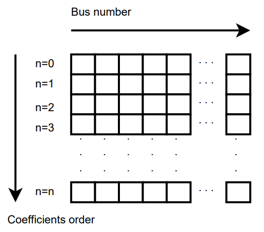

.. _holomorphic_embedding:

Holomorphic Embedding
=====================

First introduced by Antonio Trias in 2012 [1]_, promises to be a non-divergent power
flow method. Trias originally developed a version with no voltage controlled nodes
(PV), in which the convergence properties are excellent (With this software try to
solve any grid without PV nodes to check this affirmation). 

The version programmed in GridCal has been adapted from the master thesis of Muthu
Kumar Subramanian at the Arizona State University (ASU) [2]_. This version includes a
formulation of the voltage controlled nodes. My experience indicates that the
introduction of the PV control deteriorates the convergence properties of the
holomorphic embedding method. However, in many cases, it is the best approximation to
a solution. especially when Newton-Raphson does not provide one.

GridCal's integration contains a vectorized version of the algorithm. This means that
the execution in python is much faster than a previous version that uses loops.

Concepts
--------

All the power flow algorithms until the HELM method was introduced were iterative and
recursive. The helm method is iterative but not recursive. A simple way to think of
this is that traditional power flow methods are exploratory, while the HELM method is
a planned journey. In theory the HELM method is superior, but in practice the
numerical degeneration makes it less ideal.

The fundamental idea of the recursive algorithms is that given a voltage initial point
(1 p.u. at every node, usually) the algorithm explores the surroundings of the initial
point until a suitable voltage solution is reached or no solution at all is found
because the initial point is supposed to be *far* from the solution.

On the HELM methods, we form a *curve* that departures from a known mathematically
exact solution that is obtained from solving the grid with no power injections.
This is possible because with no power injections, the grid equations become linear and
straight forward to solve. The arriving point of the *curve* is the solution that we
want to achieve. That *curve* is best approximated by a Padè approximation. To compute
the Padè approximation we need to compute the coefficients of the unknown variables, in
our case the voltages (and possibly the reactive powers at the PV nodes).

The HELM formulation consists in the derivation of formulas that enable the calculation
of the coefficients of the series that describes the *curve* from the mathematically
know solution to the unknown solution. Once the coefficients are obtained, the Padè
approximation computes the voltage solution at the *end of the curve*, providing the
desired voltage solution. The more coefficients we compute the more exact the solution
is (this is true until the numerical precision limit is reached).

All this sounds very strange, but it works ;)

If you want to get familiar with this concept, you should read about the homotopy
concept. In practice the continuation power flow does the same as the HELM algorithm,
it takes a known solution and changes the loading factors until a solution for another
state is reached.

.. _fundamentals:

Fundamentals
------------

The fundamental equation that defines the power flow problem is:

.. math::

    \textbf{S} = \textbf{V} \times (\textbf{Y} \times \textbf{V})^*

Most usefully represented like this:

.. _base_eq:

.. math::
    
    {\textbf{Y} \times \textbf{V}} = \left(\frac{\textbf{S}}{\textbf{V}}\right)^* 

The holomorphic embedding is to insert a "travelling" parameter :math:`\alpha`, such
that for :math:`\alpha=0` we have an mathematically exact solution of the problem (but
not the solution we're looking for...), and for :math:`\alpha=1` we have the solution
we're looking for. The other thing to do is to represent the variables to be computed
as McLaurin series. Let's go step by step.

For :math:`\alpha=0` we say that :math:`S=0`, in this way the
:ref:`base equation<base_eq>` becomes linear, and its solution is mathematically exact.
But for that to be useful in our case we need to split the admittance matrix :math:`Y`
into :math:`Y_{series}` and :math:`Y_{shunt}`. :math:`Y_{shunt}` is a diagonal matrix,
so it can be expressed as a vector instead (no need for matrix-vector product).

.. _base_eq_alpha_0:

.. math::

    \textbf{Y}_{series} \times \textbf{V} = \left(\frac{\textbf{S}}{\textbf{V}}\right)^* - \textbf{Y}_{shunt} \textbf{V}

This is what will allow us to find the zero "state" in the holomorphic series
calculation. For :math:`\alpha=1` we say that :math:`S=S`, so we don't know the voltage
solution, however we can determine a path to get there:

.. _base_eq_embedded:

.. math::

    {\textbf{Y }\times \textbf{V}( \alpha )} = \left(\frac{ \alpha\textbf{S}}{\textbf{V}( \alpha )}\right)^* - \alpha \textbf{Y}_{shunt} \times \textbf{V}( \alpha ) = \frac{ \alpha\textbf{S}^*}{\textbf{V}( \alpha )^*} - \alpha \textbf{Y}_{shunt} \textbf{V}( \alpha )

Wait, what?? did you just made this stuff up??, well so far my reasoning is:

- The voltage :math:`\textbf{V}` is what I have to convert into a series, and the
    series depend of :math:`\alpha`, so it makes sense to say that :math:`\textbf{V}`,
    as it is dependent of :math:`\alpha`, becomes :math:`\textbf{V}(\alpha)`.
- Regarding the :math:`\alpha` that multiplies :math:`\textbf{S}`, the amount of power
    (:math:`\alpha \textbf{S}`) is what I vary during the *travel* from
    :math:`\alpha=0` to :math:`\alpha=1`, so that is why **S** has to be accompanied by
    the *traveling* parameter :math:`\alpha`.
- In my opinion the :math:`\alpha` :math:`\textbf{Y}_{shunt}` is to provoke the first
    voltage coefficients to be one.
    :math:`\textbf{Y}_{series} \times \textbf{V}[0] = 0`, makes :math:`V[0]=1`. This is
    essential for later steps (is a condition to be able to use Padè).

The series are expressed as McLaurin equations:

.. _McLaurinV:

.. math::

    V(\alpha) = \sum_{n}^{\infty} V_n \alpha ^n

**Theorem - Holomorphicity check** There's still something to do. The magnitude
:math:`\left(\textbf{V}( \alpha )\right)^*` has to be converted into
:math:`\left(\textbf{V}( \alpha^* )\right)^*`. This is done in order to make the
function be holomorphic. The holomorphicity condition is tested by the
Cauchy-Riemann condition, this is
:math:`\partial \textbf{V} / \partial \alpha^* = 0`, let's check that:

.. math::

    \partial \left(\textbf{V}( \alpha )^*\right) / \partial \alpha^*  = \partial \left(\sum_{n}^{\infty} V_n^* (\alpha ^n)^*\right) / \partial \alpha^*  = \sum_{n}^{\infty} \alpha ^n V_n^* (\alpha ^{n-1})^*

Which is not zero, obviously. Now with the proposed change:

.. math::

    \partial \left( \textbf{V}( \alpha^* )\right)^* / \partial \alpha^*  = \partial \left(\sum_{n}^{\infty} \textbf{V}_n^* \alpha ^n \right) / \partial \alpha^*  = 0
    
Yay!, now we're mathematically happy, since this stuff has no effect in practice because our $\alpha$ is not going to be a complex parameter, but for sake of being correct the equation is now:

.. _base_eq_embedded2:

.. math::

    {\textbf{Y}_{series}\times \textbf{V}( \alpha )} = \frac{ \alpha\textbf{S}^*}{\textbf{V}^*( \alpha^* )} - \alpha \textbf{Y}_{shunt} \textbf{V}( \alpha )

**(End of Theorem)**

The fact that :math:`\textbf{V}^*( \alpha^* )` is dividing is problematic. We need to
express it as its inverse so it multiplies instead of divide.

.. math::

    \frac{1}{\textbf{V}( \alpha)} =
    \textbf{W}( \alpha ) \longrightarrow \textbf{W}( \alpha ) \textbf{V}( \alpha) = 1
    \longrightarrow \sum_{n=0}^{\infty}{\textbf{W}_n \alpha^n}
    \sum_{n=0}^{\infty}{\textbf{V}_n \alpha^n} = 1

Expanding the series and identifying terms of :math:`\alpha` we obtain the expression
to compute the inverse voltage series coefficients:

.. math::

    \textbf{W}_n =
    \left\{
        \begin{array}{ll}
            \frac{1}{\textbf{V}_0}, \quad n=0 \\
            -\frac{{\sum_{k=0}^{n}\textbf{W}_k \textbf{V}_{n-k}}}{\textbf{V}_0}, \quad n>0
        \end{array}
    \right.

Now, :ref:`this equation<base_eq_embedded2>` becomes:

.. _base_eq_embedded3:

.. math::

    {\textbf{Y}_{series}\times \textbf{V}( \alpha )} =
    \alpha\textbf{S}^* \cdot \textbf{W}( \alpha)^*
    - \alpha \textbf{Y}_{shunt} \textbf{V}( \alpha )

Substituting the series by their McLaurin expressions:

.. _base_eq_embedded4:

.. math::

    {\textbf{Y}_{series}\times \sum_{n=0}^{\infty}{\textbf{V}_n \alpha^n}} = \alpha\textbf{S}^* \left(\sum_{n=0}^{\infty}{\textbf{W}_n \alpha^n}\right)^*  - \alpha \textbf{Y}_{shunt} \sum_{n=0}^{\infty}{\textbf{V}_n \alpha^n}

Expanding the series an identifying terms of :math:`\alpha` we obtain the expression
for the voltage coefficients:

.. math::

    \textbf{V}_n =
    \left\{
        \begin{array}{ll}
            {0}, \quad n=0\\
            {\textbf{S}^* \textbf{W}^*_{n-1} - Y_{shunt} \textbf{V}_{n-1} }, \quad n>0
        \end{array}
    \right.

This is the HELM fundamental formula derivation for a grid with no voltage controlled
nodes (no PV nodes). Once a sufficient number of coefficients are obtained, we still
need to use the Padè approximation to get voltage values out of the series.

In the previous formulas, the number of the bus has not been explicitly detailed. All
the :math:`\textbf{V}` and the :math:`\textbf{W}` are matrices of dimension
:math:`n \times nbus` (number of coefficients by number of buses in the grid) This
structures are depicted in the figure
:ref:`Coefficients Structure<coefficients_structure>`. For instance
:math:`\textbf{V}_n` is the :math:`n^{th}` row of the coefficients structure
:math:`\textbf{V}`.

.. _coefficients_structure:

    Coefficients Structure

Padè approximation
------------------

The :ref:`McLaurinV equation<McLaurinV>` provides us with an expression to obtain the voltage from
the coefficients, knowing that for :math:`\alpha=1` we get the final voltage results.
So, why do we need any further operation?, and what is this Padè thing?

Well, it is true that the :ref:`McLaurinV equation<McLaurinV>` provides an approximation of the
voltage by means of a series (this is similar to a Taylor approximation), but in
practice, the approximation might provide a wrong value for a given number of
coefficients. The Padè approximation accelerates the convergence of any given series,
so that you get a more accurate result with less coefficients. This means that for the
same series of voltage coefficients, using the :ref:`McLaurinV equation<McLaurinV>` could give a
completely wrong result, whereas by applying Padè to those coefficients one could
obtain a fairly accurate result.

The Padè approximation is a rational approximation of a function. In our case the
function is :math:`\textbf{V}(\alpha)`, represented by the coefficients structure
:math:`\textbf{V}`. The approximation is valid over a small domain of the function, in
our case the domain is :math:`\alpha=[0,1]`. The method requires the function to be
continuous and differentiable for :math:`\alpha=0`. Hence the Cauchy-Riemann condition.
And yes, our function meets this condition, we tested it before.

GridCal implements two algorithms that perform the Padè approximation; The Padè
canonical algorithm, and Wynn's Padè approximation.

**Padè approximation algorithm**

The canonical Padè algorithm for our problem is described by:

.. _pade_apprx:

.. math::

    Voltage\_value\_approximation = \frac{P_N(\alpha)}{Q_M(\alpha)} \quad \forall \alpha \in [0,1]

Here :math:`N=M=n/2`, where :math:`n` is the number of available voltage coefficients,
which has to be an even number to be exactly divisible by :math:`2`. :math:`P` and
:math:`Q` are polynomials which coefficients :math:`p_i` and :math:`q_i` must be
computed. It turns out that if we make the first term of :math:`Q_M(\alpha)` be
:math:`q_0=1`, the function to be approximated is given by the McLaurin expression
(What a happy coincidence!)

.. math::

    P_N(\alpha) = p_0 + p_1\alpha + p_2\alpha^2 + ... + p_N\alpha^N

.. math::

    Q_M(\alpha) = 1 + q_1\alpha + q_2\alpha^2 + ... + q_M\alpha^M

The problem now boils down to find the coefficients :math:`q_i` and :math:`p_i`. This
is done by solving two systems of equations. The first one to find :math:`q_i` which
does not depend on :math:`p_i`, and the second one to get :math:`p_i` which does depend
on :math:`q_i`.

**First linear system**: The only unknowns are the :math:`q_i` coefficients.

.. math::

    \begin{matrix}
    q_M V_{N-M+1} + q_{M-1}V_{N-M+2}+...+q_1V_N = 0\\
    q_M V_{N-M+2} + q_{M-1}V_{N-M+3}+...+q_1V_{N+1} = 0\\
    ...\\
    q_M V_{N} + q_{M-1}V_{N+1}+...+q_1V_{N+M+1} + V_{N+M} = 0\\
    \end{matrix}

**Second linear System**: The only unknowns are the :math:`p_i` coefficients.

.. math::

    \begin{matrix}
    V_0 - p_0=0\\
    q_1V_0 + V_1  p_1=0\\
    q_2V_0 + q_1V_1+V_2-p_2=0\\
    q_3V_0 + q_2V_1 + q_1V_2 + V_3 - p_3 = 0\\
    ...\\
    q_MV_{N-M} + q_{M-1}V_{N-M+1} + ... + +V_N - p_N=0
    \end{matrix}

Once the coefficients are there, you would have defined completely the polynomials
:math:`P_N(\alpha)` and :math:`Q_M(\alpha)`, and it is only a matter of evaluating the
:ref:`Padè approximation equation<pade_apprx>` for :math:`\alpha=1`.

This process is done for every column of coefficients
:math:`\textbf{V}=\{V_0, V_1,V_2,V_3, ...,V_n\}` of the structure depicted in the
:ref:`coefficients structure figure<coefficients_structure>`. This means that we have
to perform a Padè approximation for every node, using the one columns of the voltage
coefficients per Padé approximation.

**Wynn's Padè approximation algorithm**

Wynn published a paper in 1969 [4]_ where he proposed a simple calculation method to
obtain the Padè approximation. This method is based on a table. Weniger in 1989
publishes his thesis [5]_ where a faster version of Wynn's algorithm is provided in
Fortran code. 

That very Fortran piece of code has been translated into Python and included in GridCal.

One of the advantages of this method over the canonical Padè approximation
implementation is that it can be used for every iteration. In the beginning I thought
it would be faster but it turns out that it is not faster since the amount of
computation increases with the number of coefficients, whereas with the canonical
implementation the order of the matrices does not grow dramatically and it is executed
the half of the times.

On top of that my experience shows that the canonical implementation provides a more
consistent convergence.

Anyway, both implementations are there to be used in the code.

Formulation with PV nodes
-------------------------

The section :ref:`Fundamentals` introduces the canonical HELM algorithm. That algorithm
does not include the formulation of PV nodes. Other articles published on the subject
feature PV formulations that work more or less to some degree. The formulation below is
a formulation corrected by myself from a formulation contained here [3]_, which does
not work as published, hence the correction.

**Embedding**

The following embedding equations are proposed instead of the canonical HELM equations
from section :ref:`Fundamentals`.

For Slack nodes:

.. math::

    V(\alpha) = V^{SP} \quad \forall \alpha=0

For PQ nodes:

.. math::

    \left\{
    \begin{array}{ll}
    \textbf{Y} \times \textbf{V}(\alpha) = 0 \quad \quad \quad \quad \forall \alpha=0\\
    {\textbf{Y} \times \textbf{V}(\alpha) = \frac{\alpha \textbf{S}}{\textbf{V}^*(\alpha^*)}} \quad \forall \alpha>0
    \end{array}
    \right.

For PV nodes:

.. math::

    \left\{
    \begin{array}{ll}
    {\textbf{Y} \times \textbf{V}(\alpha) = \frac{ \textbf{S}}{\textbf{V}^*(\alpha^*)}} \quad \forall \alpha=0\\
    {\textbf{Y} \times \textbf{V}(\alpha) = \frac{ \textbf{S} - j \textbf{Q}(\alpha)}{\textbf{V}^*(\alpha^*)}} \quad \forall \alpha>0
    \end{array}
    \right.

.. math::

    \left\{
    \begin{array}{ll}
    V(\alpha)V^*(\alpha^*) = |V_0|^2\quad \quad \quad \quad \forall \alpha=0\\
    V(\alpha)V^*(\alpha^*) = |V_0|^2 + (|V^{SP}|^2-|V_0|^2) \quad \forall \alpha>0
    \end{array}
    \right.

This embedding translates into the following formulation:

**Step 1**

The formulas are adapted to exemplify a 3-bus system where the bus1 is a slack, the bus
2 is PV and the bus 3 is PQ. This follows the example of the Appendix A of [3]_.

Compute the initial no-load solution (:math:`n=0`):

.. math::

    \begin{bmatrix}
    1 & 0 & 0 & 0 & 0 & 0\\
    0 & 1 & 0 & 0 & 0 & 0\\
    G_{21} & -B_{21} & G_{22} & -B_{22} & G_{23} & -B_{23}\\
    B_{21} & G_{21}  & B_{22} & G_{22}  & B_{23} & G_{23}\\
    G_{31} & -B_{31} & G_{32} & -B_{32} & G_{33} & -B_{33}\\
    B_{31} & G_{31}  & B_{32} & G_{32}  & B_{33} & G_{33}\\
    \end{bmatrix}
    \times
    \begin{bmatrix}
    V[n]_{re, 1}\\
    V[n]_{im, 1}\\
    V[n]_{re, 2}\\
    V[n]_{im, 2}\\
    V[n]_{re, 3}\\
    V[n]_{im, 3}\\
    \end{bmatrix}
    =
    \begin{bmatrix}
    V^{SP}_{re, 1}\\
    V^{SP}_{im, 1}\\
    0\\
    0\\
    0\\
    0\\
    \end{bmatrix}
    \quad \forall n = 0

Form the solution vector :math:`\textbf{V}[n]` you can compute the buses calculated
power and then get the reactive power at the PV nodes to initialize
:math:`\textbf{Q}[0]`:

.. _Scalc:

.. math::

    \textbf{S} = \textbf{V}[0] \cdot (\textbf{Y}_{bus} \times \textbf{V}[0])^*

.. math::

    \textbf{Q}_i[0] = imag(\textbf{S}_{i}) \quad \forall i \in PV

The initial inverse voltage coefficients :math:`\textbf{W}[0]` are obtained by:

.. math::

    W_i[0] = \frac{1}{V_i[0]}  \quad \forall i \in N

This step is entirely equivalent to find the no load solution using the Z-Matrix
reduction.

**Step 2**

Construct the system of equations to solve the coefficients of order greater than zero
(:math:`n>0`). Note that the matrix is the same as constructed for the previous step,
but adding a column and a row for each PV node to account for the reactive power
coefficients. In our 3-bus example, there is only one PV node, so we add only one
column and one row.

.. _lin_sys_2:

.. math::

    \begin{bmatrix}
    1 & 0 & 0 & 0 & 0 & 0 & 0\\
    0 & 1 & 0 & 0 & 0 & 0 & 0\\
    G_{21} & -B_{21} & G_{22} & -B_{22} & G_{23} & -B_{23} & W[0]_{im}\\
    B_{21} & G_{21}  & B_{22} & G_{22}  & B_{23} & G_{23} & W[0]_{re}\\
    G_{31} & -B_{31} & G_{32} & -B_{32} & G_{33} & -B_{33} & 0\\
    B_{31} & G_{31}  & B_{32} & G_{32}  & B_{33} & G_{33} & 0\\
    0 & 0 & V[0]_{re} & V[0]_{im} & 0 & 0 & 0\\
    \end{bmatrix}
    \times
    \begin{bmatrix}
    V[n]_{re, 1}\\
    V[n]_{im, 1}\\
    V[n]_{re, 2}\\
    V[n]_{im, 2}\\
    V[n]_{re, 3}\\
    V[n]_{im, 3}\\
    Q_2[n]\\
    \end{bmatrix}
    =
    \begin{bmatrix}
    0\\
    0\\
    f2_{re}\\
    f2_{im}\\
    f1_{re}\\
    f1_{im}\\
    \epsilon[n]\\
    \end{bmatrix}
    \quad \forall n > 0

Where:

.. math::

    f1 = S^*_i \cdot W^*_i[n-1] \quad \forall i \in PQ

.. math::

    f2 = P_i \cdot W^*_i[n-1] + conv(n, Q_i, W^*_i) \quad \forall i \in PV

.. math::

    \epsilon[n] = \delta_{n1} \cdot \frac{1}{2} \left(|V_i^SP|^2 - |V_i[0]|^2\right) - \frac{1}{2} conv(n, V_i, V_i^*)  \quad \forall i \in PV, n > 0

The convolution :math:`conv` is defined as:

.. math::

    conv(n, A, B) = \sum_{m=0}^{n-1} A[m] \cdot B[n-m]

The system matrix (:math:`A_{sys}`) is the same for all the orders of :math:`n>0`,
therefore we only build it once, and we factorize it to solve the subsequent
coefficients.

After the voltages :math:`\textbf{V}[n]` and the reactive power at the PV nodes
:math:`Q[n]` is obtained solving the linear system (:ref:`this equation<lin_sys_2>`), we must solve
the inverse voltage coefficients of order :math:`n` for all the buses:

.. math::

    W_i[n] = \frac{- {\sum_{m=0}^{n}W_i[m] \cdot V_i[n-m]} }{V_i[0]} \quad  \forall i \in N, n>0

**Step 3**

Repeat step 2 until a sufficiently low error is achieved or a maximum number of
iterations (coefficients).

The error is computed by comparing the calculated power :math:`\textbf{S}` (eq
:ref:`Scalc<Scalc>`) with the specified power injections :math:`\textbf{S}^{SP}`:

.. math::

    mismatch = \textbf{S} - \textbf{S}^{SP}

.. math::

    error = |mismatch|_\infty = max(abs(mismatch))

.. [1] A. Trias, The Holomorphic Embedding Load Flow Method, IEEE Power and Energy Society General Meeting 2011, 22–26 July 2012

.. [2] Muthu Kumar Subramian, Application of holomorphic embedding to the power-flow problem, Arizona State University, Master thesis in electrical engineering, 2014

.. [3] Liu, Chengxi, et al. "A multi-dimensional holomorphic embedding method to solve AC power flows." IEEE Access 5 (2017): 25270-25285

.. [4] Wynn's 1969 paper about Padè approximation (citation needed)

.. [5] Weniger's 1989 thesis (citation needed)
