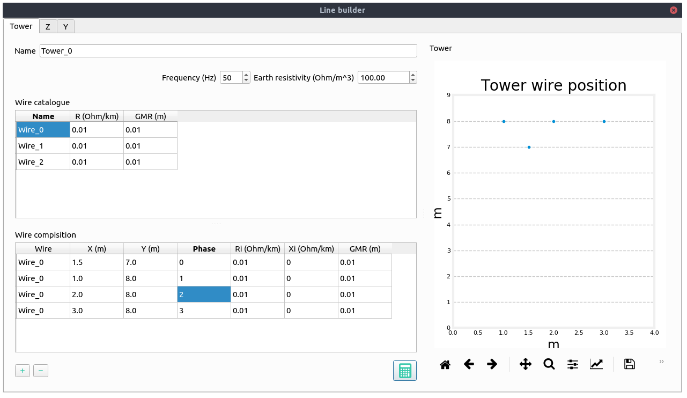
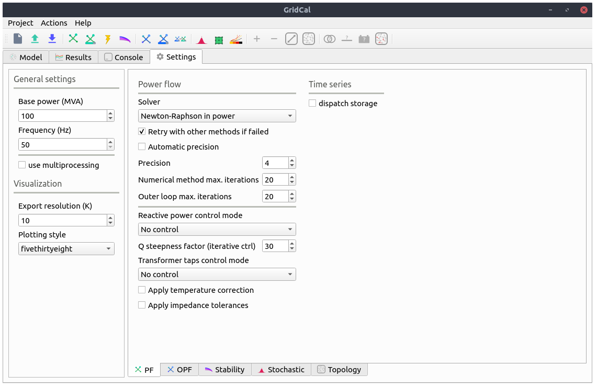
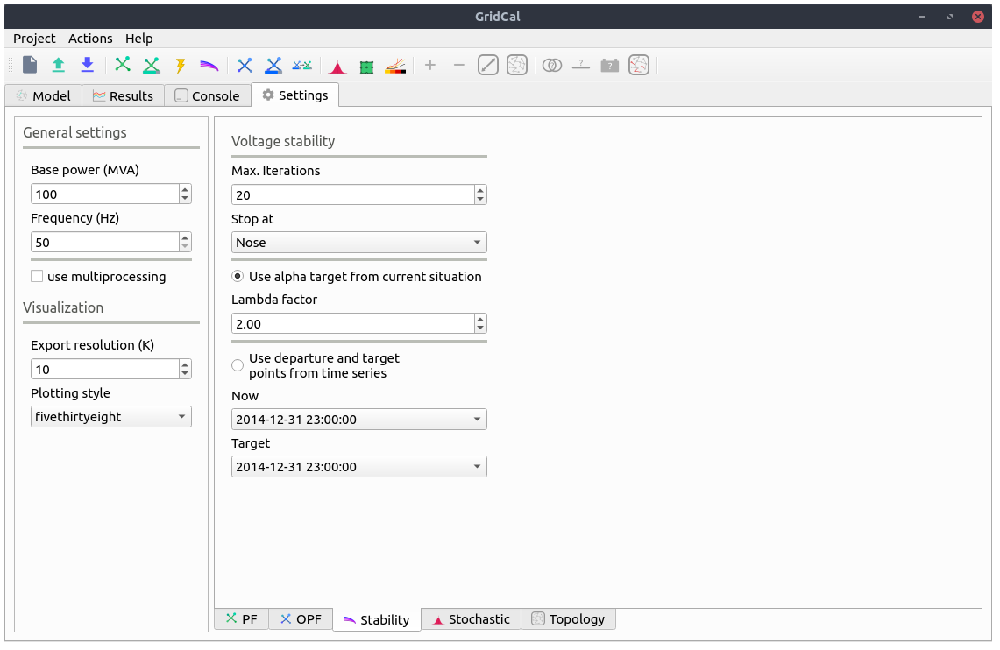

.. _gui:

Graphical User Interface
========================

The user interface of GridCal is written using the Qt graphical interface
framework. This allows GridCal to be multi-platform and to have sufficient
performance to handle thousands of graphical items in the editor, to be
responsive and plenty of other attributes of consumer software.

.. figure:: figures/gridcal_gui.png
    :alt: GridCal user interface.
    :scale: 50 %
    
    GridCal user interface representing  a zoom of a ~600 node distribution grid.

The graphical user interface (GUI) makes extensive use of tooltip texts. These area yellow tags that appear
when you hover the mouse cursor over a button from the interface. The tooltip texts are meant to be explanatory
so that reading a manual is not really needed unless you need the technical details.
Nevertheless this guide hopes to guide you through the GUI well enough so that the program is usable.

Model view
----------

The model view is where all the editing is done.

Schematic editor
^^^^^^^^^^^^^^^^

The schematic view is where you construct the grid in GridCal. The usage is quite simple:

- Drag & Drop the buses from the left upper side into the main panel.
- Click on a bus bar (black line) and drag the link into another bus bar, a branch will be created.

  - Branch types can be selected (branch, transformer, line, switch, reactance).
  - If you double click a branch and the type is Line or Transformer, a simplified editor will pop up.

- To add loads, generators, shunts, etc... just right click on  bus and select from the context menu.

- The context menu from the buses allow plenty of operations such as view the bus profiles (extended
  is time series results are present) or setting a bus as a short circuit point.

The schematic objects are coloured based on the results of the latest simulation.

.. figure:: figures/model-schematic.png
    :alt: Schematic view and editor
    :scale: 50 %

When more than one simulation is available (i.e. power flow and power flow time series)
the schematic editor is augmented with a bar that allows you to select the appropriate simulation colouring
of the grid. When the simulation has a time component, like time series or voltage collapse, the bar will
allow you to visualize each individual step of the simulation and navigate through them.

.. figure:: figures/model-schematic-2.png
    :alt: Schematic view and editor extended
    :scale: 50 %

Tabular editor
^^^^^^^^^^^^^^

Some times is far more practical to edit the objects in bulk. For that, GridCal features the tabular view
of the objects. All the static properties of the objects can be edited here. For the properties with time series
we have the "time events" tab.

.. figure:: figures/model-objects.png
    :alt: GridCal objects tabular editor.
    :scale: 50 %

There are some filtering options that can be performed; See the search chapter.

If the branch objects are selected, then it is possible to extend the view with the catalogue of template elements
available to assign to each branch. When a template is assigned to a branch, some properties are affected by  the
template. The properties affected are the resistance (R), reactance (X), Conductance (G), Susceptance (B)
and the branch rating (Rate).

.. figure:: figures/model-objects-2.png
    :alt: GridCal objects tabular editor 2.
    :scale: 50 %

Grid analysis and diagnostic
^^^^^^^^^^^^^^^^^^^^^^^^^^^^

GridCal features an analysis and diagnostics tool (F8) that allows to inspect at a glance the main magnitudes
of the grid objects. For instance if there were outliers in the branches resistance, it would be evident
from the histogram charts.

.. figure:: figures/analysis.png
    :alt: GridCal objects analysis.
    :scale: 50 %

A detailed table of common problems is provided in the diagnostics tab. This allows you to go back to the
tabular editor and fix the issues found.

.. figure:: figures/diagnostic.png
    :alt: GridCal objects diagnostic.
    :scale: 50 %

Templates
^^^^^^^^^

The branch templates are defined here. The templates are designed to ease the process of defining the
properties of the branch objects.

- *Wires*: A wire is not strictly a branch, but it is required to be able to define an overhead line.
- *Overhead lines*: It is a composition of wires bundled by phase (A:1, B:2, C:3, Neutral:0) that represents an overhead
  line. The overhead lines can be further edited using the Overhead Line Editor (see below)
- *Underground lines*: Underground lines are defined with the zero sequence and positive sequence parameters.
- *Sequence lines*: Generic sequence lines are defined with the zero sequence and positive sequence parameters.
- *Transformers*: The three phase transformers are defined with the short circuit study parameters.

Visit the theory section to learn more about these models.

.. figure:: figures/model-types.png
    :alt: GridCal device type templates editor.
    :scale: 50 %

Overhead line editor
^^^^^^^^^^^^^^^^^^^^

The overhead line editor allows you to define an overhead line in any way you want, bundling many wires per phase if you
need and including the neutral. The equations for this functionality are taken from the EMTP theory book.

Z: This tab shows the series impedance matrices with the reduced neutral (3x3) and without the reduced neutral (4x4) if
the neutral wire is present.

Y: This tab shows the shunt admittance  matrices with the reduced neutral (3x3) and without the reduced neutral (4x4) if
the neutral wire is present.

Time series
^^^^^^^^^^^

This screen allows you to visualize, create and manipulate the profiles of the
various magnitudes of the program.

.. figure:: figures/model-time.png
    :alt: GridCal time series tabular editor.
    :scale: 50 %

The time series is what make GridCal what it is. To handle time series efficiently by design is what made me
design this program.

Profiles importer
^^^^^^^^^^^^^^^^^

From the time series you can access the time series importer. This is a program to read excel and csv files from which
to import the profiles. Each column of the imported file is treated as an individual profile.
The imported profiles can be normalized and scaled. Each profile can be assigned in a number of ways to the objects for
which the profiles are being imported.

.. figure:: figures/profiles_import.png
    :alt: GridCal time series import interface.
    :scale: 50 %

Linking methods:

- Automatically based on the profile name and the object's names.
- Random links between profiles and objects; Each object is assigned with a random profile.
- Assign the selected profile to all objects.
- Assign the selected profile to the selected objects.

Array viewer
^^^^^^^^^^^^

The array viewer is an utility to inspect the array-like objects that are being passed to the numerical methods.
These are arranged per island of the circuit.

.. figure:: figures/model-arrays.png
    :alt: GridCal compiled arrays for calculation viewer.
    :scale: 50 %

Comments editor
^^^^^^^^^^^^^^^

Simple text box where to write comments about the project.

.. figure:: figures/model-coments.png
    :alt: GridCal model comments editor.
    :scale: 50 %

Results
-------

The results view is where ou can visualize the results for all the available simulations.
This feature stands out from the commercial power systems software where to simply view the results is not
standarized or simple.

.. figure:: figures/results.png
    :alt: GridCal results graphical viewer.
    :scale: 50 %

Tabular view
^^^^^^^^^^^^

The tabular view of the results displays the same information as the graphical view but numerically such that you can
copy it to a spreadsheet software, or save them for later use.

.. figure:: figures/results-data.png
    :alt: GridCal results tabular viewer.
    :scale: 50 %

Console
-------

The console in GridCal is a very nice addition that allows some degree of automation within the graphical
user interface. The console is a normal python console (embedded in a python program!) where the circuit declared
in the user interface (app) is accessible (App.circuit).

.. figure:: figures/console.png
    :alt: GridCal python console (python from within python!).
    :scale: 50 %

Some logs from the simulations will be displayed here. Apart from this any python command or operation that you can
perform with scripts can be done here.

Settings
--------

The general settings are:

Base power
    GridCal works with the magnitudes in per unit.
    In the per unit system the base magnitude is set in advance.
    This is the base value of the power in MVA. It is advised not to be changed.

Frequency
    The value of the frequency of the grid in Hertz (Hz).

Use multiprocessing
    For simulations that can be run in parallel, the software allows to use all the processing power
    by launching simulations ina parallel. This is only available for UNIX systems due to the way parallelism is
    implemented in the windows versions of python.

Export visualization
    Factor of resolution when exporting the schematic. This is a multiplier of the resolution 1080 x 1920 pixels.

Plotting style
    Matplotlib plotting style.

Power flow
^^^^^^^^^^

Solver
    The power flow solver to use.

    - Newton-Raphson in power:
    - Newton-Raphson in current:
    - Newton-Raphson-Iwamoto:
    - Levenberg-Marquardt:
    - Fast-Decoupled:
    - Holomorphic-Embedding:
    - Linear AC approximation:
    - DC approximation:

    All these solvers are covered in the theory section.

Retry with other methods is failed:
    This option tries other numerical solvers to try to find a power flow solution.
    This option is relevant because different numerical algorithms may be more suited to certain grid configurations.
    In general the Newton-Raphson implementation in GridCal includes back-tracing and other innovations that make it
    a very competitive method to consider by default.

Automatic precision
    The precision to use for the numerical solvers depends on the magnitude of the power injections.
    If we are dealing with hundreds of MW, the precision may be `1e-3`, but if we are dealing with Watts, the precision has
    to be greater. The automatic precision checks the loading for a suitable precision such that the results are fine.

Precision
    Exponent of the numerical precision. i.e. `4` corresponds to `1e-4` MW in p.u. of precision

Numerical method max. iterations
    Number of "inner" iterations of the numerical method before terminating.

Outer loop max. iterations
    Number of "outer loop" iterations to figure out the values of the set controls.

Reactive power control mode
    This is the mode of reactive power control for the generators that are set in PV mode.

    - No control: The reactive power limits are not enforced.
    - Direct: The classic pq-pv switching algorithm.
    - Iterative: An iterative algorithm that uses the power flow as objective function to
      find suitable reactive power limits.

Q steepness factor (iterative ctrl.)
    Steepness factor for the iterative reactive power control.

Transformer taps control mode

    - No control: The transformer voltage taps control is not enforced.
    - Direct:
    - Iterative:

Apply temperature correction
    When selected the branches apply the correction of the resistance due to the temperature.

Apply impedance tolerances
    ???

Optimal power flow
^^^^^^^^^^^^^^^^^^

.. figure:: figures/settings-opf.png
    :alt: GridCal Optimal power flow settings.
    :scale: 50 %

Solver
    Optimal power flow solver to use

    DC OPF: classic optimal power flow mixing active power with lines reactance.
    AC OPF: Innovative linear AC optimal power flow based on the AC linear power flow implemented in GridCal.

Load shedding
    This option activates the load shedding slack.
    It is possible to assign an arbitrary weight to this slack.

Generation shedding
    This option activated the generation shedding slack.
    It is possible to assign an arbitrary weight to this slack.

Show the real associated values
    Compute a power flow with the OPF results and show that as the OPF results.

Control batteries
    Control the batteries state of charge when running the optimization in time series.

Voltage stability
^^^^^^^^^^^^^^^^^

Max. Iterations
    Number of iteration to perform at each voltage stability (predictor-corrector) stage.

Stop at
    Point of the curve to top at

    - Nose: Stop at the voltage collapse point
    - Full: Trace the full curve.

Use alpha target from the base situation
    The voltage collapse (stability) simulation is a "travel" from a base situation towards a "final" one.
    When this mode is selected the final situation is a linear combination of the base situation. All the
    power values are multiplied by the same number.

Use departure and target points from time series
    When this option is selected the base and the target points are given by time series points.
    This allows that the base and the final situations to have non even relationships while evolving
    from the base situation to the target situation.

Stochastic power flow
^^^^^^^^^^^^^^^^^^^^^

.. figure:: figures/settings-stochastic.png
    :alt: GridCal stochastic power flow settings.
    :scale: 50 %

Precision
    Monte carlo standard deviation to achieve.
    The number represents the exponent of the precision.
    i.e. 3 corresponds to 1e-3

Max. Iterations
    Maximum iterations for Monte Carlo sampling
    if the simulation does not achieve the selected standard deviation.

Samples
    Number of samples for the latin hypercube sampling.

Additional islands until stop
    When simulating the blackout cascading, this is the number of islands
    that determine the stop of a simulation

Topology
^^^^^^^^

.. figure:: figures/settings-topology.png
    :alt: GridCal topology processor settings.
    :scale: 50 %

Select branch types to reduce
    The topological reduction is a top feature of GridCal. With it you can remove the influence of the redundant
    branches. This is specially relevant when you are provided with grids that have thousands of switches and
    connection branches that add no simulation value. Those can be removed in a very smart way.

Filter by r+x under threshold
    This feature establishes if to topologically remove branches whose resistance + reactance
    is lower than a threshold. The threshold is given by the exponent number. i.e. 5 corresponds to `r+x < 1e-5`.

Automatic layout algorithm
    Another nice feature in GridCal is the ability to sort bus bar locations according to a graph algorithm.
    This is especially useful when you are provided with a grid that has no schematic, where the graphical
    representation depict all the bus bars in the same place.

Ask before applying
    Raise a question before applying the graph layout algorithm.

Node expansion factor
    The nodes in GridCal can be expanded (far from each other) or shrink (closer) this parameter
    set the "explosion" factor that determines how far from each other shall the nodes become.

Branch rating factor
    For the branch automatic rating, this is the rate multiplier.

Override values
    If selected any non-zero rate is overridden by the calculated value.

Search queries
^^^^^^^^^^^^^^^^

The database and the results tab contain search boxes to perform advanced searches.

Here we explain how to compose a search query.

Queries in GridCal are made by using the following synthax:

.. code-block::

    [subject] [operation] [value] [and/or] [subject] [operation] [value] [and/or] ...

Observe that this query is composed by smaller sub-queries that are joined by the *and* / *or* operations

Each subquery is composed as:

.. code-block::

    [subject] [operation] [value]

The subject is what to compare. Possible subjects:

- val: Value
- col: column value
- idx: Index value
- colobj: Object underlying
- idxobj: Object underlying

The operation is how to compare. Possible operations:

- <: less than the value
- <= less or equal than the value
- >: Greater than the value
- >=: Greater or equal than the value
- "=": Equal than the value
- "!=": Different than the value
- "like": The value is in the subject
- "notlike": The value is not in the subject
- "starts": The subject starts with the value
- "ends": The subject ends with the value

Finally, the value is what to compare to. The value can be a single entity
or a list of values provided between brackets [val1, val2, ...]