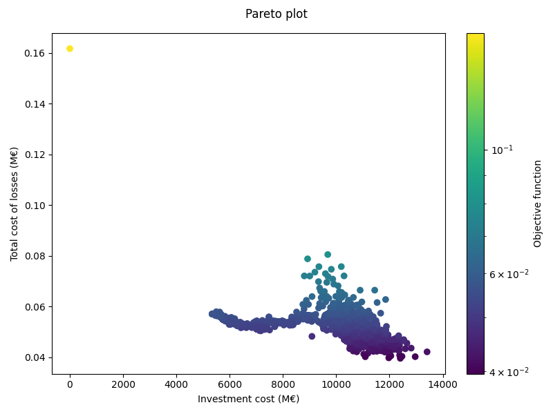
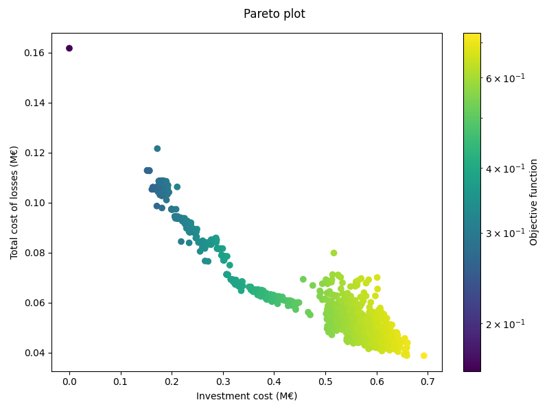
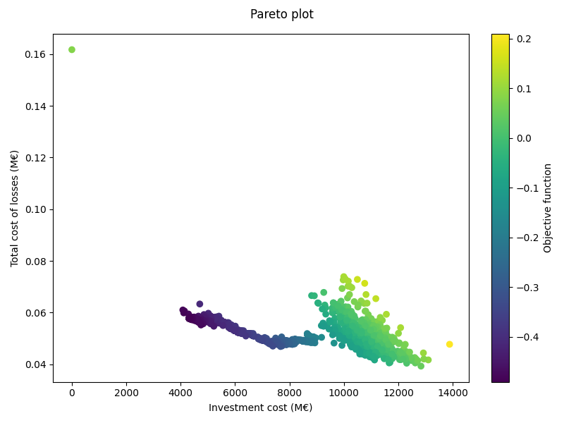

======================
Investments evaluation
======================

Introduction
_______

Planning power grids involves determining an appropriate set of assets that makes sense from both the
technical and economical optics. This challenge can be understood as an optimization problem, where one tries to
minimize the total cost :math:`C = CAPEX+OPEX`, while simultaneously minimizing the technical restrictions
:math:`t_r`. While apparently simple to comprehend, such a problem in its original form is arduous to solve and a
satisfying solution may not even be reached.

At this point we have to ask ourselves what the underlying issue is. If the puzzle is rigorously formulated, it
becomes of the type MINLP. Not only it can include continuous variables (such as the rating of a substation), but
also a wide set of integer variables (the potential investments to make). It is well-known that even solving a
single-period OPF with only continuous variables becomes a very complicated problem, to the point where the
original scenario is often convexified to solve it with acceptable precision and time. Now imagine we have to find a
solution to such a problem, but considering the full 8760 hours in a year and thousands of investment combinations.
The result would be catastrophic given the astronomically high computational time.

Hence, it is clear we desire an algorithm that can provide us with a list of optimal investments and not suffer from
the curse of dimensionality. The methodology we have adopted here consists of:

#. Building a machine-learning model that captures the behavior of the grid under diverse scenarios.
#. Optimizing such a model in a matter of a few seconds.

Formulation
_______

1. **Basic objective function**

The selected objective function considers both technical and economical criteria. In particular, it is defined as:

.. math::
    f_o(x) = \sum{C_l(x)_{br}} + \sum C_o(x)_{br} + \sum C_{vm}(x)_b + \sum C_{va}(x)_b + \sum CAPEX(x)_i + \sum OPEX(x)_i

where :math:`C_l` is a penalty function associated with active power losses, :math:`C_o` accounts for branch
overloadings, :math:`C_{vm}` gathers the undervoltage and overvoltage module penalties, and :math:`C_{va}` represents the
voltage angle deviation penalties. Power losses and the overloadings are calculated for every branch
of the grid :math:`br`, the voltage-related costs are computed at every bus :math:`b` and the CAPEX and OPEX are related
to each active investment :math:`i`. Note here that the unknown :math:`x` is used to represent the investment
combination under consideration.That is, :math:`x` has to be seen as a vector that contains an :math:`n`-length
set of boolean variables that account for the activated or deactivated investments:

.. math::
    x = [x_1, x_2, ..., x_n]

or in compact form, equivalently, :math:`x \in \mathbb{Z}^n_2`.

2. **Costs calculation**

Active power losses are calculated directly from the simulation results, such as power flow results.
All branches, including lines, transformers, DC lines, etc., are considered. The losses are summed to get :math:`C_l(x)`.

For branch overloadings, the procedure is similar. The loading of each branch is computed from simulation results, and
branches with loads above 100% of the rating are penalized. The penalty is calculated by multiplying the associated
overload cost and the loading:

.. math::

    \sum{C_o(x)_{br}} = \sum_{idx \in {branches\_idx}} P_o[idx] \cdot loading[idx] ,

where :math:`branches\_idx` is the set of indices where :math:`loading > 1` and :math:`P_o` is the
corresponding overload penalization of the branch .

Regarding the undervoltages and overvoltages, the associated penalty is computed as:

.. math::
    C_{vm}(x) =  P_{vm} \cdot ( \max(V_m - V^{\text{max}}_m, 0) +  \max(V^{\text{min}}_m - V_m, 0) )

where :math:`V_m , V^{\text{max}}_m, V^{\text{min}}_m, P_{vm}` are vectors containing voltage module results, allowed
maximum voltage, minimum voltage limit and voltage module penalization for each bus.

3. **Machine-learning algorithm**
Once the objective function is defined, each evaluation is sent to the machine-learning model previously mentioned.
The algorithm being tested is the so called Mixed-Variable ReLU-based Surrogate Modelling (MVRSM). For further
information, the reader can find the reference paper_ to understand the insights of the model.

.. _paper: https://dl.acm.org/doi/pdf/10.1145/3449726.3463136

As for the electrical problem, it is not initially relevant what goes on inside the machine-learning algorithm, it
works as a black-box model. The objective function is evaluated and sent to the model in each iteration and in the end
the model outputs the optimal point.

Testing
_______
1. **Grid**

In order to test the algorithm for different variations of the objective function, a 130-bus grid has been prepared with
389 Investment Candidates including lines and buses. The diagram of the grid is shown in Figure 1.

.. figure:: ../figures/investments/130bus_grid_diagram.png
    :alt: 130bus-grid diagram
    :scale: 50 %

    Figure 1: Test grid diagram. Grey lines and repeated elements are investment candidates.

2. **Base case**

Initially, the algorithm did not include the economical criteria in the objective function. Although it is clear that it
is needed to somehow include the CAPEX and OPEX to the minimization, the results obtained are useful to grasp the effect
of including economical criterion.

.. figure:: ../figures/investments/Figure_1_wo_capex.png
    :alt: Results wo CAPEX
    :scale: 50 %

    Figure 2: Paretto plot for investments evaluation without CAPEX inside the objective function.

It is clear in Figure 2 that the more investments are selected, the lower the technical criteria are and, therefore, the
lower the objective function. Hence, the algorithm learns that more investments equals minimum objective function values.
By adding the CAPEX to the objective function, it is expected to correct this tendency and instead find an optimal point
regarding both technical and economic criteria.

3. **Initial tests**

Including the CAPEX in the objective function is a delicate problem. As seen in Figure 2, the CAPEX values can be above
:math:`10^4` while the technical criteria are below :math:`10^{-1}`. Therefore, when adding these values to the objective
function, the CAPEX will inherently have more weight and unbalance the results.

As an example, the reader can find below the graphs corresponding to multiplying the CAPEX by different minimization
factors

.. figure:: ../figures/investments/Figure_1_w_capex_e-6_v2.png
    :alt: Results CAPEX 1e-6
    :scale: 50 %

    Figure 3: Results obtained when CAPEX is multiplied by :math:`10^{-6}`.

    Figure 4: Results obtained when CAPEX is multiplied by :math:`10^{-5}`.

.. figure:: ../figures/investments/Figure_1_w_capex_e-4_v2.png
    :alt: Results CAPEX 1e-4
    :scale: 50 %

    Figure 5: Results obtained when CAPEX is multiplied by :math:`10^{-4}`.

.. figure:: ../figures/investments/Figure_1_w_capex_e-3_v2.png
    :alt: Results CAPEX 1e-3
    :scale: 50 %

    Figure 6: Results obtained when CAPEX is multiplied by :math:`10^{-3}`.

The previous figures show that the more disparate the economic and technical criterion are, the more likely is the
objective function to tend to lesser investments solutions. The situation from the Base case is reverted,
but another problem arises: How should the different criteria values be computed so that all elements in the objective
function are around the same order of magnitude?

4. **Normalization**
When dealing with multicriteria optimization, it is common to establish some reference values for each criteria in
the objective function and normalize the terms by dividing the factors by the reference point. In essence, the basic
objective function presented in Formulation would be modified as:

.. math::
    f_o(x) = \frac{\sum{C_l(x)_{br}}}{l_{ref}} + \frac{\sum C_o(x)_{br}}{o_{ref}} + \frac{\sum C_{vm}(x)_b}{vm_{ref}} +
    \frac{\sum C_{va}(x)_b}{va_{ref}} + \frac{\sum CAPEX(x)_i}{CAPEX_{ref}} + \frac{\sum OPEX(x)_i}{OPEX_{ref}}

However, given the nature of the problem being solved, it is not possible to determine reference values for each
criteria beforehand. Hence, some solutions are proposed, the reader can find the explanation and results obtained in the
following subsections.

4.1. First iteration normalization

The first solution studied consists in taking the values of the terms for the first iteration with investments,
compute scaling factors referent to that iteration as

.. math::
    sf_{i} = \frac{min(mean)}{mean_i}

being:

    - :math:`sf_{i}`: the scale factor for each :math:`i` criteria ; losses scaling factor, overload scaling factor, etc.,
    - :math:`mean_i`: the mean between the maximum and minimum value of each criteria; :math:`\frac{max(losses) + min(losses)}{2}`,
    - :math:`mean`: an array of all the computed means of the factors; :math:`[mean_{losses}, mean_{overload}, mean_{vm}, ... ]`.

and multiply each term for its scaling facter throughout the rest of the iterations. Therefore,
the objective function ends up being:

.. math::
    f_o(x) = sf_l \sum{C_l(x)_{br}} + sf_o \sum C_o(x)_{br} + sf_{vm} \sum C_{vm}(x)_b +
    sf_{va} \sum C_{va}(x)_b + sf_{CAPEX} \sum CAPEX(x)_i + sf_{OPEX} \sum OPEX(x)_i

The results obtained in this normalization resemble the ones shown in Figure 5, given that the CAPEX scaling factor is
essentially :math:`10^{-4}`.

    Figure 7: Results obtained for the first normalization type.

4.2. Scale after random evaluations

For the second solution, the MVRSM is altered so that the normalization of the different criteria is done internally.
The new algorithm consists first of some random evaluations, in the studied case, 1.5 times the number of possible investments.
During the random evaluations, the model is not updated nor the :math:`x` are updated by minimizing the model.
Afterwards, the maximum :math:`y_{max}` and minimum :math:`y_{min}` values throughout the evaluations are saved in
order to apply the normalization as:

.. math::
    y_{norm} = \frac{y - y_{min}}{y_{max} - y_{min}}

where :math:`y` is a vector containing the values of the criteria before normalization and :math:`y_{norm}` represents
the values after normalization. Hence, this normalization is applied to all the values found in the random process and
the model is now updated with the normalized values.

The second and final part of the algorithm consists of the rest of the evaluations, where each time the criteria are
found, they are normalized and the model is updated and minimized.

Therefore, the algorithm ends up being:

.. figure:: ../figures/investments/simple_algo.png
    :alt: Updated algorithm
    :scale: 50 %

    Figure 8: Updated algorithm "grosso modo".

This new configuration has been tested using two different functions:

    - Using Rosenbrock's function :math:`f(x, y) = (1 - x)^2 + 100 \cdot (y - x^2)^2` where :math:`x \in [-200, 200]` and :math:`y \in [-1,3]`. this way, :math:`x,y` are the criteria that need to be normalized before entering the objective function :math:`f`
    - Using a Sum function :math:`f(x, y) = x +y` where :math:`x` is computed by multiplying a binary vector and a costs vector and :math:`y = \frac{1}{k+1}` where :math:`k` is the number of 1 in the binary vector previously mentioned.

The results obtained show that the algorithm works and tends to the actual minimum point of the functions.

.. figure:: ../figures/investments/3d_rosenbrock.png
    :alt: Results Rosenbrock
    :scale: 50 %

    Figure 9: Results obtained for the Rosenbrock function.

.. figure:: ../figures/investments/3d_sumfunction.png
    :alt: Results Sum
    :scale: 50 %

    Figure 10: Results obtained for the Sum function.

Finally, the algorithm is tested in the presented grid.

    Figure 11: Results obtained for the updated algorithm.

The results show a similar points distribution as Figure 4. This is not a coincidence, given that by applying the
normalization, both the technical and economic criteria end up being a similar order of magnitude, which is the same
case as the one shown in Figure 4.

It is worth mentioning that due to the fact that the objective function can now take negative values, the normalization
used in the colors visualization can no longer be LogNorm() and has been changed to Normalize().

Random evaluations process
---------------------------
Given that all previous figures share a similar shape in terms of point distribution, with two separated regions,
it is questioned that the algorithm is exploring all the possible solutions, especially during the random evaluation iterations.
One would expect a continuous Pareto front, whereas the obtained results show no solutions at intermediate points.

Therefore, it is determined that when creating random :math:`x` vectors the probability of getting a 0 or a 1 must
change for each random iteration. Therefore tThen, the random vectors obtained represent combinations of varying number
of investments. For the previous testing, the probability was fixed to 0.5. This meant that the vectors had more or less the same number of investments.

The results obtained with the scaled algorithm show a clear Pareto front as seen in Figure 12.

.. figure:: ../figures/investments/Pareto_single.png
    :alt: Pareto front
    :scale: 50 %

    Figure 11: Results obtained for the updated random evaluation iterations.

Multi-objective optimization
----------------------------
Another line of research includes modifying the MVRSM model to support multi-objective minimization. This way, the
scaling process after the random evaluations is not necessary and instead the model works directly with the values obtained
for each cost computation (losses cost, overload cost, CAPEX,...). Hence, the problem becomes a 6 objective minimization problem.

To do so, on the one hand, the MVRSM is adapted so that the surrogate model can predict an outcome for every objective,
the process followed for 1 objective has to be repeated now 6 times. On the other hand, to minimize the model, some random
weights are chosen for each objective ( the sum of the weights must be 1) and a single value is obtained. In every iteration
these random weights must change. Then, it is possible to still use scipy's tool minimize, since the model still returns
one single value. The explanation behind this process is further explained in this `reference paper <https://arxiv.org/abs/2006.04655>`_.

