======================
Investments evaluation with NSGA-III
======================

Introduction
_____________________

In continuation to prior advancements in solving the power grid optimisation problem, this report presents the NSGA-III machine learning algorithm, which has been
researched, developed and implemented into GridCal with the aim of improving investment evaluation performance.

This multi-objective optimisation problem is currently defined by two objective functions, (Equations 1 & 2). They aim to minimise the total investment cost, C = CAPEX
+ OPEX, while simultaneously minimising the technical cost, which is the sum ofmonetary penalties applied to technical violations within the grid and power losses.

.. math::
    f_1(x) = \sum (CAPEX(x)_i + \sum OPEX(x)_i)

.. math::
    f_2(x) = \sum C_l(x)_{br} + \sum C_o(x)_{br} + \sum C_{vm}(x)_b + \sum C_{va}(x)_b

Please see the investment evaluation documentation on GridCal’s GitHub for their
detailed definitions [1].

Previously, the Mixed-Variable ReLU-based Surrogate Modelling (MVRSM) algorithm
was developed to solve this non-linear optimisation problem. For multi-objective, it
was not minimised correctly. For a single-objective function, though optimal solutions
were found and shown via a Pareto front, it was only obtained due to random iterations, concluding that MVRSM did not actively explore the Pareto front. As seen in
Figure 1, its optimal solutions also tended to a concentrated area. A set of more optimal points passing through this area was hypothesised to be discovered by a genetic
algorithm.

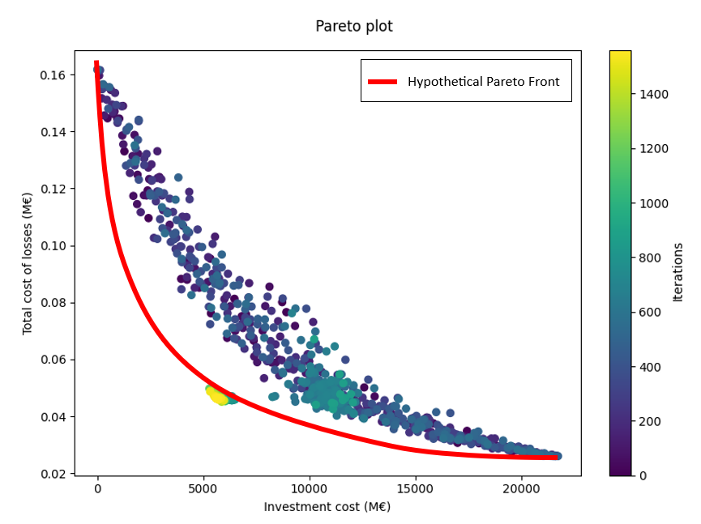

    Figure 1: MVRSM results with hypothetical improved Pareto front

NSGA-III Theory
_____________________
The Non-Dominated Sorting Genetic Algorithm III is an evolutionary (genetic) algorithm designed to find the Pareto curve of optimal solutions for multi-objective or
many-objective functions. It was implemented for this optimisation problem using Pymoo’s problem and algorithm library [2].

NSGA-III [3] starts by performing non-dominated sorting for its survival stage. It then assigns solutions to reference directions in the objective space. From the splitting front, solutions are selected, filling up the least represented reference directions
first. If a reference direction does not have any solution assigned to it, NSGA-III selects the solution with the smallest perpendicular distance in the normalised objective space to survive. If a second solution is added to a reference direction, it is
assigned randomly to maintain diversity.

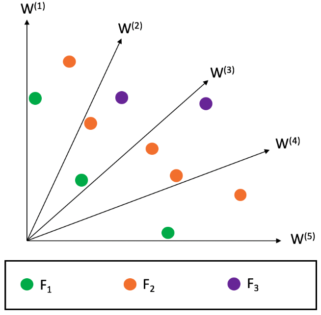

    Figure 2: (a) Non-dominated sorting (b) Points assigned to reference lines

As NSGA-III converges, each reference direction seeks to find a representative non-
dominated solution, eventually achieving a balanced distribution of solutions across
the Pareto front.

Hypertuning
_____________________

The carefully tuned parameters that direct the algorithm are explained below, with
comparisons shown where necessary, to validate the settings chosen. The algorithm
was simulated several times on the investment grid in Figure 6, to test which parameters most effectively solved the minimisation problem.

Population Size
~~~~~~~~~~~~~~~~~~~~~
The population size refers to the number of individuals in each generation of the
algorithm. In this case, it represents the pool of investment configurations sampled
by NSGA-III. When trying different scale factors, it was discovered that using a population size equal to a fraction, such as one-fifth, of the total number of investments
produced the best Pareto curve. This may be because if the population size is too
high, it is more likely that suboptimal solutions begin to dominate the population
over time; genetic drift. This may cause the solutions to converge prematurely to
suboptimal regions of the Pareto front. The population size should not be too low,
however, as the algorithm may struggle to adequately explore the solution space.

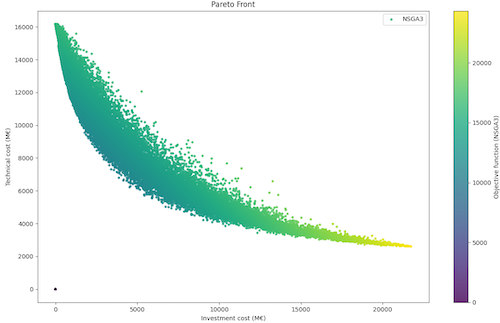

    Figure 3: (a) Dimension scaled by 2 has shallow curvature

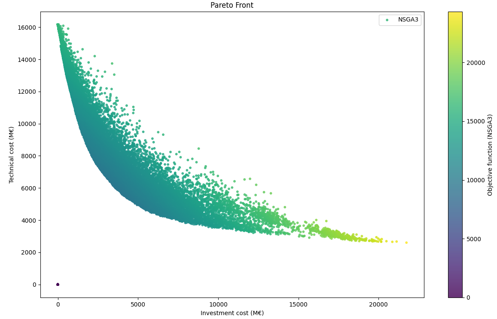

     (b) Dimension scaled by 0.2 provides finds more optimal solutions due to its deeper curve

Reference Directions
~~~~~~~~~~~~~~~~~~~~~
The reference direction used during the optimisation defines its rows as the reference lines and its columns the variables. This partitions the points in the objective
space and assigns each variable to a line. The reference direction is set equal to
the population size for this problem, since we would like to obtain a solution for
all inputs. A smaller value would partition the points with larger spacing, reducing
the number of points identified and therefore possibly inadvertently discarding some
optimal solutions, as shown in the sparse vs full plots in Figure 4. The algorithm’s
construction does not allow for reference lines to go above the population size, so
the maximum number of partitions is the population’s dimension.

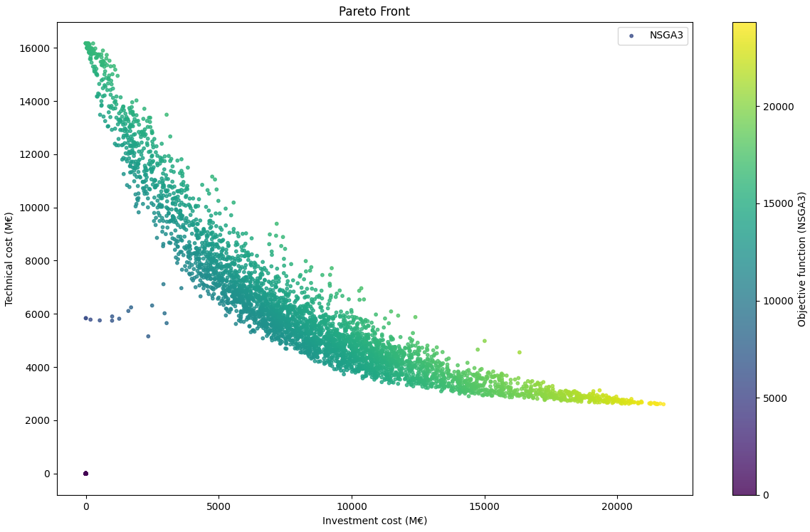

    Figure 4: (a) No. partitions = population size / 10

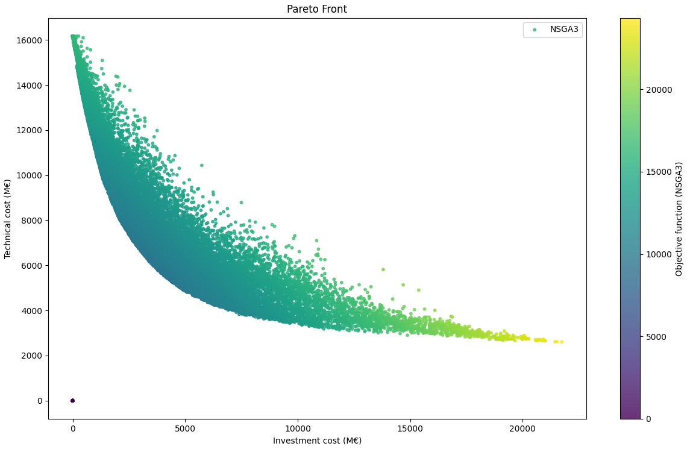

     (b) No. partitions = population size

There are also different types of reference direction sources: The uniform and das-
dennis methods generate an even distribution of points across the objective space,
providing a balanced exploration of solutions. However, they are not effective for
nonlinear problems. The energy generation distributes the reference directions more
densely in regions of high energy. This prioritises sampling in areas with significant variations in objective values, improving the coverage of the Pareto front. This
type works well for the problem at hand. The reduction type reduces overlap between reference directions, without sacrificing exploration, which effectively solves
our multi-objective problem, whilst also removing any unnecessary computation

Sampling Technique
~~~~~~~~~~~~~~~~~~~~~

The sampling process defines the initial set of solutions; from which NSGA-III starts
its optimisation. The choice of sampling technique is significant, as it influences the
diversity and coverage of the initial population, a poor choice potentially resulting
in restricted exploration of the solution space.

There are several types of sampling techniques available in Pymoo, including integer,
float and binary random sampling and latin hypercube sampling. It is also possible to
write a personalised sampling method. For this case, since the variables are binary,
and a systematic sampling method is desired to explore the entire Pareto front, a
binary uniform sampling method was created. Figure 5 presents the different types
of sampling, the first three are unable to explore points past an investment cost of
≈12000 MC, whereas binary uniform explores the entire front past 20000 MC.

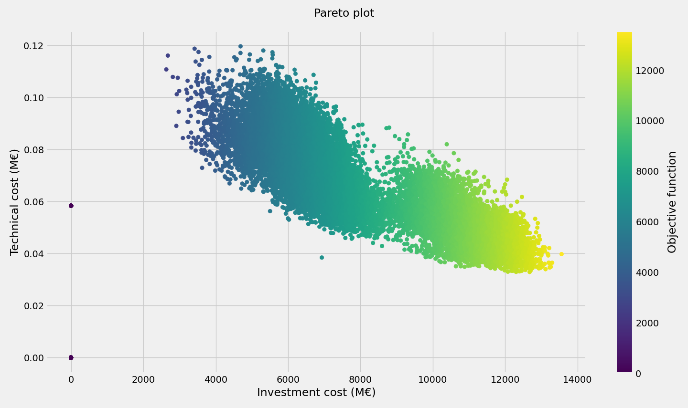

    Figure 5: (a) latin hypercube sampling

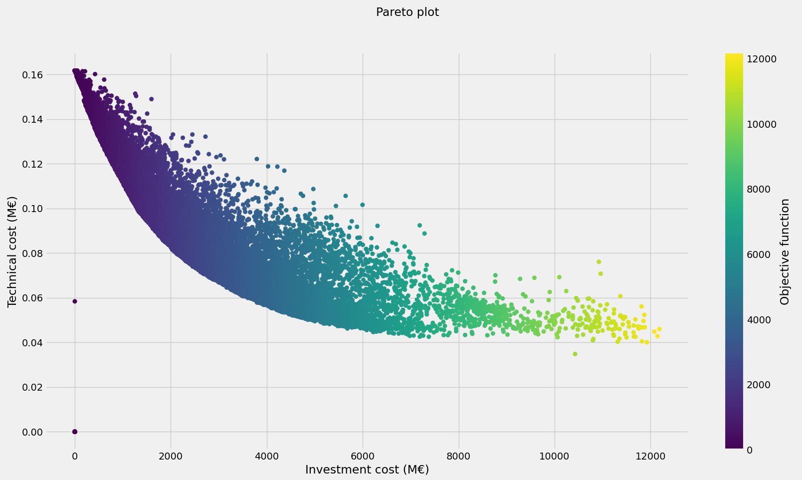

    (b) integer random

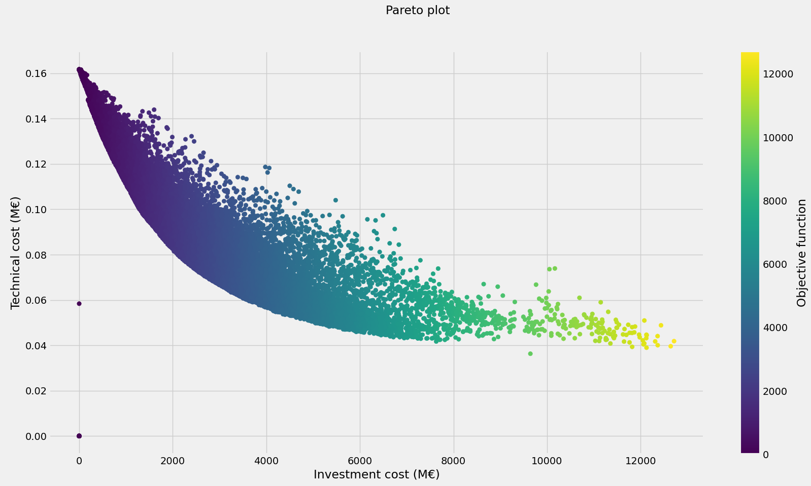

    (c) binary random

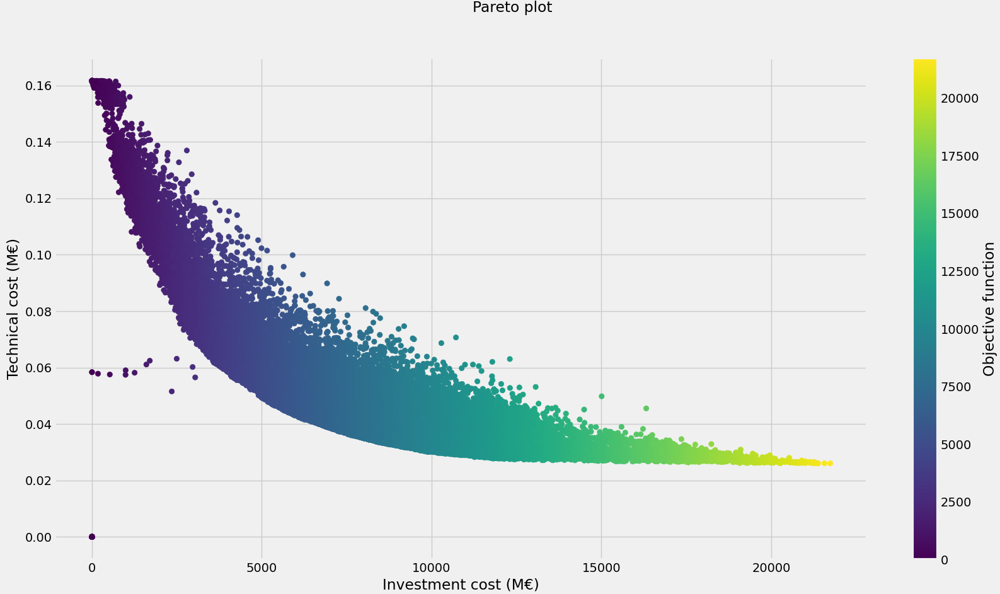

    (d) binary uniform

Selection
~~~~~~~~~~~~~~~~~~~~~

A genetic algorithm requires a mating selection so that parents are selected for each
generation to produce new offspring using different recombinations and mutation
operators. Different strategies for selecting parents are available, such as random,
neighborhood, and tournament (to introduce some selection pressure).
This is set to random since we would like to shuffle and thoroughly explore all
possible combinations, in the hope of finding all optimal solutions.

Crossover
~~~~~~~~~~~~~~~~~~~~~

The crossover operator combines genetic information from parent individuals to create offspring during evolution. The best probability found was a high value, close to
1, which ensured that offspring were frequently generated through recombination
of parent solutions, promoting genetic diversity. This encourages further exploration
of the solution space.

Mutation
~~~~~~~~~~~~~~~~~~~~~

Performing mutation after crossover introduces random changes to individual solutions through each generation. A higher probability of mutation increases the
diversity in the population, potentially leading to the discovery of more optimal solutions. However, very high mutation may result in the loss of good solutions if they
are changed or lost during evolution. It was therefore set to 0.5 to ensure a balance
between exploration and exploitation.

Crowding Distance
~~~~~~~~~~~~~~~~~~~~~

The eta value, which defines the crowding distance, influences the degree of curvature in the Pareto front. It was set to a high value between 10 and 30 which produced
the most curvature due to a greater dispersion of solutions along the Pareto front.

Results
_____________________
The two algorithms were tested on the 130-bus grid (Figure 6) prepared with 389
Investment Candidates including lines and buses in order to visually compare their
performances.

.. figure:: ../figures/investments/130bus_grid_diagram.png
    :alt: 130bus-grid diagram
    :align: center
    :scale: 20 %

    Figure 6: 130-bus grid for evaluating investments

After testing for an equal amount of time, the plots in Figure 7 proves the NSGA-
III outperforms MVRSM and fully explores the Pareto frontier, passing through the
concentrated MVRSM area as predicted.

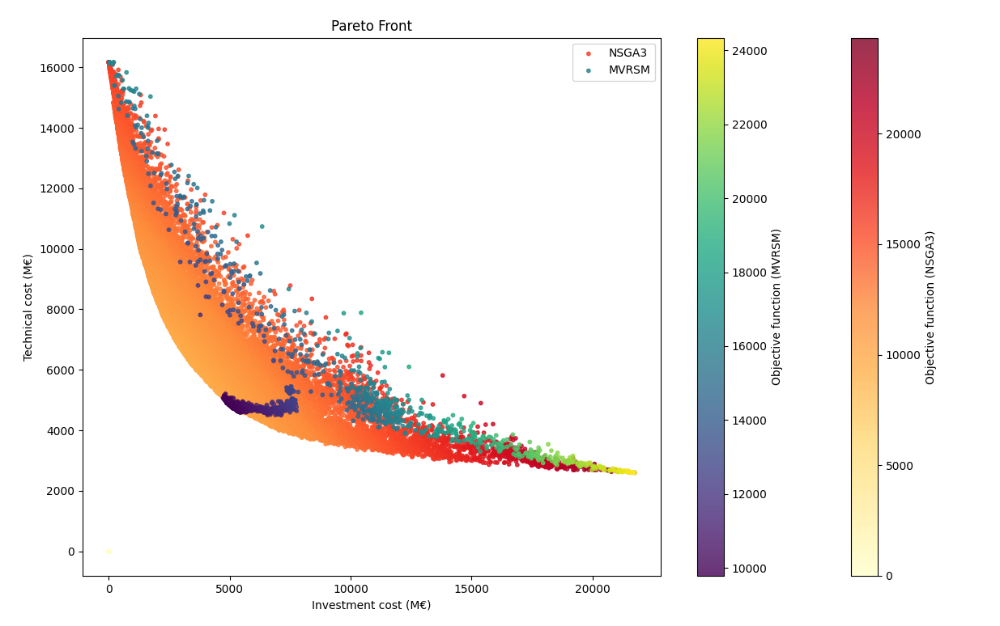

    Figure 7: Pareto front comparison after 10 minutes of simulation

In addition to this, NSGA-III is approximately 25 times faster, computationally, which
is a promising result for future evaluation on larger grids. Though it still takes a
significant amount of time to generate a very smooth and complete curve, a plot
more optimal than MVRSM’s can still be produced with few iterations.

.. table:: Optimum Parameter Configuration:

   +------------------+-------------------+
   | Parameter name   | Setting           |
   +==================+===================+
   | Population size  | No. investment groups / 5 |
   +------------------+-------------------+
   | No. partitions   | Population size          |
   +------------------+-------------------+
   | Sampling         | Binary uniform           |
   +------------------+-------------------+
   | Crossover        | Probability 0.8          |
   +------------------+-------------------+
   | Mutation         | Probability 0.5          |
   +------------------+-------------------+
   | Eta              | 30                       |
   +------------------+-------------------+

Future Development
_____________________

Improvement at this stage would involve creating a surrogate model in order to
decrease the time taken to evaluate the investments. Though faster than MVRSM,
NSGA-III still takes some time to run, which we would ideally like to reduce.

As seen by the scatter plot, many points that are distant to the optimal frontier are stored. By eliminating these, the memory and time taken could be lowered.

To ensure robustness of this algorithm, it should be tested on multiple grids, including simpler and smaller, and more complex and larger systems.

References
_____________________
[1] https://github.com/SanPen/GridCal/blob/204_investments_evaluation/doc/rst_source/theory/investments_evaluation.rst

[2] https://pymoo.org/algorithms/moo/nsga3.html

[3] K. Deb and H. Jain, ”An Evolutionary Many-Objective Optimization Algorithm Using Reference-Point-Based Nondominated Sorting Approach, Part I: Solving Problems With Box Constraints,” in IEEE Transactions on Evolutionary Computation, vol. 18, no. 4, pp. 577-601, Aug. 2014, doi: 10.1109/TEVC.2013.2281535. https://ieeexplore.ieee.org/stamp/stamp.jsp?tp=&arnumber=6600851

[4] K. Deb, A. Pratap, S. Agarwal and T. Meyarivan, ”A fast and elitist multiobjective genetic algorithm: NSGA-II,” in IEEE Transactions on Evolutionary Computation, vol. 6, no. 2, pp. 182-197, April 2002, doi: 10.1109/4235.996017. https://ieeexplore.ieee.org/document/996017

This document was authored by Cristina Fray on 6th May 2024.
