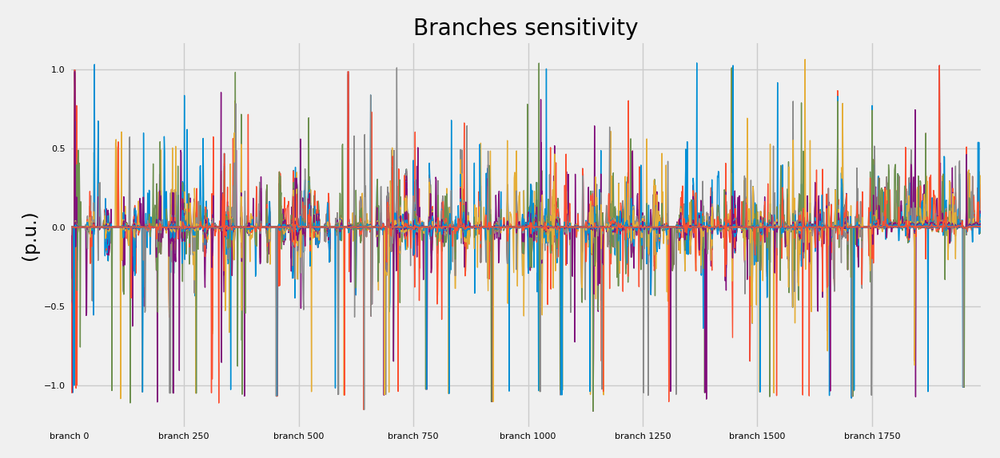

PTDF (Power Transmission Distribution Factors)
========================================================

GridCal features a PTDF simulation of the branches sensitivity to the generation variations.
This classic method is implemented in GridCal using two variants:

- Vary power by generator by generator.
- Vary power by generator technology group.
- Vary power by node (this is the most general case).

The simulation consists in:

A. Simulate a base power flow and collect the results.

B. Compute all the power variation vectors (:math:`Svaried`) either by generator or by group.
   These vector will have the same length as the number of nodes.

C. For every variation:

    C.1. run a power flow simulation with the varied power injections :math:`Sbus = Sbus_0 - Svaried`

    C.2. Collect the power flow results.

    C.3. Compute the branch sensitivity (:math:`PTDF_{i,j}`) as the power flow variation divided by the power generation variation.

    :math:`PTDF_{i,j} = \frac{Sbranch_{0j} - Sbranch_j}{power\_variation_i}`

This renders a simple method to identify how much power flow changed in a branch given the successive
generation diminishings.

    PTDF results for the Pegase 1354-bus grid.

VTDF (Voltage Transmission Distribution Factors)
======================================================================

We can extend the PTDF simple concept to the capture of other magnitudes' variation.
In this case we can capture the voltage module variation.

.. math::

    VTDF_{i,j} = \frac{V_{0j} - V_j}{power\_variation_i}

PTDF and VTDF times series
==========================================

To know the sensitivity is alright, but the real use of the PTDF and VTDF is to get estimations of the flows
and voltages in far less time than performing a normal time series simulation.

The formulation for the flows is:

.. math::

    Sbranch_{t,j} = Sbranch_{0, j} + PTDF_{i, j} \cdot power\_variation_{t,i}  \quad \forall j \in Branches, i \in Variations, t \in Time

Which in matrix form turns into:

.. math::

    Sbranch_t = Sbranch_{0} + PTDF \times power\_variation_t  \quad \forall  t \in Time

The voltage form is the same equation, replacing the magnitude of interest:

.. math::

    V_{t,j} = V_{0, j} + VTDF_{i, j} \cdot power\_variation_{t,i}  \quad \forall j \in Branches, i \in Variations, t \in Time

Which in matrix form turns into:

.. math::

    V_t = V_{0} + VTDF \times power\_variation_t  \quad \forall  t \in Time

The results of branch flow and voltage module for the IEEE39 with the weekly profiles
provided by GridCal is:

.. figure:: ../../figures/ptdf_ts.png

    PTDF results for the IEEE39 with a week's profile

.. figure:: ../../figures/vtdf.png

    VTDF results for the IEEE39 with a week's profile