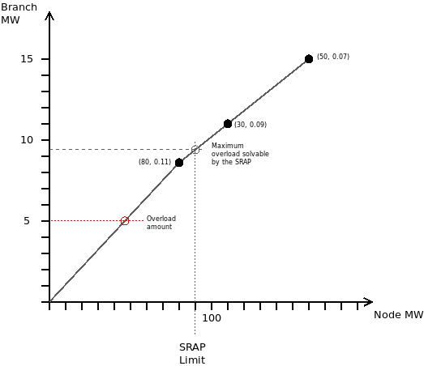

SRAP: Automatic Power Reduction System
========================================================

The Automatic Power Reduction System or SRAP from its acronym in Spanish is a mechanism that allows
to dismiss contingencies if they can be solved by generation increase or decrease.

The concept is better explained with an example:

Imagine that we have a line, that under a certain system contingency, overloads by 5 MW.
There are three plants that have been previously spotted as significant in such conditions:

- plant 1: Generating 80 MW, with 0.11 PTDF sensitivity.
- plant 2: Generating 30 MW, with 0.09 PTDF sensitivity.
- plant 3: Generating 50 MW, with 0.07 PTDF sensitivity.

We set the SRAP limit aribitrarily to 90 MW of generation shifting.

We construct a pair of arrays sorted by sensitivity:

- sensitivity = [0.11, 0.09, 0.07]
- p_availbale = [80, 30, 30]

With this, we contruct the function f = sensitivity * p_available.

Now, we find the cut point of the SRAP limit with this function. In this case 9.4.
This is the maximum overload that we can solve with our generation set.
Since 9.4 > 5, the overload can be solved with the SRAP mechanism, hence it can be dismissed.

A contingency study with SRAP activated can be run with the following commands:

.. code-block:: python

    con_options = ContingencyAnalysisOptions()
    con_options.use_srap = True
    con_options.engine = ContingencyEngine.PTDF

    con_drv = ContingencyAnalysisDriver(grid=grid,
                                        options=con_options,
                                        engine=EngineType.GridCal)

    con_drv.run()

Proceso:

- Cargar red con contingencias definidas
- Para cada contingencia:
    - Calcular PTDF equivalente PTDFc = MLODF[k, βδ] x PTDF[βδ, :] + PTDF[k, :]
    - Para cada linea sobrecargada sobrecarga (k):
        - Obtener la lista ordenada de generadores sensibles (usando PTDFc) en la línea k
        - con esta lista, calcular los genera que resuelven el SRAP

Proceso B:

- Cargar red con contingencias definidas
- para cada tiempo t:
    - Para cada contingencia:
        - si t == 0:
            - Calcular PTDF equivalente PTDFc = MLODF[k, βδ] x PTDF[βδ, :] + PTDF[k, :]
            - Obtener delta: dPTDFc = PTDF - PTDFc
          sino:
            - PTDFc = PTDF - dPTDFc

        - Para cada linea sobrecargada sobrecarga (k):
            - Obtener la lista ordenada de generadores sensibles (usando PTDFc) en la línea k
            - con esta lista, calcular los genera que resuelven el SRAP
