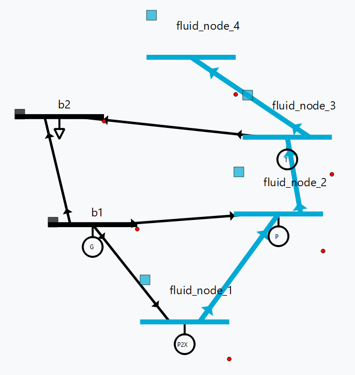

AC - Optimal Power Flow using an Interior Point Solver
==========================================================

Planning the generation for a given power network is typically done using DC - Optimal Power Flow, a method that relies on approximating the power flow as a linear problem to speed up the process in exchange of precision.
There are works that seek to solve the full non-linear problem, being one of the most relevant the MATPOWER software. The work described in this technical note integrates the Matpower Interior Point Solver in the GridCal environment using Python with the goal of adding new electrical modelling functionalities (such as including transformer operating point optimization or relaxation of the constraints to have a faster case study methodology).

The present document outlines the main additions in this regard, including:

- The model construction from a GridCal object.
- Objective function and constraints definition.
- KKT conditions and Newton-Raphson method.
- Interior Point Solver.
- Optimization output.

1. Grid model
---------------
The two main objects needed to build an electrical grid are buses and branches. The buses are the points where consumption and generation of electricity occur, and branches are the interconnections between buses that transport electricity from points with excess of generation to points lacking electricity. Some of this buses, known as *slack* buses, serve as references for voltage modulus and phase for the rest of the buses.

The final topology of the grid will be given by bus connectivity matrices, where the standard direction of the flow is also stored identifying the *from* and the *to* buses as the origin and destination respectively. This distinction is important, as it will determine the direction of the flow alongside the sign of the branch power.

Generators are the third object that have to be considered when modelling the electrical grid. We need at least 1 generator in order for the grid to have any sense. If only on bus has a generator, we directly identify this node as the *slack* bus. With more generator buses, we will identify those who will be teh reference of the grid (typically will be buses with high and stable power capacity).
Each grid has its generator connectivity matrix, and each generator has its own cost function, considered to be quadratic in this work as shown in the following chapters.

Operational limits of each elements have to be gathered to establish the constraints for buses, lines and generators.

GridCal objects are identified by the class *NumericalCircuit*, which can be abreviated as *nc*. We can extract from them all the information needed to construct the grid model as shown in the following table:

Numerical Circuit data
^^^^^^^^^^^^^^^^^^^^^^^^^^^^^^^^^^^^^^^^^^^^^^^^^^^^^^^^^^^^

.. table::

    =============  ================  ========  ================================================
        name          class_type       unit                      descriptions                  
    =============  ================  ========  ================================================
    slack          Array(int)                  Array with the slack IDs.
    no_slack       Array(int)                  Array with the rest of the buses IDs.
    from_idx       Array(int)                  Array with the *from* buses IDs.
    to_idx         Array(int)                  Array with the *to* buses IDs.
    Ybus           Matrix(complex)             Bus admittance matrix.
    Yf             Matrix(complex)             *From* admittance matrix.
    Yt             Matrix(complex)             *To* admittance matrix.
    Cg             Matrix(int)                 Generator connectivity matrix.
    Cf             Matrix(int)                 *From* connectivity matrix.
    Ct             Matrix(int)                 *To* connectivity matrix.
    Sbase          float             MW        Base power for per unit conversion.
    Sd             Array(complex)    MVA       Array with the complex power loads per bus.
    Pg_max         Array(float)      MW        Array with the upper bound for active power per generator.
    Pg_min         Array(float)      MW        Array with the lower bound for active power per generator.
    Qg_max         Array(float)      Mvar      Array with the upper bound for reactive power per generator.
    Qg_min         Array(float)      Mvar      Array with the lower bound for reactive power per generator.
    Vm_max         Array(float)      p.u.      Array with the upper bound for voltage magnitude per bus.
    Vm_min         Array(float)      p.u.      Array with the lower bound for voltage magnitude per bus.
    Va_max         Array(float)      rad       Array with the upper bound for phase per bus.
    Va_min         Array(float)      rad       Array with the lower bound for phase per bus.
    rates          Array(float)      MVA       Array with the upper bound for line loading per branch.
    c0             Array(float)      €         Array with the base cost per generator.
    c1             Array(float)      €/MWh     Array with the linear cost per generator.
    c2             Array(float)      €/MWh^2   Array with the quadratic cost per generator.

    =============  ================  ========  ================================================

Once all the necessary data has been loaded from the *NumericalCircuit* object, the optimization is ready to run. We will see now the mathematical definition of the problem.

2. Variables, objective function and constraints definition
--------------------------
The problem to be solved has the following structure:

.. math::
    min f(x)\\
    s.t.    g(x) = 0\\
            h(x) \geq 0

2.1. Variables
^^^^^^^^^^^^^^^^^^^^^^^^^^^^^^^^^^^^^^^^^^^^^^^^^^^^^^^^^^^^
The optimization variables of this problem are:

* **Voltage magnitude** (*v*) of all the buses included in the grid. Note that there is no distinction for slack or PV buses. During a PowerFlow evaluation, these buses would have a known voltage magnitude value, but for this AC-OPF evaluation, we set it as free to avoid overconstraining the model (and also considering them as a variable to optimize).
* **Voltage angle** (* :math:`\theta` *) of all the buses. We will later see that we consider one bus (the primary *slack* bus) as the reference angle 0 to eliminate the rotating nature of the power flow equations.
* **Active power generation** (P_g) of all the generators.
* **Reactive power generation** (Q_g) of all the generators.

2.2 Objective function
^^^^^^^^^^^^^^^^^^^^^^^^^^^^^^^^^^^^^^^^^^^^^^^^^^^^^^^^^^^^
The objective function of an AC-OPF can be defined in many different ways, depending on what are we trying to minimize. We can opt to minimize the cost, heat losses, penalties due to overloads or demand mismatching...

In this model, the objective function to minimize corresponds to the sum of the costs of each generator, considered to be quadratic:

.. math::

    min f(v, \theta, P_g, Q_g) = c_2^T Pg^2 + c_1^T Pg + c_0

where :math:`c_2` , :math:`c_1` and :math:`c_0` are the vectors with quadratic, linear and constant costs of the generators.

2.3 Equality constraints
^^^^^^^^^^^^^^^^^^^^^^^^^^^^^^^^^^^^^^^^^^^^^^^^^^^^^^^^^^^^
The equality constraints present in the model are the nodal power injection equations, which have to be accomplished. This set of equations ensure that the power exiting the node equals the power entering.

.. math::

    G_{S}[t,m] = S^{bus} + S_d - C_g S_g\\
    S^{bus} = [V]I_{bus}^* = [V]Y_{bus}^* V^*

There are additional equality balance for PV buses, those buses who have the same maximum and minimum voltage (which means, their voltage module is controlled) and one equality for the primary _slack_ bus, setting its angle as 0.

2.4 Inequality constraints
^^^^^^^^^^^^^^^^^^^^^^^^^^^^^^^^^^^^^^^^^^^^^^^^^^^^^^^^^^^^
The inequalities correspond to the operational limits for the voltage and power variables, which are dependant on the bus or generator, and the maximum power allowed through a line. This last conditions has to hold on both ends of the line:

.. math::

    H_{f} = S^{f^{*}} S^{f} - S_{max}^2\\
    H_{t} = S^{t^{*}} S^{t} - S_{max}^2

3. KKT conditions and Newton-Raphson method
^^^^^^^^^^^^^^^^^^^^^^^^^^^^^^^^^^^^^^^^^^^^^^^^^^^^^^^^^^^^
Once we have settled our grid model, we want to obtain the optimal solution of it, which will yield the lowest value possible for the objective function. Since we are facing a non-convex problem, there are multiple local optimal points for this problem. This has to be taken into account prior to make any statements about the solution. The point we obtain when solving these problem is a local optimal point, which can be potentially the global optimal point of the problem. More advanced methods will allow us to determine more accurately if there can be better operating points.
A general optimization problem, such as the one we are facing were no simplifications can be made, can be solved by imposing the KKT conditions over the variables of it and solving the resulting system of equations with a numerical method. Here, we use the Newton-Raphson method, explained in this section.

3.1 KKT conditions
^^^^^^^^^^^^^^^^^^^^^^^^^^^^^^^^^^^^^^^^^^^^^^^^^^^^^^^^^^^^
To formulate the problem using the KKT conditions, we will make use of associated multipliers and slack variables for our set of constraints. We can rewrite the optimization problem asa follows:

.. math::
    min f(x)\\
    s.t.    g(x) = 0\\
            h(x) + Z = 0
where :math:`Z` is the slack variable associated to the inequality constraints used to transform them into an equality. Then, we introduce the multipliers :math:`\lambda` and :math:`\mu`, which are associated to the equality and inequality constraints respectively. We can now write the expressions of the KKT conditions for the optimization problem:

.. math::
    L = \nabla f(x) + \lambda^T \nabla g(x) + \mu^T \nabla h(x) = 0 \\
    \mu Z - \gamma = 0  \\
    g(x) = 0 \\
    h(x) + Z = 0\\
    \mu, Z \geq 0

Note that the second condition makes use of the parameter :math:`\gamma`, which starts off at a non-zero value to improve convergence and is updated each iterative step tending to 0.
The last condition will be ensured avoiding steps that reduce below 0 both :math:`\mu`and Z, and not through a direct expression.

3.2 Newton-Raphson method
^^^^^^^^^^^^^^^^^^^^^^^^^^^^^^^^^^^^^^^^^^^^^^^^^^^^^^^^^^^^
To solve the previous system of equations, we make use of the Newton-Raphson method. The method consists on updating the vector of unknowns based on the following generalized step:

.. math::
    y_{i+1}  = y_i + \delta y_i = y_i - f(y_i)/f'(y_i)

In this optimization problem, we have a vector of unknowns composed by the following variables:

.. math::
    y = [x, \lambda, \mu, Z] \\
    x = [\theta, v, P_g, Q_g]

To find the optimization step :math:`\delta y_i`, we will solve the following matricial problem:

.. math::
    -J(y_i) \delta y_i = f(y_i)

Where J(y_i) is the jacobian matrix of the system of equations described in the previous section, and f(y_i) is a vector with the value of these expressions.
For this general optimization problem, we can reduce the size of this system using the same methodology used in MATPOWER's Interior Point Solver (MIPS), where the reduced system is the following:

.. math::

.. table::

    =============================  ================  ======  =================================================
    name                           class_type        unit    descriptions                                      
    =============================  ================  ======  =================================================
    fluid_node_current_level       float             hm3     Node level                                         
    fluid_node_flow_in             float             m3/s    Input flow from paths                                                                             
    fluid_node_flow_out            float             m3/s    Output flow from paths                                       
    fluid_node_p2x_flow            float             m3/s    Input flow from the P2Xs  
    fluid_node_spillage            float             m3/s    Lost flow                           
    =============================  ================  ======  =================================================

Path 
^^^^^^^^^^^^^^^^^^^^^^^^^^^^^^^^^^^^^^^^^^^^^^^^^^^^^^^^^^^^

.. table::

    =============================  ================  ======  =================================================
    name                           class_type        unit    descriptions                                      
    =============================  ================  ======  =================================================
    fluid_path_flow                     float         m3/s   Flow circulating through the path                                            
    =============================  ================  ======  =================================================

Injection (turbine, pump, P2X)
^^^^^^^^^^^^^^^^^^^^^^^^^^^^^^^^^^^^^^^^^^^^^^^^^^^^^^^^^^^^

.. table::

    =============================  ================  ======  =================================================
    name                           class_type        unit    descriptions                                      
    =============================  ================  ======  =================================================
    fluid_injection_flow                    float      m3/s   Flow injected by the device                                            
    =============================  ================  ======  =================================================

3. Practical example
--------------------
This section covers a practical case to exemplify how to build a grid containing fluid type devices, run the time-series linear optimization, and explore the results. Everything will be shown through GridCal's scripting functionalities.

Model initialization 
^^^^^^^^^^^^^^^^^^^^^^^^^^^^^^^^^^^^^^^^^^^^^^^^^^^^^^^^^^^^
.. code-block:: python

    grid = gce.MultiCircuit(name='hydro_grid')

    # let's create a master profile
    date0 = dt.datetime(2023, 1, 1)
    time_array = pd.DatetimeIndex([date0 + dt.timedelta(hours=i) for i in range(10)])
    x = np.linspace(0, 10, len(time_array))
    df_0 = pd.DataFrame(data=x, index=time_array)  # complex values

    # set the grid master time profile
    grid.time_profile = df_0.index

Add fluid side
^^^^^^^^^^^^^^^^^^^^^^^^^^^^^^^^^^^^^^^^^^^^^^^^^^^^^^^^^^^^
.. code-block:: python

    # Add some fluid nodes, with their electrical buses
    fb1 = gce.Bus(name='fb1')
    fb2 = gce.Bus(name='fb2')
    fb3 = gce.Bus(name='fb3')

    grid.add_bus(fb1)
    grid.add_bus(fb2)
    grid.add_bus(fb3)

    f1 = gce.FluidNode(name='fluid_node_1',
                       min_level=0.,
                       max_level=100.,
                       current_level=50.,
                       spillage_cost=10.,
                       inflow=0.,
                       bus=fb1)

    f2 = gce.FluidNode(name='fluid_node_2',
                       spillage_cost=10.,
                       bus=fb2)

    f3 = gce.FluidNode(name='fluid_node_3',
                       spillage_cost=10.,
                       bus=fb3)

    f4 = gce.FluidNode(name='fluid_node_4',
                       min_level=0,
                       max_level=100,
                       current_level=50,
                       spillage_cost=10.,
                       inflow=0.)

    grid.add_fluid_node(f1)
    grid.add_fluid_node(f2)
    grid.add_fluid_node(f3)
    grid.add_fluid_node(f4)

    # Add the paths
    p1 = gce.FluidPath(name='path_1',
                       source=f1,
                       target=f2,
                       min_flow=-50.,
                       max_flow=50.,)

    p2 = gce.FluidPath(name='path_2',
                       source=f2,
                       target=f3,
                       min_flow=-50.,
                       max_flow=50.,)

    p3 = gce.FluidPath(name='path_3',
                       source=f3,
                       target=f4,
                       min_flow=-50.,
                       max_flow=50.,)

    grid.add_fluid_path(p1)
    grid.add_fluid_path(p2)
    grid.add_fluid_path(p3)

    # Add electrical generators for each fluid machine
    g1 = gce.Generator(name='turb_1_gen',
                       Pmax=1000.0,
                       Pmin=0.0,
                       Cost=0.5)

    g2 = gce.Generator(name='pump_1_gen',
                       Pmax=0.0,
                       Pmin=-1000.0,
                       Cost=-0.5)

    g3 = gce.Generator(name='p2x_1_gen',
                       Pmax=0.0,
                       Pmin=-1000.0,
                       Cost=-0.5)

    grid.add_generator(fb3, g1)
    grid.add_generator(fb2, g2)
    grid.add_generator(fb1, g3)

    # Add a turbine
    turb1 = gce.FluidTurbine(name='turbine_1',
                             plant=f3,
                             generator=g1,
                             max_flow_rate=45.0,
                             efficiency=0.95)

    grid.add_fluid_turbine(f3, turb1)

    # Add a pump
    pump1 = gce.FluidPump(name='pump_1',
                          reservoir=f2,
                          generator=g2,
                          max_flow_rate=49.0,
                          efficiency=0.85)

    grid.add_fluid_pump(f2, pump1)

    # Add a p2x
    p2x1 = gce.FluidP2x(name='p2x_1',
                        plant=f1,
                        generator=g3,
                        max_flow_rate=49.0,
                        efficiency=0.9)

    grid.add_fluid_p2x(f1, p2x1)

Add remaining electrical side
^^^^^^^^^^^^^^^^^^^^^^^^^^^^^^^^^^^^^^^^^^^^^^^^^^^^^^^^^^^^
.. code-block:: python

    # Add the electrical grid part
    b1 = gce.Bus(name='b1',
                 vnom=10,
                 is_slack=True)

    b2 = gce.Bus(name='b2',
                 vnom=10)

    grid.add_bus(b1)
    grid.add_bus(b2)

    g0 = gce.Generator(name='slack_gen',
                       Pmax=1000.0,
                       Pmin=0.0,
                       Cost=0.8)

    grid.add_generator(b1, g0)

    l1 = gce.Load(name='l1',
                  P=11,
                  Q=0)

    grid.add_load(b2, l1)

    line1 = gce.Line(name='line1',
                     bus_from=b1,
                     bus_to=b2,
                     rate=5,
                     x=0.05)

    line2 = gce.Line(name='line2',
                     bus_from=b1,
                     bus_to=fb1,
                     rate=10,
                     x=0.05)

    line3 = gce.Line(name='line3',
                     bus_from=b1,
                     bus_to=fb2,
                     rate=10,
                     x=0.05)

    line4 = gce.Line(name='line4',
                     bus_from=fb3,
                     bus_to=b2,
                     rate=15,
                     x=0.05)

    grid.add_line(line1)
    grid.add_line(line2)
    grid.add_line(line3)
    grid.add_line(line4)

The resulting system is the one shown below.

Run optimization
^^^^^^^^^^^^^^^^^^^^^^^^^^^^^^^^^^^^^^^^^^^^^^^^^^^^^^^^^^^^
.. code-block:: python

    # Run the simulation
    opf_driver = gce.OptimalPowerFlowTimeSeriesDriver(grid=grid)

    print('Solving...')
    opf_driver.run()

    print("Status:", opf_driver.results.converged)
    print('Angles\n', np.angle(opf_driver.results.voltage))
    print('Branch loading\n', opf_driver.results.loading)
    print('Gen power\n', opf_driver.results.generator_power)

Results
^^^^^^^^^^^^^^^^^^^^^^^^^^^^^^^^^^^^^^^^^^^^^^^^^^^^^^^^^^^^

**Generation power, in MW**

+----------------------+-----------+-------------+--------------+------------+
| time                 | p2x_1_gen | pump_1_gen  | turb_1_gen   | slack_gen  |
+======================+===========+=============+==============+============+
| 2023-01-01 00:00:00  | 0.0       | -6.8237821  | 6.0          | 11.823782  |
+----------------------+-----------+-------------+--------------+------------+
| 2023-01-01 01:00:00  | 0.0       | -6.8237821  | 6.0          | 11.823782  |
+----------------------+-----------+-------------+--------------+------------+
| 2023-01-01 02:00:00  | 0.0       | -6.8237821  | 6.0          | 11.823782  |
+----------------------+-----------+-------------+--------------+------------+
| 2023-01-01 03:00:00  | 0.0       | -6.8237821  | 6.0          | 11.823782  |
+----------------------+-----------+-------------+--------------+------------+
| 2023-01-01 04:00:00  | 0.0       | -6.8237821  | 6.0          | 11.823782  |
+----------------------+-----------+-------------+--------------+------------+
| 2023-01-01 05:00:00  | 0.0       | -6.8237821  | 6.0          | 11.823782  |
+----------------------+-----------+-------------+--------------+------------+
| 2023-01-01 06:00:00  | 0.0       | -6.8237821  | 6.0          | 11.823782  |
+----------------------+-----------+-------------+--------------+------------+
| 2023-01-01 07:00:00  | 0.0       | -6.8237821  | 6.0          | 11.823782  |
+----------------------+-----------+-------------+--------------+------------+
| 2023-01-01 08:00:00  | 0.0       | -6.8237821  | 6.0          | 11.823782  |
+----------------------+-----------+-------------+--------------+------------+
| 2023-01-01 09:00:00  | 0.0       | -6.8237821  | 6.0          | 11.823782  |
+----------------------+-----------+-------------+--------------+------------+

**Fluid node level, in m3**

+----------------------+--------------+--------------+--------------+--------------+
| time                 | fluid_node_1 | fluid_node_2 | fluid_node_3 | fluid_node_4 |
+======================+==============+==============+==============+==============+
| 2023-01-01 00:00:00  | 49.998977    | 0.0          | 0.0          | 50.001023    |
+----------------------+--------------+--------------+--------------+--------------+
| 2023-01-01 01:00:00  | 49.997954    | 0.0          | 0.0          | 50.002046    |
+----------------------+--------------+--------------+--------------+--------------+
| 2023-01-01 02:00:00  | 49.996931    | 0.0          | 0.0          | 50.003069    |
+----------------------+--------------+--------------+--------------+--------------+
| 2023-01-01 03:00:00  | 49.995907    | 0.0          | 0.0          | 50.004093    |
+----------------------+--------------+--------------+--------------+--------------+
| 2023-01-01 04:00:00  | 49.994884    | 0.0          | 0.0          | 50.005116    |
+----------------------+--------------+--------------+--------------+--------------+
| 2023-01-01 05:00:00  | 49.993861    | 0.0          | 0.0          | 50.006139    |
+----------------------+--------------+--------------+--------------+--------------+
| 2023-01-01 06:00:00  | 49.992838    | 0.0          | 0.0          | 50.007162    |
+----------------------+--------------+--------------+--------------+--------------+
| 2023-01-01 07:00:00  | 49.991815    | 0.0          | 0.0          | 50.008185    |
+----------------------+--------------+--------------+--------------+--------------+
| 2023-01-01 08:00:00  | 49.990792    | 0.0          | 0.0          | 50.009208    |
+----------------------+--------------+--------------+--------------+--------------+
| 2023-01-01 09:00:00  | 49.989768    | 0.0          | 0.0          | 50.010232    |
+----------------------+--------------+--------------+--------------+--------------+

**Path flow, in m3/s**

+----------------------+----------+----------+----------+
| time                 | path_1   | path_2   | path_3   |
+======================+==========+==========+==========+
| 2023-01-01 00:00:00  | 0.284211 | 0.284211 | 0.284211 |
+----------------------+----------+----------+----------+
| 2023-01-01 01:00:00  | 0.284211 | 0.284211 | 0.284211 |
+----------------------+----------+----------+----------+
| 2023-01-01 02:00:00  | 0.284211 | 0.284211 | 0.284211 |
+----------------------+----------+----------+----------+
| 2023-01-01 03:00:00  | 0.284211 | 0.284211 | 0.284211 |
+----------------------+----------+----------+----------+
| 2023-01-01 04:00:00  | 0.284211 | 0.284211 | 0.284211 |
+----------------------+----------+----------+----------+
| 2023-01-01 05:00:00  | 0.284211 | 0.284211 | 0.284211 |
+----------------------+----------+----------+----------+
| 2023-01-01 06:00:00  | 0.284211 | 0.284211 | 0.284211 |
+----------------------+----------+----------+----------+
| 2023-01-01 07:00:00  | 0.284211 | 0.284211 | 0.284211 |
+----------------------+----------+----------+----------+
| 2023-01-01 08:00:00  | 0.284211 | 0.284211 | 0.284211 |
+----------------------+----------+----------+----------+
| 2023-01-01 09:00:00  | 0.284211 | 0.284211 | 0.284211 |
+----------------------+----------+----------+----------+
