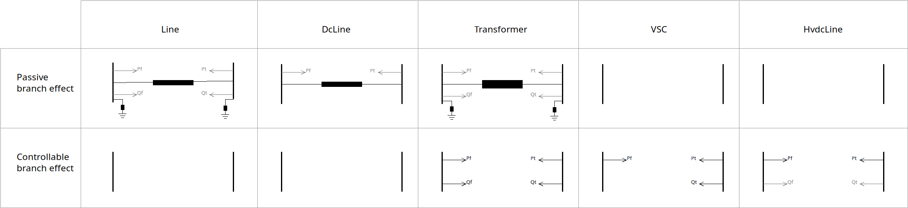

.. _generalized_power_flow:

Generalized Power Flow
=============================

This formulation of a generalized power flow was introduced in the Master Thesis
of Raiyan Bin Zulkifli in 2024 (Generalised AC/DC Power Flow at UPC university).

The linearized system is:

.. math::

    \left[
    \begin{matrix}
        \Delta P  \quad \forall ik_P\\
        \Delta Q \quad  \forall ik_Q\\
        \Delta L^{vsc} \quad \forall vsc  \\
        \Delta L^{hvdc} \quad \forall hvdc   \\
        \Delta P_{f}^{hvdc} \quad \forall hvdc \\
        \Delta P_{f}^{cbr} \quad \forall k_{cbr}^{Pf}\\
        \Delta P_{t}^{cbr} \quad \forall k_{cbr}^{Pt}\\
        \Delta Q_{f}^{cbr} \quad \forall k_{cbr}^{Qf}\\
        \Delta Q_{t}^{cbr} \quad \forall k_{cbr}^{Qt}
    \end{matrix}
    \right]
    =
    \left[
        J
    \right]
    \times
    \left[
    \begin{matrix}
        \Delta Vm \quad \forall iu_{Vm}  \\
        \Delta Va \quad \forall iu_{Va} \\
        \Delta P_{f}^{vsc} \quad \forall u_{vsc}^{P_f}\\
        \Delta P_{t}^{vsc} \quad \forall u_{vsc}^{P_t}\\
        \Delta Q_{t}^{vsc} \quad \forall u_{vsc}^{Q_t}\\
        \Delta P_{f}^{hvdc} \quad \forall hvdc\\
        \Delta P_{t}^{hvdc} \quad \forall hvdc\\
        \Delta Q_{f}^{hvdc} \quad \forall hvdc\\
        \Delta Q_{t}^{hvdc} \quad \forall hvdc\\
        \Delta m \quad \forall u_{cbr}^{m}  \\
        \Delta \tau \quad \forall u_{cbr}^{\tau}
    \end{matrix}
    \right]

The jacobian is not explicitly depicted because it will not render due to its massive size.
However, one can compose it from the unknowns and the residuals vectors.

Bus indices:

- :math:`iu_{Vm}` -> indices of buses where Vm is unknown.
- :math:`iu_{Va}` -> indices of buses where Va is unknown.
- :math:`ik_P` -> indices of nodes where P is set.
- :math:`ik_Q` -> indices of nodes where Q is set.

Controllable branch indices:

- :math:`cbr_{m}` -> Indices of the controllable branches that are using m to control.
- :math:`cbr_{\tau}` -> Indices of the controllable branches that are using tau to control.

- :math:`cbr=cbr_{m} \cup cbr_{\tau}` -> Indices of the controllable branches controlling with either m or tau.

- :math:`k_{cbr}^{Pf}` -> Indices of the controllable branches where Pf is controlled.
- :math:`k_{cbr}^{Pt}` -> Indices of the controllable branches where Pt is controlled.
- :math:`k_{cbr}^{Qt}` -> Indices of the controllable branches where Qf is controlled.
- :math:`k_{cbr}^{Qt}` -> Indices of the controllable branches where Qt is controlled.

VSC indices:

- :math:`vsc` -> Indices of the VSC converters.
- :math:`u_{vsc}^{Pf}` -> Indices of the VSC converters where Pf is unknown.
- :math:`u_{vsc}^{Pt}` -> Indices of the VSC converters where Pt is unknown.
- :math:`u_{vsc}^{Qt}` -> Indices of the VSC converters where Qt is unknown.
- :math:`k_{vsc}^{Pf}` -> Indices of the VSC converters where Pf is known.
- :math:`k_{vsc}^{Pt}` -> Indices of the VSC converters where Pt is known.
- :math:`k_{vsc}^{Qt}` -> Indices of the VSC converters where Qt is known.

HVDC indices:

- :math:`hvdc` -> Indices of the HVDC links.

Variables (unknowns):

- :math:`\Delta V_m` -> Voltage modules @ :math:`iu_{Vm}` -> indices of buses where Vm is unknown.
- :math:`\Delta V_a` -> Voltage angles @ :math:`iu_{Va}` -> indices of buses where Va is unknown.

- :math:`\Delta P_f^{vsc}` -> Active power "from" at VSC converters. @ :math:`u_{vsc}^{P_f}`
- :math:`\Delta P_t^{vsc}` -> Active power "to" at VSC converters. @ :math:`u_{vsc}^{P_t}`
- :math:`\Delta Q_t^{vsc}` -> Reactive power "to" at VSC converters. @ :math:`u_{vsc}^{Q_t}`

- :math:`\Delta P_f^{hvdc}` -> Active power "from" at HVDC lines. @ :math:`hvdc`.
- :math:`\Delta P_t^{hvdc}` -> Active power "to" at HVDC lines. @ :math:`hvdc`.
- :math:`\Delta Q_f^{hvdc}` -> Reactive power "from" at HVDC lines. @ :math:`hvdc`.
- :math:`\Delta Q_t^{hvdc}` -> Reactive power "to" at HVDC lines. @ :math:`hvdc`.

- :math:`\Delta m` -> Tap modules of the controllable branches that are controlling with :math:`m` @ :math:`u_{cbr}^{m}`
- :math:`\Delta \tau` -> Tap angles of the controllable branches that are controlling with :math:`\tau`@ :math:`u_{cbr}^{\tau}`

Controls (knowns)

- :math:`\Delta P` -> Active power mismatch for the buses @ :math:`ik_P` -> indices of nodes where P is set.
- :math:`\Delta Q` -> Reactive power mismatch for buses @ :math:`ik_Q` -> indices of nodes where Q is set.

- :math:`\Delta L_{vsc}` -> Power loss equation mismatch for the VSC devices @ :math:`vsc`

- :math:`\Delta L_{hvdc}` -> Power loss equation mismatch for the HVDC devices @ :math:`hvdc`
- :math:`\Delta P_{f}^{hvdc}` -> Power injected at the from or to side of HVDC devices depending on the HVDC angle droop eq. sign @ :math:`hvdc`

- :math:`\Delta P_f^{cbr}` -> Pf mismatch for controllable branches @ :math:`k_{cbr}^{Pf}`
- :math:`\Delta P_t^{cbr}` -> Pt mismatch for controllable branches @ :math:`k_{cbr}^{Pt}`
- :math:`\Delta Q_f^{cbr}` -> Qf mismatch for controllable branches @ :math:`k_{cbr}^{Qf}`
- :math:`\Delta Q_t^{cbr}` -> Qt mismatch for controllable branches @ :math:`k_{cbr}^{Qt}`

Set points

- :math:`S_{esp}`: array of nodal specified power
- :math:`Pset_{f}^{cbr}`: Controllable branch Pf set point
- :math:`Pset_{t}^{cbr}`: Controllable branch Pt set point
- :math:`Qset_{f}^{cbr}`: Controllable branch Qf set point
- :math:`Qset_{t}^{cbr}`: Controllable branch Qt set point

- :math:`Pset_{f}^{vsc}`: VSC Pf set point
- :math:`Pset_{t}^{vsc}`: VSC Pt set point
- :math:`Qset_{t}^{vsc}`: VSC Qt set point

- :math:`P0_{hvdc}`: HVDC P set point

Equations:

Buses
_________________________

Increment of nodal injection power:

.. math::

    \Delta S = S_{esp} - S_{calc}

Nodal injection due to the passive branches:

.. math::

    S_{calc}^{passive} = V \cdot (Y \times V)^*

Nodal injection due to the controllable branches:

.. math::

    S_{calc}^{cbr} = C_f^{cbr} \times (P_f^{cbr} + j \cdot Q_f^{cbr}) + C_t^{cbr} \times (P_t^{cbr} + j \cdot Q_t^{cbr})

Nodal injection due to the VSC's:

.. math::

    S_{calc}^{vsc} = C_f^{vsc} \times P_f^{vsc} + C_t^{vsc} \times S_t^{vsc}

Nodal injection due to the HVDC lines:

.. math::

    S_{calc}^{hvdc} = C_f^{hvdc} \times S_f^{hvdc} + C_t^{hvdc} \times S_t^{hvdc}

The total calculated nodal injections:

.. math::

    S_{calc} = S_{calc}^{passive} + S_{calc}^{cbr} + S_{calc}^{vsc} + S_{calc}^{hvdc}

Controllable branches
_________________________

.. math::

    S_f^{cbr} = {{V_m}_f^2} \cdot {y_{ff}}_{k}^* + {V_m}_f^{\angle{\theta_f}} \cdot {V_m}_t^{\angle{-\theta_t}}  \cdot  {y_{ft}}_{k}^*

.. math::

    S_t^{cbr} = {{V_m}_t^2} \cdot {{y_{tt}}_{k}^*} + {V_m}_f^{\angle{-\theta_f}} \cdot {V_m}_t^{\angle{\theta_t}}  \cdot  {y_{tf}}_{k}^*

.. math::

    \Delta P_{f}^{cbr} = Pset_{f}^{cbr} - P_f^{cbr} \quad \forall k_{cbr}^{Pf}

.. math::

    \Delta P_{t}^{cbr} = Pset_{t}^{cbr} - P_t^{cbr} \quad \forall k_{cbr}^{Pt}

.. math::

    \Delta Q_{f}^{cbr} = Qset_{f}^{cbr} - Q_f^{cbr} \quad \forall k_{cbr}^{Qf}

.. math::

    \Delta Q_{t}^{cbr} = Qset_{t}^{cbr} - Q_t^{cbr} \quad \forall k_{cbr}^{Qt}

VSC
_____

We compose :math:`P_f^{vsc}` and :math:`P_t^{vsc}` and :math:`Q_t^{vsc}` from
the controlled values and the unknown values as follows:

.. math::

    P_f^{vsc}[k_{vsc}^{Pf}] = Pset_{f}^{vsc}

.. math::

    P_t^{vsc}[k_{vsc}^{Pt}] = Pset_{t}^{vsc}

.. math::

    Q_t^{vsc}[k_{vsc}^{Qt}] = Qset_{t}^{vsc}

.. math::

    P_f^{vsc}[u_{vsc}^{Pf}] = P_{f}^{vsc}

.. math::

    P_t^{vsc}[u_{vsc}^{Pt}] = P_{t}^{vsc}

.. math::

    Q_t^{vsc}[u_{vsc}^{Qt}] = Q_{t}^{vsc}

VSC "from" power injection. Notice that the from sides of the VSC devices is the DC side, hence there is
no reactive power.

.. math::

    P_f^{vsc} =  L_{vsc} - P_t^{vsc}

VSC losses:

.. math::

    L_{vsc} = A + B \cdot \frac{\sqrt{{P_t^{vsc}}^2 + {Q_t^{vsc}}^2}}{Vm_t} + C \cdot \frac{{P_t^{vsc}}^2 + {Q_t^{vsc}}^2}{Vm_t^2}

VSC "to" power injection:

.. math::

    S_t^{vsc} = P_t^{vsc} + 1j \cdot Q_t^{vsc}

VSC Losses increment:

.. math::

    \Delta L_{vsc} = P_f^{vsc}  + P_t^{vsc} - L_{vsc}

HVDC
__________

.. math::

    P_f^{hvdc} = L_{hvdc} - P_t^{hvdc}

HVDC line losses:

.. math::

    L_{hvdc} = r \cdot {\frac{P_f^{hvdc}}{Vm_f}}^2

HVDC line power "from" injection control equation.

.. math::

    P_{f}^{hvdc} = P0_{hvdc} + k_{hvdc} \cdot (Va_f - Va_t)

HVDC Lie power at the "from" side:

.. math::

    S_f^{hvdc} = P_f^{hvdc} + 1j \cdot Q_f^{hvdc}

HVDC Lie power at the "to" side:

.. math::

    S_t^{hvdc} = P_t^{hvdc} + 1j \cdot Q_t^{hvdc}

HVDC Line losses:

.. math::

    \Delta L_{hvdc} = P_f^{hvdc} + P_t^{hvdc} - L_{hvdc}

Equation to make the calculated power match the control value:

.. math::

    \Delta P_{f}^{hvdc} = P_f^{hvdc} - P_{f}^{hvdc}

