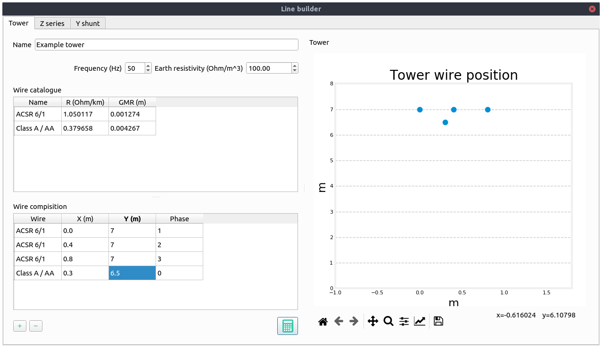

.. _line_definition_from_tower:

Definition of a line from the wire configuration
-------------------------------------------------

**Definition of the exercise**

In this tutorial we are going to define a 3-phase line with 4 wires of two different types.

The cable types are the following:

+--------------+----------+-----+----------+-------------+
| name         | r        | x   | gmr      | max_current |
+--------------+----------+-----+----------+-------------+
| ACSR 6/1     | 1.050117 | 0.0 | 0.001274 | 180.0       |
+--------------+----------+-----+----------+-------------+
| Class A / AA | 0.379658 | 0.0 | 0.004267 | 263.0       |
+--------------+----------+-----+----------+-------------+

These are taken from the data_sheets__ section

The layout is the following:

+--------------+------+------+-------+
| Wire         | x(m) | y(m) | Phase |
+--------------+------+------+-------+
| ACSR 6/1     | 0    | 7    | 1 (A) |
+--------------+------+------+-------+
| ACSR 6/1     | 0.4  | 7    | 2 (B) |
+--------------+------+------+-------+
| ACSR 6/1     | 0.8  | 7    | 3 (C) |
+--------------+------+------+-------+
| Class A / AA | 0.3  | 6.5  | 0 (N) |
+--------------+------+------+-------+

**Practice**

We may start with a prepared example from the ones provided in the `grids and profiles` folder.
The example file is `Some distribution grid.xlsx`. First define the wires that you are going to use in the tower.
For that, we proceed to the tab `Model -> Types Catalogue -> Wires`.

.. figure:: ../figures/tutorials/tower/wires.png
    :scale: 70 %

Then, we proceed to the tab `Model -> Types Catalogue -> Overhead lines`. Then we select
one of the existing towers or we create one with the (+) button.

.. figure:: ../figures/tutorials/tower/tower.png
    :scale: 70 %

By clicking on the edit button (pencil) we open a ne window with the `line builder` editor. Here we enter the tower
definition, and once we are done, we click on the compute button (calculator). THen the tower cross section will
be displayed and the results will appear in the following tabs.

This tab shows the series impedance matrix (:math:`\Omega / km`) in several forms:

- Per phase without reduction.
- Per phase with the neutral embedded.
- Sequence reduction.

.. figure:: ../figures/tutorials/tower/editorZ.png
    :scale: 70 %

This tab shows the series shunt admittance matrix (:math:`\mu S / km`) in several forms:

- Per phase without reduction.
- Per phase with the neutral embedded.
- Sequence reduction.

.. figure:: ../figures/tutorials/tower/editorY.png
    :scale: 70 %

When closed, the values are applied to the overhead line catalogue type that we were editing.
