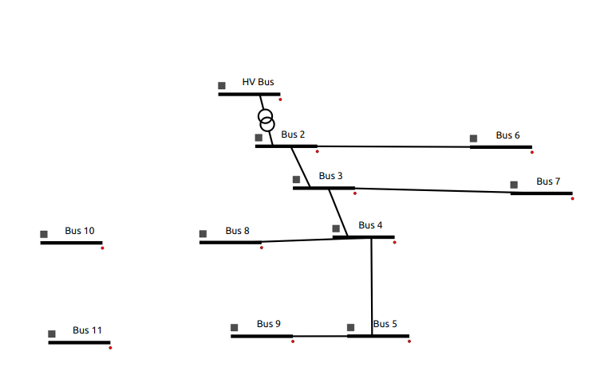
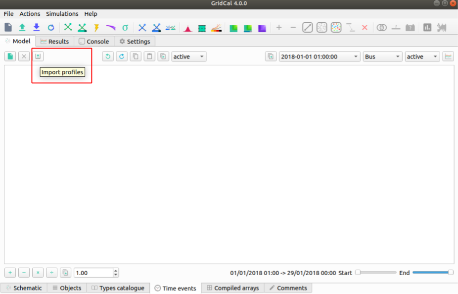
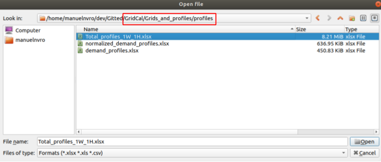
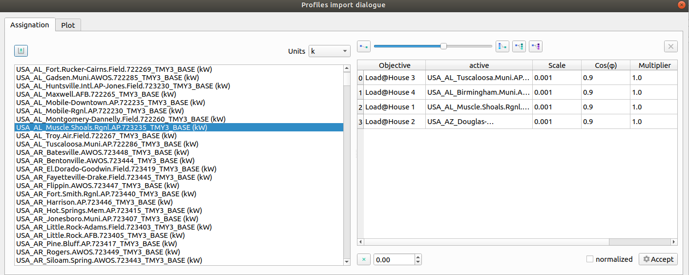
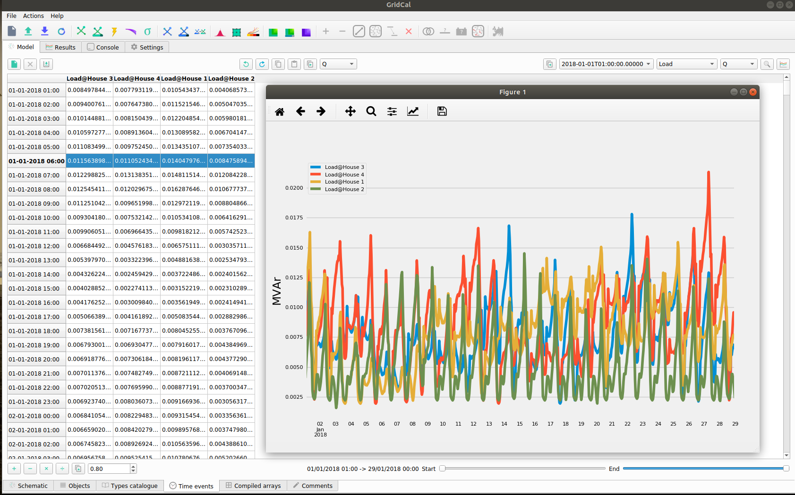
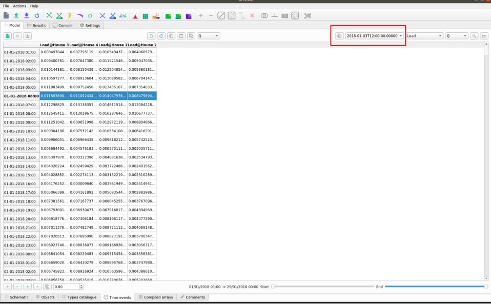
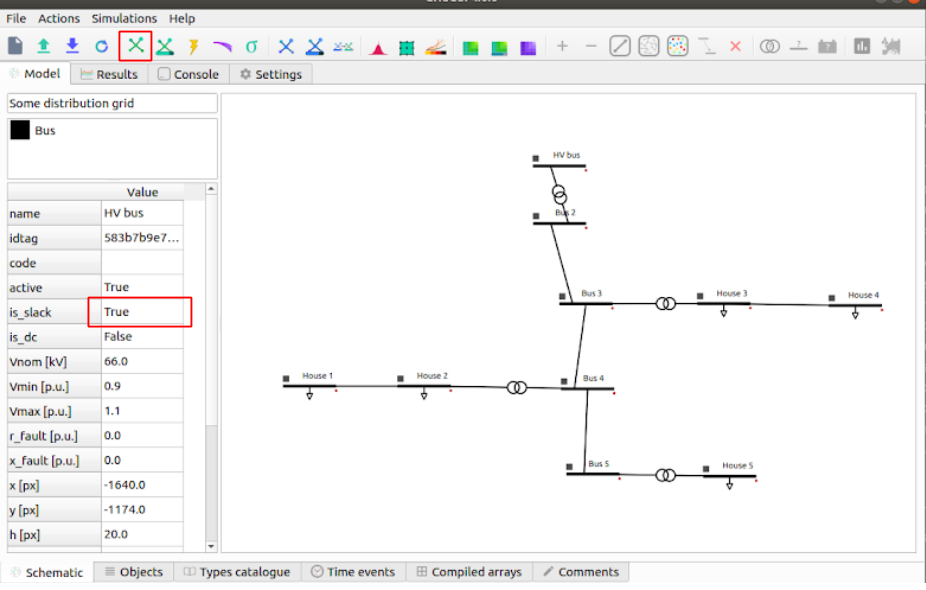
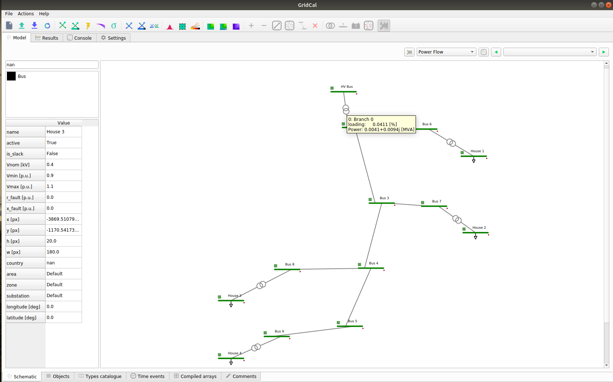

Gr  .. _distribution_grid:

Distribution Grid
==================
This tutorial shows a step by step guide on how to build distribution grid system that contains: 13 Buses, 4 Transformers, 4 Loads. The tutorial shows how to create a grid using time profiles and device templates. The tutorial also contains:

- Easy drag and drop creation of components.
- Transformer type creation.
- Overhead lines creation.
- Templates for transformers and overhead lines.
- Import of profiles into the loads.
- Set s power flow snapshot from the profiles.
- Execution of power flow.
- Execution of power flow time series.
- Automatic precision adjustment.
- Results visualization.
- Live results visualization (grid colouring).

A video tutorial can be found here_.

.. _here: https://www.youtube.com/watch?v=Yx3zRYRbe04&t=404s

Note: this tutorial was made with GridCal v 4.0.0

Step 0: System Overview
-----------------------
The system grid is supposed to look like the figure below.

.. figure:: ../figures/tutorials/dg/overview.png
    :scale: 50%

The system featurese:

- 9 Buses.
- 5 Transformers.
- 4 Loads.
- 7 Lines.

Solution file of the grid system can be found in _GitHub.

.. _GitHub:

Step 1: Create a Transformer
----------------------------
Open GridCal:

1. 'Drag and drop' 2 'Bus' element to the diagram canvas:

.. figure:: ../figures/tutorials/dg/busaddition.png
    :width: 500 px
    :align: center

2. Select (double 'click') Bus 0 and change the parameters (on the left side pane):

+----------+--------+
|   name   | HV Bus |
+----------+--------+
| Vnom[kV] |   20   |
+----------+--------+

3. Select (double 'click') Bus 1 and change the parameters (on the left side pane):

+----------+--------+
|   name   | Bus 2  |
+----------+--------+
| Vnom[kV] |   10   |
+----------+--------+

4. Hover over either bus element, 'click and drag' (when there is a cross) to the other bus to create a branch.

.. figure:: ../figures/tutorials/dg/transformer.png
    :width: 500 px
    :align: center

Note: A transformer will be created between HV Bus and Bus 2 when nominal voltage values are different.
Note: The name of an element may not change until you 'double click' the element on the diagram canvas after the change.

Step 2: Create a Lines of Different Lengths
-------------------------------------------

1. Create 3 more Buses (Bus 3, Bus 4 and Bus 5) and create a branch between them.

.. figure:: ../figures/tutorials/dg/threebusaddition.png
    :width: 500 px
    :align: center

2. Select the branch between Bus 2 and Bus 3 and change its parameters to:

+------------+--------+
|   name     | Line 1 |
+------------+--------+
| length[km] |   5    |
+------------+--------+

3. Select the branch between Bus 3 and Bus 4 and change its parameters to:

+------------+--------+
|   name     | Line 2 |
+------------+--------+
| length[km] |   3    |
+------------+--------+

4. Select the branch between Bus 4 and Bus 5 and change its parameters to:

+------------+--------+
|   name     | Line 3 |
+------------+--------+
| length[km] |   7    |
+------------+--------+

Note: Element placing can be changed by 'clicking' the square on the right hand side of a bus.

Step 3: Add more Lines and Buses
--------------------------------

1. Add Bus 6 to the right of Bus 2.
2. Add Bus 7 to the right of Bus 3.
3. Add Bus 8 and Bus 10 to the left of Bus 4.
4. Add Bus 9 and Bus 11 to the left of Bus 5.

.. figure:: ../figures/tutorials/dg/morebuses.png
    :width: 500 px
    :align: center

5. Select the branch between Bus 2 and Bus 6 and change its parameters to:

+------------+--------+
|   name     | Line 4 |
+------------+--------+
| length[km] |   2    |
+------------+--------+

5. Select the branch between Bus 3 and Bus 7 and change its parameters to:

+------------+--------+
|   name     | Line 5 |
+------------+--------+
| length[km] |   1.6  |
+------------+--------+

6. Select the branch between Bus 4 and Bus 8 and change its parameters to:

+------------+--------+
|   name     | Line 7 |
+------------+--------+
| length[km] |   1.5  |
+------------+--------+

7. Select the branch between Bus 5 and Bus 9 and change its parameters to:

+------------+--------+
|   name     | Line 8 |
+------------+--------+
| length[km] |    2   |
+------------+--------+

Step 4: Create Loads
--------------------

1. Select Bus 10 and change parameters to:

+----------+----------+
|   name   | House 3  |
+----------+----------+
| Vnom[kV] |   0.4    |
+----------+----------+

2. Create a line between Bus 8 and House 3 (a transformer will be created). Rename it to 'TR House 3'.

3. Select Bus 11 and change parameters to:

+----------+----------+
|   name   | House 4  |
+----------+----------+
| Vnom[kV] |   0.4    |
+----------+----------+

4. Create a line between Bus 9 and House 4 (a transformer will be created). Rename it to 'TR House 4'.

5. Right 'click' on House 3 and select 'Add Load'.

6. Right 'click' on House 4 and select 'Add Load'.

.. figure:: ../figures/tutorials/dg/loads.png
    :width: 500 px
    :align: center

Step 5: Create House 1 and House 2
----------------------------------

1. Create load House 1: Create a new bus and name it 'House 1' to the right of Bus 6, and a transformer in the line between Bus 6 and House 1. The parameters are the following:

+----------+----------+
|   name   | House 1  |
+----------+----------+
| Vnom[kV] |   0.4    |
+----------+----------+

2. Create load House 2: Create a new bus and name it 'House 2' to the right of Bus 7, and a transformer in the line between Bus 7 and House 2. The parameters are the following:

+----------+----------+
|   name   | House 2  |
+----------+----------+
| Vnom[kV] |   0.4    |
+----------+----------+

The full system topology looks like:

.. figure:: ../figures/tutorials/dg/fourhouses.png
    :width: 500 px
    :align: center

Note: do not forget to add the load after you rename the House buses.

Step 6: Defining the Main Transformer
-------------------------------------

In order to define the type of transformer a catalogue is available within the GridCal repository.

This transformer is the transformer between HV Bus and Bus 2. The transformer is: 25 MV 20/10 kV.

1. Access the catalogue (Excel file). It can be found in the repository at Gridcal/Grids_and_profiles/grids/equipment and select 'equipment.ods'.

2. Select the 'Transformers' sheet.

3. Remove all filters on the 'Rate (MVA)' column by pressing on the downward arrow.

.. figure:: ../figures/tutorials/dg/downtriangle.png
    :width: 500 px
    :align: center

4. Select the '20 kV' filter on the 'HV (kV)' column using the downward arrow.

4. Select the '10 kV' filter on the 'LV (kV)' column using the downward arrow.

6. The parameters of the transformer are:

+--------------------+------------------+
|        name        | 25 MVA 20/10 kV  |
+--------------------+------------------+
|     Rate[MVA]      |       25         |
+--------------------+------------------+
|   Frequency[Hz]    |       50         |
+--------------------+------------------+
|       HV[kV]       |       20         |
+--------------------+------------------+
|       LV[kV]       |        10        |
+--------------------+------------------+
|  Copper Losses[kW] |      102.76      |
+--------------------+------------------+
| No Load Losses[kW] |      10.96       |
+--------------------+------------------+
| No Load Current[%] |       0.1        |
+--------------------+------------------+
| V Short Circuit[%] |      10.3        |
+--------------------+------------------+
| HV Vector Group    |        YN        |
+--------------------+------------------+
|   LV Vector Group  |         D        |
+--------------------+------------------+
|   Phase Shift      |       5          |
+--------------------+------------------+

7. Double click on the transformer between HV Bus and Bus 2 and enter the following parameters (based on the model selected):

+--------+--------+
|   Sn   | 25     |
+--------+--------+
|  Pcu   | 102.76 |
+--------+--------+
|   Pfe  |  10.96 |
+--------+--------+
|   lo   | 0.1    |
+--------+--------+
|    Vsc | 10.3   |
+--------+--------+

8. Once the parameters are placed, right click and select 'Add to catalogue'. This way the branch p.u. values are calculated from the template values.

Note: In the new GridCal version, a transformer can be defined by just right clicking on the desired transformer and selecting the type from the drop down menu.

Note: All of the element types can be found under the 'Types catalogue' tab after clicking on the desired element, then clock 'Load Values' to change the parameters.

Step 7: Defining Load Transformers
----------------------------------

The transformers used for the 4 loads (houses) a 10 to 0.4 kV transformer will be used. The name is a '0.016 MVA 10/0.4 kV ET 16/23 SGB'.

1. Using the same catalogue find the transformer and do this for the transformer between Bus 6 and House 1.

2. The parameters of the transformer are:

+--------------------+-----------------------------------+
|        name        | 0.016 MVA 10/0.4 kV ET 16/23 SGB  |
+--------------------+-----------------------------------+
|     Rate[MVA]      |                       0.016       |
+--------------------+-----------------------------------+
|   Frequency[Hz]    |                         50        |
+--------------------+-----------------------------------+
|       HV[kV]       |                         10        |
+--------------------+-----------------------------------+
|       LV[kV]       |                        0.4        |
+--------------------+-----------------------------------+
|  Copper Losses[kW] |                            0.45   |
+--------------------+-----------------------------------+
| No Load Losses[kW] |                         0.11      |
+--------------------+-----------------------------------+
| No Load Current[%] |                       0.68751     |
+--------------------+-----------------------------------+
| V Short Circuit[%] |                          3.75     |
+--------------------+-----------------------------------+
| HV Vector Group    |                            Y      |
+--------------------+-----------------------------------+
|   LV Vector Group  |                            ZN     |
+--------------------+-----------------------------------+
|   Phase Shift      |                         5         |
+--------------------+-----------------------------------+

3. Fill these values out for the pop up menu:

+--------+---------+
|   Sn   |  0.016  |
+--------+---------+
|  Pcu   | 0.45    |
+--------+---------+
|   Pfe  |  0.11   |
+--------+---------+
|   lo   |0.687510 |
+--------+---------+
|    Vsc |3.75     |
+--------+---------+

4. Right click on the transformer and select 'Add to catalogue' this will create a template for quick add.

5. Rename the transformer to 'TR house 1'.

6. On the lower tabs select 'Types catalogue'.

.. figure:: ../figures/tutorials/dg/typescatalogue.png
    :width: 500 px
    :align: center

7. Select the transformer that has the characteristics of the 10 to 0.4 kV transformer and rename it to 'House trafo'. Now you have defined a transformer type that can be added to many transformers.

Note: In the new GridCal version, a transformer can be defined by just right clicking on the desired transformer and selecting the type from the drop down menu.

Step 8: Defining Load Transformer
---------------------------------

Now that 'House trafo' has been created, other transformers can be set to the same type.

1. In the 'Schematic' tab change the name of the other load transformers to their respective load (i.e. House 3 transformer rename to 'TR house 3').

2. Double click on the transformer

3. Click 'Load Values' to set the parameters.

4. Repeat for all desired transformers: TR house 3, TR house 4, TR house 2.

Note: this can be done with all elements either to preloaded models or models you create.

Step 9: Defining Wires and Overhead Lines
-----------------------------------------

1. Just like in Step 7 access the 'Types catalouge' and select 'Wires'.

2. All of the wire types will show up and select the 17th option 'AWG SLD'. The parameters are:

+-------------------+-----------+
|  R [Oh/Km]        |  1.485077 |
+-------------------+-----------+
|   X [Ohm/Km]      |        0  |
+-------------------+-----------+
|    GMR [m]        |  0.001603 |
+------------------+------------+
|  Max Current [kA] |  0.11     |
+-------------------+-----------+

Note: A new wire or custom wire can be added using the '+' button on the top right.

3. Now that you have located the wire you will use, in the same tab of 'Data structures' select 'Overhead Lines'.

4. Click on the '+' sign at the top right to create a new element. A new element '0:Tower' should come up.

5. Select the element '0: Tower' and click on the pencil on the top right corner to edit. A new window should pop up.

6. Rename the overhead line to: 'Distribution Line'.

7. Select the wire 'AWG SLD', highlight it and click on the '+' sign on the 'Wire composition' section below:

.. figure:: ../figures/tutorials/dg/awgsld.png
    :width: 500 px
    :align: center

8. Add the 'AWG SLD' wire three times to enter the wire arrangement. The formulas come from ATP-EMTP.

9. Give each cable a different phase: 1, 2 and 3. Enter the following parameters for Phase 2 and Phase 3.

+-----------+------+-------+-------+
| Wire      | X[m] | Y [m] | Phase |
+-----------+------+-------+-------+
|  AWG SLD  |  0   |  7.0  |     1 |
+-----------+------+-------+-------+
|  AWG SLD  |0.4   |  7.3  |     2 |
+-----------+------+-------+-------+
|  AWG SLD  |0.8   |  7.0  |     3 |
+-----------+------+-------+-------+

.. figure:: ../figures/tutorials/dg/threeawgsld.png
    :width: 500 px
    :align: center

10. Click on the 'Compute matrices' button the little calculator on the bottom right and you will be able to see:
-Tower Wire Position (right).
- Z Series [Ohm/Km] for ABCN (under the 'Z series' tab at the top).
- Z Series [Ohm/Km] for ABC (under the 'Z series' tab at the top).
- Z Series [Ohm/Km] for the sequence components (under the 'Z series' tab at the top).
- Y shunt [uS/Km] for ABCN (under the 'Y shunt' tab at the top).
- Y shunt [uS/Km] for ABC (under the 'Y shunt' tab at the top).
- Y shunt [uS/Km] for the sequence components (under the 'Y shunt' tab at the top).

12. Close the window, and your 'Elements Data' tab should look lie:

13. To apply this model to the lines in the model: In the 'Schematic' tab change the name of the other load transformers to their respective load (i.e. House 3 transformer rename to 'TR house 3').

14. Double click on the desired line. Click 'Load Values' to set the parameters.

15. Repeat for all desired lines. In this case Line 1 to Line 8. The 'Objecs -> Line' Data tab should look like:

.. figure:: ../figures/tutorials/dg/threeawgsld.png
    :width: 500 px
    :align: center

Note: this can be done with all elements either to preloaded models or models you create.

Step 10: Importing Load Profiles
--------------------------------

1. Head to the 'Time Events' tab on the bottom part of the GUI. Then click on the left and select 'Import Profiles'. This should bring up the 'Profile Import Dialogue' box.

Note: Make sure that the desired object is set to 'Load' and power types are both set to 'P'.

2. Click on 'Import file' box on the left. This will bring up a file explorer tab.

3. In the installation location head to '../GridCal/Grids_and_Profiles/profiles/..' then select the Excel file called: 'Total_profiles_1W_1H.xlsx'.

4. On the next dialogue box select 'Sheet 1' and 'OK'. Wait for all of the profiles to load.

5. Any load profile can be selected. For example, click on 'USA_AL_Dothan.Muni.AP.7222268_TMY3_BASE(kW)'. Then select the 'Plot' tab to see the load profile in kW for January 2018.

.. figure:: ../figures/tutorials/dg/loadprofilechart.png
    :width: 500 px
    :align: center

Note: in the 'Assignation' tab, the units can be changed to: T, G, k , m Watts.

Set the units to 'k'.

6. On the right, you can see the different 'Objectives', fill the out by double-clicking on a profile and then double-clicking in the 'active' box of the desired 'Objective'. The profiles are assigned as follows:
    - Load@House 1: 'USA_AL_Muscle.Shoals.Rgni.AP.723235_TMY3_BASE(k@)'.
    - Load@House 2: 'USA_AZ_Douglas-Bisbee.Douglas.intl.AP.722735_TMY3_BASE(k@)'.
    - Load@House 3: 'USA_AL_Tuscaloosa.Muni.AP.722286_TMY3_BASE(k@)'.
    - Load@House 4: 'USA_AL_Birmingham.Muni.AP.722286_TMY3_BASE(k@)'.

The selection should look like this:

Click 'Accept' to load the profiles.

7. On the 'Time events' tab, confirm that the time series has bene added:

.. figure:: ../figures/tutorials/dg/timeevents.png
    :width: 500 px
    :align: center

8. To set the reactive power as a copy of the active power and scale it, click on the dropdown menu and select 'Q'. Then click next to it on the 'Copy the selected profile into the profiles selected next to this button' button. When the pop up box comes on confirming the action select 'Yes'.

.. figure:: ../figures/tutorials/dg/scaling.png
    :width: 500 px
    :align: center

.. figure:: ../figures/tutorials/dg/pprofile.png
    :width: 500 px
    :align: center

9. On the bottom left side scale it by 0.8 and click on the multiply button. The profile should look like this:

.. figure:: ../figures/tutorials/dg/qprofile.png
    :width: 500 px
    :align: center

9. The profiles can be visualized by 1) selecting the times, and load, and clicking on the 'Plot the selected project's profile' button.

10. Power flow snapshots can be seen also by going to the 'Time events' tabs, and then

.. figure:: ../figures/tutorials/dg/snapshotpf.png
    :width: 500 px
    :align: center

Step 10: Set Power Flow From A Profile
--------------------------------------
Once we have checked that the profiles are okay, we can set the power flow snapshot from the profiles and run a power flow.

1. Head to the 'Time Series' Tab and select '2018+01-03T12:00:00.00000000000000'.

2. Select the 'Assign selected values to the selected time slot to the grid'.

3. Select 'Yes'.

Step 11: Running a Power Flow
-----------------------------

In order to run the power flow, we must select the slack bus. If you try run without one, you will get this error message:

.. figure:: ../figures/tutorials/dg/noslackbus.png
    :width: 500 px
    :align: center

Note: to run a Power Flow, select the 'Power Flow' button in the red square in the figure above.

1. Return to the 'Schematic' tab.

2. Select the 'HV Bus'.

3. On the left pane, select 'True' in the 'is_slack' option.

.. figure:: ../figures/tutorials/dg/isslack.png
    :width: 500 px
    :align: center

4. Click on the 'Power Flow' button and the grid will be colored according to the voltage or loading.

5. Click on the 'Power Flow Time Series' button and the grid will be colored according to th

.. figure:: ../figures/tutorials/dg/runpftimeseries.png
    :width: 500 px
    :align: center

6. In addition by hovering above a transformer you can see the loading percentage and the power.

Step 12: Results & Features
---------------------------

Here are some of the few results and features that are available with GridCal. All results can be found in the 'Results' tab. Here you can see a list of all studies perfomed and their respective results:

.. figure:: ../figures/tutorials/dg/results.png
    :width: 500 px
    :align: center

In the results you can also choose from:

- Study
- Result Type
- Devices

From here you can choose and customize the plot and results that are displayed to you.

.. figure:: ../figures/tutorials/dg/resultsorting.png
    :width: 500 px
    :align: center

Select the Study, Result Type and Devices, then the Data will pop up in table format, to graph it use the 'Graph' button on the top right. The graph will come up on a new figure:

.. figure:: ../figures/tutorials/dg/resultselection.png
    :width: 500 px
    :align: center

In the 'Schematic' Tab, you can visualize the result's profiles, by selection the load, right click and selecting 'Plot Profiles':

.. figure:: ../figures/tutorials/dg/plotprofiles.png
    :width: 500 px
    :align: center

From the result plots you can do various things with the plot:

.. figure:: ../figures/tutorials/dg/plotoptions.png
    :width: 500 px
    :align: center

In the 'Settings Tab' some of the stuff that can be changed are:

- **General Settings**: Base Power.
- **General Settings**: Frequency.
- **General Settings**: Multiprocessing.
- **Visualization**: Export Resolution.
- **Visualization**: Plotting Style.
- **Visualization**: Schematic Selection.
- **PF**: Solver Selection.
- **PF**: Method Retry.
- **PF**: Distributed Slack.
- **PF**: Ignore Single Node Islands.
- **PF**: Automatic Graph Precision.
- **PF**: Precision.
- **PF**: Numerical Method Max. Iterations.
- **PF**: Outer Loop Max. Iterations.
- **PF**: Reactive Control Mode.
- **PF**: Q Steepnes Factor.
- **PF**: Transformer Tap Control.
- **PF**: Apply Temperature Correction.
- **PF**: Apply Impedance Tolerances.
- **PF**: Dispatch Storage.
- **PF**: Use Clustering.
- **PF**: Cluster Numbers.
- **PTDF**: Power Increment.
- **PTDF**: Grouping.
- **PTDF**: k.
- **OPF**: Method.
- **OPF**: Time Grouping.
- **OPF**: MIP Solver.
- **Stability**: Max. Iterations.
- **Stability**: Stop Settings.
- **Stability**: Using Alpha Target From Current Situation.
- **Stability**: Lambda Factor.
- **Stability**: User Departure and Target Points From Time Series.
- **Stability**: 'Now' Time.
- **Stability**: 'Target' Time.
- **Stochastic - Monte Carlo**: Precision Group Data.
- **Stochastic - Monte Carlo**: Max Iterations.
- **Stochastic - Latin Hypercube Sampling**: Samples.
- **Stochastic - Cascading**: Additional Islands Until Stop.
- **Topology - Grid Reduction**: Branch Selection Type.
- **Topology - Grid Reduction**: Filter by R+X Under Treshold.
- **Topology - Node Layout**: Automatic Layout Algorithm.
- **Topology - Node Layout**: Ask Before Applying.
- **Topology - Node Layout**: Node Expansion Factor.
- **Topology - Branch Rating**: Branch Rating Factor.
- **Topology - Branch Rating**: Override Values.
- **Synchronization**: Synchronization Interval.
- **Synchronization**: Accept Newer Cahnges.

