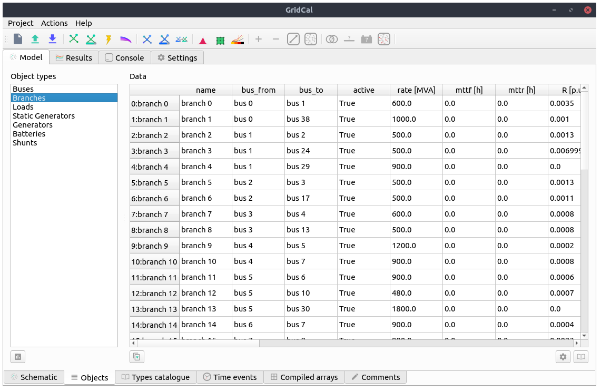
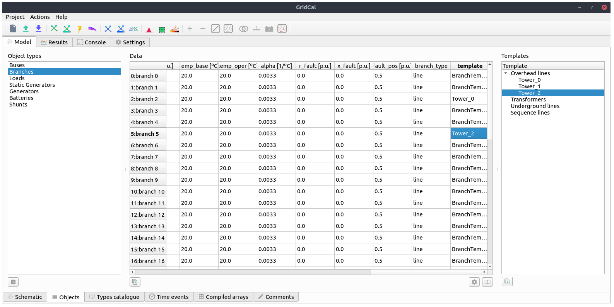
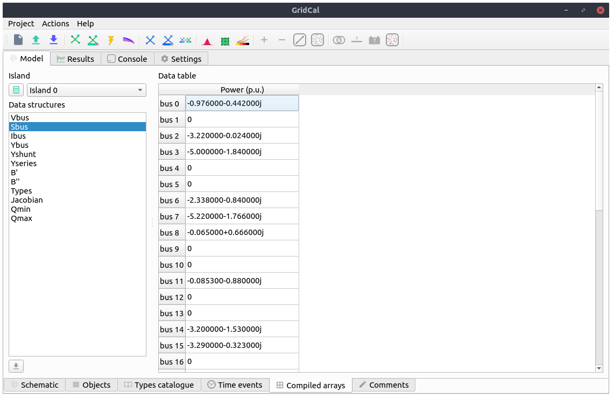
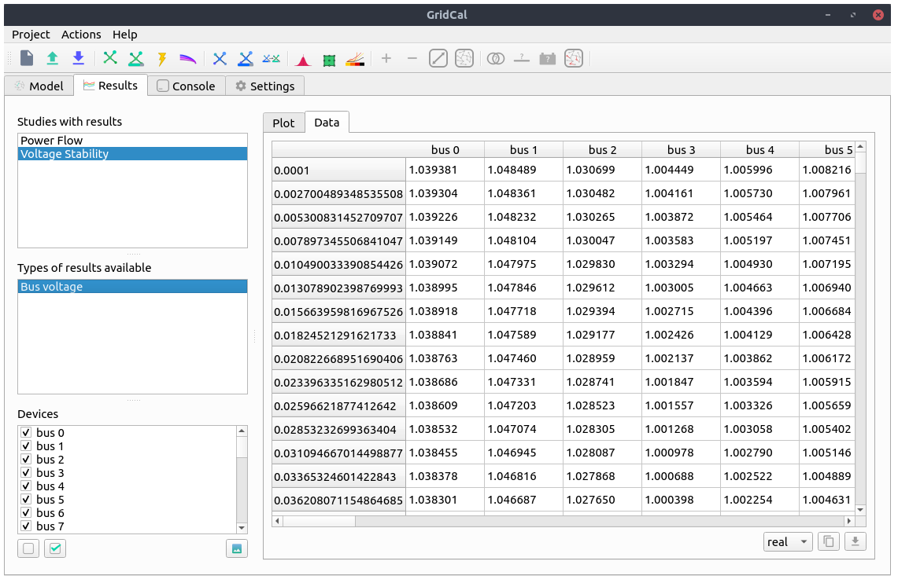

.. _gui:

Graphical User Interface
========================

The user interface of GridCal is written using the Qt graphical interface
framework. This allows GridCal to be multi-platform and to have sufficient
performance to handle thousands of graphical items in the editor, to be
responsive and plenty of other attributes of consumer software.

.. figure:: figures/gridcal_gui.png
    :alt: GridCal user interface.
    :scale: 50 %
    
    GridCal user interface representing  a zoom of a ~600 node distribution grid.

The graphical user interface (GUI) makes extensive use of tooltip texts. These area yellow tags that appear
when you hover the mouse cursor over a button from the interface. The tooltip texts are meant to be explanatory
so that reading a manual is not really needed unless you need the technical details.
Nevertheless this guide hopes to guide you through the GUI well enough so that the program is usable.

Model
-----

The model view is where all the editing is done.

Schematic editor
^^^^^^^^^^^^^^^^

The schematic view is where you construct the grid in GridCal. The usage is quite simple:

- Drag & Drop the buses from the left upper side into the main panel.

- Click on a bus bar (black line) and drag the link into another bus bar, a branch will be created.
    - Branch types can be selected (branch, transformer, line, switch, reactance).
    - If you double click a branch and the type is Line or Transformer, a simplified editor will pop up.

- To add loads, generators, shunts, etc... just right click on  bus and select from the context menu.

- The context menu from the buses allow plenty of operations such as view the bus profiles (extended
  is time series results are present) or setting a bus as a short circuit point.

The schematic objects are coloured based on the results of the latest simulation.

.. figure:: figures/model-schematic.png
    :alt: Schematic view and editor
    :scale: 50 %

When more than one simulation is available (i.e. power flow and power flow time series)
the schematic editor is augmented with a bar that allows you to select the appropriate simulation colouring
of the grid. When the simulation has a time component, like time series or voltage collapse, the bar will
allow you to visualize each individual step of the simulation and navigate through them.

.. figure:: figures/model-schematic-2.png
    :alt: Schematic view and editor extended
    :scale: 50 %

Tabular editor
^^^^^^^^^^^^^^

Some times is far more practical to edit the objects in bulk. For that, GridCal features the tabular view
of the objects. All the static properties of the objects can be edited here. For the properties with time series
we have the "time events" tab.

If the branch objects are selected, then it is possible to extend the view with the catalogue of template elements
available to assign to each branch. When a template is assigned to a branch, some properties are affected by  the
template. The properties affected are the resistance (R), reactance (X), Conductance (G), Susceptance (B)
and the branch rating (Rate).

Grid analysis and diagnostic
^^^^^^^^^^^^^^^^^^^^^^^^^^^^

GridCal features an analysis and diagnostics tool that allows to inspect at a glance the main magnitudes
of the grid objects. For instance if there were outliers in the branches resistance, it would be evident
from the histogram charts.

.. figure:: figures/analysis.png
    :alt: GridCal objects analysis.
    :scale: 50 %

A detailed table of common problems is provided in the diagnostics tab. This allows you to go back to the
tabular editor and fix the issues found.

.. figure:: figures/diagnostic.png
    :alt: GridCal objects diagnostic.
    :scale: 50 %

Templates
^^^^^^^^^

The branch templates are defined here.

.. figure:: figures/model-types.png
    :alt: GridCal device type templates editor.
    :scale: 50 %

Overhead line editor
^^^^^^^^^^^^^^^^^^^^

.. figure:: figures/tower.png
    :alt: GridCal overhead lines editor.
    :scale: 50 %

Time series
^^^^^^^^^^^

.. figure:: figures/model-time.png
    :alt: GridCal time series tabular editor.
    :scale: 50 %

.. figure:: figures/profiles_import.png
    :alt: GridCal time series import interface.
    :scale: 50 %

Array viewer
^^^^^^^^^^^^

Comments editor
^^^^^^^^^^^^^^^
.. figure:: figures/model-coments.png
    :alt: GridCal model comments editor.
    :scale: 50 %

Results
-------

.. figure:: figures/results.png
    :alt: GridCal results graphical viewer.
    :scale: 50 %

Tabular view
^^^^^^^^^^^^

Settings
--------

Power flow
^^^^^^^^^^
.. figure:: figures/settings-pf.png
    :alt: GridCal power flow settings.
    :scale: 50 %

Optimal power flow
^^^^^^^^^^^^^^^^^^
.. figure:: figures/settings-opf.png
    :alt: GridCal Optimal power flow settings.
    :scale: 50 %

Voltage stability
^^^^^^^^^^^^^^^^^
.. figure:: figures/settings-stability.png
    :alt: GridCal voltage collapse settings.
    :scale: 50 %

Stochastic power flow
^^^^^^^^^^^^^^^^^^^^^
.. figure:: figures/settings-stochastic.png
    :alt: GridCal stochastic power flow settings.
    :scale: 50 %

Topology
^^^^^^^^
.. figure:: figures/settings-topology.png
    :alt: GridCal topology processor settings.
    :scale: 50 %

Console
-------

.. figure:: figures/console.png
    :alt: GridCal python console (python from within python!).
    :scale: 50 %

